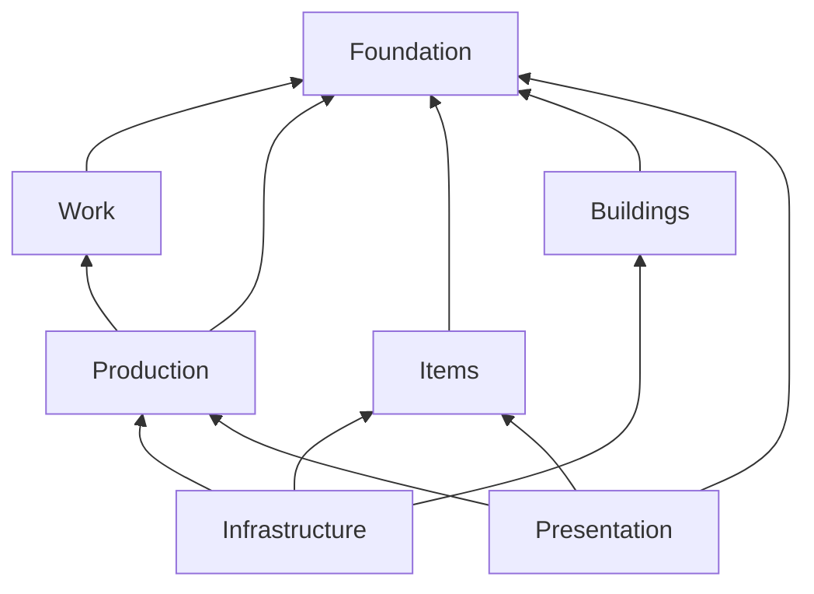
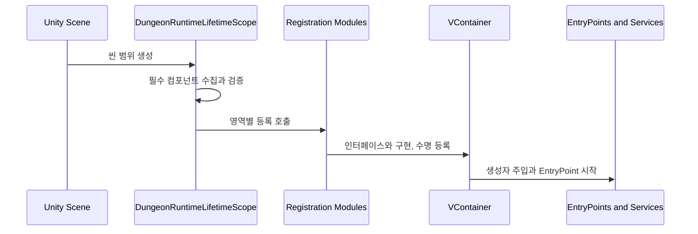

# 01. 모듈 경계와 런타임 조립

이 장은 시스템이 어디에서 만들어지고, 어떤 방향으로 참조하며, 서로 다른 도메인이 어떤 계약을 통해 연결되는지 다룬다.

## 1. Modular Monolith

### 해결하려는 변경 압력

생산, 작업, 인물, 전투, 연구, 환경과 저장은 계속 맞물린다. 모든 형식이 하나의 어셈블리에 있으면 작은 기능 변경도 임의의 내부 형식에 의존하기 쉽고, 도메인 경계가 코드 배치 이상의 의미를 갖지 못한다.

### 현재 구현

프로젝트는 Unity asmdef를 도메인별로 나눈 모듈형 모놀리스다. `DungeonStory.Foundation`은 프로젝트 내 다른 어셈블리를 참조하지 않는다. `DungeonStory.Production`은 Foundation과 Work를 참조한다. Infrastructure와 Presentation은 여러 도메인을 연결하므로 참조 폭이 넓다.

구현 위치:

- `Assets/Scripts/Services/Foundation/DungeonStory.Foundation.asmdef`
- `Assets/Scripts/Models/Production/Core/DungeonStory.Production.asmdef`
- `Assets/Scripts/Services/Infrastructure/Core/DungeonStory.Infrastructure.asmdef`
- `Assets/Scripts/Views/UI/Core/DungeonStory.Presentation.asmdef`

### 실제 효과

- 새 도메인은 별도 asmdef와 공용 계약을 갖는 모듈로 시작할 수 있다.
- 도메인 내부 형식이 다른 영역의 임의 코드에서 사용되는 범위를 참조 수준에서 제한할 수 있다.
- Editor 검증 코드를 런타임 어셈블리와 분리할 수 있다.
- Infrastructure와 Presentation을 통합 지점으로 삼아 도메인 간 의존 방향을 일정하게 유지할 수 있다.

### 한계와 오용 위험

asmdef가 존재한다고 경계가 자동으로 유지되지는 않는다. Infrastructure와 Presentation은 많은 도메인을 참조하며, 이 안의 대형 서비스가 여러 권위를 직접 조율하면 논리적 결합은 계속 커질 수 있다. 새 기능을 편의상 Foundation에 넣으면 기반 어셈블리가 공용 저장소가 된다. Foundation에는 여러 도메인이 실제로 공유하는 안정 계약만 들어가야 한다.

## 2. Composition Root와 Dependency Injection

### 해결하려는 변경 압력

게임 서비스가 생성자에서 다른 서비스를 직접 만들거나, MonoBehaviour가 전역 검색으로 의존성을 찾으면 구현 교체와 검증 대역 구성이 어렵다. Unity 씬 객체와 순수 C# 서비스의 수명도 뒤섞인다.

### 현재 구현

`DungeonRuntimeLifetimeScope.Configure`가 씬의 Composition Root다. 먼저 씬 참조를 수집하고 필수 계약을 검증한 뒤, VContainer 등록 모듈을 호출한다.

등록은 Foundation, Work, Combat and Invasion, World Simulation, Save, Core Infrastructure, Facility, Character, AI and Rooms, Progression and Offense, Presentation 순으로 위임된다.

구현 위치:

- `Assets/Scripts/Services/Infrastructure/DungeonRuntimeLifetimeScope.cs`
- `Assets/Scripts/Services/Infrastructure/Registration/`

### 사용된 기법

- 생성자 주입으로 필수 의존성을 명시한다.
- 인터페이스와 구현을 컨테이너에 매핑한다.
- 같은 인터페이스의 여러 구현을 multi-binding으로 등록해 레지스트리가 수집한다.
- `IStartable`과 EntryPoint로 Unity 수명주기 진입을 제한한다.
- 씬 계층 주입과 선택적 강제 resolve로 씬 객체와 런타임 서비스의 초기화를 연결한다.
- 필수 씬 참조가 없으면 구성 단계에서 즉시 실패한다.

### 실제 효과

새 구현을 사용하는 코드가 구체 생성자를 알 필요가 없다. 예를 들어 새 `IFeatureSurfaceTabPresenter`나 작업 핸들러는 등록 모듈에 추가하면 컬렉션으로 주입된다. 런타임 객체의 수명과 생성 순서도 한곳에서 확인할 수 있다.

### 한계와 오용 위험

DI는 의존성을 없애지 않고 보이게 만든다. 생성자 인수가 지나치게 많다면 책임이 집중됐다는 신호다. 등록 순서와 build callback에 암묵적 초기화 의존성이 생길 수 있으므로, 순서가 중요한 경우 별도 시작 계약이나 명시적 단계로 표현하는 편이 안전하다.

## 3. Registration Module

`RegisterDungeonWork`, `RegisterDungeonSaveInfrastructure`, `RegisterDungeonPresentation` 같은 확장 메서드는 등록 책임을 영역별로 묶는 Installer 또는 Registration Module 역할을 한다.

이 구조가 확보하는 것은 동적 플러그인 로딩이 아니다. Composition Root 한 파일이 수백 개의 등록문으로 무너지는 것을 막고, 새 영역의 객체 그래프를 한 파일에서 검토할 수 있게 하는 조직적 확장성이다. 새 모듈을 추가할 때도 Composition Root에서 명시적으로 호출해야 한다.

등록 모듈의 품질 기준은 다음과 같다.

- 도메인 서비스 생성과 프레젠테이션 등록을 같은 모듈에 섞지 않는다.
- multi-binding 대상은 중복과 누락을 레지스트리에서 검증한다.
- 등록 순서에 의존하는 서비스는 그 이유를 코드 계약으로 드러낸다.
- 단순히 생성자 인수를 줄이기 위한 거대한 Context 객체를 만들지 않는다.

## 4. Dependency Inversion과 Port

생산이 작업자 구현을 직접 알고, 작업 코드가 생산 주문 내부 상태를 직접 수정하면 어느 쪽의 변경도 양쪽을 함께 고치게 된다. 현재는 도메인 또는 응용 계층이 필요한 동작을 작은 인터페이스로 요구하고, Infrastructure의 Adapter가 실제 시스템에 번역한다.

대표 사례:

- `BuildingCraftWorkRuntimeAdapter`: 건물과 생산의 작업 요구를 Work 도메인 계약으로 번역한다.
- `CraftWorkExecutionAdapter`: 작업 실행 결과를 생산 진행으로 전달한다.
- `ProductionBillSceneFacade`: 생산 질의와 명령을 씬에서 사용하기 쉬운 단일 경계로 제공한다.
- `ResourceGameContentCatalog`: 하나의 작성 루트를 여러 읽기 전용 카탈로그 포트로 노출한다.

구현 위치:

- `Assets/Scripts/Services/Infrastructure/BuildingCraftWorkAdapters.cs`
- `Assets/Scripts/Services/Economy/ProductionBillSceneFacade.cs`
- `Assets/Scripts/Services/Items/GameContentCatalog.cs`

### 실제 효과

- 작업 실행기가 생산 주문의 내부 표현을 몰라도 된다.
- 생산 방식이 바뀌어도 Work가 요구하는 포트가 유지되면 작업자 탐색과 실행 루프를 보존할 수 있다.
- Unity 객체 생성이나 씬 검색을 외곽 Adapter에 둘 수 있다.
- 인터페이스 대역을 통해 도메인 규칙을 Unity 생명주기에서 분리해 검증할 수 있다.

모든 클래스에 일대일 인터페이스를 붙이는 것은 Port 설계가 아니다. Port는 경계를 넘는 안정된 용도여야 한다. 호출자의 요구보다 구현 클래스의 전체 API를 그대로 복제한 인터페이스는 결합을 숨길 뿐이다.

## 5. Facade와 Factory

`ProductionBillSceneFacade`는 여러 생산 질의와 명령을 씬 소비자에게 정리된 API로 제공한다. `ResourceGameContentCatalog`는 작성 콘텐츠 루트를 여러 도메인별 읽기 계약으로 노출한다. Facade는 호출부를 단순화하지만, 상태 권위를 대신하거나 내부 명령 검증을 우회해서는 안 된다.

`IGridBuildingObjectFactory`와 `GridBuildingObjectFactory`는 배치 코드에서 `BuildableObject` 생성 세부를 분리한다. 프리팹, 컴포넌트 부착, 정렬 계층과 초기화 순서를 바꿔도 배치 흐름을 유지할 수 있다. 현재 구현은 Unity 객체 종류별 구체 Factory이며, 일반화된 Abstract Factory 체계로 볼 근거는 부족하다.

구현 위치:

- `Assets/Scripts/Services/Grid/Building/GridBuildingObjectFactory.cs`
- `Assets/Scripts/Services/Offense/EnemyEncounterFactory.cs`
- `Assets/Scripts/Services/Invasion/InvasionIntruderFactory.cs`

## 6. 구현별 효과와 비용

| 구현 또는 기법 | 직접 얻는 이득 | 변경할 때 생기는 차이 | 함께 치르는 비용 |
|---|---|---|---|
| 도메인별 asmdef | 허용되지 않은 어셈블리 참조를 Unity 컴파일 경계에서 차단한다 | 생산 내부 형식을 Presentation에서 임의로 끌어다 쓰는 식의 경계 침범이 코드 리뷰 이전에도 드러난다 | 공용 계약의 위치를 잘못 잡으면 참조를 옮기는 작업이 커진다 |
| Foundation의 무참조 구조 | 최하위 계약이 상위 게임 기능에 끌려가지 않는다 | 새 도메인이 Foundation만 참조해도 식별자, 이벤트와 저장 계약을 사용할 수 있다 | 편의를 이유로 기능 코드를 Foundation에 넣지 않도록 계속 관리해야 한다 |
| Composition Root | 객체 생성과 연결 위치를 한곳으로 제한한다 | 구현 교체나 새 서비스 추가 시 생성 코드를 소비자마다 찾아다닐 필요가 없다 | root와 등록 모듈이 커지면 전체 객체 그래프를 이해하는 비용이 늘어난다 |
| 생성자 주입 | 클래스가 실행에 필요한 의존성을 선언부에 드러낸다 | 누락된 필수 서비스가 구성 과정에서 발견된다 | 의존성이 많은 클래스는 생성자 자체가 책임 집중을 드러내므로 분해가 필요하다 |
| 인터페이스 등록 | 사용 코드와 구체 구현의 생성을 분리한다 | 같은 Port를 유지한 채 어댑터나 저장 구현을 교체할 수 있다 | 안정된 경계가 아닌 클래스마다 인터페이스를 만들면 형식만 늘어난다 |
| multi-binding | 같은 역할의 여러 구현을 컬렉션으로 조립한다 | 새 Presenter나 handler를 추가해도 기존 소비자의 생성자를 바꾸지 않는다 | 중복 키와 누락 구현을 검사하는 Registry가 반드시 필요하다 |
| `IStartable`과 EntryPoint | 시작 시점이 필요한 서비스만 Unity 수명주기에 참여시킨다 | 일반 도메인 서비스에 `MonoBehaviour.Start`가 퍼지는 것을 막는다 | EntryPoint 사이의 순서는 별도 계약이 없으면 암묵적으로 남는다 |
| Registration Module | 객체 그래프를 기능 영역별로 나눈다 | 새 하위 시스템의 등록과 수명 설정을 한 파일에서 검토할 수 있다 | 동적 플러그인은 아니므로 Composition Root의 명시 호출은 계속 필요하다 |
| Port와 Adapter | 서로 다른 도메인의 자료형과 호출 방식을 경계에서 번역한다 | 생산 모델이 바뀌어도 Work Port가 유지되면 작업자 실행 루프는 그대로 둘 수 있다 | Adapter가 양쪽 모델을 모두 알아야 하므로 변환 코드와 검증이 추가된다 |
| Scene Facade | 씬 소비자가 여러 생산 서비스의 위치를 알 필요가 없다 | 씬 코드가 내부 Aggregate API에 직접 결합되는 범위를 줄인다 | Facade가 많은 유스케이스를 흡수하면 새로운 집중 지점이 된다 |
| Content Catalog Facade | 여러 소비자가 같은 작성 정의 집합을 읽는다 | 도메인마다 임시 목록을 만들어 정의가 달라지는 문제를 줄인다 | 카탈로그 루트의 검증과 로딩 실패 정책이 강해져야 한다 |
| Unity Factory | GameObject 생성, 컴포넌트 부착과 초기화 순서를 호출부에서 숨긴다 | 프리팹 구성이나 생성 절차를 바꿔도 배치 유스케이스는 유지된다 | 생성 종류가 늘면 Factory 자체의 분기와 의존성이 커질 수 있다 |

## 7. 적용 사례

### 건물 생성 과정이 바뀌는 경우

`GridBuildingObjectFactory`가 없다면 배치 서비스가 프리팹 생성, 컴포넌트 연결, 정렬 계층과 초기화 순서를 모두 알아야 한다. 건물 표시 구조를 바꿀 때마다 배치 검증과 격자 등록 코드까지 함께 수정하게 된다.

생성을 Factory로 분리하면 배치 서비스는 "검증을 통과한 위치에 건물을 만든다"는 절차만 유지한다. 프리팹 구성이나 초기화 순서의 변경은 Factory 안에서 처리할 수 있다. 그 대신 Factory가 Unity 생성 규칙을 모두 떠안으므로, 건물 종류별 예외가 늘어나지 않는지 살펴야 한다.

### 생산과 작업의 내부 모델이 서로 다른 경우

생산은 주문, 공정 단계와 남은 작업량을 기준으로 상태를 관리한다. 작업 시스템은 작업자, 대상과 `WorkTypeId`를 기준으로 실행한다. 양쪽을 직접 연결하면 생산 주문의 필드 변경이 작업 실행기까지 번진다.

`BuildingCraftWorkRuntimeAdapter`와 `CraftWorkExecutionAdapter`는 두 모델 사이에서 필요한 정보만 번역한다. 생산 쪽에서 공정 상태 표현을 바꾸더라도 Work Port가 요구하는 의미가 같으면 작업자 탐색과 실행 루프는 유지된다. 번역 규칙이 틀리면 양쪽 상태가 어긋날 수 있으므로 Adapter의 검증 책임은 늘어난다.

### 새 하위 시스템이 씬 수명주기에 들어오는 경우

가정 사례로, 새 환경 분석 시스템이 여러 도메인 질의를 사용하고 씬 시작 시 활성화돼야 한다고 하자. 각 MonoBehaviour가 서비스를 직접 찾게 만들면 생성 순서와 필수 의존성이 씬 곳곳에 퍼진다.

별도 Registration Module에 서비스와 수명을 등록하고 `DungeonRuntimeLifetimeScope`에서 모듈을 호출하면 생성 위치가 고정된다. 필수 구현이 빠진 경우 구성 단계에서 실패하며, 시스템 제거 시에도 등록 모듈과 Composition Root 연결을 중심으로 추적할 수 있다. 이 방식은 동적 발견이 아니므로 모듈 호출을 추가하는 작업 자체는 남는다.

### 같은 인터페이스 구현이 계속 늘어나는 경우

Feature 탭 Presenter나 작업 handler처럼 같은 역할의 구현이 계속 추가되는 영역에서 소비자의 생성자에 구현을 하나씩 추가하면 기존 코드가 매번 바뀐다. multi-binding은 구현 목록을 컨테이너가 모아 Registry에 넘긴다.

새 구현은 등록만으로 기존 소비자와 연결된다. 대신 어떤 구현이 어떤 키를 소유하는지 Registry가 검사해야 한다. 중복과 누락을 허용하면 multi-binding은 오류를 늦게 숨기는 구조가 된다.

## 8. 새 모듈 추가 절차

1. 상태와 불변식을 소유할 도메인 asmdef를 정한다.
2. 다른 도메인이 요구하는 최소 Port를 안정된 어셈블리에 둔다.
3. Unity, 저장소, 다른 도메인과의 번역은 Infrastructure Adapter에 둔다.
4. 영역별 Registration Module에 구현과 수명을 등록한다.
5. EntryPoint가 필요하면 시작과 종료 계약을 함께 구현한다.
6. 새 상태 권위라면 저장 섹션과 복원 의존성을 추가한다.
7. Presentation은 질의와 명령 포트만 소비하도록 연결한다.

도메인 asmdef가 Presentation이나 구체 MonoBehaviour를 참조해야 한다면 의존 방향이 뒤집혔을 가능성이 높다.

## 9. 진화 계층의 모듈과 조립

시설 성장에는 성격이 다른 세 모듈이 참여한다.

| 모듈 | 담당 범위 | 확장 시 얻는 이점 | 경계상의 비용 |
|---|---|---|---|
| `DungeonStory.Synthesis` | 설치 시설 합성의 순수 규칙 | Unity 객체 없이 조합식의 입력과 결과 계약을 유지한다 | 실제 제거와 생성은 Services가 조율해야 한다 |
| `DungeonStory.FacilityEvolution` | 시설 진화 ID, 스냅샷, 복원과 진행 규칙 | 작성 조합식 교체와 저장 검증을 엔진 코드에서 분리한다 | 공용 Foundation 계약과의 연결을 유지해야 한다 |
| `DungeonStory.Evolution` | 시설·장비가 공유하는 사용 원장, 압축 이력, 노드와 도메인별 진화 모델 | 이력 표현과 결정론 도구를 두 콘텐츠군에서 재사용한다 | 시설 전용 모듈과 VContainer를 참조하므로 중립적인 공용 커널로 완전히 분리되지는 않았다 |

앞의 두 모듈은 `noEngineReferences`가 설정되어 있다. 진화 규칙과 복원 형식을 Unity 장면 객체 없이 다룰 수 있다는 이점이 있다. 반면 `DungeonStory.Evolution`은 Unity 비의존 경계가 아니며 시설 모델과 장비 모델까지 함께 가진다. 재사용 자체는 확인되지만, 의존 방향은 앞으로 기능이 늘 때 분리 압력을 받을 수 있다.

`DungeonFacilityRegistration`은 시설 진화의 Composition Root 역할을 한다. 작성 조합식 공급자, 창고 자원 어댑터, 기록 표식 소비자, 건물 교체 Factory, 규칙 기반 제안자, 검증기, 후보 작성기, 변이 해석기, 사용 원장 압축기, 진화 모듈 Registry와 개체 진화 런타임을 한 그래프에 연결한다.

이 조립 방식에서는 규칙 제안자나 자원 공급자를 Port 뒤에서 교체할 수 있고, 후보 계산과 Unity 객체 교체가 서로의 생성 세부를 알 필요가 없다. 그 대신 등록 파일이 넓어지며, 동일 인터페이스의 기본 구현과 선택 구현이 어떤 순서로 결합되는지 시작 단계 검증이 필요하다.

새 진화 소비자를 추가할 때 공용 원장 클래스를 직접 수정하는 것부터 시작하지 않는다. 공용 이력 형식으로 표현 가능한지 먼저 확인하고, 도메인별 후보 규칙과 투영 Adapter를 추가한다. 공용 이력 자체에 새 의미가 필요할 때만 증거 종류, 압축 규칙과 직렬화 계약을 함께 변경한다. 자세한 경계는 [사용 이력 기반 진화 아키텍처](07-history-driven-evolution-architecture.md)에 정리했다.
