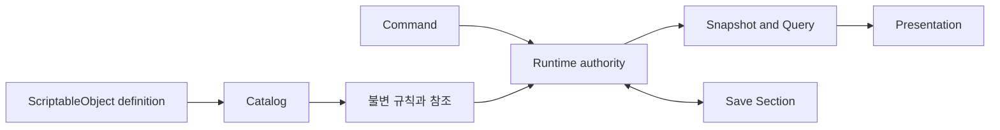
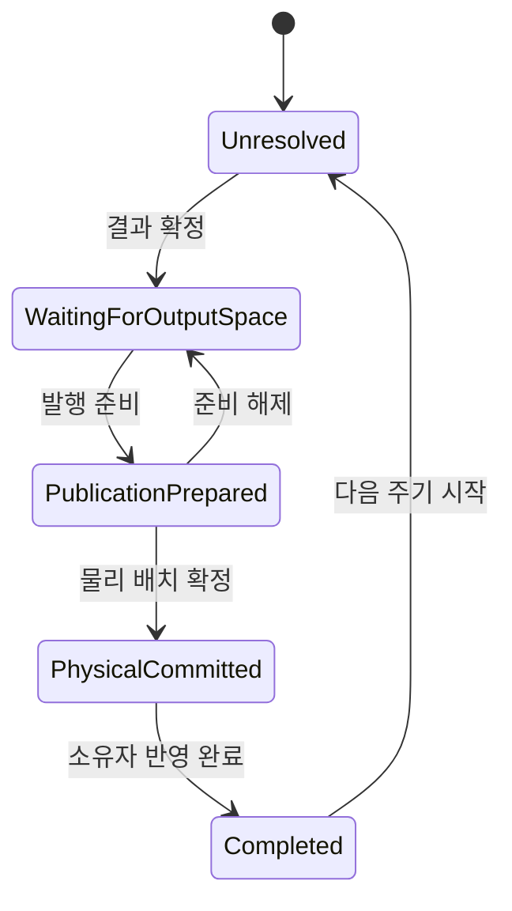
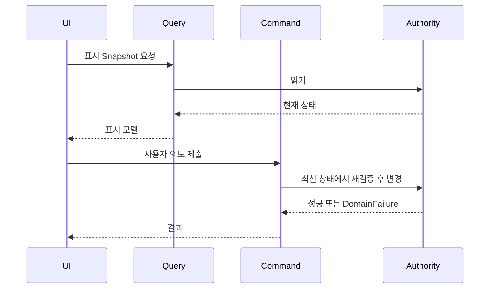
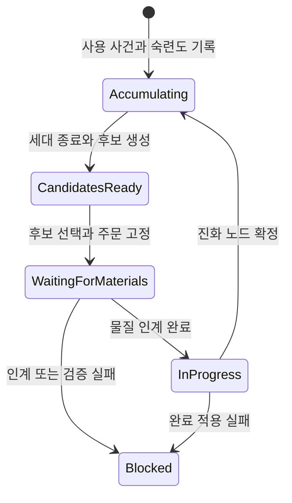

# 02. 도메인 상태와 명령 경계

이 장은 런타임 상태가 어디에 존재하며, 누가 변경할 수 있고, 잘못된 상태 전이를 어떻게 차단하는지 설명한다.

## 1. Definition과 Runtime State의 분리

ScriptableObject와 카탈로그는 아이템, 건물, 연구 같은 작성 정의를 제공한다. 현재 수량, 설치 위치, 작업 진행, 부상 상태와 사건 해결 기록은 런타임 권위가 소유한다.

이 분리로 같은 정의를 여러 인스턴스가 공유할 수 있고, 저장 데이터가 Unity 자산을 복제하지 않는다. 작성 자산을 런타임 저장소처럼 수정하면 이 경계가 무너지므로 금지해야 한다.

## 2. Typed ID와 Value Object 기법

문자열 ID만 사용하면 작업 ID와 아이템 ID를 잘못 전달해도 컴파일 단계에서 드러나지 않는다. `WorkTypeId`는 생성 시 공백 값을 거부하고, 정규화된 값을 ordinal 비교하는 불변 구조체다. 생산 주문, 건물 인스턴스, 인물과 시설 진화에도 별도 식별 형식이 사용된다.

구현 위치:

- `Assets/Scripts/Models/Work/WorkTypeId.cs`
- `Assets/Scripts/Services/Foundation/PersistentEntityIds.cs`
- `Assets/Scripts/Services/Foundation/ItemDefinitionId.cs`
- `Assets/Scripts/Models/FacilityEvolution/Core/FacilityEvolutionIds.cs`

이 기법은 API가 요구하는 식별자 종류를 구분하고, 정규화와 동일성 규칙을 한곳에 두며, 저장과 이벤트에서 안정 ID를 공통 언어로 사용하게 한다. 일부 ID 카탈로그는 정적 목록이므로 새 종류가 자동 발견되는 것은 아니며, 모든 문자열 경계가 typed ID로 전환된 것도 아니다.

## 3. Aggregate와 불변식 보호

현재 코드는 전면적인 교과서식 DDD가 아니지만, 상태와 변경 규칙을 한 경계에 모으는 Aggregate 기법을 반복해서 사용한다.

`ProductionBillRecord`는 준비 출력과 물리 발행의 단계 전이를 메서드로 제한한다. 호출자는 임의 단계로 건너뛸 수 없고, 현재 단계가 맞는지 확인한 뒤 복제 후보를 검증해 반영한다.

구현 위치:

- `Assets/Scripts/Models/Production/Core/ProductionAggregateState.cs`
- `Assets/Scripts/Models/Production/Core/ProductionBillModels.cs`

이 구조는 전이 안정성을 확보한다. 새로운 생산 단계가 필요하면 허용 전이, 저장 표현, 실패 복구와 완료 조건을 같은 경계에서 확장한다.

`ProductionBillRecord`는 많은 책임과 저장 형태를 포함한다. 불변식이 가까이 있다는 장점은 있지만, 규모가 계속 커지면 단계별 하위 상태나 전용 정책 객체로 분해할 필요가 있다.

## 4. Repository와 상태 권위

`WorldItemRepository`는 월드 아이템 스택의 레코드, ID 인덱스, 위치 인덱스, 운반 가능 캐시와 여러 물리 인계 원장을 소유한다. 상위 서비스는 이 권위를 통해 수량과 책임 상태를 바꾼다.

구현 위치:

- `Assets/Scripts/Services/Items/WorldItemRepository.cs`
- `Assets/Scripts/Services/Items/ItemTransferService.cs`
- `Assets/Scripts/Services/Items/WorldItemStackRuntime.cs`

Repository는 저장 방식과 인덱스를 호출부에서 숨기고, 아이템 변경 시 캐시와 revision을 함께 갱신하며, 생산과 건설이 별도 수량 권위를 만들지 않게 한다. 반면 물리 stack 저장소가 생산 및 물류의 여러 pending ledger까지 보유해 책임 범위가 넓다. 새 원장이 계속 늘면 하위 authority 분리를 검토해야 한다.

## 5. Command and Query Separation

프레젠테이션과 일부 응용 경계는 조회 인터페이스와 변경 인터페이스를 분리한다. 건물 기능 화면에는 `BuildingFeatureQueryService`와 `BuildingFeatureCommandService`가 따로 등록되고, 생산도 질의와 주문 명령 계약을 구분한다.

화면 표시용 조합을 바꿔도 변경 API를 유지할 수 있고, 명령은 오래된 UI Snapshot을 신뢰하지 않고 최신 상태에서 재검증한다. 이는 Command-Query Separation이다. 적용 범위는 같은 저장 모델에서 명령과 조회 책임을 분리하는 수준이며, 독립된 읽기 저장소와 비동기 투영은 두지 않는다.

## 6. Explicit State Machine

프로젝트는 다형 State 객체보다 enum 단계와 guarded method를 주로 사용한다. 생산 준비 출력, 물리 책임 이전 outbox, 수술 주문과 방어 교전 등이 해당한다.

이 기법은 상태가 저장 형식에 명시되어야 하고, 재시도 시 현재 단계를 판정하며, 허용되지 않은 역행이나 건너뛰기를 거부해야 할 때 적합하다. 새 단계를 추가할 때는 enum 값뿐 아니라 생성 진입, 허용 전이, 저장 검증, 복원, 중복 호출 결과, 취소와 최종 정리를 함께 정의한다.

## 7. Snapshot, Revision과 실패 경계

질의는 가능한 한 가변 객체보다 Snapshot이나 읽기 전용 뷰를 반환한다. 상태 권위는 변경 revision을 올리고, Presentation은 다시 조회해 표시를 갱신한다. Snapshot과 명령 사이에는 상태가 바뀔 수 있으므로 변경 가능성은 명령 경계에서 다시 검증한다.

예상 가능한 게임 규칙 실패는 `DomainFailure`와 결과 형식으로 전달된다. 잘못된 등록, 중복 ID, 복원 손상처럼 권위 위반에 해당하는 문제는 예외로 빠르게 실패한다. 새 기능은 어떤 실패가 플레이 규칙이고 어떤 실패가 구조 손상인지 먼저 분류해야 한다.

## 8. 구현별 효과와 비용

| 구현 또는 기법 | 직접 얻는 이득 | 변경할 때 생기는 차이 | 함께 치르는 비용 |
|---|---|---|---|
| Definition과 Runtime State 분리 | 여러 인스턴스가 같은 정의를 공유하면서 현재 상태는 서로 독립적으로 유지한다 | 밸런스 정의를 바꾸는 작업과 세이브 상태 형식을 바꾸는 작업을 구분할 수 있다 | 정의 ID와 런타임 참조를 다시 연결하는 카탈로그 검증이 필요하다 |
| Typed ID | 서로 다른 ID 종류의 혼용을 형식 수준에서 줄이고 정규화 규칙을 한곳에 둔다 | 작업 ID를 아이템 ID 자리에 넘기는 실수가 문자열 API보다 빨리 드러난다 | 새 ID 형식, serializer와 기존 문자열 경계의 변환 코드가 필요하다 |
| Aggregate의 guarded method | 허용된 상태 전이와 불변식을 변경 메서드 안에서 검사한다 | 호출자가 필드를 바꾸는 순서에 의존하지 않으므로 새 호출 경로도 같은 규칙을 따른다 | Aggregate가 너무 많은 단계를 소유하면 클래스 규모와 수정 영향이 커진다 |
| 읽기 전용 컬렉션 뷰 | 외부 코드가 내부 목록을 직접 수정하지 못하게 한다 | 컬렉션 변경 경로가 Aggregate 메서드로 모여 revision과 검증을 함께 적용할 수 있다 | Snapshot 생성이나 복제 비용을 고려해야 한다 |
| Repository | 저장, 인덱스와 캐시 갱신을 하나의 상태 권위에 모은다 | 생산, 건설과 의료가 각자 아이템 수량을 보유하는 중복 권위를 만들지 않는다 | 책임이 계속 추가되면 Repository가 지나치게 넓어질 수 있다 |
| Command와 Query 분리 | 읽기 소비자에게 변경 권한을 노출하지 않고, 변경 시 최신 상태를 다시 검사한다 | UI 표시 형식을 바꿔도 도메인 명령 계약을 유지할 수 있다 | 질의 모델과 명령 결과를 각각 관리해야 하므로 형식 수가 늘어난다 |
| enum과 guarded method 상태 기계 | 현재 단계를 저장하고 재시도 시 허용된 다음 행동을 판정한다 | 저장 직후 재개되더라도 이미 끝난 단계를 다시 실행하지 않을 근거가 생긴다 | 단계 추가 시 전이, 취소, 복원과 이전 저장 형식을 모두 갱신해야 한다 |
| Snapshot | 소비자가 조회 이후 내부 상태를 몰래 변경하지 못한다 | Presentation과 AI가 같은 시점의 읽기 결과를 안전하게 전달받는다 | Snapshot이 오래될 수 있으므로 명령 단계의 재검증은 여전히 필요하다 |
| Revision | 상태가 바뀌었는지 값 전체 비교 없이 확인할 수 있다 | 화면과 projection이 재조회 시점을 결정하기 쉬워진다 | 모든 변경 경로가 revision을 올려야 하며 누락 시 오래된 표시가 남는다 |
| `DomainFailure` | 자원 부족이나 대상 부재를 정상적인 게임 결과로 전달한다 | UI와 AI가 예외를 해석하지 않고 동일한 실패 코드를 처리할 수 있다 | 실패 코드와 사용자 설명의 대응표를 유지해야 한다 |
| 구조 손상에 대한 예외 | 중복 등록이나 잘못된 복원 상태를 정상 실패로 감추지 않는다 | 잘못된 콘텐츠나 객체 구성이 첫 실행 지점에서 드러난다 | 복구 가능한 플레이 실패와 개발 오류의 경계를 일관되게 정해야 한다 |

## 9. 적용 사례

### 서로 다른 ID가 모두 문자열로 보이는 경우

가정 사례로, 작업 종류와 아이템 정의가 모두 `string`을 받는 API를 사용한다고 하자. 호출부에서 아이템 ID를 작업 ID 자리에 넘겨도 컴파일은 통과하며, 오류는 카탈로그 조회나 실제 실행 시점에야 드러난다.

`WorkTypeId` 같은 Typed ID는 생성 시 빈 값을 거부하고 API가 요구하는 ID 종류를 형식으로 표시한다. 잘못된 종류의 값을 전달하는 실수는 호출 경계 가까이에서 드러난다. 대신 저장 DTO나 Unity 직렬화 경계에서는 문자열과 Typed ID를 변환하는 코드가 필요하다.

### 화면을 연 뒤 상태가 바뀌는 경우

생산 화면이 "주문 가능" Snapshot을 표시한 뒤 다른 작업이 재료를 예약할 수 있다. 화면의 오래된 판단을 그대로 믿고 상태를 바꾸면 현재 재고와 맞지 않는 주문이 들어간다.

Query는 표시할 Snapshot만 만들고 Command는 실행 시점의 상태를 다시 검사한다. 화면은 읽기 편의를 얻고, 상태 권위는 최신 조건을 지킨다. 같은 이유로 명령 실패는 `DomainFailure`로 돌아와 화면이 부족한 재료나 사용할 수 없는 대상을 설명할 수 있어야 한다.

### 생산 출력이 물리 배치 중간에 멈추는 경우

생산 결과를 계산한 직후 물리 stack을 만들고 주문을 곧바로 초기화하면, 두 동작 사이에 저장되거나 오류가 날 때 결과를 다시 계산해야 하는지 판단하기 어렵다.

`ProductionBillRecord`는 결과 미해결, 출력 공간 대기, 발행 준비, 물리 발행 완료와 최종 완료를 별도 단계로 둔다. 재개 시 현재 단계가 남아 있으므로 끝난 단계를 다시 실행하지 않을 근거가 생긴다. 이 선택의 비용은 단계마다 허용 전이와 저장 검증을 함께 관리해야 한다는 점이다.

### 아이템 수량을 여러 시스템이 사용하는 경우

생산, 건설과 의료가 각자 "사용 가능한 재료 수"를 따로 저장하면 운반이나 예약이 일어날 때 숫자가 서로 달라진다. `WorldItemRepository`를 물리 stack 권위로 두면 모두 같은 수량과 인덱스를 조회한다.

한곳에서 stack 변경과 cache revision을 갱신하므로 중복 권위는 줄어든다. 반대로 물류와 생산 원장까지 Repository에 계속 추가하면 변경 이유가 너무 많아지므로, 상태 소유권을 보존하면서 하위 authority를 나눌 시점을 관리해야 한다.

## 10. 새 상태 권위 추가 절차

1. 안정 ID와 저장 수명을 정의한다.
2. 상태를 변경할 명령과 읽기 Snapshot을 분리한다.
3. 불변식과 허용 상태 전이를 authority 또는 aggregate에 둔다.
4. 다른 도메인의 변경이 필요하면 Port를 통해 요청한다.
5. 이벤트는 완료 사실을 알리는 데 사용하고, 핵심 변경을 구독 순서에 맡기지 않는다.
6. 저장 섹션, 복원 후보와 교차 참조 검증을 구현한다.
7. 재시도 가능한 외부 효과라면 operation ID, fingerprint와 완료 영수증을 둔다.

## 11. 사용 이력 기반 진화 Aggregate

시설과 장비의 진화 상태는 사용 원장, 압축 이력, 현재 세대, 진화 노드, 대기 후보, 서술 요청과 진행 중 작업을 한 개체에 함께 보존한다. 사건은 후보 계산의 입력이고, 현재 상태는 저장된 스냅샷으로 복원된다.

시설에는 두 종류의 기록 권위가 공존한다.

- 작성된 시설 교체 조합식은 누적 지표, 기록 표식과 최근 운영 사건을 담는 `FacilityEvolutionRecord`를 사용한다.
- 시설 개체 진화는 세대별 원시 사건과 압축 구간을 담는 `UsageLedger`를 사용한다.

두 기록은 목적과 수명 정책이 다르다. `UsageLedger`는 현재 세대 원시 사건을 최대 128개로 제한하고 세대 종료 시 계층형 구간으로 압축한다. `FacilityEvolutionRecord`의 최근 사건 목록에는 같은 상한이 확인되지 않는다. 저장량과 복원 규칙을 평가할 때 둘을 하나의 목록처럼 취급해서는 안 된다.

진화 주문은 승인 시점의 후보, 재료, 작업량과 목적지를 복제한다. 작업 중 새 사건이 기록되거나 방이 바뀌어도 이미 승인한 결과를 다시 계산하지 않는다. 이 Snapshot 결정은 저장 후 결과가 바뀌는 일을 막는 대신, 취소와 재승인 정책을 명시하게 만든다.

시설 개조, 재조율과 이전은 한 시설에서 동시에 진행되지 않는다. 이전은 해체, 포장물 대기, 재설치와 차단 상태를 가진다. 해체가 끝난 뒤에는 단순 취소할 수 없도록 막아 물리 포장물과 시설 권위가 갈라지는 상황을 피한다.

| 기법 | 상태 모델상의 이득 | 비용 |
|---|---|---|
| 제한 원장과 압축 구간 | 장기 이력에서 집계와 선택 증거를 유지한다 | 원시 사건 전체를 재생할 수 없다 |
| 진화 노드 | 효과, 부담, 계보, 증거와 활성 조건을 함께 추적한다 | 노드 참조와 투영 검증이 늘어난다 |
| 후보 Snapshot | 승인 이후 계산 입력이 바뀌어도 결과를 고정한다 | 주문 데이터와 취소 정책이 추가된다 |
| 상호 배타 대기 작업 | 한 시설의 물질과 작업 권위를 한 경로에 둔다 | 여러 변화를 병렬 진행할 수 없다 |
| 활성·휴면 ID 투영 | 방 조건 변화가 어떤 노드에 영향을 주었는지 빠르게 조회한다 | 모든 관련 변경이 버전을 올려야 한다 |

복원 도중에는 노드 부모, 후보, 대기 작업과 물질 인계 참조를 검증한 뒤 상태를 발행해야 한다. 구체적인 압축과 작업 흐름은 [사용 이력 기반 진화 아키텍처](07-history-driven-evolution-architecture.md)를 따른다.
