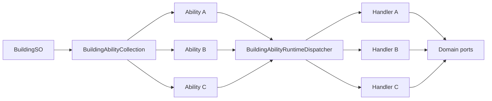
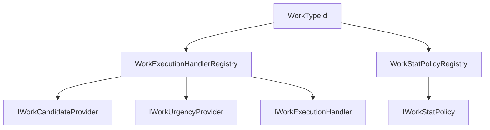

# 03. 콘텐츠 조립과 런타임 디스패치

이 장은 새 건물, 아이템과 작업을 어느 수준까지 조립만으로 만들 수 있는지 설명한다. 데이터 추가와 의미 추가를 구분하는 것이 핵심이다.

## 1. 확장의 네 단계

| 단계 | 의미 | 일반적인 변경 범위 |
|---|---|---|
| 매개변수 콘텐츠 | 기존 형식의 수치와 참조만 다름 | 자산과 카탈로그 |
| 조합 콘텐츠 | 기존 능력과 특성의 조합이 새로움 | 자산, 검증, 경우에 따라 화면 |
| 새 의미 모듈 | 기존 처리기로 표현할 수 없는 행동 | 계약, 구현, 처리기, 등록, 검증, 필요 시 저장 |
| 새 불변식 | 상태 소유권이나 거래 규칙이 달라짐 | 여러 도메인과 저장 아키텍처 |

첫 두 단계가 코드 수정 없이 가능한 조립식 콘텐츠다. 세 번째 단계는 확장 가능한 코드 구조가 필요하며, 네 번째 단계는 일반 콘텐츠 추가로 취급해서는 안 된다.

## 2. Type Object와 ScriptableObject 정의

건물과 아이템은 구체 클래스 상속만으로 종류를 늘리지 않고, ScriptableObject 정의가 안정 ID, 표시 정보, 규칙과 능력 모음을 가진다. 런타임 인스턴스는 정의를 참조하고 현재 상태만 보유한다.

이 Type Object 구조는 같은 런타임 형식이 수백 개의 작성 정의를 공유하게 하고, 저장에는 정의 전체 대신 안정 ID와 상태를 기록하게 한다. 다만 ScriptableObject 자체가 조립성을 보장하지는 않는다. 런타임 코드가 특정 콘텐츠 ID로 분기하면 데이터 외형만 가진 하드코딩 구조가 된다.

## 3. Building Capability Composition

### 적용 패턴

- Type Object: `BuildingSO`
- Capability Composition: `BuildingAbilityCollection`
- Composite: 하나의 건물이 여러 `BuildingAbility`를 보유
- Strategy/Handler: 능력별 실행 처리기
- Registry/Dispatcher: 능력 실제 형식을 처리기로 연결
- Fail-loud validation: 중복 능력과 누락 처리기를 즉시 거부

구현 위치:

- `Assets/Scripts/Services/Buildings/SO/BuildingSO.cs`
- `Assets/Scripts/Models/Buildings/Core/BuildingAbilityContracts.cs`
- `Assets/Scripts/Services/Buildings/Abilities/BuildingAbilityHandlers.cs`

`BuildingAbilityCollection`은 `[SerializeReference]`로 다형 능력을 저장한다. 능력별 안정 ID를 관리하고 같은 형식 또는 같은 ID의 중복을 거부하며, 각 능력이 자체 작성 값을 검증하게 한다.

`BuildingAbilityRuntimeDispatcher`는 능력의 실제 `Type`을 `IBuildingAbilityWorkCompletedHandler`에 연결한다. 작업 완료 의미를 표방한 능력에 처리기가 없으면 예외를 발생시킨다. 새 능력이 조용히 무시되는 상태를 허용하지 않는다.

### 실제 효과

기존 능력만 사용하는 새 건물은 배치, 건설 재료, 작업량, 연구 조건, 기존 생산 및 서비스 능력과 시각 자산을 조합해 만들 수 있다. 건물 런타임의 중앙 `switch (buildingId)`를 수정할 필요가 없다. 새 능력 의미도 능력 정의와 처리기를 한 쌍으로 추가하고 DI multi-binding에 등록할 수 있다.

### 한계

능력 데이터만 추가하면 지속 상태와 저장이 자동으로 생기지는 않는다. 지속 상태를 가진 능력은 런타임 authority, 명령, 질의, 저장 섹션과 복원 검증이 필요하다. 정확한 `Type` 기반 디스패치는 파생 능력을 기본 처리기로 자동 위임하지 않으므로 타입 계층 확장 시 등록 규칙을 명확히 해야 한다.

## 4. Item Feature Composition

`ItemDefinitionSO`는 `[SerializeReference] List<ItemFeatureDefinition>`을 보유한다. 현재 특성에는 생산 분류, 시장, 연구 잠금, 음식, 의약품, 포장 lot, 백신, 병원체 시료, 의료 절차 공급품, 작물 처리제, 물질, 시설 공급품, 장비, 탄약, 설치, 연구 청사진과 진화 촉매 등이 있다.

각 특성은 안정된 `FeatureId`, 작성 값 검증, 생산 출력에서 개별 물리 상태가 필요한지 여부를 제공한다. 소비자는 `TryGetFeature<T>`로 필요한 의미만 조회한다.

구현 위치:

- `Assets/Scripts/Models/Economy/Content/ItemDefinitionSO.cs`
- `Assets/Scripts/Services/Items/ItemDefinitionCatalog.cs`
- `Assets/Scripts/Services/Items/WorldItemRepository.cs`

### 실제 효과

같은 물리 품목이 음식이면서 시장 거래 대상이고 연구 잠금 대상일 수 있다. 상속 조합을 늘리지 않고 feature를 합성할 수 있다. 기존 특성 조합으로 표현되는 아이템은 정의와 카탈로그 추가로 끝낼 수 있다.

### 새 feature가 요구하는 계약

1. 특성을 소비할 질의 또는 처리기
2. 생산 출력의 개별 인스턴스 상태 생성 여부
3. 월드 stack 병합 identity
4. 이동, 예약, 소비와 파괴 시 상태 보존
5. 저장과 복원 codec

코드는 미래 특성에 대해 fail-closed를 택한다. 새로운 특성이 개별 물리 상태를 필요로 하는지 명시하지 않으면 일반 생산 출력 경로에 안전하게 편입되지 않는다.

## 5. Work Strategy와 Registry

작업 시스템은 하나의 거대한 실행 분기 대신 여러 전략을 `WorkTypeId`로 연결한다.

- `IWorkExecutionHandler`: 실제 작업 수행
- `IWorkCandidateProvider`: 대상과 수행 가능성 판정
- `IWorkUrgencyProvider`: 추가 긴급도
- `IWorkStatPolicy`: 작업 속도에 사용할 능력치 정책
- `WorkExecutionHandlerRegistry`: 위 구현들을 ID별로 인덱싱

구현 위치:

- `Assets/Scripts/Models/Work/WorkTypeId.cs`
- `Assets/Scripts/Services/Character/Work/WorkExecutionRegistry.cs`

새 작업 종류는 대상 탐색, 긴급도, 실행과 속도 정책을 독립적으로 설계할 수 있다. 같은 실행기를 여러 `WorkTypeId`에 재사용할 수도 있다. worker loop가 모든 작업의 세부 규칙을 알 필요가 없다.

`BuiltInWorkTypeIds.All`과 작업 정의 카탈로그는 명시적으로 유지된다. 새 작업은 처리기 등록만으로 끝나지 않으며, 작업 정의, 직업 허용, UI 우선순위, 저장된 작업 주문과 자동 감사 범위를 함께 확인해야 한다.

## 6. Registry와 Dispatcher의 품질 조건

현재 좋은 레지스트리는 공통적으로 다음 성질을 가진다.

- 키가 안정 ID 또는 명확한 runtime type이다.
- null, 중복 키와 필수 구현 누락을 구성 단계에서 거부한다.
- 등록 순서를 게임 의미로 사용하지 않는다.
- 호출자는 구체 구현 목록을 순회하지 않고 레지스트리에 질의한다.
- 새 구현을 추가할 때 중앙 실행 분기문을 수정하지 않는다.

이 기준에서 건물 능력과 작업 실행 레지스트리는 완성도가 높다. 사건 효과의 `V21ContentEffectExecutionRegistry`는 효과 종류와 소유자 설명만 연결하므로 같은 수준의 실행 레지스트리가 아니다.

## 7. 구현별 효과와 비용

| 구현 또는 기법 | 직접 얻는 이득 | 콘텐츠를 추가할 때 생기는 차이 | 함께 치르는 비용 |
|---|---|---|---|
| ScriptableObject Type Object | 하나의 런타임 형식으로 많은 작성 정의를 표현한다 | 같은 행동을 쓰는 새 건물이나 아이템은 클래스를 추가하지 않고 자산으로 작성할 수 있다 | 자산 ID, 카탈로그 등록과 참조 무결성 검증이 필요하다 |
| `[SerializeReference]` 능력 조합 | 상속 조합을 늘리지 않고 한 정의에 여러 다형 능력을 붙인다 | 음식이면서 거래 가능하고 연구 잠금인 아이템처럼 기능을 독립적으로 합성할 수 있다 | Unity 직렬화 호환성과 관리 참조 형식 변경을 주의해야 한다 |
| 안정 Ability/Feature ID | 같은 형식의 모듈도 저장, 감사와 오류 메시지에서 구분한다 | 자산 순서가 바뀌어도 모듈의 정체성을 ID로 추적할 수 있다 | ID 변경을 단순 이름 수정으로 처리할 수 없고 이전 자료와의 호환 정책이 필요하다 |
| 모듈 자체 validation | 각 능력과 특성이 자기 작성 규칙을 가장 가까운 곳에서 검사한다 | 카탈로그 검증 단계에서 잘못된 참조와 수치를 찾을 수 있다 | 여러 모듈이 함께 있을 때 생기는 조합 규칙은 별도 교차 검증이 필요하다 |
| 중복 형식과 ID 거부 | 같은 의미가 두 번 적용되는 모호한 정의를 차단한다 | 생산량이나 서비스 효과가 의도치 않게 중복되는 자산을 시작 전에 발견한다 | 의도적인 중첩 효과는 별도 합성 모듈로 명시해야 한다 |
| 실제 `Type` 기반 Dispatcher | 콘텐츠 ID 분기 없이 능력 구현과 handler를 연결한다 | 새 건물 ID를 중앙 switch에 추가하지 않고 같은 능력 handler를 재사용한다 | 파생 형식 자동 fallback이 없으므로 모든 실행 형식의 등록을 관리해야 한다 |
| 필수 handler 누락 시 예외 | 작성됐지만 실행되지 않는 능력을 허용하지 않는다 | 콘텐츠가 조용히 무효화되지 않고 구성 오류로 드러난다 | 정의 전용 모듈과 실행 모듈을 명확히 구분해야 한다 |
| Item Feature의 instance-state 선언 | 생산 출력이 개별 상태 codec을 요구하는지 보수적으로 판정한다 | 탄약이나 장비처럼 stack 수량만으로 부족한 아이템이 일반 출력 경로에서 상태를 잃는 일을 막는다 | 새 feature마다 병합, 이동과 저장 계약을 검토해야 한다 |
| Work handler Registry | 작업 ID를 실행 구현에 연결하고 worker loop에서 세부 규칙을 제거한다 | 새 작업을 추가해도 공용 작업 순회 코드를 수정하지 않는다 | ID 카탈로그와 DI 등록이 수동이므로 완전성 감사가 필요하다 |
| 후보, 긴급도, 실행 정책 분리 | 작업의 탐색, 우선순위와 실제 수행을 독립적으로 바꾼다 | 긴급도 조정만 필요할 때 실행 coroutine을 건드리지 않아도 된다 | 하나의 작업에 여러 정책 파일과 등록이 생긴다 |
| multi-binding Registry 구성 | 여러 handler를 생성자 변경 없이 수집한다 | 새 구현을 등록해도 기존 Registry 소비자 API가 유지된다 | 중복 키와 null 구현을 시작 시 검사해야 한다 |

## 8. 적용 사례

### 기존 능력으로 새 건물을 구성하는 경우

가정 사례로, 새 생산 건물이 이미 구현된 생산 능력, 저장 능력과 연구 잠금만 필요하다고 하자. 건물 ID를 검사하는 전용 코드를 추가하면 같은 의미가 새 건물마다 복제된다.

`BuildingSO`에 기존 `BuildingAbility`를 조합하면 런타임은 능력 형식을 기준으로 기존 handler를 사용한다. 새 건물의 차이는 작성 자산에 남고, 생산과 저장 실행 코드는 바뀌지 않는다. 이 이점은 필요한 의미가 이미 능력으로 분리돼 있을 때만 성립한다. 건물 고유의 지속 상태가 필요하면 새 ability와 저장 권위를 추가해야 한다.

### 하나의 아이템이 여러 용도를 갖는 경우

가정 사례로, 어떤 물자가 생산 재료이면서 식품이고 시장 판매도 가능하다고 하자. 용도 조합마다 하위 클래스를 만들면 `생산 식품`, `판매 식품`, `판매 가능한 생산 식품`처럼 상속 경우의 수가 늘어난다.

`ItemDefinitionSO`에 생산, 음식과 시장 feature를 함께 넣으면 소비 시스템은 자신이 필요한 feature만 조회한다. 새 조합을 만들 때 runtime class가 늘지 않는 것이 직접적인 이득이다. feature 조합 사이의 충돌은 각 feature의 개별 validation만으로 잡히지 않을 수 있으므로 교차 검증이 필요하다.

### 기존 아이템과 병합할 수 없는 상태가 추가되는 경우

탄약 종류나 장비 개체처럼 수량 외의 상태가 필요한 feature를 일반 재료와 같은 출력 codec으로 만들면 서로 다른 상태가 한 stack으로 합쳐질 수 있다. `RequiresProductionOutputInstanceState`는 이런 feature가 전용 개체 상태를 요구한다는 사실을 생산 경로에 알린다.

이 결정은 상태 손실을 막는 대신 새 feature를 추가할 때 생산, 병합, 분할, 이동과 저장을 모두 확인하게 만든다. 단순 수치 feature보다 구현 비용이 큰 이유가 여기에 있다.

### 작업의 긴급도만 다르게 만들고 싶은 경우

가정 사례로, 실행 방식은 같은 운반 작업이지만 특정 목적지의 작업만 더 먼저 선택해야 한다고 하자. 실행 handler에 긴급도 계산까지 넣으면 우선순위를 조정할 때 coroutine 실행 코드도 수정해야 한다.

`IWorkUrgencyProvider`를 실행 handler와 분리하면 대상 선택 점수만 바꿀 수 있다. 후보 판정, 긴급도와 실행이 서로 다른 이유로 변경될 수 있다는 판단에서 나온 구조다. 대신 새 작업 종류를 추가할 때 필요한 정책이 여러 등록 파일에 나뉠 수 있으므로 완전성 감사가 필요하다.

### 능력 자산은 있는데 handler 등록이 빠진 경우

새 작업 완료 능력을 자산에 넣었지만 `IBuildingAbilityWorkCompletedHandler`를 등록하지 않았다고 하자. 조용한 fallback은 건물이 정상처럼 보이면서 실제 효과만 없는 상태를 만든다.

Dispatcher가 예외를 내도록 한 이유는 이 오류를 콘텐츠 결과로 받아들이지 않기 위해서다. 구성 실패가 빨라지는 대신, 의도적으로 실행되지 않는 정의 전용 ability와 실행 ability를 계약으로 구분해야 한다.

## 9. 콘텐츠 유형별 변경 범위

| 추가 대상 | 기존 모듈 조합 | 새 의미가 필요할 때 |
|---|---|---|
| 건물 | `BuildingSO`, 기존 능력, 카탈로그 | 능력 계약, handler, registration, state/save, UI |
| 아이템 | `ItemDefinitionSO`, 기존 feature, 카탈로그 | feature, consumers, instance state codec, merge/transfer/save |
| 작업 | 기존 `WorkTypeId`와 정책 재사용 | ID, definition, candidate, urgency, execution, stat policy, registration |
| 생산식 | 기존 입력, 설비, 작업, 출력 계약 | 새 공정 stage, transaction authority, save and recovery |
| 연구 | 기존 해금 대상과 선행 조건 | 새 해금 command/owner, UI projection, save |

## 10. 조립성을 훼손하는 신호

- 콘텐츠 ID를 비교하는 분기가 런타임 서비스에 추가된다.
- 새 정의 하나 때문에 기존 handler의 생성자 의존성이 늘어난다.
- 능력이나 특성이 등록됐지만 소비자가 없어 조용히 무시된다.
- 물리 아이템 수량을 Repository나 정식 연산을 거치지 않고 직접 수정한다.
- 저장되지 않는 장기 상태를 ScriptableObject에 기록한다.
- 새 작업이 worker loop의 중앙 switch에 직접 추가된다.

이 중 하나가 나타나면 새 의미 모듈 또는 새 불변식으로 분류해야 한다.

## 11. 진화 콘텐츠의 조립 범위

진화 콘텐츠는 작성 조합식, 진화 모듈과 역사 증거를 구분해서 추가해야 한다.

| 추가 대상 | 기존 조합으로 끝나는 경우 | 코드 계약이 바뀌는 경우 |
|---|---|---|
| 시설 교체 조합식 | 기존 방 지표, 기록 표식, 정체성 압력과 변이 태그를 사용한다 | 새로운 조건 의미, 기록 표식 소비 방식이나 교체 거래를 도입한다 |
| 시설 개체 후보 | 기존 이력 지표, 방 활성 규칙, 이득·부담 모듈을 조합한다 | 새 후보 부류, 새 작업 종류나 활성 판정 의미를 만든다 |
| 장비 역사 진화 | 기존 역사 증거와 효과 후보를 다른 가중치로 조합한다 | 새 전투 증거 종류, 장비 상태 전이나 능력치 투영 의미를 만든다 |
| 서술 | 고정된 효과와 증거를 표시 문구로 해석한다 | 서술 응답에 후보 선택이나 효과 변경 권한을 준다 |

작성 조합식은 제작자가 가능한 결과와 조건을 미리 정의한다. 개체 진화 후보는 현재 사용 이력과 방 상태에서 결정론적으로 생성한다. 둘 다 데이터 중심이지만 실행 시점과 상태 권위는 다르다. 새 시설 결과 자산을 추가했다고 해서 개체 진화 후보가 자동으로 생기지는 않으며, 새 진화 모듈을 등록했다고 작성 교체 계보가 자동으로 연결되는 것도 아니다.

예를 들어 기존 `RoomSynergy` 후보에 이미 존재하는 위생 조건과 서비스 이득 모듈을 조합한다면 후보 작성과 Registry 연결로 범위를 제한할 수 있다. 반대로 "역병 중 사용"을 처음으로 역사 증거로 추가한다면 사건 생산자, `HistoricalEvidenceKind`, 압축 집계, 시설 또는 장비 규칙, 저장 호환성과 표시 설명을 함께 바꿔야 한다.

위험 촉매 후보처럼 기존 작업 흐름을 사용하더라도 촉매 계열, 요구 진행 단계, 이득과 부담의 대응이 모두 유효한지 검증해야 한다. 정의는 있는데 모듈 Registry가 효과를 해석하지 못하거나, 사건은 기록되는데 후보 규칙이 소비하지 않는 상태를 구현 완료로 보지 않는다.

진화 콘텐츠를 조립식이라고 판정하려면 다음 연결이 닫혀 있어야 한다.

1. 입력 사건이나 방 조건의 생산자가 존재한다.
2. 압축 이력 또는 작성 기록이 그 의미를 보존한다.
3. 후보 규칙이 기존 모듈과 안정 ID로 결과를 만든다.
4. 물질과 작업 경로가 선택 결과를 고정해 적용한다.
5. 노드 또는 교체 결과가 저장되고 해당 도메인 투영에서 소비된다.

공용 이력 구조와 시설·장비 Adapter의 관계는 [사용 이력 기반 진화 아키텍처](07-history-driven-evolution-architecture.md)에 설명되어 있다.
