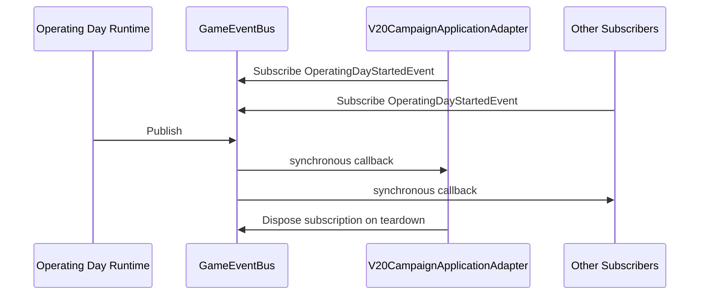
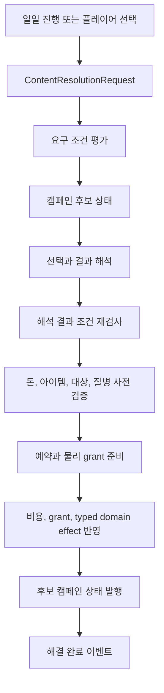
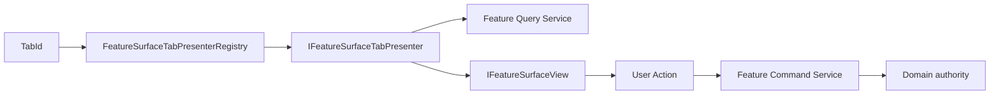
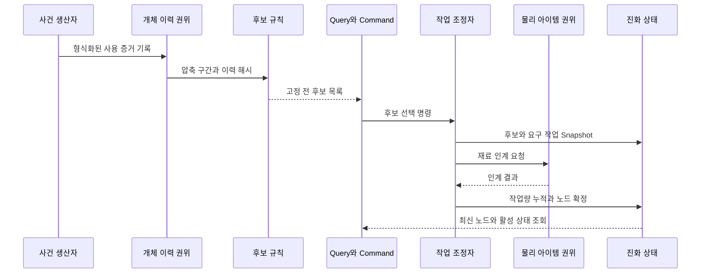

# 04. 응용 워크플로, 사건과 프레젠테이션

이 장은 한 도메인만으로 끝나지 않는 절차를 누가 조율하며, 완료 사실과 화면 갱신이 어떻게 전달되는지 다룬다.

## 1. Application Service와 Coordinator

사건 해결, 원정 귀환, 생산 출력과 건설 완공은 여러 상태 권위를 정해진 순서로 호출한다. 이 순서를 도메인 모델에 넣으면 다른 도메인의 내부 구조를 알아야 하고, UI에 넣으면 자동화나 AI가 재사용할 수 없다.

Infrastructure와 Services의 응용 클래스가 유스케이스 순서를 조율한다.

대표 사례:

- `V20CampaignApplicationAdapter`: 일일 시작 이벤트를 캠페인 평가와 사건 해결 요청으로 번역한다.
- `V20ContentResolutionService`: 요구 조건, 후보 상태, 물리 효과 사전 검증과 반영을 조율한다.
- `ProductionCapacityRoutingDrainExecutionCoordinator`: 여러 생산 및 물리 권위의 책임 이전을 조정한다.
- `OffenseExpeditionReturnCoordinator`: 원정 귀환의 여러 결과를 조율한다.

이들은 Application Service, Coordinator 또는 Process Manager에 가까운 구조다. 장기 상태와 보상 트랜잭션을 관리하는 일부 흐름은 Saga와 유사하지만, 공통 Saga 엔진이나 보상 명령 프레임워크를 사용하지 않으므로 `Saga-like`로만 분류한다.

이 구조는 UI, AI와 시간 진행이 같은 유스케이스를 호출하게 하고, 여러 권위의 호출 순서와 복구를 한곳에서 검토하게 한다. 반면 생성자 의존성과 분기 종류가 계속 늘어나면 유스케이스별 서비스, effect handler 또는 명시적 step pipeline으로 분리해야 한다.

## 2. Observer와 Typed Event Bus

`IGameEventBus`는 `Subscribe<TEvent>`, `Publish<TEvent>`와 `Clear`를 제공한다. `GameEventBus`는 이벤트 형식을 키로 채널을 만들고 동기적으로 listener를 호출한다. 구독은 `IDisposable`을 반환하며, 발행 시 listener 배열 snapshot을 사용한다.

구현 위치:

- `Assets/Scripts/Services/Foundation/Events/GameEventBus.cs`
- `Assets/Scripts/Services/Run/V20CampaignApplicationAdapter.cs`



발행자는 캠페인, UI 알림, 통계 등 후속 소비자를 알 필요가 없다. 새로운 반응은 구독자를 추가해 연결할 수 있다.

현재 Event Bus는 구독자 순서, 비동기 큐, 예외 격리, 영속화, 재생과 정확히 한 번 전달을 보장하지 않는다. 반드시 완료되어야 하는 변경은 Coordinator가 명령 응답으로 확인하고, 이벤트는 이미 확정된 사실의 후속 반응에 사용해야 한다.

## 3. Adapter as event translator

`V20CampaignApplicationAdapter`는 `IStartable`과 `IDisposable`을 구현한다. 일일 시작 이벤트를 직접 도메인 상태 변경으로 연결하지 않고, 현재 세계 Snapshot을 구성해 `ContentResolutionRequest`로 번역한다.

시간 시스템은 캠페인 평가에 필요한 인물, 시설, 문화와 질병 정보를 알지 않는다. 캠페인 서비스도 Unity 시작 수명주기나 구독 정리를 알 필요가 없다. 다만 Adapter의 의존성 수가 많아 일일 캠페인 문맥의 책임이 넓다. 문맥 projection 또는 사건 종류별 평가기로 더 분리할 여지가 있다.

## 4. 사건 해결 파이프라인



사건은 단순 수치 변경 목록으로 끝나지 않는다. 아이템 비용은 실제 stack을 기준으로 예약하고, grant는 물리 exact-source publication을 준비하며, 돈과 아이템 실패 시 복구를 수행한다. 대상 인물, 관계 인원수와 질병 정의도 사전 검증한다.

구현 위치:

- `Assets/Scripts/Services/Run/V20ContentResolutionService.cs`

기존 `V20ContentEffectKind`와 요구 조건을 조합하는 사건은 데이터 정의 중심으로 확장할 수 있다. 계절, 사회, 세력과 인물 사건이 같은 사전 검증 및 결과 발행 절차를 이용한다.

### 구조적 한계

`V21ContentEffectExecutionRegistry`는 효과 종류를 실행 소유자 설명 문자열에 연결할 뿐이다. 실제 실행은 `V20ContentResolutionService.ApplyTypedDomainEffects`의 `switch`와 별도 preflight/commit 코드에 있다.

새 효과 종류는 effect enum, 정의 검증, 대상 검증, preflight 계획, commit/rollback, typed effect switch와 지속 상태를 함께 수정해야 한다. 기존 효과의 조합성은 높지만 새 효과 구현의 폐쇄성은 낮다.

건물 능력과 같은 수준으로 끌어올리려면 `IContentEffectHandler`가 효과 종류, 정의 검증, 사전 검증, 준비, 반영, 복구와 소유자 정보를 제공하고 effect kind별 레지스트리가 이를 수집해야 한다.

## 5. Presenter와 Query/Command boundary

Feature Surface 화면은 탭별 Presenter를 `IFeatureSurfaceTabPresenter`로 통일한다. `FeatureSurfaceTabPresenterRegistry`는 주입된 presenter를 `TabId`로 인덱싱하고 중복 탭과 선언된 Feature 탭의 Presenter 누락을 시작 시 거부한다.

구현 위치:

- `Assets/Scripts/Views/UI/Core/PresentationPrimitives.cs`
- `Assets/Scripts/Services/Infrastructure/Registration/DungeonPresentationRegistration.cs`



새 탭은 탭 정의, Presenter, 질의 및 명령 서비스와 DI 등록으로 추가할 수 있다. 공용 패널은 탭별 세부 도메인을 알 필요가 없다.

등록은 `DungeonPresentationRegistration`에 수동으로 추가되며 파일 규모가 크다. 일부 화면 Context는 여러 서비스를 묶는데, 안정된 화면 유스케이스 경계라면 유효하지만 단순 dependency bag이 되면 결합을 감춘다.

## 6. 구현별 효과와 비용

| 구현 또는 기법 | 직접 얻는 이득 | 워크플로를 변경할 때 생기는 차이 | 함께 치르는 비용 |
|---|---|---|---|
| Application Service | 여러 도메인 명령의 실행 순서를 도메인 모델과 UI 밖에 둔다 | 같은 유스케이스를 UI, AI와 시간 진행이 공유할 수 있다 | 의존성이 늘면 서비스가 여러 변경 이유를 한곳에 모으게 된다 |
| Coordinator/Process Manager | 장기 절차의 현재 단계와 다음 호출을 한 경계에서 관리한다 | 한 권위의 완료 후 어느 권위를 호출할지 추적하기 쉬워진다 | 보상과 재시도 규칙을 절차별로 작성해야 한다 |
| Typed Event Bus | 발행자가 구독자의 구체 구현을 참조하지 않는다 | 새 알림이나 통계 반응을 발행 코드 수정 없이 추가할 수 있다 | 호출 순서, 영속성, 예외 격리와 exactly-once 전달은 제공하지 않는다 |
| listener 배열 snapshot | 발행 도중 구독자가 해제돼도 현재 순회 컬렉션이 변하지 않는다 | 콜백 안에서 `Dispose`가 호출되어도 순회 자체가 깨지지 않는다 | 발행마다 listener 배열을 복사한다 |
| `IDisposable` 구독 | 구독 생명주기를 명시적으로 끝낼 수 있다 | 씬 교체 뒤 이전 객체가 이벤트를 계속 받는 참조 누수를 줄인다 | 각 구독자가 종료 시점을 빠뜨리지 않고 `Dispose`해야 한다 |
| Event Adapter | 시간 이벤트와 캠페인 요청의 자료형을 경계에서 변환한다 | 시간 시스템은 캠페인 평가에 필요한 세부 데이터를 알 필요가 없다 | Adapter가 양쪽 계약을 알고 문맥을 조립해야 한다 |
| 효과 적용 전 preflight | 돈, 아이템, 대상과 정의의 실패를 mutation 전에 확인한다 | 중간까지 반영된 사건 결과를 되돌려야 하는 경우를 줄인다 | 실제 commit 사이에 상태가 바뀔 수 있어 reservation이나 재검증이 필요하다 |
| 아이템 reservation | preflight에서 확인한 물리 수량을 commit까지 다른 작업이 사용하지 못하게 한다 | 조건 확인 직후 다른 시스템이 재료를 가져가 발생하는 경쟁을 막는다 | 실패와 취소 경로에서 reservation을 반드시 해제해야 한다 |
| exact-source publication 준비 | 생성할 물리 아이템과 배치 결과를 실제 반영 전에 고정한다 | 비용만 소모되고 보상 아이템이 생성되지 않는 절반 반영을 막을 근거가 생긴다 | prepare, commit과 rollback 상태를 모두 관리해야 한다 |
| 후보 캠페인 상태 | 사건 해석을 live 상태와 분리해 검증한다 | 모든 조건이 통과하기 전 계절, 사회와 세력 상태가 화면에 노출되지 않는다 | 후보 복제와 최종 publication 절차가 추가된다 |
| Presenter Registry | 탭 ID와 표시 구현을 연결하고 중복과 누락을 시작 시 검사한다 | 공용 패널을 수정하지 않고 새 탭 Presenter를 등록할 수 있다 | 탭 정의와 DI 등록을 함께 유지해야 한다 |
| Presentation의 Query/Command 분리 | 화면 조회 코드가 변경 권한을 갖지 않게 한다 | 표시 방식 변경과 게임 규칙 변경의 수정 범위를 분리한다 | 화면별 query model과 command result 형식이 늘어난다 |

## 7. 적용 사례

### 사건이 비용과 보상을 함께 처리하는 경우

가정 사례로, 선택 시 돈과 물리 아이템을 소비하고 다른 아이템을 보상으로 지급하는 사건을 생각할 수 있다. 순서대로 즉시 반영하면 돈은 빠졌지만 재료가 없거나, 비용은 모두 빠졌지만 보상 배치가 실패하는 중간 상태가 생긴다.

`V20ContentResolutionService`는 돈, item cost, 대상과 grant 위치를 먼저 검사하고, 아이템 수량을 예약하며, 보상 publication을 준비한 뒤 commit한다. 실패 가능성을 mutation 앞에 모아 절반 반영을 줄이는 결정이다. prepare 이후에도 실패할 수 있으므로 reservation 해제와 publication rollback을 함께 구현해야 한다.

### 구독자가 이벤트 처리 중 스스로 해제되는 경우

씬 종료를 감지한 구독자가 콜백 안에서 `Dispose`할 수 있다. listener 원본 목록을 직접 순회하면 현재 index가 바뀌어 다음 구독자를 건너뛰거나 순회가 깨질 수 있다.

`GameEventBus`가 listener 배열 snapshot을 만든 뒤 호출하는 이유가 여기에 있다. 현재 발행은 시작 시점의 구독자 집합을 안정적으로 처리하고, 해제는 다음 발행부터 반영된다. 그 대가로 발행마다 배열 복사가 발생한다.

### 시간 진행에 새로운 후속 반응을 붙이는 경우

일일 시작을 발행한 시간 시스템이 캠페인, 알림과 통계 구현을 모두 직접 호출하면 후속 기능이 추가될 때마다 시간 코드를 수정해야 한다. Typed Event Bus를 사용하면 새 구독자는 발행자를 바꾸지 않고 연결된다.

이 이점은 후속 반응이 서로 독립적일 때 유효하다. 반드시 먼저 끝나야 하는 거래를 이벤트 순서에 맡기면 안 된다. 그런 절차는 Application Service가 명령 결과를 확인하며 직접 조율해야 한다.

### 새 기능 탭을 추가하는 경우

가정 사례로, 기존 Feature Surface에 새 운영 탭을 추가한다고 하자. 공용 패널에 탭별 `switch`를 계속 넣으면 탭 추가가 패널 수정으로 이어지고, 누락된 화면은 실행 전까지 알기 어렵다.

새 `IFeatureSurfaceTabPresenter`를 등록하면 Registry가 `TabId`로 찾아 공용 View에 표시한다. 중복 탭과 Presenter 누락도 Registry 생성 시 확인된다. 대신 탭 정의, Query/Command Service와 DI 등록을 함께 변경해야 한다.

### 기존 목록에 없는 사건 효과를 추가하는 경우

새 효과가 기존 돈, 아이템, 관계나 상태 명령으로 표현되지 않는다면 현재 구조에서는 effect enum, preflight, commit과 실행 switch를 함께 수정해야 한다. 이 경우는 데이터 조합의 이점을 얻지 못한다.

효과별 handler 계약을 제안한 이유는 새 의미가 다시 등장할 때 중앙 service를 반복 수정하지 않기 위해서다. handler 분리는 등록 지점을 늘리지만, 효과별 검증과 rollback 책임을 같은 구현 가까이에 둘 수 있다.

## 8. 사건 효과 handler의 목표 계약

현재 코드의 개선 목표를 문서 수준에서 다음과 같이 정의한다.

```text
IContentEffectHandler
  - EffectKind
  - ValidateDefinition(effect, catalog)
  - Preflight(effect, participants, world, plan)
  - Prepare(plan)
  - Commit(prepared)
  - Rollback(prepared)
  - DescribeAuthority()
```

하나의 handler가 모든 동작을 직접 구현할 필요는 없다. 이 계약은 새 효과 종류를 중앙 service의 여러 switch에 흩어 놓지 않고 동일한 거래 생명주기에 등록하기 위한 것이다. 물리 효과와 단순 도메인 명령의 비용 차이는 별도 handler family나 capability interface로 구분할 수 있다.

## 9. 워크플로 점검표

- 단일 도메인 불변식은 해당 authority에 있는가.
- 여러 권위의 호출 순서만 Application Service가 소유하는가.
- 모든 실패 가능 작업을 mutation 전에 검증했는가.
- 준비 후 실패할 수 있다면 복구 명령이 있는가.
- Event Bus는 완료 사실을 전달하며 거래 성공을 결정하지 않는가.
- 새 종류를 추가할 때 중앙 switch 수정 수가 늘어나지 않는가.
- UI가 명령 결과를 받은 뒤 최신 상태를 다시 조회하는가.

## 10. 이력에서 진화 작업으로 이어지는 워크플로

시설과 장비의 진화는 Event Bus 구독 하나로 결과를 즉시 적용하지 않는다. 사건 기록, 이력 압축, 후보 생성, 플레이어 승인, 물질 인계와 작업 완료를 서로 다른 단계로 둔다.



`FacilityEvolutionRuntime`과 `FacilityInstanceEvolutionRuntime`은 이름이 비슷하지만 다른 Coordinator다. 전자는 작성된 조합식 후보를 검증하고 물질 영수증과 건물 교체를 조율한다. 후자는 숙련도 기반 후보, 개조, 노드 재조율, 포장 운반을 포함한 시설 이전을 관리한다. 하나의 진화 파이프라인으로 합치면 각 경로의 저장 단계와 실패 복구를 설명할 수 없다.

서술 생성은 별도 응용 경계다. 요청은 대상, 노드, 이력 해시, 허용 효과와 증거를 먼저 고정한다. 모델 응답은 저장된 요청과 현재 노드가 여전히 일치할 때 이름과 설명만 갱신한다. 게임 규칙의 후보와 효과를 모델 응답에 맡기지 않으므로, 응답 지연이나 실패가 작업 결과를 바꾸지 않는다.

| 워크플로 기법 | 적용 효과 | 추가 비용 |
|---|---|---|
| 사건 기록과 완료 명령 분리 | 사용 사실을 남기는 호출이 곧바로 진화를 확정하지 않는다 | 후보를 여는 시점과 중복 기록 정책이 필요하다 |
| 이력 해시 기반 후보 계산 | 저장과 재조회 사이의 후보 입력을 재현할 수 있다 | 정규화와 해시 입력 호환성을 관리해야 한다 |
| 승인 시 후보 고정 | 작업 중 이력이 바뀌어도 완료 결과가 흔들리지 않는다 | 취소 시 재료와 후보를 어떻게 처리할지 정해야 한다 |
| 도메인별 Coordinator | 작성 교체, 개체 개조와 장비 재단조의 실패 상태를 각자 소유한다 | 비슷한 절차 사이에 중복 코드가 생길 수 있다 |
| 제한된 서술 Adapter | 자연어 생성과 게임 결과 권위를 분리한다 | 요청 Snapshot, 응답 검증과 fallback이 필요하다 |

가정 사례로 시설 개조 후보를 승인한 직후 다른 서비스 사건이 기록됐다고 하자. 후보를 완료 시점에 다시 계산하면 플레이어가 선택하지 않은 결과가 적용될 수 있다. 현재 구조는 승인한 후보를 주문에 복제하고, 이후 사건은 다음 세대의 자료로 남긴다. 이 결정은 명령 의미를 보존하지만, 오래 대기한 주문이 현재 운영과 달라 보일 수 있으므로 UI가 고정된 후보와 대기 원인을 표시해야 한다.

전체 상태와 모듈 관계는 [사용 이력 기반 진화 아키텍처](07-history-driven-evolution-architecture.md)에서 이어진다.
