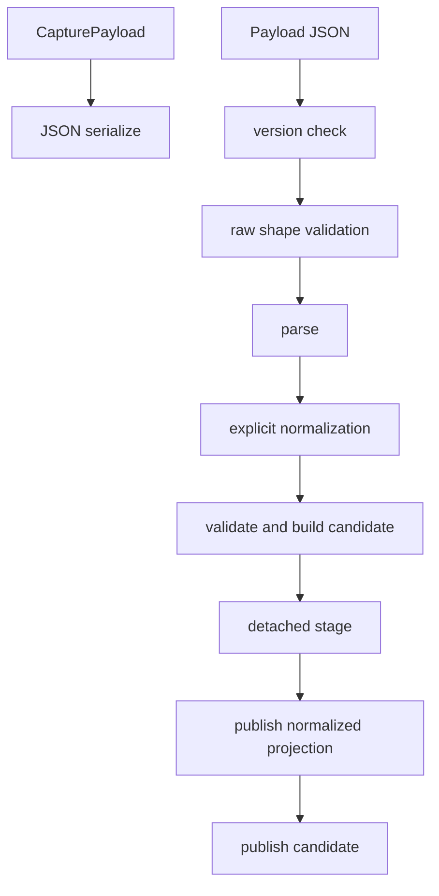
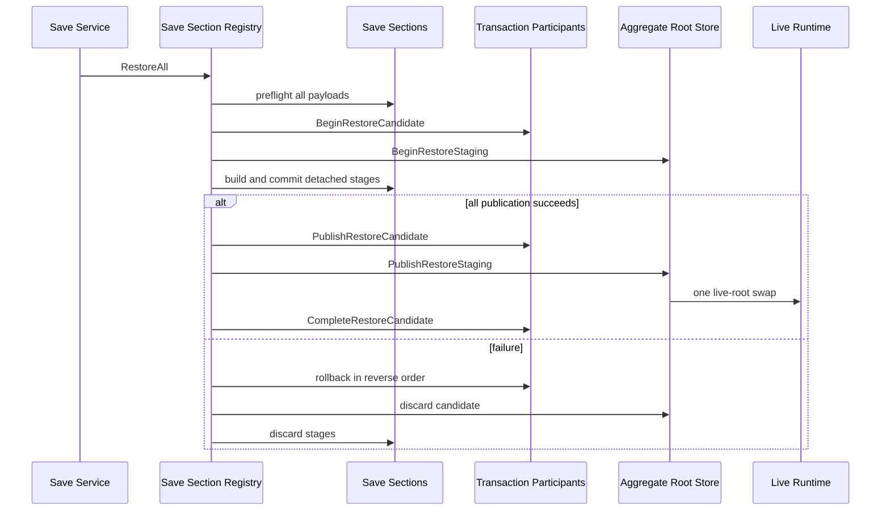
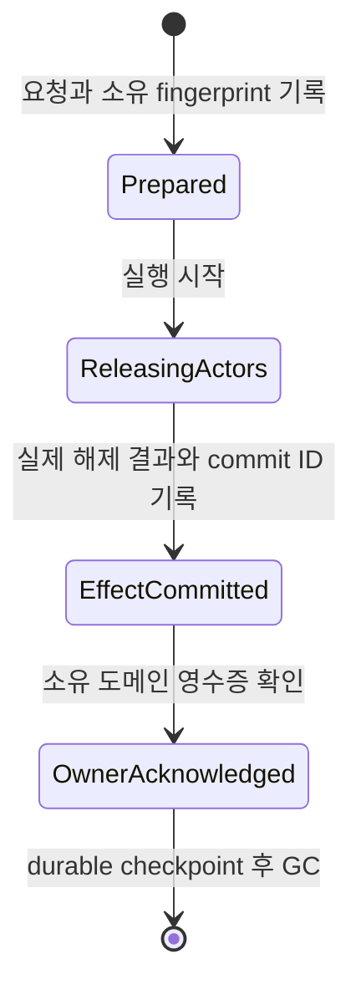

# 05. 저장, 복원과 중복 실행 방지

이 장은 저장 파일 형식보다 상태 권위의 일관성을 다룬다. 목표는 저장이나 복원 도중 실패해도 절반만 반영된 세계를 노출하지 않고, 재시도된 거래가 결과를 중복 생성하지 않게 하는 것이다.

## 1. Save Section Registry

각 도메인은 `IDungeonSaveSection`으로 자신의 캡처와 복원을 제공한다. 섹션은 안정 ID, 버전, 복원 단계와 의존 섹션을 선언한다. `DungeonSaveSectionRegistry`는 이를 수집해 중복, staged restore 계약 누락과 잘못된 의존성을 거부한다.

구현 위치:

- `Assets/Scripts/Services/Foundation/Save/DungeonSaveSections.cs`
- `Assets/Scripts/Services/Infrastructure/DungeonGameSaveService.cs`

적용된 구조는 Plugin/Registry, 의존 그래프의 위상 정렬, fail-loud validation이다. 새 도메인은 중앙 저장 DTO에 필드를 계속 추가하지 않고 별도 섹션으로 참여한다. 섹션별 버전과 복원 순서를 독립적으로 정의할 수 있고, 중앙 서비스는 구체 도메인 형식을 몰라도 전체 저장을 조율한다.

## 2. Template Method for strict JSON sections

`DungeonStrictJsonSaveSection<TPayload, TRestoreCandidate>`는 저장 섹션의 생명주기를 고정한다.

하위 섹션은 `CapturePayload`, `BuildRestoreCandidate`, `PublishRestoreCandidate`와 필요한 호환성 정규화를 구현한다. 기반 클래스는 버전 확인, 빈 payload 거부, 파싱, preflight candidate 생성과 실제 commit에서만 일어나는 publication 순서를 고정한다.

이 Template Method는 섹션마다 복원 생명주기와 실패 정책이 달라지는 것을 막는다. 범용 reflection 보정 대신 지원하는 이전 형식의 경로를 명시적으로 작성하게 해 손상 데이터를 추측으로 복원하지 않는다.

구현 위치:

- `Assets/Scripts/Services/Infrastructure/Core/Save/DungeonJsonSaveSection.cs`

## 3. Staged Restore와 Unit of Work 유사 구조

복원은 모든 섹션이 준비된 뒤 한 번에 발행된다.

적용 범위는 로컬 Unit of Work와 가역 publication transaction이다. 데이터베이스나 외부 자원 관리자는 참여하지 않는다.

이 구조는 복원 도중 뒤 섹션이 실패해도 앞 섹션의 변경을 노출하지 않고, Unity 월드 객체 같은 aggregate root 밖의 자원도 transaction participant로 참여하게 한다.

## 4. Snapshot/Memento와 Copy-on-write

`DungeonRuntimeAggregateRootStore`는 현재 live root의 얕은 사본을 복원 후보로 만들고, 실제로 변경되는 root type만 후보 소유로 복제한다. 모든 준비가 성공하면 live 참조를 후보로 한 번 교체하고 복원 revision을 올린다.

이 기법은 전체 세계를 매번 깊은 복사하는 비용을 줄인다. 동시에 candidate-owned type을 잘못 관리하면 live 객체가 staging 중 변경될 수 있으므로, 새 mutable root는 반드시 copy-on-write 참여 방식을 지켜야 한다.

## 5. Transaction Participant

`IDungeonRestoreTransactionParticipant`는 DTO aggregate 밖에 있는 상태를 복원 거래에 참여시킨다.

- `BeginRestoreCandidate`
- `PublishRestoreCandidate`
- `RollbackPublishedRestoreCandidate`
- `CompleteRestoreCandidate`
- `DiscardRestoreCandidate`

비활성 Unity 객체나 별도 runtime root는 단순 JSON 후보만으로 안전하게 교체할 수 없다. participant가 publication과 rollback을 소유한다. `Complete`는 모든 publication과 root swap 이후 이전 live 자원을 정리하는 비실패 단계여야 한다.

## 6. Transactional Outbox와 명시적 상태 기계

`ProductionPhysicalCustodyDrainOutbox`는 생산 입력 목적지의 물리 책임을 해제하는 장기 거래를 Items 권위에 기록한다.

구현 위치:

- `Assets/Scripts/Services/Items/ProductionPhysicalCustodyDrainOutbox.cs`
- `Assets/Scripts/Models/Production/Core/ProductionFacilityDestructiveDrainContracts.cs`

`EffectCommittedAwaitingOwnerAck`는 물리 효과가 발생했고 소유 도메인의 확인이 남은 상태다. `OwnerAcknowledgedAwaitingCheckpointGc`는 확인까지 끝났지만 안전한 저장 checkpoint가 아직 남은 상태다.

### 사용된 기법

- operation ID로 같은 논리 거래를 식별한다.
- request fingerprint로 같은 ID에 다른 요청이 재사용되는 충돌을 탐지한다.
- result와 receipt fingerprint로 완료 결과를 고정한다.
- deterministic commit ID를 생성한다.
- 같은 요청의 재호출은 `Replay`로 반환한다.
- 선행 단계가 끝나지 않았으면 `Deferred`를 반환한다.
- durable checkpoint 이후에만 완료 원장을 garbage collection한다.
- GC도 prepare, publish, rollback, complete 후보를 사용한다.

저장 직전, 효과 반영 직후, 소유자 확인 직후 어느 시점에서 종료되어도 다음 실행이 현재 단계를 판정할 수 있다. 생산과 Items가 하나의 메모리 트랜잭션을 공유하지 않아도 결과 중복과 소실을 억제한다.

## 7. Durable Save Commit Coordinator

`DungeonDurableSaveCommitCoordinator`는 파일이 영속적으로 반영된 이후 실행할 참가자를 안정된 순서로 호출한다.

- `Applied`: 이번 호출에서 반영됨
- `AlreadyApplied`: 같은 durable commit이 이미 처리됨
- `Deferred`: 선행 조건이 아직 충족되지 않음
- `Corruption`: 식별자, 상태 또는 결과가 계약과 충돌함

구현 위치:

- `Assets/Scripts/Services/Infrastructure/Save/DungeonDurableSaveCommitCoordinator.cs`

메모리의 JSON 생성과 파일 교체는 서로 다른 단계다. outbox 완료 기록을 너무 일찍 지우면 crash 후 실제 효과를 재판정할 근거를 잃는다. 이 coordinator는 직렬화와 durable commit 이후 정리를 분리한다.

## 8. 구현별 효과와 비용

| 구현 또는 기법 | 직접 얻는 이득 | 실패하거나 재시도할 때 생기는 차이 | 함께 치르는 비용 |
|---|---|---|---|
| Save Section Plugin/Registry | 도메인 저장 형식을 중앙 DTO에서 분리한다 | 새 상태 권위는 Registry 알고리즘을 바꾸지 않고 섹션으로 참여할 수 있다 | section ID, version과 등록 완전성을 관리해야 한다 |
| `DependsOn`과 위상 정렬 | 참조 대상이 먼저 복원되는 순서를 선언으로 계산한다 | 등록 순서가 바뀌어도 의존 관계에 맞는 복원 순서를 유지한다 | 순환 의존과 과도한 섹션 결합을 해결해야 한다 |
| 중복 ID와 unstaged section 거부 | 저장 권위가 겹치거나 live mutation을 하는 옛 섹션을 시작 전에 차단한다 | 모호한 저장 소유권이 실제 복원까지 숨어 있지 않는다 | 모든 섹션이 공통 staging 계약으로 이행돼야 한다 |
| Strict JSON Template Method | parse, normalize, validate, stage와 publish 순서를 고정한다 | 새 섹션이 검증을 건너뛰거나 preflight 중 live state를 바꾸기 어렵다 | 특수 호환성 처리는 정해진 hook 안에서 구현해야 한다 |
| raw JSON shape 검사 | serializer가 null과 빈 컬렉션을 같게 만드는 경우에도 필수 필드 누락을 구분한다 | 손상된 payload가 정상 빈 상태로 복원되는 일을 막는다 | 필요한 필드 목록을 섹션 버전과 함께 유지해야 한다 |
| 명시적 이전 형식 정규화 | 지원하는 과거 경로만 현재 ID 형식으로 변환한다 | 필드명 추측이나 reflection으로 잘못된 값을 고치는 위험을 줄인다 | 지원할 이전 버전마다 변환 코드를 작성해야 한다 |
| Detached Restore Stage | 모든 검증과 후보 준비가 끝날 때까지 live 상태를 유지한다 | 뒤 섹션이 실패해도 앞 섹션만 복원된 세계가 노출되지 않는다 | 후보 메모리와 discard 경로가 필요하다 |
| Aggregate Root의 copy-on-write | 실제 변경되는 root type만 복제한다 | 전체 세계 deep copy보다 적은 복제로 원자적 root 교체를 준비한다 | mutable type별 후보 소유 규칙을 지키지 않으면 live state가 오염된다 |
| Transaction Participant | Unity 객체처럼 DTO root 밖의 자원도 같은 복원 거래에 참여시킨다 | 일부 GameObject만 새 저장 상태를 반영하는 불일치를 rollback할 수 있다 | publish, reverse-order rollback, complete와 discard를 모두 구현해야 한다 |
| Outbox 단계 기록 | 서로 다른 권위 사이의 장기 거래 진행을 저장한다 | crash 후 효과가 이미 실행됐는지 판정하고 다음 단계부터 재개할 수 있다 | 단계 수와 영속 데이터가 늘어나며 GC 시점을 관리해야 한다 |
| request fingerprint | 같은 operation ID에 내용이 다른 요청이 들어오는 충돌을 구분한다 | 잘못된 요청을 정상 replay로 처리하지 않는다 | canonical fingerprint 생성 규칙을 버전과 함께 유지해야 한다 |
| result/receipt fingerprint | 실제 실행 결과와 소유자 확인 결과를 고정한다 | 재호출 결과가 이전 완료 내용과 같은지 검증할 수 있다 | 결과를 만드는 모든 필드가 fingerprint 범위에 포함돼야 한다 |
| deterministic commit ID | 같은 논리 결과가 같은 완료 식별자를 사용한다 | 저장과 재시도 사이에서 중복 결과를 별도 거래로 오인하지 않는다 | ID 조합 규칙을 바꾸면 이전 기록과 호환 문제가 생긴다 |
| `Replay`, `Deferred`, `Conflict` 구분 | 재실행, 선행 단계 미완료와 데이터 충돌을 다른 결과로 전달한다 | 호출자가 재시도할지 중단할지 상태에 맞게 결정할 수 있다 | 각 호출 경로가 상태별 결과를 빠짐없이 처리해야 한다 |
| durable-save commit 참가자 | 파일 교체가 끝난 뒤에만 완료 원장을 정리한다 | 메모리 직렬화 성공 직후 crash가 나도 replay 증거를 잃지 않는다 | 저장 후속 pipeline과 참가자 순서를 관리해야 한다 |

## 9. 적용 사례

### 다른 섹션의 ID를 참조하는 상태를 복원하는 경우

가정 사례로, 작업 주문 섹션이 건물 인스턴스 ID를 참조한다고 하자. 파일에 섹션이 적힌 순서대로 복원하면 작업 주문이 먼저 처리되어 아직 존재하지 않는 건물을 참조할 수 있다.

`DependsOn`을 선언하고 위상 정렬하는 방식은 파일 순서나 DI 등록 순서와 복원 의미를 분리한다. 건물 상태가 먼저 준비된 뒤 작업 주문을 검증할 수 있다. 대신 섹션 사이의 순환 의존이 생기면 어느 쪽이 권위를 소유하는지 다시 나눠야 한다.

### 필수 배열이 손상된 저장을 읽는 경우

Unity `JsonUtility`가 명시적 null이나 누락 필드를 초기화된 빈 목록처럼 보이게 만들면, "저장에 아무 항목이 없음"과 "필수 필드가 사라짐"을 구분하기 어렵다.

strict JSON section이 역직렬화 전에 raw shape를 검사하는 이유는 손상을 정상 빈 상태로 받아들이지 않기 위해서다. 저장 복원은 중단되지만, 일부 상태가 조용히 사라진 채 게임이 계속되는 것보다 원인을 보존한다. 새 필수 필드를 추가하면 raw shape 규칙과 section version도 함께 바꿔야 한다.

### 복원 후보에 Unity 객체가 포함되는 경우

비활성 GameObject나 씬 계층 객체는 DTO root 참조 하나를 바꾸는 것만으로 교체할 수 없다. 일부 객체를 활성화한 뒤 다른 섹션의 publication이 실패하면 새 객체와 이전 도메인 상태가 섞일 수 있다.

`IDungeonRestoreTransactionParticipant`가 publish, rollback과 complete를 나눈 이유다. 모든 participant가 성공하기 전에는 이전 live 객체를 폐기하지 않고, 실패하면 역순으로 publication을 되돌린다. 각 participant가 부분 적용 후 예외가 난 경우까지 rollback할 수 있어야 한다는 비용이 따른다.

### 물리 효과 직후 저장되거나 종료되는 경우

생산 입력 stack을 실제로 해제한 직후, 생산 도메인이 완료 영수증을 기록하기 전에 프로세스가 끝날 수 있다. 재개 시 pending 기록이 없다면 다시 해제해 수량을 중복 차감할 수 있고, 무조건 완료로 보면 생산 주문만 남을 수 있다.

Outbox는 `EffectCommittedAwaitingOwnerAck` 단계와 result fingerprint를 저장한다. 재개 후에는 물리 효과를 반복하지 않고 같은 영수증을 소유 도메인에 다시 전달할 수 있다. 단계 원장과 fingerprint를 저장하는 비용이 생기지만, 두 권위를 하나의 메모리 트랜잭션으로 묶지 않고도 현재 위치를 판정한다.

### 완료 원장을 언제 삭제할지 결정하는 경우

소유 도메인이 결과를 확인했다고 곧바로 outbox 행을 지우면, 그 삭제가 저장 파일에 반영되기 전에 종료됐을 때 이전 파일에는 확인 전 상태가 남는다.

durable-save commit 참가자는 새 파일이 실제로 교체된 뒤 checkpoint GC를 실행한다. 완료 증거가 저장되기 전에는 원장을 남겨 replay 판단 자료를 보존한다. 저장 후속 pipeline과 GC 순서를 별도로 운영해야 하지만, 직렬화 성공과 영속 반영을 같은 사건으로 오인하지 않게 된다.

## 10. 새 Save Section 추가 절차

1. 안정되고 중복되지 않는 section ID와 current version을 정한다.
2. 다른 상태를 참조한다면 `DependsOn`을 선언한다.
3. 캡처 DTO와 detached restore candidate를 분리한다.
4. raw JSON에서 반드시 존재해야 하는 배열과 형식을 검증한다.
5. candidate 생성 중 live state를 수정하지 않는다.
6. publish는 이미 검증된 candidate의 교체만 수행한다.
7. aggregate 밖 자원이 있으면 transaction participant를 추가한다.
8. 교차 섹션 ID 참조를 preflight에서 검증한다.
9. 재시도 가능한 효과는 operation ID와 완료 영수증을 저장한다.
10. durable checkpoint 이전에 완료 원장을 삭제하지 않는다.

## 11. 엄격한 실패 기준

- 알 수 없는 section version을 추측 복원하지 않는다.
- 누락된 필수 섹션을 빈 상태로 조용히 대체하지 않는다.
- staging 중 live collection을 수정하지 않는다.
- rollback이 불가능한 publication을 transaction 중간에 두지 않는다.
- 저장 성공 전에 outbox를 정리하지 않는다.
- 같은 operation ID에 다른 fingerprint가 오면 conflict 또는 corruption으로 처리한다.

이 규칙을 지키는 한 새 도메인이 늘어도 저장 시스템의 중심 알고리즘을 바꾸지 않고 섹션과 참가자를 추가할 수 있다.

## 12. 진화 작업의 저장과 재개

시설 개조, 재조율과 이전은 저장 가능한 장기 작업이다. 각 주문은 승인한 대상, 요구 재료, 필요한 작업량, 완료 작업량과 물리 인계 결과를 진화 상태에 보존한다. 저장 후에는 후보를 다시 생성하거나 이미 전달된 재료를 처음부터 소비하지 않고, 저장된 단계에서 계속해야 한다.

| 작업 | 저장해야 하는 판정 근거 | 재개 시 금지되는 동작 |
|---|---|---|
| 개조 | 고정 후보, 결속 재료와 촉매, 목적지, 인계 식별자, 작업 진행도 | 현재 이력으로 후보를 다시 추첨하거나 같은 재료를 중복 소비하는 일 |
| 재조율 | 대상 노드, 새 활성 조건, 촉매, 인계 결과, 작업 진행도 | 노드가 사라졌는데 다른 노드에 결과를 적용하는 일 |
| 이전 | 원본·목적지 좌표, 포장물, 해체·재설치 작업량, 현재 단계 | 해체 완료 뒤 시설을 원래 위치의 정상 상태로 단순 취소하는 일 |

개조와 재조율의 물질 인계, 이전 포장물 소비는 월드 아이템 권위의 물리 처리 서비스를 사용한다. 주문은 operation ID, commit 결과와 필요한 전송 정보를 보존한다. 세 helper의 저장 필드와 검증 수준이 완전히 동일한 것은 아니므로, 하나의 범용 outbox 구현으로 설명하지 않는다.

이 절차는 각 도메인에 저장된 Process Manager와 Transactional Outbox 기법을 부분적으로 사용한다. 적용 범위는 한 프로세스 안에서 각 주문의 단계와 영수증을 보존하는 수준이다. 실패 시에는 주문을 차단 상태로 남기거나 허용된 시점에 취소하고, 다음 호출이 현재 단계와 물리 영수증을 대조한다.

### 이전 도중 저장되는 사례

시설의 해체 작업이 끝나 포장물이 생성됐지만 아직 목적지에 도착하지 않은 시점에 저장됐다고 하자. 저장에는 시설 진화 상태, 이전 주문의 `WaitingForPackage` 단계, 포장물 stack과 목적지가 함께 남아야 한다.

복원 후 작업자는 포장물을 다시 생성하지 않는다. 기존 포장물이 목적지에 인계되면 물리 처리 결과를 주문에 반영하고 `Reinstalling`으로 전이한다. 재설치 작업까지 끝난 뒤에만 시설 위치를 확정한다. 포장물과 주문 중 한쪽 참조가 손상됐다면 정상 완료로 추측하지 않고 복원 검증이나 차단 상태로 드러내야 한다.

### 개조 완료 직전 저장되는 사례

재료가 인계되고 작업량 일부가 채워진 개조 주문은 `InProgress` 상태와 완료 작업량을 보존한다. 복원 뒤 남은 작업량만 수행하고, 주문에 고정된 후보로 노드를 만든다. 완료 시점의 사용 원장으로 후보를 다시 계산하지 않는 이유는 플레이어가 승인한 거래 결과를 보존하기 위해서다.

진화 상태의 전체 권위와 결정론은 [사용 이력 기반 진화 아키텍처](07-history-driven-evolution-architecture.md)를 참고한다.
