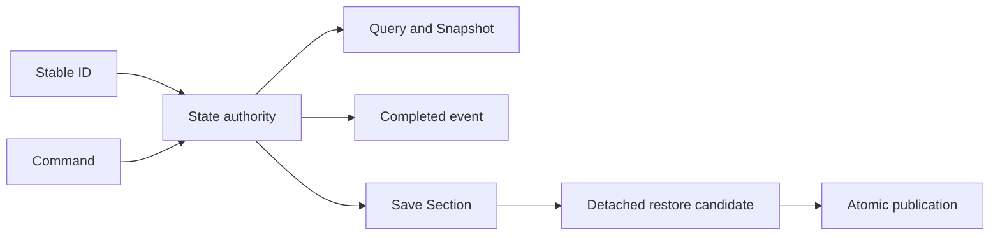

# 06. 확장 실무와 엄격 평가

이 장은 새 콘텐츠를 추가할 때 실제로 어떤 계약이 바뀌어야 하는지, 현재 구조가 그 변경을 얼마나 국소화하는지 판정한다.

## 1. 확장 종류를 먼저 분류한다

### A. 매개변수 콘텐츠

기존 의미와 실행 경로를 그대로 사용한다. 이름, 수치, 참조와 시각 자산만 다르다. 코드 변경이 발생하면 기존 정의 체계가 충분하지 않은 이유를 먼저 설명해야 한다.

### B. 조합 콘텐츠

기존 능력, 특성, 요구 조건과 효과의 조합이 새롭다. 작성 자산과 카탈로그가 주 변경 지점이다. 조합 충돌과 상호 배타 조건을 검증해야 한다.

### C. 새 의미 모듈

기존 처리기로 표현할 수 없는 행동이다. 계약, handler 또는 policy, 등록, 상태 권위, 저장과 UI projection이 필요할 수 있다. 목표는 다음 콘텐츠부터 이 모듈을 재사용하게 만드는 것이다.

### D. 새 불변식

물리 소유권, 거래 원자성, 생명주기 또는 저장 권위가 바뀐다. 일반 콘텐츠 작업으로 처리하지 않고 별도 아키텍처 변경으로 설계한다.

## 2. 새 건물 추가

### 기존 능력 조합인 경우

1. `BuildingSO`의 안정 ID, 크기, 배치와 연구 조건을 작성한다.
2. 건설 재료와 작업량을 물리 BOM 기준에 맞춘다.
3. `BuildingAbilityCollection`에 기존 능력을 조합한다.
4. 능력별 필수 참조와 중복 검증을 통과시킨다.
5. 콘텐츠 카탈로그와 필요한 Presentation 노출을 추가한다.
6. 건설 현장, 물리 재료 인도, 완공 후 격자 점유 경로를 확인한다.

기존 dispatcher나 배치 service에 건물 ID 분기를 추가해서는 안 된다.

### 새 능력인 경우

1. 재사용 가능한 `BuildingAbility`를 정의한다.
2. 작성 값의 자체 validation을 구현한다.
3. 작업 완료형이라면 `IBuildingWorkCompletionAbility`와 handler를 구현한다.
4. handler가 사용할 도메인 Port를 정의한다.
5. Infrastructure registration에 multi-binding으로 등록한다.
6. 장기 상태가 있으면 authority, query, command와 save section을 추가한다.
7. 능력이 없는 이전 건물과의 fallback 정책을 결정한다.

## 3. 새 아이템 추가

### 기존 feature 조합인 경우

1. `ItemDefinitionSO` 안정 ID, 질량, stack과 가격을 작성한다.
2. 생산, 음식, 시장, 의료 등 필요한 기존 feature를 조합한다.
3. feature validation과 중복 ID 검증을 통과시킨다.
4. 생산식, 연구, 상점과 소비 시스템의 카탈로그 참조를 연결한다.
5. 월드 stack 생성, 병합, 예약, 운반과 저장에서 기존 codec을 사용하는지 확인한다.

### 새 feature인 경우

1. `ItemFeatureDefinition`과 안정 `FeatureId`를 추가한다.
2. 개별 생산 출력 상태 필요 여부를 보수적으로 결정한다.
3. feature consumer를 typed query 또는 handler로 구현한다.
4. stack merge identity와 instance state codec을 확장한다.
5. 이동, 분할, 소비와 파괴 시 상태 보존 규칙을 추가한다.
6. save payload, restore validation과 source digest 범위를 확인한다.

새 feature 클래스만 존재하고 소비자가 없는 상태는 구현 완료가 아니다.

## 4. 새 작업 추가

1. 안정 `WorkTypeId`와 작업 정의를 추가한다.
2. 대상 탐색과 수행 가능성을 `IWorkCandidateProvider`로 구현한다.
3. 긴급도 차이가 있으면 `IWorkUrgencyProvider`를 구현한다.
4. 실행을 `IWorkExecutionHandler`로 구현한다.
5. 속도 계산이 다르면 `IWorkStatPolicy`를 추가한다.
6. 모든 구현을 Work registration에 등록한다.
7. 직업, 은퇴자 허용, 우선순위 UI와 자동화 정책을 연결한다.
8. 저장되는 작업 주문이 새 ID를 복원할 수 있는지 확인한다.

worker loop나 캐릭터 AI의 중앙 분기에 작업별 코드를 추가하는 방식은 현재 확장 구조를 거스른다.

## 5. 새 사건 추가

### 기존 요구 조건과 효과 조합인 경우

1. 안정 definition ID와 선택 ID를 정한다.
2. 발동 조건, 참여자 조건과 선택 가능 조건을 작성한다.
3. 비용은 돈 또는 실제 아이템 소비 effect로 작성한다.
4. 결과는 현재 실행 owner가 있는 effect만 사용한다.
5. 장기 결과는 해당 도메인의 지속 상태로 남는지 확인한다.
6. 중복 선택과 저장 후 재실행을 막을 resolution ID를 확인한다.

### 새 효과 종류인 경우

현재 구조에서는 `V20ContentResolutionService`의 preflight, commit과 typed effect switch를 함께 수정해야 한다. 이는 국소 확장이 아니다. 같은 효과가 두 개 이상의 사건에서 사용될 예정이면 다음 계약을 가진 handler 모듈로 먼저 승격하는 편이 맞다.

- 정의 검증
- 대상과 권위 조회
- 사전 검증
- 준비된 거래 후보
- commit과 rollback
- replay와 완료 증거
- save dependency

## 6. 새 프레젠테이션 기능 추가

1. 읽기 모델은 Query Service에서 조합한다.
2. 사용자 행동은 Command Service에 전달한다.
3. Presenter는 View 형식으로 변환하고 도메인 상태를 직접 수정하지 않는다.
4. Feature Surface 탭이면 `IFeatureSurfaceTabPresenter`를 구현한다.
5. tab definition과 DI multi-binding을 추가한다.
6. Registry의 중복 및 누락 검증을 통과시킨다.
7. 명령 성공 후 최신 상태를 다시 조회한다.

화면 Context 객체는 안정된 유스케이스 묶음일 때만 만든다. 관련이 약한 서비스를 생성자에서 숨기기 위한 dependency bag으로 사용하지 않는다.

## 7. 새 상태 권위 추가

필수 산출물은 상태 소유권, 변경 명령, 예상 가능한 실패 결과, 읽기 Snapshot, 명시적 전이, 도메인 간 Port, Save Section과 재시도 거래의 완료 증거다. 권위 중복을 찾는 자동 감사도 함께 둔다.

## 8. 콘텐츠 추가 판단 사례

아래 사례는 현재 코드에서 확인한 계약을 바탕으로 구성한 가정이다. 실제 콘텐츠 ID나 구현 완료 상태를 뜻하지 않으며, 어떤 조건에서 데이터 조합으로 끝내고 어떤 조건에서 새 모듈이나 상태 권위를 추가해야 하는지 설명한다.

### 사례 A. 기존 능력만 사용하는 건물

가정한 건물이 현재 생산, 저장과 연구 잠금 능력만 필요하다면 `BuildingSO` 조합으로 처리한다. 건물 전용 runtime class나 ID 분기를 만들 이유가 없다. 이 선택은 기존 handler와 저장 경로를 그대로 사용하므로 변경 범위가 작성 자산과 카탈로그에 머문다.

건물만의 내구 상태나 주기적 사건처럼 기존 능력으로 표현할 수 없는 동작이 들어오면 판단이 달라진다. 그때는 전용 건물 분기를 넣지 않고 재사용 가능한 ability, handler와 상태 권위를 설계한다.

### 사례 B. 개별 상태를 가진 아이템

새 아이템이 기존 음식과 시장 feature의 수치만 다르면 정의 조합으로 충분하다. 반대로 개체마다 품질, 장전 상태나 추적해야 할 소유 정보가 있다면 일반 stack 수량만으로 표현할 수 없다.

이 경우 새 feature가 instance state를 요구한다고 선언하고 생산 출력 codec, stack 병합 조건, 이동과 저장을 함께 확장한다. 작성 비용은 커지지만 서로 다른 개체 상태가 병합 과정에서 사라지는 일을 막는다.

### 사례 C. 실행은 같고 선택 정책만 다른 작업

새 작업이 기존 실행 절차를 사용하지만 대상 후보나 긴급도만 다르다면 실행 handler를 복제하지 않는다. 새 `IWorkCandidateProvider`나 `IWorkUrgencyProvider`를 등록해 달라지는 정책만 교체한다.

작업 중 실제 자원 인계나 완료 상태가 달라질 때만 새 실행 handler를 만든다. 이 구분은 우선순위 조정이 실행 coroutine의 회귀 위험으로 이어지는 것을 줄인다.

### 사례 D. 기존 목록에 없는 사건 효과

기존 돈, 아이템, 관계, 건강과 진행 효과의 조합이라면 사건 정의만 추가한다. 새로운 상태 권위를 바꾸는 효과라면 데이터 행만 늘려서는 실행되지 않는다.

현재 코드는 중앙 resolution service 수정이 필요하다. 같은 새 효과를 여러 사건에서 사용할 가능성이 있다면 먼저 effect handler로 분리하는 편이 낫다. 초기 구현 파일은 늘어나지만 이후 사건은 handler를 재사용하고 중앙 switch 수정에서 벗어난다.

### 사례 E. 생산과 물리 아이템 사이의 장기 거래

생산이 입력 완료를 기록하는 일과 Items가 실제 stack을 해제하는 일은 서로 다른 권위에 속한다. 한쪽만 성공한 시점에 저장되거나 종료될 가능성을 무시하면 중복 차감이나 유령 재료가 생길 수 있다.

이 경우 단순한 메서드 연속 호출보다 operation ID, request fingerprint, outbox 단계와 완료 receipt가 필요하다. 구현과 저장 데이터는 복잡해지지만 재개 시 이미 끝난 물리 효과를 판정하고 남은 승인 단계만 실행할 수 있다.

## 9. 기법별 실제 효과

| 기법 | 작성 단계의 이득 | 구현 단계의 이득 | 실행 및 저장 단계의 이득 | 비용 |
|---|---|---|---|---|
| ScriptableObject 정의 | 기존 능력 조합을 자산에서 작성할 수 있다 | 콘텐츠마다 새 runtime class를 만들 필요가 줄어든다 | 안정 ID로 저장 상태와 정의를 다시 연결한다 | 카탈로그와 참조 검증 필요 |
| Capability/Feature 조합 | 기능 조합을 상속 계층 없이 표현한다 | 새 의미만 handler로 분리해 재사용할 수 있다 | 처리기 누락을 구성 오류로 잡을 수 있다 | 새 의미는 state와 save까지 수동 연결 |
| Handler Registry | 작성된 의미와 실행 owner의 대응을 검사한다 | 중앙 switch를 수정하지 않고 구현을 등록한다 | 실행 종류별 실패 정책을 같은 registry 경계에서 적용한다 | 등록 완전성 감사 필요 |
| Port와 Adapter | 도메인별 작성 모델을 유지할 수 있다 | 한 도메인 변경이 다른 도메인의 내부 형식까지 번지는 범위를 줄인다 | 책임 이전 지점에서 변환과 검증을 집중한다 | 변환 코드와 양쪽 계약 이해 필요 |
| Aggregate와 guarded transition | 허용 상태와 완료 조건을 명시한다 | 호출 경로마다 같은 검증을 다시 쓰지 않는다 | 저장 후 재개 시 현재 단계에서 다음 행동을 판정한다 | Aggregate 비대화 위험 |
| Query/Command 분리 | 화면 표시 자료와 플레이어 행동을 구분한다 | UI 수정이 도메인 변경 API에 미치는 영향을 줄인다 | 오래된 조회 결과를 명령에서 재검증한다 | 표시 모델과 결과 형식 증가 |
| Preflight와 reservation | 실행 전에 비용과 대상을 확인한다 | 실패한 뒤 되돌릴 mutation 수를 줄인다 | 확인한 물리 자원을 commit까지 보호한다 | 취소와 해제 경로 필요 |
| Staged restore | 저장 payload 전체를 발행 전에 검증한다 | 도메인별 섹션을 독립적으로 추가할 수 있다 | 절반 복원된 live world 노출을 막는다 | 후보와 rollback 구현 필요 |
| Outbox와 receipt | 장기 거래의 단계와 완료 결과를 기록한다 | 도메인 간 단일 트랜잭션 없이도 재시도 계약을 만들 수 있다 | 중복 실행과 결과 소실을 구분한다 | 원장, fingerprint와 GC 관리 필요 |
| fail-loud validation | 잘못된 ID, 중복과 누락을 작성 및 구성 단계에서 드러낸다 | fallback 때문에 오류 위치가 멀어지는 것을 막는다 | 손상 상태를 정상 플레이 실패로 감추지 않는다 | 선택적 기능과 필수 기능의 구분 필요 |

## 10. 확장성 평가

| 영역 | 수준 | 확보된 변경 | 아직 중앙 수정이 필요한 변경 |
|---|---|---|---|
| asmdef 모듈 경계 | 높음 | 새 도메인과 Editor 검증 분리 | Infrastructure와 Presentation 참조 폭 축소 |
| 런타임 조립 | 높음 | 구현 교체, multi-binding, 영역별 installer | root의 명시 호출과 대형 registration 정리 |
| 건물 정의 | 높음 | 기존 능력 조합, 새 능력 handler 등록 | 지속 상태 능력의 save/UI 연결은 수동 |
| 아이템 정의 | 중상 | 기존 feature 조합 | 새 instance state와 소비 의미는 여러 경로 수정 |
| 작업 실행 | 높음 | 실행, 후보, 긴급도와 stat policy 등록 | ID catalog, 직업/UI/저장 연결은 수동 |
| 생산 상태 | 중상 | guarded transition과 물리 거래 재사용 | aggregate 규모와 단계 증가 비용 |
| 사건 데이터 | 중상 | 기존 requirement/effect 조합 | 새 request kind와 장기 workflow |
| 사건 효과 실행 | 보통 | 기존 effect 재사용과 거래 preflight | 새 effect가 중앙 service switch를 수정 |
| 프레젠테이션 | 중상 | presenter registry와 query/command 분리 | 대형 registration과 context 결합 |
| 저장과 복원 | 높음 | 새 section과 participant 등록 | 모든 새 authority가 엄격 계약을 수동 이행 |
| 중복 실행 방지 | 높음 | outbox, fingerprint, receipt와 checkpoint GC | 도메인마다 같은 수준의 원장이 적용됐는지 감사 필요 |

## 11. 개선 순서

### 1. 사건 효과 실행을 handler registry로 분리

현재 가장 분명한 확장성 병목이다. owner 설명 dictionary를 실제 실행 handler registry로 바꾸고, preflight와 commit 책임을 effect별로 이동해야 한다. `V20ContentResolutionService`는 handler들을 조율하는 pipeline에 집중한다.

### 2. 대형 응용 서비스의 변경 이유를 분리

`V20ContentResolutionService`와 일부 Repository, Presentation registration은 여러 이유로 변경된다. 독립적으로 늘어나는 정책 축을 기준으로 분리한다.

### 3. 등록과 카탈로그 누락을 자동 감사

새 능력, feature, work type, presenter, save section이 구현만 되고 등록되지 않는 문제를 정적 Editor audit로 잡아야 한다. 중복만 검사하지 말고 선언된 종류와 실행 owner의 완전성을 대조한다.

### 4. 확장 유형별 canary 유지

기존 모듈 조합만으로 만든 건물, 아이템, 작업과 사건을 각각 하나씩 기준 콘텐츠로 두고, 중앙 코드 수정 없이 로드되고 실행되는지 검사한다.

### 5. 넓어진 Repository의 분해 기준 수립

`WorldItemRepository`에 새 pending ledger가 계속 추가될 경우 물리 stack authority, custody transaction ledger와 domain-specific projection을 분리한다. 원자적 변경과 저장 일관성을 잃지 않도록 aggregate root와 transaction 경계는 유지한다.

## 12. 구조 검토 기준

새 콘텐츠 하나를 추가한 뒤 다음 질문에 답할 수 있어야 한다.

- 기존 의미 조합인가, 새 의미인가, 새 불변식인가.
- 변경된 중앙 switch가 있다면 왜 handler 등록으로 해결할 수 없었는가.
- 실제 상태를 소유하는 authority는 하나인가.
- 물리 자원, 노동, 시간과 위험이 기존 정식 경로를 통과하는가.
- 실패 전에 사전 검증하며, 준비 후 실패에는 복구 경로가 있는가.
- 저장 후 재실행돼도 결과가 중복되지 않는가.
- 새 타입이 등록되지 않았을 때 구성 단계에서 실패하는가.
- UI와 AI가 같은 명령 계약을 재사용할 수 있는가.

이 질문에 답하지 못하면 파일이 분리돼 있어도 구조적으로 확장 가능한 콘텐츠라고 판정하지 않는다.

## 13. 구현 위치

| 주제 | 위치 |
|---|---|
| Composition Root | `Assets/Scripts/Services/Infrastructure/DungeonRuntimeLifetimeScope.cs` |
| 등록 모듈 | `Assets/Scripts/Services/Infrastructure/Registration/` |
| Port와 Adapter | `Assets/Scripts/Services/Infrastructure/BuildingCraftWorkAdapters.cs` |
| 콘텐츠 Catalog Facade | `Assets/Scripts/Services/Items/GameContentCatalog.cs` |
| 건물 능력 | `Assets/Scripts/Models/Buildings/Core/BuildingAbilityContracts.cs` |
| 건물 능력 dispatcher | `Assets/Scripts/Services/Buildings/Abilities/BuildingAbilityHandlers.cs` |
| 아이템 feature | `Assets/Scripts/Models/Economy/Content/ItemDefinitionSO.cs` |
| 작업 registry | `Assets/Scripts/Services/Character/Work/WorkExecutionRegistry.cs` |
| 생산 aggregate | `Assets/Scripts/Models/Production/Core/ProductionAggregateState.cs` |
| 물리 아이템 Repository | `Assets/Scripts/Services/Items/WorldItemRepository.cs` |
| Event Bus | `Assets/Scripts/Services/Foundation/Events/GameEventBus.cs` |
| 사건 resolution | `Assets/Scripts/Services/Run/V20ContentResolutionService.cs` |
| Presenter registry | `Assets/Scripts/Views/UI/Core/PresentationPrimitives.cs` |
| Save registry와 aggregate root | `Assets/Scripts/Services/Foundation/Save/DungeonSaveSections.cs` |
| JSON Save Template Method | `Assets/Scripts/Services/Infrastructure/Core/Save/DungeonJsonSaveSection.cs` |
| 물리 인계 outbox | `Assets/Scripts/Services/Items/ProductionPhysicalCustodyDrainOutbox.cs` |
| durable commit pipeline | `Assets/Scripts/Services/Infrastructure/Save/DungeonDurableSaveCommitCoordinator.cs` |

## 14. 진화 콘텐츠 확장 절차와 평가

진화 기능은 결과 정의를 추가하는 작업과 이력 의미를 추가하는 작업을 분리한다.

### 작성된 시설 교체 조합식을 추가하는 경우

1. 기존 시설 계보와 결과 정의를 안정 ID로 연결한다.
2. 현재 제공되는 방 지표, 기록 표식, 정체성 압력과 변이 태그로 조건을 작성한다.
3. 실제 물질 요구와 배치 가능성을 기존 검증 경로에 연결한다.
4. 필요한 표식을 소모한 뒤에도 저장·재시도 결과가 같도록 조합식과 결과 정의를 고정한다.
5. 새 조건 의미가 없다면 제안자, 실행기와 저장 형식을 수정하지 않는다.

### 시설 또는 장비의 새 진화 모듈을 추가하는 경우

1. 기존 `EvolutionNode`가 이득, 부담과 활성 조건을 표현할 수 있는지 확인한다.
2. 모듈 정의와 Registry 등록을 추가한다.
3. 시설이면 방 활성 투영, 장비면 전투 능력치 투영에서 모듈을 소비한다.
4. 기존 역사 증거와 후보 부류로 생성 가능한지 확인한다.
5. 개조 또는 재단조의 기존 물질·작업 상태 기계를 재사용한다.

### 새 역사 증거를 추가하는 경우

이 변경은 단순 데이터 추가가 아니다. 사건 생산자, `HistoricalEvidenceKind`, 세대 압축 집계, 시설 또는 장비 후보 규칙, 저장 호환성과 서술 입력을 함께 바꾼다. 증거를 기록하는 코드만 있고 후보나 노드 규칙이 소비하지 않으면 플레이 결과에 연결되지 않는다.

### 새 작업 종류나 불변식을 추가하는 경우

개조, 재조율, 이전 또는 장비 재단조가 표현하지 못하는 절차라면 새 pending work 종류로 다룬다. 허용 전이, 물리 책임 이전, 취소 가능한 단계, 차단 상태, 복원 검증과 완료 투영을 먼저 설계한다. 기존 enum에 값만 추가하고 호출부가 알아서 순서를 지키게 두어서는 안 된다.

### 구조 평가

공용 사용 원장, 압축 구간, 진화 노드와 안정 해시는 시설과 장비에서 실제로 재사용된다. 이 점은 새 개체 진화 시스템이 같은 역사 표현을 사용할 수 있는 기반이다. 다만 `DungeonStory.Evolution` 어셈블리가 시설 전용 모듈과 VContainer를 참조하므로, 현재 경계를 중립적인 공용 커널로 평가하지 않는다.

향후 세 번째 진화 소비자가 추가되거나 시설·장비 모델의 변경 속도가 달라지면 다음 분리를 검토할 수 있다.

1. Unity와 DI에 의존하지 않는 이력 원장, 압축, 해시와 공용 노드 계약
2. 시설 전용 후보, 방 활성과 작업 모델
3. 장비 전용 증거 해석, 재단조와 능력치 투영
4. Services 계층의 VContainer 등록과 Unity Adapter

한 도메인 변경이 다른 도메인의 컴파일 참조나 직렬화 계약을 불필요하게 끌고 갈 때 분리한다.

진화 아키텍처의 상태 권위와 현재 제약은 [사용 이력 기반 진화 아키텍처](07-history-driven-evolution-architecture.md)에 정리했다.
