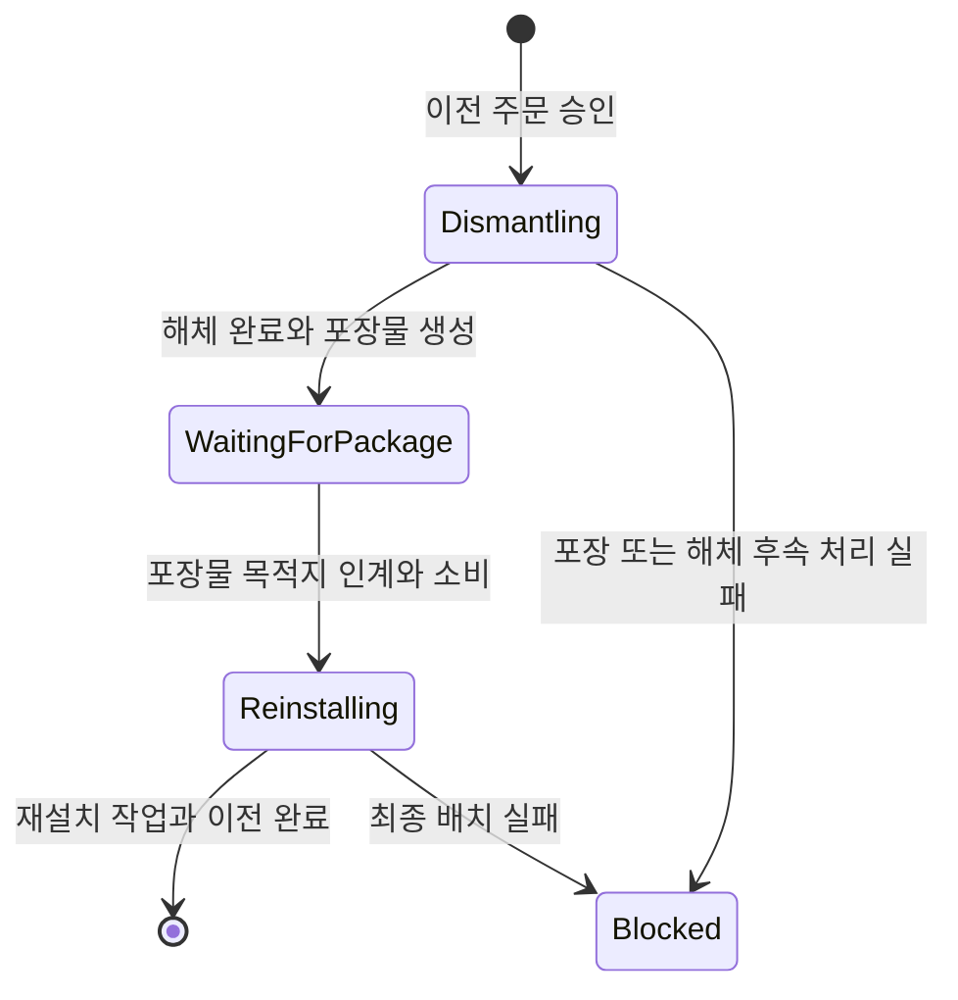

# 07. 사용 이력 기반 진화 아키텍처

시설과 장비의 진화는 사용 사건을 곧바로 수치 보너스로 바꾸지 않는다. 사건을 제한된 원장에 기록하고, 세대 단위 요약과 역사 증거로 압축한 뒤, 그 결과로 후보와 진화 노드를 결정한다. 선택된 변화는 다시 물질, 노동, 배치 조건과 저장 가능한 작업 상태를 거쳐 적용된다.

이 장은 시설 합성이나 작성된 시설 교체 조합식 하나만 다루지 않는다. 시설 개체 진화와 장비 진화가 공유하는 이력 처리 구조, 각 도메인이 별도로 소유하는 상태, 서술 생성의 권한 한계와 장기 작업의 복원 계약을 설명한다.

## 1. 구조의 분류

현재 구현은 사건을 입력으로 받는 역사 Aggregate에 가깝다. 다음 이유로 Event Sourcing으로 분류하지 않는다.

- 시설과 장비의 현재 상태는 스냅샷과 런타임 상태로 직접 저장된다.
- 복원은 모든 과거 사건을 처음부터 재생해 현재 상태를 재구성하지 않는다.
- 원시 사건 일부는 세대가 닫힐 때 요약 구간으로 압축된다.
- 진화 노드, 대기 후보, 작업 진행도와 활성 상태는 사건 원장과 별도로 보존된다.

사건은 진화 판정의 증거다. 현재 상태는 별도의 스냅샷으로 저장한다. 이 구분을 지켜야 저장 복원을 사건 재생으로 오해하거나, 압축된 이력을 완전한 감사 로그로 사용하는 설계를 피할 수 있다.

## 2. 모듈 경계

| 모듈 | 현재 책임 | 확보한 이점 | 현재 제약 |
|---|---|---|---|
| `DungeonStory.Synthesis` | 설치 시설의 합성 규칙과 값 형식 | Unity와 다른 게임 모듈에 의존하지 않는 순수 규칙 경계 | 사용 이력 진화와 별도 체계이므로 연결은 응용 계층이 맡는다 |
| `DungeonStory.FacilityEvolution` | 시설 진화 ID, 조합식 규칙, Aggregate 스냅샷과 복원 검증 | Unity 객체 없이 시설 진화의 영속 계약을 검사할 수 있다 | Foundation 계약에는 의존한다 |
| `DungeonStory.Evolution` | 공용 사용 원장, 이력 압축, 진화 노드, 시설·장비 진화 모델 | 시설과 장비가 같은 역사 표현과 결정론 도구를 재사용한다 | 시설 전용 모듈과 VContainer를 참조하고 Unity 비의존 모듈도 아니어서 중립적인 공용 커널로 완전히 분리되지는 않았다 |
| Services와 Infrastructure | 사건 수집, 후보 생성, 작업 조율, 물리 인계, 장면 객체 교체와 DI 등록 | 도메인 상태와 Unity 실행 세부를 분리한다 | 조정 서비스와 등록 모듈의 의존 폭이 커진다 |

합성, 작성 조합식 교체, 개체 진화는 같은 기능의 세 이름이 아니다. 합성은 여러 설치 시설을 소모해 새 시설을 만든다. 작성 조합식 교체는 방과 운영 기록을 작성된 계보 조건과 대조해 시설 정의를 교체한다. 개체 진화는 숙련도와 압축 이력에서 후보를 생성하고, 선택된 모듈을 같은 시설의 진화 노드로 남긴다.

## 3. 공용 이력 처리 흐름

`UsageLedger`는 현재 세대의 원시 사건을 최대 128개 보관한다. 세대를 닫으면 다음 정보가 `CompactedHistorySegment`로 옮겨진다.

- 사건 종류별 누적 지표
- 역사 증거의 강도와 발생 횟수
- 절대 크기와 순번으로 고른 주요 사건 최대 8개
- 참여자 ID와 출처 태그
- 세대 범위, 사건 수와 총 규모
- 정규화된 내용으로 계산한 이력 해시

같은 레벨의 구간이 8개 쌓이면 상위 구간 하나로 합쳐진다. 따라서 장기 이력을 모든 원시 사건의 무제한 목록으로 유지하지 않고, 의사결정에 필요한 집계와 선택된 증거를 남긴다. 이 방식은 저장량의 성장 형태를 제한하지만, 원시 사건 전체를 보존하는 감사 원장은 제공하지 않는다.

## 4. 결정론과 후보 고정

압축기는 사전, 태그와 참여자를 안정된 순서로 정렬한 뒤 `StableEvolutionHash`를 계산한다. 시설 후보 생성은 런 시드, 시설의 영속 ID, 현재 세대와 이력 해시를 함께 사용한다. 장비도 같은 해시와 시드 도구를 사용한다.

이 설계로 얻는 성질은 다음과 같다.

- 같은 정규화 이력과 같은 시드는 같은 후보 계산 입력을 만든다.
- 저장 후 다시 열었다는 이유로 후보가 바뀌는 경로를 줄인다.
- UI 서술이나 컬렉션 순서가 기계적 결과를 바꾸지 않는다.
- 후보를 선택한 뒤에는 주문에 복제해 작업 도중 원장이 바뀌어도 대상 변화가 생기지 않는다.

결정론은 같은 입력에서 같은 후보를 재현한다. 후보 분포의 공정성과 선택 가치는 별도의 플레이 검증이 필요하다.

## 5. 상태 권위

| 상태 | 소유 위치 | 변경 계기 | 저장 의미 |
|---|---|---|---|
| 작성된 합성·교체 조합식 | 콘텐츠 자산과 카탈로그 | 제작자가 정의를 편집할 때 | 안정 ID로 런타임 상태와 다시 연결한다 |
| 시설의 운영 기록 | 시설 상태 컴포넌트의 작성 조합식용 기록 | 방문, 매출, 재고, 범죄, 방어와 운영 사건 | 작성된 시설 교체 조건과 정체성 압력에 사용한다 |
| 시설·장비 사용 원장 | 각 개체의 진화 상태 | 사용 또는 전투 사건 | 세대 압축과 역사 증거 계산의 입력이다 |
| 압축 이력 | 각 개체의 진화 상태 | 세대를 닫을 때 | 이전 세대의 집계와 선택된 증거를 보존한다 |
| 진화 후보 | 각 개체의 진화 상태 | 숙련도와 이력 조건을 만족할 때 | 선택 전 제안 집합과 이력 해시를 고정한다 |
| 진화 노드 | 각 개체의 진화 상태 | 개조·재단조 작업이 완료될 때 | 계보, 효과, 부담, 증거와 활성 조건을 보존한다 |
| 대기 작업 | 시설 또는 장비 진화 상태 | 플레이어가 후보, 재조율, 이전 등을 승인할 때 | 물질 인계와 작업 진행을 중단 지점에서 재개한다 |
| 서술 요청 | 공용 진화 상태 | 역사 노드에 표시 문구가 필요할 때 | 요청 대상과 허용 범위를 고정하고 늦은 응답을 검증한다 |

시설에는 서로 다른 두 기록층이 있다. 작성 조합식 교체에 쓰는 `FacilityEvolutionRecord`는 누적 지표, 표식과 최근 사건을 보유한다. 개체 진화에 쓰는 `UsageLedger`는 원시 사건 상한과 계층 압축을 갖는다. 전자의 최근 사건 목록에는 현재 확인된 상한이 없으므로, 후자의 압축 정책을 전자에도 적용된 것으로 설명하면 안 된다.

## 6. 시설 개체 진화

시설 개체의 진화 상태는 세대, 숙련도, 사용 원장, 후보, 노드, 서술 요청과 진행 중 작업을 함께 소유한다. `FacilityGenerationCandidateKind`는 후보를 세 부류로 구분한다.

| 후보 부류 | 판정 근거 | 플레이어가 감수하는 조건 |
|---|---|---|
| 주 역할 | 압축 이력에서 가장 강한 시설 사용 성격 | 특정 운영을 반복해 숙련도와 증거를 축적한다 |
| 방 시너지 | 현재 방의 설비와 조건 | 노드 효과를 유지하려면 공간 구성을 계속 충족해야 한다 |
| 위험 촉매 | 결정론적으로 선택된 촉매 계열과 진행 단계 | 촉매를 소비하고 이득과 부담을 함께 받아들인다 |

선택 가능한 숙련도에 도달하면 현재 세대가 닫히고 후보가 생성된다. 플레이어가 하나를 승인하면 후보 복제본, 필요한 결속 재료와 촉매, 작업량이 개조 주문에 고정된다. 재료 인계가 완료된 뒤 작업량을 채우며, 완료 시 진화 노드가 추가된다.

노드는 방 조건에 따라 활성 또는 휴면 상태가 된다. 격자의 구조 버전과 시설 동적 상태 버전이 모두 그대로면 방 판정을 반복하지 않는다. 방을 바꾸면 노드가 휴면될 수 있으므로 공간 구성은 지속적인 운영 조건이 된다.

### 재조율

재조율은 기존 노드의 효과를 새 효과로 교환하지 않는다. 촉매와 작업을 들여 노드가 요구하는 방 활성 조건을 다시 설정한다. 현재 방을 기준으로 조건을 만드는 보조 경로도 있다. 시설을 다른 역할로 전환할 때 과거 성장을 버리지 않고 공간 적합성을 다시 맞추는 용도다.

### 이전

시설 이전은 위치 값만 변경하지 않는다. `FacilityRelocationPhase`가 해체부터 재설치까지의 중단 지점을 보존한다.

해체가 끝난 뒤에는 단순 취소할 수 없다. 포장물을 목적지로 운반하고 재설치해야 한다. 이 절차는 시설의 장소 변경을 노동과 물류 문제로 만들고, 중단 시점을 저장할 수 있게 한다. 반면 포장물, 두 작업량, 차단 상태와 복구 경로를 함께 관리하는 비용이 생긴다.

## 7. 장비 진화

장비 진화는 시설과 같은 원장, 압축 구간, 역사 증거, 노드와 해시 도구를 사용한다. 전투 사건은 장비마다 다른 역사 방향을 만든다. 현재 규칙에는 강적 처치, 소유자 보호, 치명타 차단, 빈사 생존, 장거리 반복 명중, 방어구 파손과 적 포획 등이 포함된다.

장비 쪽 어댑터는 이 증거를 재단조 후보와 역사 노드로 변환하고, `CombatEquipmentStatProjector`가 활성 노드를 전투 능력치 스냅샷에 반영한다. 시설이 방 조건으로 활성 여부를 투영한다면, 장비는 장착 상태와 진화 상태를 전투 수치로 투영한다. 공용 커널은 이력을 표현하고 압축하는 방법을 공유하며, 실제 효과와 작업 규칙은 각 도메인이 맡는다.

## 8. 서술 생성의 권한 한계

시설 교체 제안과 공용 역사 노드 서술에는 로컬 언어 모델을 사용할 수 있다. 두 경로 모두 모델 응답을 신뢰된 게임 명령으로 취급하지 않는다.

작성 조합식 교체에서는 규칙 공급자가 후보 ID, 이유, 변이 제안과 신뢰도를 먼저 결정한다. 모델 응답이 유효 후보와 허용 변이 검사를 통과해도 표시 문구와 해석만 사용하고, 기계적 후보는 규칙 결과를 유지한다.

역사 노드 서술 요청은 대상 개체, 노드와 부모, 효과, 이력 해시, 허용 효과 후보, 선택 인덱스와 증거를 스냅샷으로 고정한다. 응답 도착 시 같은 요청과 역사 노드가 아직 유효한지 다시 검사한다. 통과한 응답은 이름, 설명과 생성 추적 정보만 갱신한다.

이 경계는 선택적인 서술 품질과 게임 규칙의 결정론을 분리한다. 그 대가로 요청 스냅샷, 응답 검증, 오래된 응답 거부와 실패 시 대체 문구가 필요하다.

## 9. 장기 작업과 물리 인계

시설 개조, 재조율과 이전은 즉시 적용 명령이 아니다. 주문에는 요구 작업량, 완료 작업량, 물질 인계 식별자와 결과 상태가 저장된다. 물질 소비는 월드 아이템 권위의 물리 처리 서비스를 통해 확정한다.

이 구조는 Process Manager와 Transactional Outbox 기법을 부분적으로 사용한다. 적용 범위는 각 주문이 필요한 대기 단계와 영수증을 보존하고, 호출 시 현재 상태에서 가능한 다음 동작을 수행하는 수준이다.

| 작업 | 보존하는 중단 지점 | 완료 결과 |
|---|---|---|
| 시설 개조 | 재료 대기, 작업 진행, 차단 | 고정된 후보로 새 진화 노드 생성 |
| 시설 재조율 | 촉매 대기, 작업 진행, 차단 | 기존 노드의 활성 조건 교체 |
| 시설 이전 | 해체, 포장 운반 대기, 재설치, 차단 | 같은 진화 상태를 유지한 시설의 위치 이전 |
| 장비 재단조·재조율 | 장비와 재료 인계, 작업 진행, 완료 | 장비의 진화 노드 또는 조율 상태 갱신 |

저장 복원은 대기 주문과 인계 결과를 검증한 뒤 같은 단계에서 재개해야 한다. 이미 소비된 재료를 다시 소비하거나, 작업 중 원장이 바뀌었다는 이유로 후보를 다시 추첨해서는 안 된다.

## 10. 사용된 설계 기법과 판단

| 기법 | 적용 이유 | 얻는 이점 | 비용과 위험 |
|---|---|---|---|
| 사건을 입력으로 받는 Aggregate | 사용 경험을 개체 정체성의 자료로 남긴다 | 시설과 장비가 같은 정의라도 서로 다른 계보를 형성할 수 있다 | 사건 생산자 누락과 Aggregate 비대화를 감사해야 한다 |
| 제한 원장과 계층 압축 | 장기 런의 이력을 무제한 원시 목록으로 두지 않는다 | 후보 판정에 필요한 집계와 선택 증거를 보존한다 | 원시 사건 전체를 재현하거나 감사할 수 없다 |
| 정규화 해시와 결정론적 시드 | 컬렉션 순서와 재접속이 후보를 흔들지 않게 한다 | 같은 상태의 후보 재현성과 저장 안정성이 높아진다 | 해시 입력이나 정렬 규칙 변경은 호환성 검토가 필요하다 |
| 진화 노드 | 이득, 부담, 계보와 활성 조건을 한 단위로 묶는다 | 누적 성장을 단순 합산 수치보다 추적 가능한 구조로 표현한다 | 노드 수, 투영 비용과 참조 검증이 늘어난다 |
| 후보 고정 | 작업 시작 후 계산 입력이 변하는 문제를 막는다 | 완료 결과가 승인 시점의 선택과 일치한다 | 주문 스냅샷과 취소 정책을 유지해야 한다 |
| 방 조건 투영 | 시설 성장과 공간 구성을 지속적으로 연결한다 | 방 개조가 노드 활성과 역할 전환에 영향을 준다 | 구조 변경 때 재평가와 이해 가능한 UI가 필요하다 |
| 제한된 서술 어댑터 | 선택적 자연어 생성을 게임 권위 밖에 둔다 | 모델 실패나 문구 변화가 기계적 결과를 바꾸지 않는다 | 검증, 캐시, 요청 수명과 대체 문구를 관리해야 한다 |
| 저장 가능한 작업 상태 | 물질과 노동을 거치는 변화를 중단 지점에서 복원한다 | 재시도 때 이미 끝난 단계를 판정할 수 있다 | 상태 단계와 복원 검증이 많아진다 |

## 11. 확장 판단

다음 변경은 기존 구조 안에서 작성 또는 조합으로 처리할 수 있다.

- 기존 시설 교체 조건을 사용한 새 작성 조합식
- 기존 진화 모듈과 방 활성 규칙을 조합한 새 후보
- 기존 역사 증거를 다른 가중치로 해석하는 장비 규칙
- 기존 작업 종류와 물질 인계 경로를 사용하는 새 결과 정의

다음 변경은 새 의미나 불변식을 추가한다.

- 새로운 역사 증거 종류와 이를 발생시키는 사건 연결
- 기존 노드가 표현하지 못하는 효과 또는 부담
- 개조, 재조율, 이전 이외의 시설 작업 단계
- 기존 재단조 상태 기계로 처리할 수 없는 장비 변화
- 새로운 물리 책임 이전이나 취소 후 보상 규칙
- 모델 응답에 게임 결과 선택 권한을 주는 변경

새 의미를 추가할 때는 사건 생산자, 원장 직렬화, 압축 집계, 후보 규칙, 노드 투영, 작업 상태, 저장 복원과 표시 모델을 함께 검토해야 한다. 정의 자산 하나를 추가하는 작업으로 축소해서는 안 된다.

## 12. 현재 한계

- 공용 진화 모델이 별도 어셈블리에 모여 있지만 시설 전용 모듈과 DI 컨테이너에 의존한다. 장비와 시설이 장기간 함께 확장된다면 순수 이력 커널, 도메인별 모델과 응용 등록의 의존 방향을 다시 나눌 가치가 있다.
- 작성 조합식용 시설 최근 사건 목록은 개체 진화 원장과 달리 상한과 압축이 확인되지 않는다.
- 시설 합성은 결과 생성 전에 재료 시설을 제거한다. 결과 생성이나 등록 실패에 대한 완전한 철회 절차는 현재 메서드에서 확인되지 않는다.
- 정적 검토는 결정론 도구와 비용 통제 구조의 존재만 확인한다. 후보 다양성, 성장 속도, 설명 가독성과 장기 저장 크기는 실행 측정이 필요하다.

## 13. 구현 위치

- `Assets/Scripts/Models/Synthesis/Core/`
- `Assets/Scripts/Models/FacilityEvolution/Core/`
- `Assets/Scripts/Models/Evolution/Core/EvolutionHistoryModels.cs`
- `Assets/Scripts/Models/Evolution/Core/UsageLedgerCompactor.cs`
- `Assets/Scripts/Models/Evolution/Facility/FacilityEvolutionModels.cs`
- `Assets/Scripts/Models/Evolution/Equipment/EquipmentEvolutionModels.cs`
- `Assets/Scripts/Services/FacilityEvolution/FacilityEvolutionRuntime.cs`
- `Assets/Scripts/Services/FacilityEvolution/FacilityInstanceEvolutionRuntime.cs`
- `Assets/Scripts/Services/FacilityEvolution/FacilityEvolutionLlmProposalProvider.cs`
- `Assets/Scripts/Services/Evolution/EvolutionHistoryNarrativeRuntime.cs`
- `Assets/Scripts/Services/Combat/EquipmentEvolutionRuntime.cs`
- `Assets/Scripts/Services/Combat/EquipmentEvolutionRules.cs`
- `Assets/Scripts/Services/Combat/CombatEquipmentStatProjector.cs`
- `Assets/Scripts/Services/Infrastructure/Registration/DungeonFacilityRegistration.cs`

시설의 세 실행 경로와 플레이 단위는 [시설 합성과 사용 기반 진화](systems/19-facility-synthesis-and-use-based-evolution.md), 장비의 전투 적용은 [전투, 장비와 피해 처리](systems/12-combat-equipment-and-damage.md)에서 이어진다.
