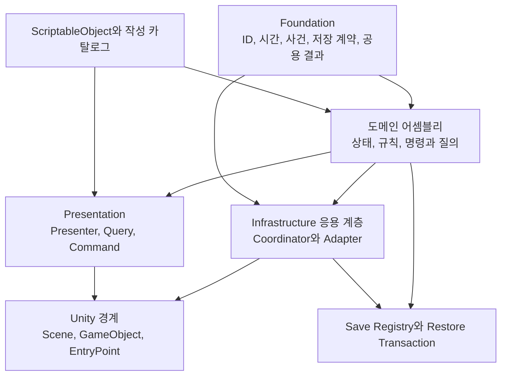
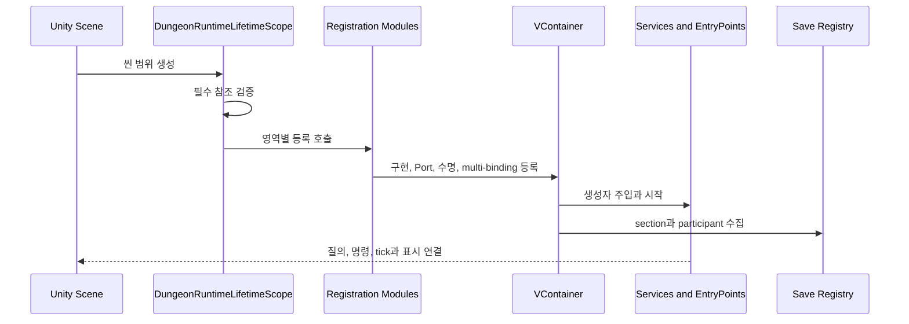
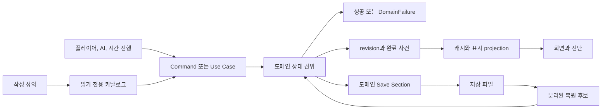

# 08. 전체 런타임 구조

이 장은 DungeonStory의 코드를 하나의 실행 체계로 연결해 설명한다. 개별 클래스의 역할은 [시스템 구현 문서](systems/README.md)에 남기고, 여기서는 작성 자산이 런타임 상태가 되고, 여러 도메인의 작업을 거쳐 화면과 저장으로 이어지는 경로를 다룬다.

조사 기준일은 2026-08-31이다. 현재 C# 소스, 45개 asmdef, `DungeonRuntimeLifetimeScope`, 12개 등록 모듈과 19개 시스템 구현 문서를 정적으로 대조했다. Unity 컴파일, 테스트, Play Mode와 프로파일링은 실행하지 않았다.

## 1. 구조를 나누는 기준

이 프로젝트의 계층은 폴더 이름이나 `Runtime` 접미사만으로 결정되지 않는다. 각 코드가 맡는 책임으로 구분해야 한다.

| 구역 | 소유하는 것 | 소유하지 않는 것 |
|---|---|---|
| 작성 정의와 카탈로그 | 아이템, 건물, 조합식, 연구, 종족, 사건처럼 제작자가 작성한 불변 정의 | 한 런의 수량, 위치, 진행도와 피해 상태 |
| 도메인 상태 | 안정 ID를 가진 현재 상태, 불변식, 허용된 상태 전이와 revision | 씬 생성 순서, 화면 배치와 다른 도메인의 내부 상태 |
| 응용 조율 | 여러 도메인 명령의 순서, 사전 검증, 준비, 확인과 실패 처리 | 각 도메인의 최종 상태 필드 |
| Infrastructure와 Unity Adapter | DI 조립, 씬 생명주기, GameObject 생성, 도메인 사이의 자료형 변환 | 장기 게임 규칙을 임의로 저장하는 별도 권위 |
| Presentation | 질의 결과의 표시 모델, 사용자 입력을 명령으로 번역하는 과정, 진단 화면 | 재고, 작업, 건강, 연구와 전투 결과의 원본 상태 |
| 영속성 | 도메인별 DTO, section version, 복원 후보와 발행 순서 | 런타임 규칙을 우회하는 두 번째 상태 모델 |

같은 서비스가 Unity의 `ITickable`이나 `IStartable`을 구현하더라도 그 사실만으로 상태 권위가 되지는 않는다. EntryPoint에는 도메인 런타임, 응용 Adapter, 캐시 갱신기, 복구 작업과 UI Controller가 함께 존재한다. 상태를 변경할 권한은 해당 클래스가 호출하는 명령과 Aggregate 경계에서 판정한다.

## 2. 어셈블리와 의존 방향

`Foundation`은 안정 ID, 시간, 사건, 저장과 스케줄링 계약을 제공한다. 도메인 어셈블리는 이 기반 위에 상태와 규칙을 둔다. 여러 도메인을 함께 호출해야 하는 코드는 Infrastructure의 Coordinator와 Adapter에 모인다. Presentation은 Query와 Command를 통해 도메인을 사용하며, 씬과 GameObject의 생성 및 수명은 가장 바깥 경계에서 처리한다.

이 형태는 모듈형 모놀리스다. asmdef가 배포 단위를 나누지는 않지만 금지된 참조 방향을 컴파일 경계로 드러낸다. 반면 Infrastructure와 Presentation은 통합을 담당하므로 참조 폭이 넓다. 이 두 어셈블리 안에 장기 상태가 계속 쌓이면 논리적 모듈성은 약해질 수 있다.

## 3. 씬 조립 순서

`DungeonRuntimeLifetimeScope.Configure`는 런타임의 Composition Root다. 필수 씬 참조를 확인한 뒤 등록 모듈을 다음 순서로 호출한다.

| 순서 | 등록 영역 | 조립 책임 |
|---:|---|---|
| 1 | Foundation | 게임 시계, UI 시계, 시간 배율, 공용 스케줄링과 기반 계약 |
| 2 | Work | 작업 유형, 주문, 후보 공급자, 실행 handler와 노동 연결 |
| 3 | Combat and Invasion | 전투 명령, 장비, 피해, 방어 교전, 침입과 복구 참가자 |
| 4 | World Simulation | 아이템, 생산, 환경, 기반망, 농업, 야생동물과 세계 진행 |
| 5 | Save | section registry, 도메인 save section, autosave와 durable commit |
| 6 | Core Infrastructure | 런 흐름, 달력, 캠페인, 경제와 공용 응용 서비스 |
| 7 | Facility | 시설 합성, 작성 계보 교체, 개체 진화, 재조율과 이전 |
| 8 | Character | 인물 세계 표현, 생애, 욕구, 사회 상태, 의료와 관련 Adapter |
| 9 | AI and Rooms | 행동 스케줄러, 후보 선택, 경로 요청과 방 질의 |
| 10 | Progression and Offense | 연구, 메타 진행, 원정, 월드맵과 전략 전투 |
| 11 | Presentation | Presenter, 화면 Query와 Command, 경보, 오버레이와 진단 |

등록 모듈은 객체 생성 위치를 정리하지만 실행 의존성을 자동으로 설명하지 않는다. build callback이나 강제 resolve가 초기화를 유발할 수 있으므로, 순서가 필요한 서비스는 시작 계약이나 명시적 의존 관계를 가져야 한다. 파일에 먼저 등록됐다는 사실을 도메인 규칙으로 사용하면 Composition Root의 편집이 게임 동작을 바꾸게 된다.

## 4. 실행 중 자료의 이동

작성 정의는 카탈로그를 통해 읽히고, 플레이어 또는 AI의 의도는 명령으로 제출된다. 도메인 권위가 명령을 검증하고 상태를 바꾸면 revision이나 형식화된 사건이 후속 소비자에게 변경 사실을 알린다. 화면은 Snapshot을 다시 읽고, 저장은 각 권위의 DTO를 캡처한다.

여기서 카탈로그, Snapshot, ViewModel, 캐시와 저장 DTO는 서로 다른 복사본이다. 원본 런타임 상태를 바꿀 수 있는 것은 명령을 받은 도메인 권위뿐이다. 저장 DTO는 복원 시 검증된 후보를 만드는 재료이며, UI 모델은 다음 명령의 성공을 보장하지 않는다.

## 5. 시스템군의 배치

19개 시스템 문서는 다음 실행 구역에 놓인다. 하나의 시스템이 여러 구역을 사용할 수 있지만, 상태 소유권은 [상태 권위 원장](09-state-authority-ledger.md)에서 한 경계로 제한한다.

| 실행 구역 | 시스템 문서 | 결합 지점 |
|---|---|---|
| 공간과 노동 | [AI](systems/01-character-ai-and-behavior.md), [그리드](systems/02-grid-spatial-and-pathfinding.md), [건설과 방](systems/03-buildings-construction-and-rooms.md), [작업](systems/04-work-orders-and-labor.md) | 공간 후보, 작업 주문, 경로 세션과 작업 완료 명령 |
| 물질과 생산 | [아이템과 운반](systems/05-items-inventory-and-hauling.md), [생산](systems/06-production-and-output-routing.md), [기반망과 자동화](systems/07-industrial-networks-and-automation.md) | 물리 수량, 예약, 작업 중 재공품, 출력 인계와 네트워크 공급 |
| 인물과 생태 | [인물 생애](systems/08-character-life-needs-and-society.md), [의료](systems/09-medical-disease-and-body-health.md), [환경과 생존](systems/10-environment-survival-and-sanitation.md), [야생동물과 농축산](systems/11-wildlife-agriculture-and-husbandry.md) | 인물 ID, 신체 상태, 환경 표본, 소비와 생산물 |
| 충돌과 외부 세계 | [전투](systems/12-combat-equipment-and-damage.md), [방어와 침입](systems/13-defense-invasion-and-threat.md), [원정](systems/14-offense-expeditions-and-world-map.md) | 장비와 탄약, 피해 명령, 교전 단계, 귀환 보상과 후유증 |
| 진행과 콘텐츠 | [연구](systems/15-research-progression-and-meta.md), [세력과 사건](systems/16-factions-events-recruitment-and-captivity.md), [시설 성장](systems/19-facility-synthesis-and-use-based-evolution.md) | 해금, 캠페인 후보, 효과 실행, 시설 계보와 물질 작업 |
| 세션과 외곽 | [저장과 결정론](systems/17-session-save-and-determinism.md), [UI와 진단](systems/18-presentation-notifications-and-diagnostics.md) | section registry, restore revision, Query, Command와 알림 projection |

## 6. 하나의 생산 주문이 통과하는 구조

생산 주문은 이 아키텍처의 경계를 한 번에 보여준다.

1. 조합식과 시설 정의는 작성 카탈로그에서 읽는다.
2. 생산 명령은 현재 시설, 연구, 입력과 출력 조건을 다시 검사한다.
3. `ProductionAggregateStateSession`이 주문, 공정 단계, 준비 출력을 소유한다.
4. Work는 필요한 작업을 별도 주문과 handler로 실행하고 완료량을 생산에 전달한다.
5. Items는 실제 입력 stack, 예약, 목적지와 출력 stack을 소유한다.
6. 출력 Coordinator는 생산 상태와 물리 배치 사이의 준비, commit, 영수증과 acknowledgement를 조율한다.
7. 화면은 생산 Snapshot과 실패 사유를 읽으며 내부 상태를 직접 수정하지 않는다.
8. 생산과 아이템 save section은 각자의 상태를 캡처하고 의존 순서에 따라 복원한다.

이 분리 덕분에 작업자 탐색을 바꿔도 생산 주문 형식을 유지할 수 있고, 출력 배치 방식을 바꿔도 조합식 정의를 다시 만들 필요가 없다. 대신 생산, Work와 Items 사이의 인계 계약이 늘어나므로 operation ID, revision, 영수증과 복원 순서를 함께 관리해야 한다.

## 7. 확장 유형별 변경 범위

| 변경 | 주된 수정 구역 | 함께 확인할 경계 |
|---|---|---|
| 기존 능력을 조합한 새 건물 | 작성 정의와 카탈로그 | 능력 중복, 연구 조건, 물리 BOM, 배치와 방 판정 |
| 새로운 건물 능력 | 도메인 계약, handler, 등록 모듈 | 저장 상태, 작업 연결, 화면 Presenter와 누락 handler 검증 |
| 기존 특성을 조합한 새 아이템 | 작성 정의와 카탈로그 | 생산, 거래, 장비, 운반과 목적지 capability |
| 새로운 물리 아이템 상태 | Items 권위와 명령 | 생산 인계, 예약, 저장 section, outbox와 모든 소비자 Snapshot |
| 기존 효과를 조합한 새 사건 | 사건 정의와 현재 효과 카탈로그 | 요구 조건, 대상, 비용 예약, 선택 결과와 경보 |
| 새로운 사건 효과 종류 | 응용 효과 실행 경계와 대상 도메인 | preflight, prepare, commit, rollback, 저장과 중앙 분기 확장 |
| 새 장기 시스템 | 별도 도메인 Aggregate와 Port | 등록 모듈, 명령과 질의, save section, restore participant, cadence |
| 새 화면 | Presentation Presenter와 Registry | Query/Command 분리, restore revision, 객체 수명과 진단 |

## 8. 구조가 제공하는 이점과 대가

| 설계 결정 | 확보되는 범위 | 유지 비용 |
|---|---|---|
| 도메인 asmdef | 내부 형식의 무분별한 참조를 줄이고 변경 파급을 모듈 단위로 드러낸다 | 공용 계약의 위치와 참조 그래프를 계속 관리해야 한다 |
| 단일 Composition Root | 객체 생성, 수명과 구현 선택을 추적할 위치가 고정된다 | 등록 모듈과 초기화 순서가 큰 검토 대상이 된다 |
| 상태 권위와 Adapter 분리 | Unity 생명주기나 다른 도메인의 자료형이 불변식 안으로 들어오는 범위를 줄인다 | 경계마다 변환, 재검증과 실패 매핑이 필요하다 |
| 명령과 질의 분리 | AI와 UI가 같은 변경 경로를 공유하고 오래된 Snapshot을 다시 검증한다 | 화면별 질의 모델과 명령 결과 형식이 늘어난다 |
| 도메인별 저장 section | 새 상태가 중앙 저장 DTO를 수정하지 않고 참여한다 | section ID, version, 의존성과 복원 후보를 관리해야 한다 |
| revision과 projection | 값 전체를 비교하지 않고 필요한 읽기 모델만 갱신할 수 있다 | 모든 변경 경로가 무효화 token을 빠뜨리지 않아야 한다 |

## 9. 새 코드를 배치하는 판단 순서

1. 이 코드가 작성 정의, 현재 상태, 유스케이스 순서, Unity 표현, 화면 표시 중 무엇을 소유하는지 정한다.
2. 현재 상태라면 안정 ID, 불변식, 단일 변경 경로와 저장 수명을 먼저 정한다.
3. 다른 도메인의 상태가 필요하면 읽기 Snapshot과 명령 Port를 사용한다.
4. 여러 도메인의 호출 순서는 Infrastructure Coordinator에 두고, 각 상태의 최종 변경은 원래 권위에 남긴다.
5. `IStartable`이나 `ITickable`은 실행 시점만 제공한다. 상태 소유권을 얻기 위한 수단으로 사용하지 않는다.
6. 화면과 진단은 Query 결과를 보관할 수 있지만 명령 성공 여부는 최신 권위에서 다시 판정한다.
7. 새 상태가 저장돼야 한다면 section, candidate, dependency와 필요한 restore participant를 같은 변경에 포함한다.

개별 상태의 소유자와 금지된 우회 경로는 [상태 권위 원장](09-state-authority-ledger.md), 도메인 사이의 장기 인계는 [도메인 간 거래와 실패 경계](10-cross-domain-transactions.md), 갱신 주기와 캐시는 [런타임 스케줄링과 읽기 투영](11-runtime-scheduling-and-projections.md)에서 이어진다.
