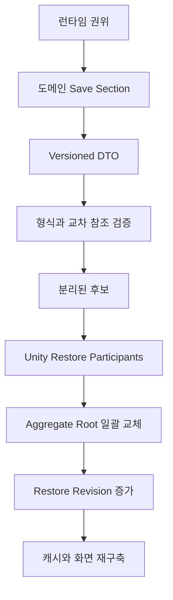
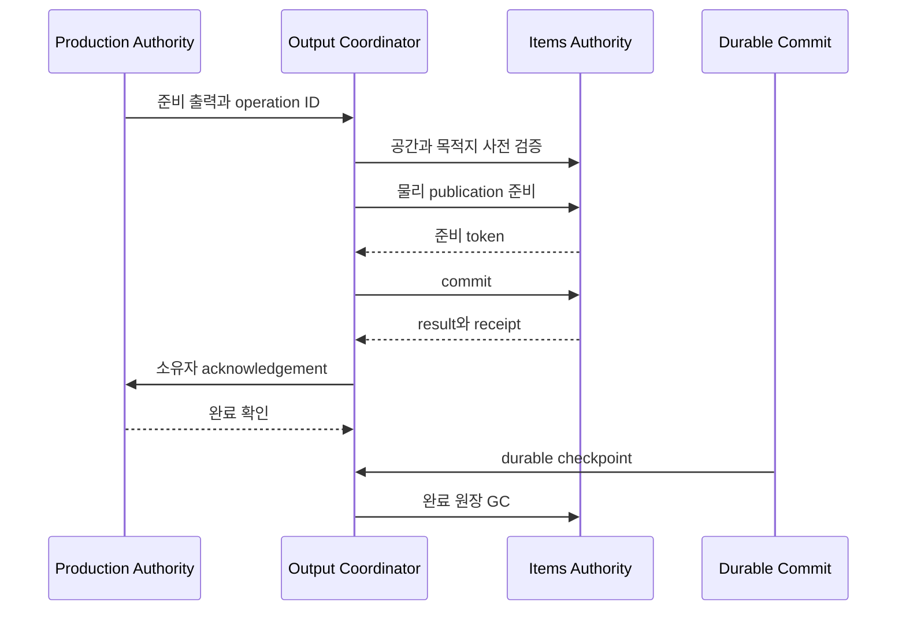

# 09. 상태 권위 원장

이 장은 주요 상태마다 누가 쓸 수 있고, 다른 시스템은 어떤 방식으로 읽으며, 저장과 복원에서 무엇을 기준으로 삼는지 정리한다. 클래스 수보다 상태 가족을 기준으로 작성했다. 하나의 상태 가족이 여러 Aggregate로 나뉘어 있으면 그 경계를 유지하며, 편의를 이유로 하나의 전역 Manager가 모두 소유한다고 표현하지 않는다.

조사 기준일은 2026-08-31이다. 현재 소스와 save section 등록을 정적으로 확인했으며 Unity 실행 검증은 하지 않았다.

## 1. 권위의 네 형태

| 형태 | 의미 | 변경 가능 여부 |
|---|---|---|
| 작성 권위 | ScriptableObject와 카탈로그에 저장된 정의, 규칙, 참조와 기본 수치 | 에디터에서 작성하며 한 런의 명령으로 바꾸지 않는다 |
| 런타임 권위 | 인스턴스, 수량, 위치, 진행도, 관계, 피해와 주문처럼 현재 런의 상태 | 담당 Aggregate, Repository 또는 명령 서비스만 바꾼다 |
| 영속 권위 | 런타임 상태를 캡처한 versioned DTO와 복원 후보 | 저장 section이 만들고 검증하며, publication 뒤 런타임 권위로 돌아간다 |
| 읽기 투영 | Snapshot, 인덱스, 캐시, ViewModel, 오버레이와 진단 값 | 원본을 바꾸지 않으며 source revision이 달라지면 폐기하거나 다시 만든다 |

단일 쓰기 권위는 같은 사실을 한 시스템만 저장한다는 원칙이다. 예를 들어 생산은 출력이 준비됐다는 사실을 소유하고, Items는 실제 stack이 월드에 존재한다는 사실을 소유한다. 두 사실이 모두 필요한 절차는 Coordinator가 인계하지만 어느 쪽 상태도 대신 소유하지 않는다.

## 2. 기반과 공간 상태

| 상태 가족 | 작성 기준 | 런타임 쓰기 권위 | 허용된 진입 경로 | 읽기 투영 | 영속성과 복원 | 금지되는 우회 |
|---|---|---|---|---|---|---|
| 콘텐츠 정의 | 통합 카탈로그와 각 도메인 ScriptableObject | 런타임 쓰기 없음 | Editor 작성과 validator | 도메인별 읽기 Port, 콘텐츠 DB | 자산 자체가 기준이며 세이브는 안정 ID를 저장 | 런타임 수량이나 진행도를 SO 필드에 기록 |
| 세션, 런 변수와 난수 | 런 설정과 메타 정의 | run flow, session state, random stream 권위 | 런 시작, 달력, 명시적 진행 명령 | 현재 런 Snapshot, calendar query | `FoundationSessionSaveSection`, `RunVariableSaveSection`, `RandomStreamSaveSection`, `RunFlowSaveSection` | UI 시간이나 임의 `UnityEngine.Random` 결과를 저장 권위로 사용 |
| 게임 시간과 달력 | 시간 규칙 | `IGameClock` 사용 런타임과 `GameCalendarRuntime`의 담당 상태 | 시간 배율 명령, 런 진행 | UI 시계, 달력 Snapshot | 달력과 기후 section, 운영일 section | UI clock으로 게임 진행을 누적하거나 일시정지 중 시뮬레이션 변경 |
| 그리드와 공간 점유 | 건물 크기와 통행 정의 | 그리드 셀, 점유와 구조 version을 관리하는 Grid 권위 | 배치, 철거, 이동과 명시적 점유 명령 | 경로 Snapshot, 공간 질의, navigation cache | 월드와 건물 관련 section 및 Unity restore participant | 경로 캐시나 GameObject 위치를 셀 점유의 기준으로 삼기 |
| 건설 현장과 완공 시설 | `BuildingSO`, 능력 조합, BOM과 작업량 | 건설 현장 상태와 완공된 건물 registry | 배치 명령, 재료 인계, Work 완료, 철거 명령 | 배치 preview, 시설 질의, 구조 안전 cache | 건물과 모듈 시설 관련 section, 씬 publication participant | Presenter가 현장을 완공 처리하거나 Items와 별도 재료 수량 보유 |
| 방과 서비스 공간 | 방 조건, 시설 capability | 벽과 점유 상태에서 방을 판정하는 room runtime | 공간 구조 변경 뒤 재판정 | room layout, service-room projection | `ServiceRoomsSaveSection`과 재구축 가능한 방 투영 | 표시용 방 윤곽을 공간 권위로 저장 |

## 3. 노동, 물질과 생산

| 상태 가족 | 작성 기준 | 런타임 쓰기 권위 | 허용된 진입 경로 | 읽기 투영 | 영속성과 복원 | 금지되는 우회 |
|---|---|---|---|---|---|---|
| 작업 주문과 진행 | `WorkTypeId`, 작업 정책과 handler 등록 | Work Aggregate와 `WorkOrderRuntime` | 주문 생성, claim, 실행 결과, 취소와 완료 명령 | AI 작업 후보, 작업 목록, 실패 사유 | `WorkOrdersSaveSection` | AI blackboard가 주문 진행도를 직접 수정 |
| 물리 아이템과 stack | 아이템 정의, feature와 stack 규칙 | `WorldItemRepository`와 Items 명령 경계 | 생성, 예약, 이동, 소비, 분할, 병합, 장착과 인계 | 위치 인덱스, haulable cache, 재고 Snapshot | `PhysicalItemsSaveSection`과 Items restore participant | 생산, 건설, 의료가 별도 실제 수량을 저장하거나 ViewModel에서 stack 수정 |
| 물리 질량과 목적지 용량 | 아이템 기본 중량, 장비·의복 질량 기여와 목적지 capacity profile | 기본값은 카탈로그, 개별 기여는 Items 인스턴스 상태, 합성은 `PhysicalItemMassQuery`, 허용량은 각 창고·시설 buffer authority | mass projector 등록, exact gram query, revision이 결속된 admission prepare·commit·cancel | stack 총질량, 운반 부담, 적재량, 생산 출력 질량과 kg 표시 | ID·수량·구성요소·custody를 저장하고 기본 질량은 재계산, 거래의 frozen gram은 검증 증거로만 보존 | 화면·전투·원정이 별도 최종 kg를 저장하거나 count·slot과 kg를 한 수치로 합산, 살아 있는 대상을 item stack으로 환산 |
| 물리 책임과 pending ledger | 목적지 capability와 인계 계약 | Items 권위 안의 custody, drain, publication 원장 | operation ID와 fingerprint를 가진 prepare, commit, ack | pending transaction query, 진단 projection | 물리 아이템 section과 관련 terminal drain section | 완료 영수증 없이 원장을 삭제하거나 같은 ID에 다른 요청 재사용 |
| 생산 주문과 재공품 | 조합식, 공정, 품질과 시설 요구 | `ProductionAggregateStateSession`과 생산 주문 Aggregate | 주문 명령, Work 결과, 입력 확인, 출력 단계 전이 | bill Snapshot, 병목과 출력 대기 query | `ProductionBillsSaveSection`, prepared output와 terminal drain section | 실제 stack 존재를 생산 상태만으로 확정하거나 임의 단계 건너뛰기 |
| 전력, 유체, 컨베이어와 자동화 | 포트, 용량, 연결과 정책 정의 | 각 산업 기반망 Aggregate와 runtime | 구조 변경, 공급과 소비 등록, 자동화 명령 | topology Snapshot, route cache, overlay | Power, Fluid, Conveyor, Automation section | overlay graph나 오래된 route version을 네트워크 권위로 사용 |
| 재고 정책과 경제 원장 | 거래, 목표 재고와 계약 정의 | 재고 정책, 국고, 거래 원장과 계약 Aggregate | 거래 명령, 판매 준비, 계약 인계와 확인 | 재고 부족, 원장, HUD Snapshot | Treasury, stock policy, contract와 economy section | 화면 숫자를 직접 보정하거나 물리 수량과 경제 영수증을 하나의 임의 값으로 합치기 |

## 4. 인물, 건강과 생태

| 상태 가족 | 작성 기준 | 런타임 쓰기 권위 | 허용된 진입 경로 | 읽기 투영 | 영속성과 복원 | 금지되는 우회 |
|---|---|---|---|---|---|---|
| 인물 존재와 씬 표현 | 종족, 기본 외형과 생성 규칙 | `CharacterPopulationAggregate`와 character world 경계 | 생성, 사망, 이주와 복원 명령 | actor registry, scene adapter, 화면 Snapshot | `CharacterWorldSaveSection`과 scene restore participant | GameObject 존재만으로 인물의 영속 생존을 판정 |
| 생애, 가족, 직업과 사회 상태 | 종족, 특성, 직업과 문화 정의 | life, kinship, household, career, grief, narrative 등 분리 Aggregate | 해당 도메인의 명령과 형식화된 완료 사건 Adapter | 인물 정보, 사회 관계, 서술 Snapshot | Character life, career, kinship household, psychosocial, narrative section | 한 Aggregate의 내부 컬렉션을 다른 Adapter가 직접 수정 |
| 욕구, 소비와 결핍 | 음식, 의복, 생존 규칙 | consumables와 deprivation Aggregate | 소비 명령, 시간 누적, 환경 표본 | AI 필요도, 경보와 상태 표시 | `CharacterConsumablesSaveSection`, dark survival과 survival resource section | AI 점수 자체를 배고픔이나 결핍의 원본 상태로 저장 |
| 신체, 활력과 질병 | 해부, 질병, 치료와 보호 규칙 | `CharacterBodyHealthRuntime`이 관리하는 신체 상태와 health Aggregate | 피해, 회복, 질병 진행과 의료 명령 | 신체 Snapshot, 의료 후보와 경보 | `CharacterBodyHealthSaveSection`, population health section | 전투 결과 화면이 체력 값을 직접 덮어쓰기 |
| 의료, 수술과 환자 운송 | 수술법, 도구, 약품과 병상 조건 | medical Aggregate, surgery Aggregate와 transport order | 치료 명령, 재료 인계, Work 완료, 수술 상태 전이 | 치료 후보, 병상과 수술 진행 projection | Character medical, Surgery section과 관련 material outbox | 신체 부품을 Items와 Body 양쪽에서 각각 생성된 것으로 처리 |
| 환경장과 인물 노출 | 온도, 오염, 광원, 보호와 source 정의 | 환경 셀 필드 Aggregate, 인물별 노출과 의복 Aggregate | source 등록, topology 변경, 고정 주기 표본과 보호 명령 | 셀 overlay, 위험도, clean-work 후보 | Environmental field, Character environment section | 화면 색상이나 캐시된 셀 값을 독립 환경 상태로 저장 |
| 작물과 농업 | 작물, 종자와 재배 규칙 | crop plot과 crop ecology Aggregate | 파종, 성장 step, 처리, 수확과 생산물 인계 | 밭 상태, 작업 후보, 성장 projection | Crop plot, Crop ecology, Certified seed section | 수확 UI가 생산물을 직접 지급 |
| 야생동물과 축산 | 종, 해부, 서식지와 산출 규칙 | wildlife world와 ecosystem, husbandry, capture Aggregate | 생태 step, 포획, 급여, 번식과 산출물 인계 | 동물 registry, 우리별 projection, 행동 후보 | Wildlife, Animal husbandry, Captivity section | scene actor나 우리 목록 projection을 포획 상태 권위로 사용 |

## 5. 전투, 외부 세계와 진행

| 상태 가족 | 작성 기준 | 런타임 쓰기 권위 | 허용된 진입 경로 | 읽기 투영 | 영속성과 복원 | 금지되는 우회 |
|---|---|---|---|---|---|---|
| 전투 명령과 교전 | 무기, 방어구, 탄약, 공격과 전술 정의 | 전투 명령 Aggregate와 교전 runtime | 전투 command, 명중과 피해 결과, 종료 명령 | 전술 overlay, combat Snapshot | Character combat command, combat equipment section | overlay나 애니메이션 완료가 피해 확정을 대신하기 |
| 장비 인스턴스와 내구도 | 장비 정의와 품질 규칙 | 물리 존재와 장착은 Items, 전투 장비 상태와 진화는 해당 equipment Aggregate | 장착, 해제, 사용, 수리, 해체와 재단조 명령 | loadout, 성능, 유지보수와 진화 projection | Combat equipment, durable facility equipment, maintenance와 evolution section | 같은 장비 내구도를 Items와 전투 화면이 각각 별도 저장 |
| 피해와 신체 결과 | 공격과 방어 계산 규칙 | 계산은 Combat, 지속 신체 변화는 Body Health | 검증된 damage command와 결과 적용 | 피해 로그와 신체 Snapshot | 신체 section이 지속 결과를 보존 | 전투 세션의 임시 수치를 장기 신체 상태로 간주 |
| 방어와 침입 | 방어 시설, 침입 세력과 전술 정의 | defense tactical Aggregate와 `InvasionCampaignRuntime` | 방어 정책, 침입 단계, 교전 명령과 후속 결과 | 위협, intent, 전술 overlay | Defense facility, Defense tactical, Invasion section | 침입자 GameObject를 캠페인 단계의 유일한 기준으로 사용 |
| 원정과 월드맵 | 지역, 조우, 이동과 보급 정의 | Offense world state, expedition, travel과 battle Aggregate | 출정, 이동, 선택, 전투, 귀환과 도착 명령 | 월드맵, 위협, 귀환 상태 query | `OffenseAggregateSaveSection`과 versioned codec | UI 경로 선택이 확정된 이동 상태를 직접 변경 |
| 연구와 런 진행 | 연구 프로젝트, 선행 조건과 해금 정의 | 연구 queue, progress, unlock과 milestone Aggregate | 연구 선택, 작업 또는 자원 기여, 완료 명령 | 연구 후보, 진행도와 잠금 사유 | Blueprint research, run milestone, experience pacing section | 작성 정의의 unlocked 필드를 런 상태로 변경 |
| 메타 진행 | 메타 해금과 프로필 정의 | meta profile과 progression 권위 | 런 종료 결과와 명시적 메타 명령 | 메타 메뉴 Snapshot | `MetaProgressionSaveSection`과 별도 profile persistence | 한 런의 연구 완료를 메타 해금으로 자동 간주 |

## 6. 세력, 사건, 시설 성장과 화면

| 상태 가족 | 작성 기준 | 런타임 쓰기 권위 | 허용된 진입 경로 | 읽기 투영 | 영속성과 복원 | 금지되는 우회 |
|---|---|---|---|---|---|---|
| 세력과 관계 | 세력, 계약, 호의와 적대 규칙 | faction Aggregate와 계약 및 goodwill 원장 | 외교 명령, 계약 인계, 배상과 완료 영수증 | 관계, 계약과 공급 경로 Snapshot | Faction, Faction campaign, regional contract section | 사건 Coordinator가 세력 내부 컬렉션을 직접 수정 |
| 모집과 포로 수용 | 모집, 포획, 수용, 석방과 포로 노동 규칙 | recruitment와 captivity Aggregate | 체포, 모집 제안, 포로 노동 배치, 석방과 보복 명령 | 후보, 수용 상태와 위험 projection | Recruitment 관련 상태가 소속된 도메인 section, Captivity section | 인물 화면이 소속이나 구금 상태를 직접 교체 |
| 정착 신분과 하수인 전환 | 준비 후보·방문자·정식 주민·하수인 규칙 | 신분은 Character Population, 포획일과 재사회화는 Captivity, 임금 계약은 Employment | `CaptivityRuntime`의 하수인 전환·재사회화·정식 영입 명령 | `ICharacterSettlementStandingQuery`, 인구·업무·포로 화면 projection | Character Population standing, Captivity rehabilitation fields, Employment section | 업무·임금·원정·UI가 캐릭터 유형이나 `CaptivityStatus.Minion`만 보고 신분을 추정 |
| 캠페인과 사건 해결 | 계절, 사회, 사건 요구 조건과 효과 정의 | `V20CampaignRuntime`의 후보 및 확정 상태, 대상 도메인의 실제 효과 권위 | `V20ContentResolutionService`의 preflight, prepare, commit과 publish | 사건 후보, 선택 결과와 이력 | Seasonal world events, Society events, campaign section | 경보 선택지가 비용 검증 없이 효과를 직접 적용 |
| 시설 작성 계보 교체 | 시설 진화 조합식, metric과 표식 정의 | `FacilityEvolutionRuntime`과 시설 기록 | 후보 검증, 물질 영수증, Work 완료와 건물 교체 | 후보, 대기 원인과 운영 이력 | modular facility와 facility 관련 section | 방 표시나 정의 교체만으로 물리 재료 소모를 생략 |
| 시설 개체 진화와 이전 | 사용 증거, 진화 규칙과 활성 조건 | `FacilityInstanceEvolutionRuntime`, `UsageLedger`와 진화 상태 | 사건 기록, 후보 선택, 개조, 재조율, 포장과 재설치 명령 | 활성 노드, 계보, 후보와 이전 단계 projection | 시설 및 장비 evolution section과 물리 package outbox | 서술 결과가 후보 효과를 바꾸거나 포장물 없이 위치만 변경 |
| 경보와 사용자 선택 기록 | 경보 형식과 merge policy | `EventAlertAggregateState` | alert command, dismissal과 action result | 경보 목록과 badge projection | `EventAlertSaveSection` | Toast GameObject 존재를 경보 상태로 간주 |
| 일반 Presentation | 탭, 화면 구조와 표시 규칙 | 게임 상태 쓰기 권위 없음 | Query로 읽고 Command로 의도 제출 | Presenter, ViewModel, overlay와 객체 풀 | 필요한 사용자 선택만 해당 도메인 또는 alert section에 저장 | ViewModel 수정으로 gameplay state를 확정 |

## 7. 저장 권위의 배치

`DungeonSaveRegistration`은 도메인별 `IDungeonSaveSection`을 중앙 registry에 모은다. 등록은 중앙에서 하지만 payload의 의미와 복원 후보는 각 도메인이 책임진다.

저장 section은 런타임 권위를 대체하지 않는다. 캡처 시점에는 상태를 읽고, 복원 시점에는 live 상태와 분리된 후보를 만든다. 모든 section과 participant가 준비된 뒤에만 새 root를 발행한다. 구조와 실패 절차는 [저장, 복원과 중복 실행 방지](05-persistence-transactions-and-idempotency.md)를 따른다.

## 8. 권위 이전의 표준 형태

생산 결과를 예로 들면 권위는 다음 순서로 이어진다.

생산은 실제 stack을 직접 만들지 않고, Items는 생산 주문을 완료 처리하지 않는다. Coordinator가 두 권위 사이의 순서를 관리하고 영수증을 전달한다. 이 구분이 지켜져야 저장 직후 재개해도 출력 중복이나 소실을 판정할 수 있다.

## 9. 검토 기준

새 상태나 변경 경로를 추가할 때 다음 항목이 하나라도 비어 있으면 권위가 닫히지 않은 것이다.

1. 상태 가족과 안정 ID가 정해져 있는가.
2. 런타임에서 쓸 수 있는 Aggregate, Repository 또는 명령 경계가 하나로 정해져 있는가.
3. 다른 시스템은 Snapshot이나 Query로만 읽는가.
4. 오래된 Snapshot을 명령 시점에 다시 검증하는가.
5. 인덱스, 캐시와 화면 projection이 원본 revision에 종속되는가.
6. 저장 section의 ID, version, dependency와 candidate가 있는가.
7. Unity 객체가 있다면 publication과 rollback을 맡을 participant가 있는가.
8. 다른 도메인의 상태가 바뀐다면 Port와 Coordinator가 호출 순서를 소유하는가.
9. 실패 가능한 물리 효과에는 operation ID, 결과와 acknowledgement가 있는가.
10. 우회 변경을 탐지할 validator, 진단 또는 fail-loud 경계가 있는가.

구체적인 인계 순서와 실패 지점은 [도메인 간 거래와 실패 경계](10-cross-domain-transactions.md), 캐시와 projection의 수명은 [런타임 스케줄링과 읽기 투영](11-runtime-scheduling-and-projections.md)에 정리한다.
