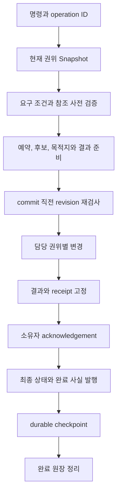
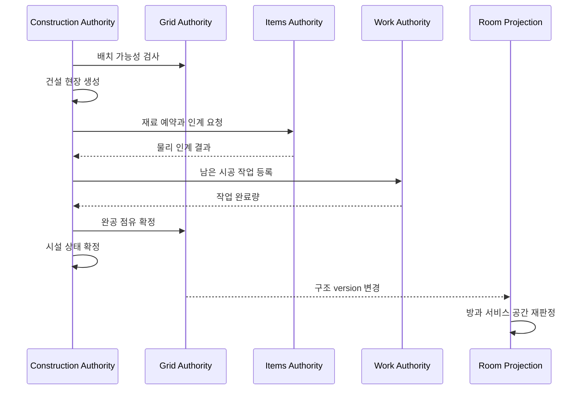
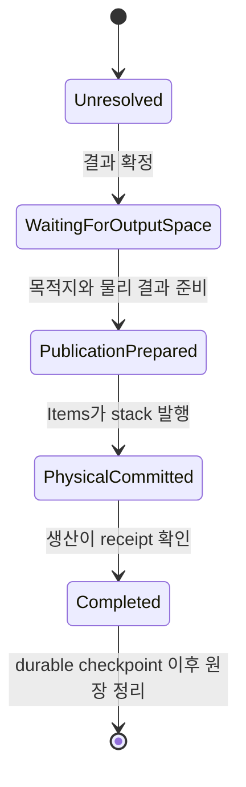
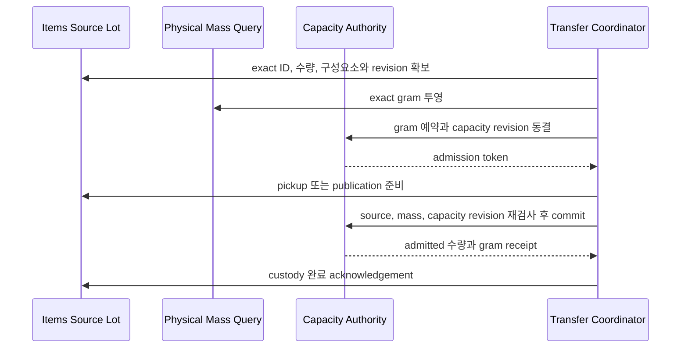
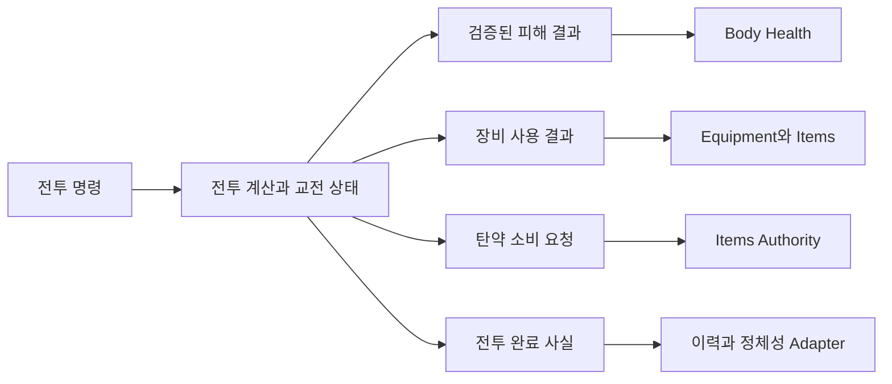
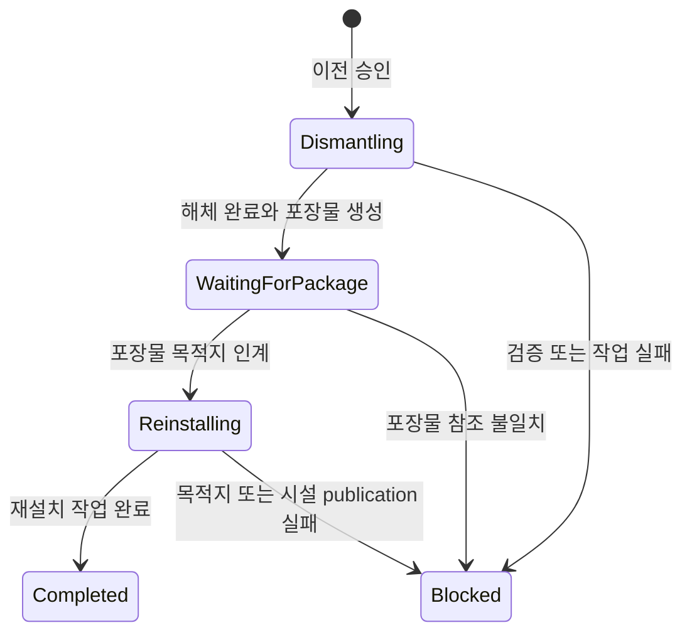

# 10. 도메인 간 거래와 실패 경계

DungeonStory의 주요 행동은 한 상태만 바꾸고 끝나지 않는다. 생산은 작업과 물리 아이템을 거치고, 수술은 환자 운송, 도구, 재료와 신체 상태를 함께 다룬다. 시설 이전은 기존 시설의 해체, 포장물 운반과 재설치를 연결한다. 이 장은 이러한 절차에서 각 권위가 무엇을 확정하고, 중간 실패와 저장을 어떻게 판정하는지 설명한다.

현재 코드에는 하나의 범용 분산 거래 엔진이 없다. 대신 유스케이스별 Coordinator, 분리 후보, reservation, outbox, receipt, checkpoint와 guarded state machine이 조합되어 있다. 따라서 모든 다단계 작업을 Saga나 two-phase commit으로 부르지 않는다.

## 1. 거래 형태의 구분

| 형태 | 적용 조건 | 완료 판정 | 실패 처리 |
|---|---|---|---|
| 단일 권위 명령 | 하나의 Aggregate 안에서 불변식을 닫을 수 있음 | 명령 결과와 새 revision | mutation 전 거부하거나 Aggregate 내부 전이 취소 |
| 응용 Coordinator | 여러 권위를 같은 실행 흐름에서 순서대로 호출 | 각 명령의 성공과 최종 owner publication | preflight, 재검증, 명시적 복구 또는 차단 |
| 분리 후보와 일괄 발행 | live 세계 전체를 부분 변경으로부터 보호해야 함 | 모든 후보와 participant 발행 후 root swap | 역순 rollback과 candidate discard |
| Transactional Outbox | 물리 효과와 소유자 확인 사이에 저장 또는 종료가 가능함 | effect commit, owner acknowledgement, durable checkpoint | 동일 operation replay, deferred, conflict 판정 |
| 완료 사건 반응 | 이미 확정된 사실에 독립 후속 반응을 붙임 | 각 구독자의 자체 처리 | 필수 상태 변경을 Event Bus 순서에 의존하지 않음 |

## 2. 공통 거래 생명주기

모든 절차가 아래 단계를 전부 사용하지는 않는다. 물리 자원, 장기 작업 또는 외부 권위 인계가 있는 경우 필요한 단계가 늘어난다.

### 의도와 식별

재시도 가능한 작업은 같은 논리 행동을 식별할 operation ID가 필요하다. 같은 ID에 다른 대상, 수량이나 목적지가 들어오면 충돌로 판정한다. request fingerprint가 이 차이를 판정한다.

### 사전 검증

대상 존재, 최신 단계, 카탈로그 참조, 공간, 수량, 시설 capability와 권한을 mutation 전에 확인한다. 사전 검증은 실패 가능성을 앞에 모으지만 동시 변경을 막지는 않는다. commit까지 시간이 있다면 reservation이나 revision 재검사가 필요하다.

### 준비

아이템 reservation, 출력 publication 후보, restore candidate처럼 live 상태와 분리된 준비물을 만든다. 준비 단계는 실제 결과를 노출하지 않는다. 실패하면 준비물과 예약을 해제할 수 있어야 한다.

### commit과 영수증

각 도메인은 자기 상태만 변경한다. 물리 효과가 끝나면 result와 receipt를 고정해 재호출이 같은 결과를 반환하게 한다. Coordinator는 이 영수증으로 원래 소유자에게 완료를 확인시킨다.

### checkpoint와 정리

메모리 변경과 durable save는 서로 다른 단계다. owner acknowledgement와 완료 원장이 새 저장 파일에 반영된 뒤에만 replay 증거를 정리한다.

## 3. 건설과 철거

건설은 공간, 물질과 노동의 세 권위를 연결한다.

건설 현장은 필요한 재료와 작업량을 소유하지만 실제 stack 수량을 소유하지 않는다. Work는 시공 진행을 실행하지만 건물을 완공 상태로 직접 바꾸지 않는다. Grid는 점유를 확정하지만 건설 재료의 충족 여부를 판단하지 않는다.

배치 사전 검증 뒤 다른 구조물이 생길 수 있으므로 완공 시점의 공간 검증도 필요하다. 철거와 파괴는 점유 해제, 회수 가능한 물리 품목, 연결된 기반망과 방 재판정을 함께 일으킨다. 이 절차를 완료 사건 구독 순서에 맡기면 일부 후속 반응이 실패했을 때 어떤 상태가 확정됐는지 불명확해진다. 필수 상태 변경은 Coordinator가 명령 결과를 확인해야 한다.

## 4. 생산 입력과 출력

생산은 주문 진행과 실제 물리 아이템이 서로 다른 권위에 있기 때문에 가장 엄격한 인계가 필요하다.

### 입력

1. 생산은 조합식과 현재 주문 단계에서 필요한 입력을 계산한다.
2. Items는 실제 stack, destination custody와 reservation을 검사한다.
3. Work가 공정을 진행하기 전에 입력 책임이 준비된다.
4. 실제 소비 또는 파괴가 끝나면 Items가 결과를 기록한다.
5. 생산은 receipt를 확인한 뒤 다음 단계로 전이한다.

`ProductionPhysicalCustodyDrainOutbox`, `ProductionInputDestinationCustodyDrainOutbox`와 terminal drain 계열은 물리 효과와 생산 소유자 확인 사이의 중단 지점을 저장한다.

### 출력

`ProductionCapacityRoutingDrainExecutionCoordinator`와 준비 출력 routing 경계는 목적지 용량, revision과 capability version을 확인한다. 물리 발행 이후 생산 acknowledgement 전에 종료되면 같은 commit 결과를 replay해야 한다. 생산 결과를 다시 계산하거나 새 stack을 하나 더 만들면 중복 생성이 된다.

### 질량 입고

창고와 시설 버퍼로 물건을 옮기는 절차는 source lot, 질량 계산과 목적지 capacity라는 세 권위를 연결한다.

질량 입고는 목적지에 이미 저장된 gram과 아직 도착하지 않은 예약 gram을 함께 계산한다. 일부 수량만 들어갈 수 있으면 token이 허용한 물리 slice와 실제 custody가 정확히 일치해야 한다. 남은 물건은 source 또는 운반자의 책임에 남고 재계획한다.

이 경계에서는 목적지 포화가 물질 변환의 근거가 될 수 없다. 창고에 맞추기 위해 수량을 줄이거나 바닥에 버리는 것은 실패를 성공으로 위장한다. 반대로 생산, 건조와 연소처럼 실제 변환이 있는 경우에는 외부 유입, 물리 부산물, 최종 폐기 또는 추상 공정 손실을 별도 disposition으로 선언할 수 있다. exact transfer와 explainable transform을 구분해야 용량 처리와 물질수지가 서로의 오류를 숨기지 않는다.

창고와 시설 버퍼는 같은 canonical gram을 읽지만 capacity authority와 admission ledger를 공유하지 않는다. 각 목적지의 lifecycle, 최대 체류시간과 파괴 정책이 다르기 때문이다. count, 진열 slot, 배치 수와 kg도 별도 차원으로 유지한다.

## 5. 의료와 수술

수술은 다음 권위를 결합한다.

| 책임 | 소유 권위 |
|---|---|
| 환자의 신체와 질병 상태 | Body Health |
| 수술 주문, 단계와 치료 계획 | Medical and Surgery |
| 장기, 약품, 도구와 소모품의 물리 존재 | Items |
| 환자 운송과 시술 노동 | Work와 transport runtime |
| 침상, 수술실과 위생 조건 | 시설, 방과 환경 Query |

수술 시작 전에는 환자, 대상 신체 부위, 의료진, 시설, 도구와 재료를 확인한다. 재료를 예약한 뒤 환자 운송과 작업이 지연될 수 있으므로 주문 단계와 예약 식별자가 저장돼야 한다. 신체 부품 적출이나 설치처럼 물리 아이템과 신체 상태가 동시에 바뀌는 절차는 outbox와 명시적 단계로 중복 생성과 소실을 판정한다.

수술 결과를 UI가 직접 적용하거나, Items가 신체 노드를 수정하거나, Body Health가 월드 stack을 직접 생성하면 권위가 겹친다. Surgery Coordinator가 각 명령을 순서대로 호출하되 신체와 물리 상태의 최종 변경은 각 원래 권위에 남겨야 한다.

## 6. 전투, 장비와 피해

전투 계산은 공격자, 무기, 방어와 상황을 이용해 결과를 만든다. 지속 상태는 결과 종류에 따라 다른 권위가 받는다.

현재 구조를 모든 피해, 탄약, 장비 내구도와 신체 상태를 한 번에 commit하는 범용 트랜잭션으로 해석하면 안 된다. 즉시 호출되는 로컬 절차와 저장 가능한 장비 outbox가 섞여 있다. 필수 결과의 호출 순서, 실패 가능성, 재호출 의미를 유스케이스별로 확인해야 한다.

장비 제작, 수리, 해체와 진화에는 `CombatEquipmentCraftMaterialOutbox`, `EquipmentRepairMaterialOutbox`, `EquipmentEvolutionMaterialOutbox` 같은 물질 인계 경계가 있다. 전투 중 일시적인 계산 결과와 장기 장비 상태를 분리한 덕분에 표시 연출이나 전술 overlay를 바꿔도 물리 장비 권위는 유지된다.

## 7. 시설 합성, 진화와 이전

시설 성장에는 서로 다른 세 거래가 있다.

| 거래 | 입력 | 결과 | 조율 권위 |
|---|---|---|---|
| 시설 합성 | 설치된 시설과 실물 재료 | 새 시설 구성 | 합성 규칙과 응용 서비스 |
| 작성 계보 교체 | 운영 기록, 조합식, 물질과 작업 | 다음 시설 정의로 교체된 건물 | `FacilityEvolutionRuntime` |
| 개체 진화 | 사용 원장, 고정 후보, 촉매와 작업 | 같은 개체에 추가된 진화 노드 | `FacilityInstanceEvolutionRuntime` |

이전은 개체 진화 쪽의 장기 절차다.

해체 뒤에는 원래 시설, 포장물과 이전 주문이 모두 같은 상태를 가리켜야 한다. `FacilityRelocationPackageOutbox`는 포장물 인계를 기록하고, 주문은 원본과 목적지 좌표, 현재 단계와 작업량을 보존한다. GameObject 위치만 옮기면 물리 운반과 중간 저장의 의미가 사라진다.

서술 생성은 거래 결과의 권위가 아니다. 요청 Snapshot과 노드가 여전히 일치할 때 이름과 설명만 갱신하며, 후보 효과와 재료 요구를 바꾸지 않는다.

## 8. 원정 귀환과 사건 해결

### 원정 귀환

`OffenseExpeditionReturnCoordinator`는 전투 결과, 귀환 이동, 보상, 인물과 월드 상태를 연결한다. 원정 Aggregate는 결정과 이동 단계를 보존하고, 실제 보상 아이템은 Items가 발행한다. 귀환 완료 전에 저장되면 현재 travel 또는 arrival 단계에서 재개해야 하며 조우나 보상을 다시 추첨하지 않는다.

### 사건 해결

`V20ContentResolutionService`는 현재 세계 Snapshot에서 요구 조건을 평가하고 캠페인 후보를 만든다. 돈, 아이템 비용, 지급 대상, 질병과 관계 인원을 사전 검증한 뒤 reservation과 exact-source publication을 준비하고 대상 도메인의 명령을 호출한다. 모든 필수 결과가 확인된 뒤 캠페인 후보와 해결 완료 사실을 발행한다.

현재 새 효과 종류는 중앙 effect 분기, preflight와 commit 경로를 함께 수정해야 한다. 기존 효과의 조합은 데이터 중심이지만 새로운 의미의 추가는 handler plug-in 수준으로 닫혀 있지 않다. 이 제약은 [응용 워크플로, 사건과 프레젠테이션](04-workflows-events-and-presentation.md)에 상세히 기록돼 있다.

## 9. 저장과 복원 자체의 거래

복원은 도메인 간 거래 중 가장 넓은 범위를 가진다.

1. registry가 section ID, version과 dependency를 검증한다.
2. 모든 payload를 live 상태와 분리해 preflight한다.
3. 각 section이 restore candidate를 stage한다.
4. Unity 자원은 transaction participant가 별도 후보를 준비한다.
5. 모든 publication이 성공하면 aggregate root를 한 번 교체한다.
6. 실패하면 participant publication을 역순으로 되돌리고 후보를 폐기한다.
7. 성공 뒤 restore revision을 올려 projection 재구축을 유도한다.

적용 범위는 한 프로세스 안의 staged publication과 가역 participant 구조다. 데이터베이스와 외부 서비스는 참여하지 않는다.

## 10. 실패 시점별 판정

| 실패 시점 | 노출 가능한 상태 | 필요한 처리 | 재호출 의미 |
|---|---|---|---|
| preflight 전후 | live 변경 없음 | 실패 결과 반환 | 조건이 바뀐 뒤 새 요청 가능 |
| reservation 또는 prepare 이후 | 예약과 분리 후보만 존재 | release, discard 또는 rollback | 같은 operation으로 준비 재개 가능 |
| 일부 권위 commit 이전 | 아직 확정되지 않은 준비 상태 | commit 중단과 준비 해제 | 처음부터 재검증 |
| 물리 effect commit 이후, owner ack 이전 | 실제 효과와 pending 원장 존재 | 같은 receipt를 owner에게 다시 전달 | effect를 반복하지 않는 replay |
| owner ack 이후, durable checkpoint 이전 | 양쪽 live 상태와 완료 원장 존재 | 완료 증거 유지 | `AlreadyApplied` 또는 replay |
| checkpoint 이후 | 저장 파일에 완료 상태 존재 | 원장 GC 가능 | 같은 요청은 완료 결과 반환 |
| restore publication 중 | 이전 live root 유지 또는 일부 participant 임시 발행 | 역순 rollback과 candidate discard | 전체 복원을 다시 시작 |
| 완료 사건 구독 중 | 원래 거래는 이미 완료 | 구독자 자체 복구 또는 진단 | 원래 거래를 되돌릴 근거로 사용하지 않음 |

## 11. 결과 코드의 의미

거래 경계에서는 최소한 다음 상태를 구분해야 한다.

| 결과 | 의미 | 호출자 행동 |
|---|---|---|
| Applied | 이번 호출에서 새 상태가 반영됨 | 다음 단계 진행 |
| Replay 또는 AlreadyApplied | 같은 논리 요청이 이미 같은 결과로 끝남 | 저장된 결과를 사용하고 effect 반복 금지 |
| Deferred | 선행 단계, 자원 또는 publication이 아직 준비되지 않음 | 현재 단계 유지 후 조건이 충족되면 재시도 |
| DomainFailure | 자원 부족, 대상 부재 같은 정상 게임 규칙 실패 | 사용자 또는 AI에 이유 전달 |
| Conflict | 같은 ID에 다른 fingerprint나 오래된 revision이 들어옴 | 요청 폐기 또는 최신 상태에서 새 operation 생성 |
| Corruption | 저장 참조, 단계와 영수증이 계약상 함께 존재할 수 없음 | 정상 진행을 중단하고 구조 오류로 보고 |

## 12. 새 도메인 간 절차 설계 순서

1. 각 상태 사실의 단일 쓰기 권위를 [상태 권위 원장](09-state-authority-ledger.md)에서 정한다.
2. 유스케이스의 operation ID와 request fingerprint 범위를 정한다.
3. mutation 전에 검증할 대상, 수량, 공간, capability와 revision을 나열한다.
4. prepare에서 만들 reservation, candidate와 publication token을 정한다.
5. commit 순서와 각 권위의 명령 결과를 정한다.
6. effect commit 뒤 owner acknowledgement가 분리되면 outbox 단계를 저장한다.
7. 각 단계 사이에 저장되고 종료되는 경우의 재개 지점을 작성한다.
8. rollback 가능한 단계와 차단 상태로 남겨야 하는 단계를 구분한다.
9. 완료 원장을 삭제할 durable checkpoint를 정한다.
10. Event Bus에는 확정된 사실만 발행하고 필수 commit을 구독 순서에 맡기지 않는다.

업데이트 빈도와 projection 무효화는 [런타임 스케줄링과 읽기 투영](11-runtime-scheduling-and-projections.md), 저장 공통 절차는 [저장, 복원과 중복 실행 방지](05-persistence-transactions-and-idempotency.md)에서 이어진다.
