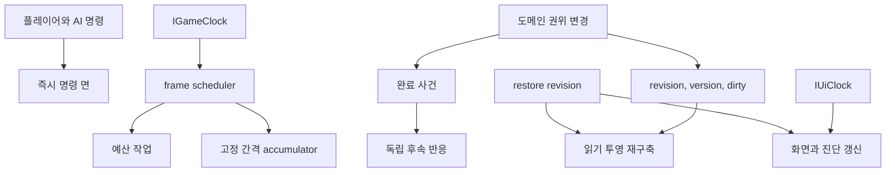

# 11. 런타임 스케줄링과 읽기 투영

DungeonStory는 모든 시스템을 매 프레임 같은 방식으로 갱신하지 않는다. 플레이어 명령에 즉시 반응하는 상태 전이, 일일 사건, 예산이 있는 AI와 경로 탐색, 고정 간격 환경 누적, 느린 유지보수 scan, revision 기반 화면 갱신이 함께 사용된다. 이 장은 각 실행 방식의 선택 이유와 캐시가 원본 상태를 따라가는 규칙을 정리한다.

조사 기준일은 2026-08-31이다. 소스의 시계 계약, EntryPoint, accumulator, cadence, dirty flag, revision, version, index와 기존 19개 시스템 문서를 정적으로 확인했다. 프레임 시간, GC, 최대 인구와 실제 처리량은 측정하지 않았다.

## 1. 시간 권위

Foundation은 세 가지 시간 책임을 분리한다.

| 계약 | 용도 | 지켜야 할 경계 |
|---|---|---|
| `IGameClock` | 게임 진행에 종속되는 frame, delta와 시뮬레이션 시간 | 일시정지와 시간 배율을 반영해야 하는 상태 누적에 사용 |
| `IUiClock` | 일시정지 중에도 필요한 화면, 입력과 진단 시간 | 욕구, 생산, 환경과 같은 게임 상태를 진행시키지 않음 |
| `IGameTimeScaleController` | 플레이어와 런 흐름의 시간 배율 제어 | 각 시스템이 임의 배율을 별도로 보관하지 않음 |

`GameCalendarRuntime`은 게임 시간의 누적 결과를 운영일과 달력 사건으로 변환한다. `DynamicFrameWorkBudget`은 게임 시계와 UI 시계를 함께 읽어 한 프레임의 허용 작업량을 조절한다. 화면이 계속 움직인다는 이유로 일시정지된 시뮬레이션을 갱신하거나, 게임이 빨라졌다는 이유로 UI 애니메이션까지 같은 배율로 누적하면 두 시간 권위가 섞인다.

## 2. 여섯 가지 실행 방식

| 실행 방식 | 적합한 작업 | 이점 | 위험 |
|---|---|---|---|
| 명령 즉시 실행 | 플레이어 선택, AI 행동 시작, 예약과 상태 전이 | 의도와 결과가 같은 호출 경계에 있어 실패를 바로 전달한다 | 한 명령에 무거운 전수 scan이 들어가면 입력 지연이 생긴다 |
| 완료 사건 반응 | 이미 확정된 사실의 알림, 정체성 기록과 후속 통계 | 발행자가 후속 소비자를 몰라도 된다 | 호출 순서와 exactly-once가 없으므로 필수 거래에 부적합하다 |
| 매 frame tick | 짧은 수명 상태, 입력 bridge와 소량의 진행 제어 | 반응 지연이 작다 | 모든 객체가 자체 scan을 하면 인구와 시설 수에 비례해 비용이 커진다 |
| budgeted scheduler | AI 후보 평가, 경로 탐색처럼 나눌 수 있는 많은 작업 | 한 frame의 작업량을 제한하고 공정성을 조절한다 | 결과가 여러 frame 뒤에 나오며 starvation 정책이 필요하다 |
| accumulator cadence | 환경, 욕구, 성장처럼 연속 시간을 일정 step으로 근사할 수 있는 상태 | frame rate와 계산 빈도를 분리한다 | 긴 frame 뒤 여러 step이 몰릴 수 있어 catch-up 상한이 필요하다 |
| dirty 또는 revision 반응 | topology, 재고 후보, 화면처럼 원본이 바뀔 때만 다시 만들면 되는 값 | 변하지 않은 상태의 반복 계산을 피한다 | 무효화 누락 시 오래된 결과가 정상처럼 남는다 |

`ITickable` 구현 여부는 실행 시점을 말할 뿐 작업 비용을 통제하지 않는다. 하나의 EntryPoint가 내부에서 budget을 사용하거나 accumulator를 돌릴 수 있고, 반대로 tick 없이 명령과 사건만으로 갱신되는 Aggregate도 있다.

## 3. 실행 면의 배치



한 상태 변경은 여러 실행 면에 신호를 보낼 수 있다. 건물이 완공되면 Grid version이 올라가고, 방과 기반망 topology가 dirty가 되며, 작업 후보 cache와 화면 projection이 무효화된다. 이 후속 값들은 서로 다시 원본이 되지 않고 건물과 Grid 권위를 참조해 재구축된다.

## 4. 시스템별 갱신 정책

| 시스템군 | 주된 실행 방식 | 비용 통제와 무효화 | 허용되는 지연 |
|---|---|---|---|
| 캐릭터 AI | 중앙 scheduler, actor cadence, offscreen stride와 jitter | frame budget, 공정성, 후보 cache, blackboard와 실패 기억 | actor별 다음 평가 시점까지 |
| 그리드와 경로 탐색 | 요청 broker와 incremental search | navigation version, in-flight 공유, 경로 cache와 step budget | 경로 세션이 여러 frame에 걸칠 수 있음 |
| 건설과 방 | 명령과 구조 변경 반응 | Grid 및 building version, 안전 cache, room dirty 재판정 | 구조가 바뀐 뒤 다음 projection 갱신까지 |
| 작업과 노동 | 주문 명령, AI 후보 주기와 실행 tick | 작업 type registry, 후보 index, 여러 source version을 결합한 cache key | AI 재평가 cadence까지 |
| 아이템과 운반 | stack 명령, 월드 runtime과 후보 갱신 | 위치 및 ID index, haulable dirty cache, item과 haul-work revision | 후보 목록 재구축 시점까지 |
| 생산 | 주문 상태 기계, 작업 결과와 출력 routing | 단계별 Snapshot, 목적지 revision, capability version과 outbox | 출력 공간이나 acknowledgement가 준비될 때까지 |
| 전력, 유체, 컨베이어 | 주기적 network step과 topology 변경 반응 | topology dirty, source version, network Snapshot과 route version | 다음 network step까지 |
| 인물 생애와 욕구 | 명령, 사건, 지속 욕구 accumulator | 인물별 다음 갱신, 변경된 상태만 projection | 욕구와 통계 cadence까지 |
| 의료와 질병 | 상태 명령, 치료 작업과 느린 후보 refresh | 환자 및 주문 index, 재료 outbox, 복원 revision | 의료 후보 refresh 주기까지 |
| 환경과 위생 | 고정 간격 필드 step과 source 변경 | topology dirty, grid 및 building version, 셀 index와 source 반경 | 다음 환경 step까지 |
| 야생동물과 축산 | 행동 scheduler, 생태 step, 축산 5초 cadence | item version cache, 우리별 projection, capture restore revision | 축산 상태는 최대 한 cadence 지연 |
| 전투와 장비 | 전투 명령, 교전 tick, 유지보수 1초 scan | actor와 engagement index, 장비 주문 및 material outbox | 유지보수 후보는 최대 1초 지연 |
| 방어와 침입 | 캠페인 단계, 전술 명령과 위협 반응 | phase와 intent Snapshot, 전술 projection | 정책과 phase cadence까지 |
| 원정과 월드맵 | 이동 ticker, 명령 queue, battle step, 긴급 완화 0.5초 cadence | 지역 index, 저장된 intent와 versioned world state | 긴급 완화는 최대 0.5초 지연 |
| 연구와 진행 | queue 명령, 작업 또는 자원 기여, 완료 사건 | 선행 topology, unlock projection, milestone 상태 | 다음 기여 또는 달력 반응까지 |
| 세력과 사건 | 운영일 사건, 사용자 선택과 계약 진행 | 세계 문맥 Snapshot, 캠페인 후보, receipt와 alert merge | 다음 운영일 또는 명령 처리까지 |
| 저장과 복원 | 수동 저장, autosave, staged publication | section dependency, restore revision, durable checkpoint | transaction이 끝날 때까지 live root 유지 |
| Presentation | UI clock, 사용자 입력과 revision 감시 | Presenter registry, ViewModel, object pool, overlay cache | 다음 표시 refresh까지 |
| 시설 진화 | 사용 사건, 후보 명령과 장기 Work 진행 | 이력 해시, 고정 후보, activation version과 pending material projection | 승인된 작업과 cadence에 따른 진행 |

표의 cadence는 코드에 존재하는 정책을 설명한다. 실제 반응성이 적절한지, 한 frame에 몇 건을 처리하는지는 플레이와 프로파일러로 확인해야 한다.

## 5. AI와 경로 탐색의 예산화

AI는 모든 인물을 같은 frame에 전부 평가하지 않는다. 중앙 scheduler가 actor별 다음 평가 시점, 화면 안팎의 stride, jitter와 frame budget을 사용한다. 이 구조는 인구가 늘 때 한 frame에 평가가 몰리는 것을 줄이고 오래 기다린 actor에게 기회를 줄 수 있다.

경로 탐색도 요청 broker가 세션을 만들고 제한된 step으로 진행한다. 같은 시작과 목적지, 같은 navigation version을 가진 요청은 cache나 in-flight 결과를 공유할 수 있다. 구조가 바뀌어 navigation version이 오르면 이전 경로는 원본과 일치하지 않으므로 폐기한다.

```mermaid
sequenceDiagram
    participant Actor as AI Actor
    participant Scheduler as AI Scheduler
    participant Broker as Path Broker
    participant Grid as Grid Authority

    Actor->>Scheduler: 평가 요청과 다음 시각
    Scheduler->>Scheduler: frame budget과 공정성 검사
    Scheduler->>Broker: 경로 요청
    Broker->>Grid: navigation version과 통행 Snapshot
    alt cache 또는 in-flight 일치
        Broker-->>Scheduler: 기존 결과 공유
    else 새 탐색
        Broker->>Broker: 제한된 step 실행
        Broker-->>Scheduler: 완료 또는 다음 frame 계속
    end
    Scheduler-->>Actor: 행동 후보와 실패 사유
```

예산화는 총 작업량을 없애지 않는다. 요청이 지속적으로 유입되면 대기 시간이 늘 수 있다. actor별 최대 대기, 긴급 행동 우선순위, 취소된 경로 세션의 정리와 budget 진단이 함께 필요하다.

## 6. 읽기 투영의 종류

| 투영 종류 | 사례 | 원본 token | 재구축 규칙 |
|---|---|---|---|
| ID와 위치 index | 아이템, 인물, 야생동물과 건물 lookup | owning repository revision | 원본 변경과 같은 명령 안에서 갱신하거나 전체 복원 뒤 재구축 |
| 필터 결과 cache | 운반 가능 stack, 작업 후보, 의료 후보 | item, work, patient 등 결합 version | source token 중 하나가 달라지면 폐기 |
| topology Snapshot | 방, 전력, 유체, 컨베이어와 환경 장벽 | Grid, building, port source version | 구조 dirty 후 다음 허용 갱신에 재계산 |
| 경로 cache | 이동 경로와 도달 가능성 | navigation version과 요청 fingerprint | 구조 변경 또는 요청 조건 변경 시 무효화 |
| 상태 projection | 시설 활성 노드, 우리별 위험, 연구 해금 | Aggregate revision과 관련 정의 version | 원본 revision 변경 또는 restore 뒤 다시 계산 |
| Presentation ViewModel | 패널, HUD, overlay와 경보 목록 | query revision과 restore revision | 화면 refresh 또는 복원 감지 시 다시 조회 |
| 진단 Snapshot | budget 사용량, pending outbox와 실패 원인 | 각 runtime의 현재 진단 revision | 관찰만 하며 gameplay 명령에 다시 입력하지 않음 |

캐시의 유효성은 값이 그럴듯한지로 판정하지 않는다. 원본 token이 같은지로 판정한다. 여러 도메인 값을 합친 cache는 모든 source token을 key에 포함해야 한다. 하나라도 누락하면 다른 도메인이 바뀌어도 오래된 후보가 남는다.

## 7. dirty, version과 revision

세 용어는 비슷하지만 용도가 다르다.

| 장치 | 표현하는 것 | 적합한 사용 |
|---|---|---|
| dirty flag | 마지막 계산 이후 관련 변경이 한 번 이상 있었음 | 다음 허용 시점에 한 번만 재구축할 topology나 목록 |
| version | 특정 원본 구조나 계약의 세대 | 경로, 네트워크 route와 캐시 key 비교 |
| revision | 권위 상태가 변경된 순서 | Snapshot 새로고침, 낙관적 재검증과 restore 감지 |

dirty flag는 여러 변경을 하나의 재계산으로 합칠 수 있지만 어떤 변경이 있었는지 설명하지 않는다. version과 revision은 동등성 비교에 유용하지만 올리는 경로가 누락되면 cache가 영구히 오래된 상태로 남는다. 값 전체 비교를 줄이는 대신 모든 mutation 경로가 token 갱신 규칙을 지켜야 한다.

### 결합 cache key 사례

운반 작업 후보가 Grid 도달 가능성, 아이템 상태와 작업 주문을 함께 사용한다면 cache key에는 최소한 navigation version, item revision과 work revision이 들어가야 한다. 아이템만 확인하면 벽이 생긴 뒤에도 이전 경로의 후보를 반환할 수 있고, Grid만 확인하면 이미 예약된 stack을 계속 제안할 수 있다.

## 8. 복원 뒤 재구축

복원은 많은 원본 상태를 한 번에 교체한다. 기존 cache가 내부 객체 참조를 보유하면 version 값이 우연히 같더라도 새 aggregate root와 연결되지 않을 수 있다. `DungeonRuntimeAggregateRootStore`가 publication 뒤 restore revision을 올리는 이유가 여기에 있다.

복원 참가자와 projection은 다음 순서를 지킨다.

1. section candidate와 Unity candidate를 live 상태와 분리해 준비한다.
2. 모든 publication이 성공한 뒤 aggregate root를 교체한다.
3. restore revision을 올린다.
4. object reference를 보유한 index, cache와 Presenter가 새 root를 다시 조회한다.
5. 재구축 가능한 projection은 저장 payload의 독립 권위로 승격하지 않는다.

캐시를 세이브에 포함하는 경우에도 복원 후 source token과 fingerprint를 검증해야 한다. 재계산 비용을 줄이기 위해 저장했다는 이유로 원본보다 우선할 수는 없다.

## 9. 사건과 명령의 스케줄링

동기 Event Bus는 발행 시점에 구독자를 호출한다. 이 방식은 frame 지연이 없지만 listener 실행 시간이 발행자 호출에 포함되고 예외 격리나 durable queue가 없다. 오래 걸리는 작업을 이벤트 callback 안에서 전부 수행하면 시간 진행이나 명령 처리까지 지연될 수 있다.

필수 상태 전이는 명령과 결과로 끝내고, 사건에는 확정된 사실을 담는다. 무거운 후속 계산은 dirty flag를 세우거나 scheduler queue에 등록해 budget 안에서 처리할 수 있다. 같은 사건을 두 번 받을 가능성이 있는 Adapter는 stable event ID나 현재 revision으로 중복 의미를 정의해야 한다.

## 10. 결정론과 cadence

고정 cadence만 사용한다고 결과가 자동으로 결정론적이지는 않다. 다음 입력이 안정돼야 한다.

- 순회 순서와 tie-breaker
- 안정 ID와 정렬 기준
- random stream의 소유자와 저장 상태
- accumulator의 남은 시간과 catch-up 규칙
- 승인 시 고정한 후보와 request fingerprint
- topology와 source version
- 저장 후 재개할 state-machine 단계

시설 진화 후보는 정규화한 이력과 안정 해시를 사용하고, 원정은 선택과 enemy intent를 저장하며, random stream도 별도 section에서 복원한다. 반면 컬렉션 순회 순서나 Unity 객체 발견 순서에 결과를 맡기면 같은 저장에서도 결과가 달라질 수 있다.

## 11. 정적 코드로 확정할 수 없는 속성

현재 구조에서 cache, index, budget, cadence, object pool과 dirty rebuild의 존재는 확인할 수 있다. 다음 항목은 실행 증거 없이는 확정하지 않는다.

- 목표 기기에서의 frame time과 p95 spike
- 인구, 시설, 아이템과 맵 크기의 안전 상한
- scheduler의 실제 평균 대기와 starvation 여부
- cache hit rate와 rebuild burst 비용
- allocation rate와 GC 빈도
- 저장 및 복원 시간과 최대 payload 크기
- 긴 frame 뒤 accumulator catch-up이 플레이에 미치는 영향

이 문서의 정책은 성능 측정 지점을 제공한다. 병목이 확인되면 각 시스템 문서의 개선 후보와 실제 profiler marker를 연결해 판단해야 한다. 성능 보장은 측정 결과에서 판정한다.

## 12. 새 런타임 갱신기 설계 순서

1. 변경할 상태의 권위를 [상태 권위 원장](09-state-authority-ledger.md)에서 확인한다.
2. 사용자 명령, 완료 사건, frame tick, budget, accumulator와 dirty 반응 중 가장 느려도 되는 실행 방식을 고른다.
3. 게임 시간과 UI 시간 중 어떤 시계에 종속되는지 정한다.
4. 한 번의 작업 단위와 frame당 상한, 취소와 starvation 정책을 정한다.
5. cache가 있다면 모든 source token과 무효화 경로를 적는다.
6. projection이 object reference를 보유한다면 restore revision 처리와 재구축 경로를 둔다.
7. 순회 순서, tie-breaker와 random stream을 결정론 경계에 포함한다.
8. UI나 AI가 오래된 Snapshot으로 명령을 보내도 권위가 최신 상태를 재검증하게 한다.
9. 진단에는 queue 길이, 처리 수, 대기 시간, cache rebuild와 실패 사유를 노출한다.
10. 성능 평가는 profiler와 대표 규모의 실행 결과로 별도 기록한다.

전체 조립 위치는 [전체 런타임 구조](08-whole-runtime-topology.md), 도메인 사이의 저장 가능한 인계는 [도메인 간 거래와 실패 경계](10-cross-domain-transactions.md)에서 확인한다.
