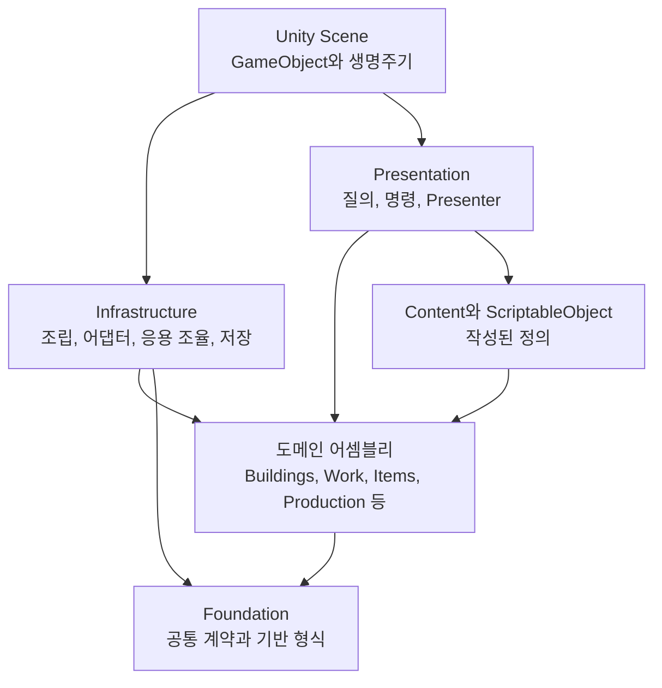

# DungeonStory 코드 아키텍처

이 문서군은 현재 코드가 어떤 변경을 견디기 위해 어떤 구조를 택했는지 설명한다. 클래스 목록보다 설계 의도를 우선하며, 각 패턴이 실제로 확보한 확장 범위와 아직 닫히지 않은 변경 지점을 구분한다.

조사 기준일은 2026-08-31이다. C# 소스와 asmdef를 정적으로 확인했으며 Unity 컴파일, 테스트와 Play Mode는 실행하지 않았다. 패턴명은 코드를 해석하기 위한 분류다. 교과서 형태와 정확히 일치하지 않는 경우에는 `유사`, `부분 적용`, `기법`으로 범위를 제한했다.

## 전체 구조

현재 구조는 다음 원칙을 따른다.

1. 상태를 변경할 권한은 담당 도메인에 둔다.
2. 작성 콘텐츠는 기존 의미 단위를 조합하고, 새로운 의미는 처리기와 계약으로 확장한다.
3. 여러 도메인이 함께 움직이는 절차는 응용 계층에서 사전 검증, 실행, 복구 순서로 조율한다.

## 문서 구성

| 문서 | 내용 |
|---|---|
| [01. 모듈 경계와 런타임 조립](01-modules-composition-and-ports.md) | asmdef 의존 방향, Composition Root, DI, Port와 Adapter |
| [02. 도메인 상태와 명령 경계](02-domain-model-state-and-commands.md) | 식별자, 상태 권위, Repository, 명령과 질의, 상태 전이 |
| [03. 콘텐츠 조립과 런타임 디스패치](03-content-capabilities-and-dispatch.md) | 건물 능력, 아이템 특성, 작업 정책의 조립 범위와 처리기 등록 |
| [04. 응용 워크플로, 사건과 프레젠테이션](04-workflows-events-and-presentation.md) | 도메인 간 조율, Event Bus, 사건 효과 실행, Presenter Registry |
| [05. 저장, 복원과 중복 실행 방지](05-persistence-transactions-and-idempotency.md) | Save Section, staged restore, outbox, 완료 영수증과 재시도 |
| [06. 확장 실무와 엄격 평가](06-extension-playbook-and-assessment.md) | 콘텐츠 유형별 변경 범위, 확장 절차와 구조적 한계 |
| [07. 사용 이력 기반 진화 아키텍처](07-history-driven-evolution-architecture.md) | 시설·장비의 이력 압축, 결정론적 후보, 진화 노드, 제한된 서술과 장기 작업 |
| [08. 전체 런타임 구조](08-whole-runtime-topology.md) | 45개 asmdef, Composition Root, 12개 등록 영역과 19개 시스템이 하나의 실행 체계로 연결되는 방식 |
| [09. 상태 권위 원장](09-state-authority-ledger.md) | 주요 상태 가족의 작성 기준, 단일 쓰기 권위, 명령, 읽기 투영, 저장과 금지된 우회 경로 |
| [10. 도메인 간 거래와 실패 경계](10-cross-domain-transactions.md) | 건설, 생산, 의료, 전투, 시설, 사건, 원정과 복원의 권위 인계 및 중간 실패 처리 |
| [11. 런타임 스케줄링과 읽기 투영](11-runtime-scheduling-and-projections.md) | 게임·UI 시계, tick, budget, cadence, dirty, revision, cache와 복원 뒤 재구축 |
| [시스템 구현과 성능 설계](systems/README.md) | AI, 그리드, 생산, 생존, 전투, 저장과 시설 성장 등 19개 런타임 시스템의 실행 흐름과 실제 비용 통제 |

01부터 07까지는 설계 기법과 확장 계약을 주제별로 설명한다. 08부터 11까지는 같은 코드를 런타임 전체의 조립, 상태 소유권, 도메인 간 거래와 갱신 정책으로 다시 연결한다. 특정 시스템의 구현 세부를 찾을 때는 19개 시스템 문서로 내려가고, 새 기능의 배치와 책임을 판단할 때는 08부터 11을 먼저 확인한다.

## 패턴 지도

| 설계 분류 | 적용 위치 | 직접 이득 | 비용 |
|---|---|---|---|
| Modular Monolith | 도메인별 asmdef와 제한된 참조 | 금지된 의존 방향이 어셈블리 경계에서 드러나고 도메인 변경 범위가 줄어든다 | 공용 계약의 위치와 참조 그래프를 관리해야 한다 |
| Composition Root와 DI | `DungeonRuntimeLifetimeScope`, VContainer 등록 모듈 | 생성 코드가 한곳에 모이고 필수 의존성 누락이 구성 단계에서 발견된다 | 전체 객체 그래프와 등록 순서가 새로운 관리 대상이 된다 |
| Ports and Adapters | 도메인 포트와 Infrastructure 어댑터 | 생산이나 작업의 내부 모델을 바꿔도 반대편 도메인의 실행 루프를 유지할 수 있다 | 경계마다 변환 코드와 검증이 필요하다 |
| Type Object와 Capability Composition | ScriptableObject, `[SerializeReference]` 능력과 특성 | 기존 의미 조합은 runtime class나 중앙 분기 추가 없이 자산으로 작성할 수 있다 | 새 의미는 handler, state와 save 계약을 별도로 구현해야 한다 |
| Strategy, Handler, Registry | 건물 능력, 작업 실행, Presenter 레지스트리 | 새 실행 정책을 등록해 기존 dispatcher와 소비자 API를 유지한다 | 중복 키, 누락 handler와 등록 완전성을 검사해야 한다 |
| Aggregate와 Repository 기법 | 생산 주문, 물리 아이템 저장소 | 상태 변경 경로가 모여 불변식, 인덱스와 revision을 함께 갱신한다 | 책임이 계속 쌓이면 클래스와 Repository가 비대해진다 |
| Observer/Event Bus | 형식화된 동기 이벤트 채널 | 발행 코드를 바꾸지 않고 완료 사실의 후속 반응을 추가할 수 있다 | 순서, 영속성, 예외 격리와 exactly-once 전달은 별도로 해결해야 한다 |
| Template Method와 Save Section Registry | JSON 저장 섹션과 복원 레지스트리 | 새 도메인 저장도 동일한 parse, validate, stage, publish 순서를 따른다 | 섹션 version, 의존성과 호환성 hook을 유지해야 한다 |
| Snapshot, Copy-on-write, Unit of Work 유사 구조 | 분리된 복원 후보와 일괄 발행 | 복원 실패 시 live world가 일부만 바뀌는 상태를 막고 실제 변경 root만 복제한다 | 후보 소유권, discard와 rollback 경로가 추가된다 |
| Transactional Outbox와 Idempotency | 물리 책임 이전 원장, commit ID와 영수증 | crash 후 재시도에서 이미 실행된 효과와 미실행 효과를 구분한다 | 원장 단계, fingerprint와 durable checkpoint 이후 GC를 관리해야 한다 |
| 사건을 입력으로 받는 역사 Aggregate | 시설과 장비의 개체별 사용 원장, 압축 이력과 진화 노드 | 같은 정의의 개체도 사용 방식에 따라 다른 계보와 후보를 가질 수 있다 | 사건 연결 누락, Aggregate 크기와 원시 이력 손실 범위를 관리해야 한다 |
| 결정론적 압축과 안정 해시 | 세대별 이력 구간과 후보 시드 | 저장과 재조회 사이에 같은 정규화 이력의 후보 입력을 재현한다 | 정렬, 해시 입력과 저장 호환성 규칙이 고정된다 |
| 제한된 서술 Adapter | 시설 제안 설명과 시설·장비 역사 노드 서술 | 선택적인 모델 출력이 기계적 후보와 효과를 바꾸지 못한다 | 요청 Snapshot, 응답 검증, 캐시와 fallback이 필요하다 |
| 저장 가능한 진화 Process Manager | 시설 개조·재조율·이전과 장비 재단조 주문 | 물질 인계와 작업을 중단 지점에서 재개하고 승인 결과를 유지한다 | 도메인별 상태 단계, 차단과 취소 규칙이 늘어난다 |

## 현재 평가

건물 능력과 작업 실행은 새 구현을 다형 핸들러로 등록할 수 있어 구조적 확장성이 높다. 건설 이후에는 시설 합성, 작성 조합식 교체와 개체 진화가 서로 다른 변경을 맡는다. 합성은 설치 시설을 실물 재료로 재편하고, 작성 교체는 방 맥락과 운영 기록을 다음 시설 정의에 계승하며, 개체 진화는 압축된 사용 이력을 모듈과 활성 조건으로 같은 시설에 남긴다. 내부 능력 조립이 제작 단계의 확장성을 제공한다면, 이 실행 경로들은 플레이어가 시간, 공간, 물질과 노동을 지불하며 시설 구성을 바꾸게 한다. 실행 세부는 [시설 합성과 사용 기반 진화](systems/19-facility-synthesis-and-use-based-evolution.md), 공용 이력 구조는 [사용 이력 기반 진화 아키텍처](07-history-driven-evolution-architecture.md)에 정리했다.

아이템은 기존 특성 조합에 강하지만, 새로운 물리 상태를 도입하면 생산 출력, 인계, 저장 계약까지 확장해야 한다. 사건은 기존 요구 조건과 효과를 조합하는 데 적합하지만, 새로운 효과 종류를 추가할 때 `V20ContentResolutionService`의 중앙 실행 경로를 수정해야 한다. 콘텐츠별 조립 범위는 이 확장 경계에 따라 달라진다.

저장과 복원은 이 프로젝트에서 가장 엄격하게 설계된 영역 중 하나다. 분리 후보, 의존 순서, 가역 참가자, outbox와 완료 영수증이 함께 사용된다. 반면 그 정합성을 유지하려면 새 상태 권위도 같은 계약을 빠짐없이 구현해야 한다.

구현 상태의 최종 판정은 [시스템 구현 권위 체크리스트](../system-implementation-checklist.md), 게임 규칙과 콘텐츠 의도는 [현행 게임 시스템 설계 핸드북](../handbook/README.md), 코드 위치 색인은 [코드와 문서의 근거 지도](../handbook/appendix-source-map.md)를 따른다.
