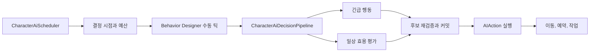

# 캐릭터 AI와 행동 실행

## 구현 개요

캐릭터 AI는 행동 트리 하나에 모든 판단을 넣은 구조가 아니다. `CharacterAiScheduler`가 실행 시점과 프레임 예산을 관리하고, Behavior Designer 트리가 고수준 실행 흐름을 진행하며, `CharacterAiDecisionPipeline`이 긴급 행동과 일상 행동을 효용 점수로 비교한다. 선택된 후보는 실행 직전에 다시 검증된다.

## 판단과 실행의 분리

스케줄러는 어떤 행동이 좋은지 알지 않는다. 각 캐릭터의 다음 결정 시각, 긴급 재평가 요청, 허용된 결정 수, 허용된 경로 탐색 수와 사용 가능한 밀리초를 관리한다. 판단 파이프라인은 생존, 업무, 시설 이용, 휴식 같은 도메인 후보를 평가한다. 실제 행동은 `AIAction`, 이동 능력, 작업 실행기 같은 실행 계층이 맡는다.

이 분리 덕분에 판단 규칙을 추가해도 전체 캐릭터를 매 프레임 갱신하는 방식으로 돌아가지 않는다. 반대로 이동이나 작업의 완료 규칙을 바꿀 때 효용 계산식을 함께 수정할 필요도 줄어든다.

## 상태와 책임

| 상태 | 소유자 | 용도 |
|---|---|---|
| 등록된 캐릭터와 다음 결정 시각 | `CharacterAiScheduler` | 실행 순서와 공정성 |
| 현재 후보, 실행 행동, 예약 | `AIBrain`과 `AIAction` | 한 캐릭터의 행동 수명주기 |
| 의도와 현재 약속 | `CharacterBlackboard` | 행동 전환과 디버그 설명 |
| 최근 실패와 시설 냉각 | `CharacterAiFailureMemory` | 같은 실패의 즉시 반복 억제 |
| 경로 요청 결과 | `AIBrainPathSearchSession` | 같은 시작점과 지형 버전에서 재사용 |
| 성능 표본과 런타임 추적 | 성능 기록기와 고정 추적 버퍼 | 병목과 불변식 위반 관찰 |

행동 트리는 외부 행동 자산을 캐릭터의 런타임 컴포넌트에 연결한다. 스케줄러가 트리를 수동으로 틱하기 때문에 Unity의 각 캐릭터 `Update`가 독립적으로 폭주하지 않는다.

## 적용된 최적화

| 구현 | 줄이는 비용 | 남는 제약 |
|---|---|---|
| 결정 수와 밀리초의 이중 예산 | 후보가 많은 프레임의 AI 집중 비용 | 예산이 작으면 결정 지연이 늘어난다 |
| 공유 프레임 작업 예산 | AI가 다른 무거운 시스템과 같은 여유 시간을 경쟁하도록 조정 | 실제 배분 품질은 런타임 측정이 필요하다 |
| 화면 밖 캐릭터의 느린 결정 주기와 이동 stride | 보이지 않는 캐릭터의 갱신 빈도 | 화면 밖에서도 즉시 반응해야 하는 사건은 긴급 요청이 필요하다 |
| 등록 시점 분산과 결정 간격 jitter | 같은 프레임에 결정이 몰리는 현상 | 결정 순서가 완전히 균일하지는 않다 |
| 최대 지연과 공정성 floor | 낮은 우선순위 캐릭터의 영구 기아 | 한도 초과 시 일시적 예산 overdraft가 생길 수 있다 |
| 재사용 버퍼와 고정 길이 런타임 trace | 반복 리스트 생성과 무제한 로그 증가 | 상세 스냅샷 생성은 별도 할당을 일으킨다 |
| 경로 탐색 세션 캐시 | 같은 시작점과 동일 지형에서 중복 탐색 | 캐릭터 이동이나 지형 버전 변경 시 무효화된다 |
| 단계별 `ProfilerMarker`와 rolling sample ring | 병목 위치를 분리해 측정 | 측정 장치 자체가 성능 통과를 뜻하지 않는다 |

## 선택 안정성과 실패 처리

후보는 평가 당시 가능했더라도 커밋 직전에 목적지가 점유되거나 재료가 예약될 수 있다. `AIBrainCandidateCommitter`는 캐시된 평가를 사용할 수 있지만, 최종 커밋 전에 행동 정의의 재검증을 거친다. 실패 원인과 대상은 짧은 냉각 상태로 남아 즉시 같은 후보를 고르는 루프를 줄인다.

경로 예산이 부족하면 실패로 확정하지 않고 `Deferred` 상태를 보존한다. 선호 업무가 있는 캐릭터는 그 후보의 소유권을 다음 bounded slice까지 유지한다. 이는 비싼 검색을 한 프레임에 끝내기보다 여러 프레임에 나누기 위한 설계다.

## 적용 사례

응급 수술 작업을 추가한다고 가정한다. 응급 job giver는 환자 위험과 수술실 가능 여부를 평가하고 높은 효용을 낸다. 스케줄러는 해당 작업자를 긴급 큐에 넣고, 파이프라인은 일상 업무보다 먼저 응급 후보를 검사한다. 수술실 예약과 이동 경로는 커밋 전에 다시 확인한다. 새 행동이 전체 AI 갱신 방식을 바꾸지 않으면서도, 응급 규칙은 일반 업무 선택보다 높은 우선순위로 들어간다.

## 비용과 한계

`CharacterAiDecisionPipeline`, `AIBrain`, `WorkTargetSelector`에는 많은 도메인 규칙이 모여 있다. 새 행동 종류가 기존 job giver와 action 계약으로 표현되지 않으면 이 집중도가 더 커질 수 있다. 또한 정적 검토로는 100명, 500명 같은 인구 규모에서 목표 프레임을 유지하는지 알 수 없다. 성능 보고기의 p95, 할당량, 최대 결정 지연을 실제 시나리오에서 확인해야 한다.

## 구현 위치

- `Assets/Scripts/Services/Character/AI/CharacterAiScheduler.cs`
- `Assets/Scripts/Services/Character/AI/CharacterAiDecisionPipeline.cs`
- `Assets/Scripts/Services/Character/AI/AIActionRuntime.cs`
- `Assets/Scripts/Services/Character/AI/AIBrain.cs`
- `Assets/Scripts/Services/Character/AI/AIBrainCandidateCommitter.cs`
- `Assets/Scripts/Services/Character/AI/CharacterAiFailureMemory.cs`
- `Assets/Scripts/Models/AI/Core/AIBrainPathSearchSession.cs`
- `Assets/Scripts/Services/Character/AI/CharacterAiPerformanceRecorder.cs`
