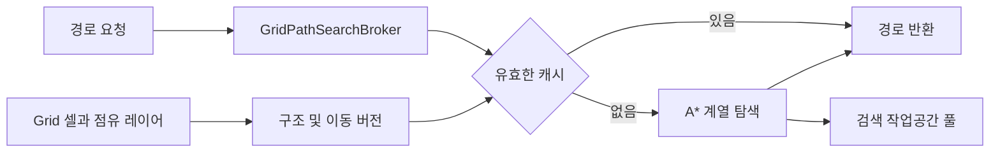

# 그리드, 공간 질의와 경로 탐색

## 구현 개요

`Grid`는 셀 배열, 셀별 점유 레이어, 이동 연결과 지형 정보를 가진 공간 권위다. 건물, 공사 현장, 통로, 유틸리티와 이동 가능한 연결은 서로 다른 레이어에 등록된다. 경로 탐색은 가중 이동 비용과 남은 비용 추정치를 사용하는 A* 계열 탐색이며, `GridPathSearchBroker`가 캐시, 우선순위, 프레임 예산과 점진 탐색을 덧붙인다.

## 공간 표현

셀은 2차원 배열에 들어 있고 검색에서는 `y * width + x` 형태의 선형 인덱스를 사용한다. 따라서 부모, 이동 비용, 방문 순서 같은 탐색 상태를 연속 배열에 저장할 수 있다. 한 셀은 건물, 공사, 통로, 유틸리티 등 여러 점유 레이어를 가지며, 여러 칸을 차지하는 객체는 등록 참조 수로 추적한다.

그리드는 일반 변경 버전, 구조 버전과 이동 버전을 구분한다. 면적이나 구조물이 바뀌면 관련 버전이 증가한다. 경로 캐시와 출구 캐시는 자신이 계산된 이동 버전과 현재 버전을 비교한다. 호출자가 모든 캐시를 찾아 직접 비우지 않아도 오래된 결과를 거부할 수 있다.

## 경로 탐색

정확한 목적지가 있는 탐색은 현재 누적 비용에 휴리스틱을 더해 이진 힙 우선순위 큐에서 다음 셀을 고른다. 같은 우선순위와 비용이면 삽입 순서로 순서를 고정한다. 수평 이동뿐 아니라 계단, 문과 다른 이동 점유자가 제공하는 연결도 `GridTraversalStepData`로 동일하게 처리한다.

목적지가 없는 도달 가능 영역 탐색은 부모와 비용 맵을 보존해 방문 가능한 시설이나 점유자를 뒤에서 조회할 수 있게 한다. 정확한 한 목적지 탐색과 광범위한 접근성 질의가 같은 결과 형태를 강제로 쓰지 않는 이유다.

## 적용된 최적화

| 구현 | 실제 효과 | 한계 |
|---|---|---|
| 밀집 배열과 선형 셀 인덱스 | 검색 상태의 연속 접근과 직접 인덱싱 | 그리드 확장은 전체 레이아웃 복사가 필요하다 |
| 이진 힙 우선순위 큐 | 최소 후보 선택을 선형 탐색하지 않는다 | 열린 집합이 큰 검색 자체는 여전히 비싸다 |
| 휴리스틱 인덱스 | 층과 이동 연결을 반영해 불필요한 확장을 줄인다 | 휴리스틱 품질은 실제 맵에서 측정해야 한다 |
| 검색 workspace와 컬렉션 풀 | 배열, 큐, 리스트, 집합의 반복 생성 감소 | 반환 규약을 어기면 보존 메모리가 늘거나 데이터가 섞인다 |
| generation stamp와 touched index | 큰 배열 전체 초기화를 매 검색마다 하지 않는다 | 세대 값 관리가 복잡해진다 |
| broker 캐시와 in-flight 공유 | 동일 요청의 중복 계산 감소 | 키 구성과 버전 검사가 정확해야 한다 |
| 점진 탐색과 시간 예산 | 긴 검색을 여러 프레임에 나눈다 | 결과가 즉시 필요하면 지연을 감수한다 |
| 오래된 캐시의 주기적 pruning과 상한 | 캐시의 무제한 증가 방지 | pruning 시점에는 순회 비용이 발생한다 |

## 변경과 무효화

건물이나 문이 바뀌면 구조 및 이동 버전이 증가한다. 현재 진행 중인 점진 탐색은 시작 당시 버전과 다르면 더 이상 유효하지 않다. 캐시된 결과도 같은 검사를 거친다. 이 방식은 정확성을 지키지만, 문이 자주 열리고 닫히는 구조에서 모든 변화가 이동 버전을 올린다면 캐시 적중률이 낮아질 수 있다. 실제 무효화 빈도는 프로파일러의 검색 수와 캐시 적중률로 확인해야 한다.

## 적용 사례

엘리베이터를 새 이동 연결로 추가한다고 가정한다. 엘리베이터 객체가 셀 간 연결과 이동 비용을 제공하면 탐색기는 일반 보행과 같은 후보 집합에서 평가한다. 별도 엘리베이터 전용 길찾기를 만들 필요가 없다. 엘리베이터 정지나 파손이 이동 가능성을 바꾸면 이동 버전을 갱신해야 기존 경로가 재사용되지 않는다.

## 비용과 한계

가장 가까운 보행 가능 셀 찾기, 그리드 확장, 전체 도달 가능 점유자 수집은 넓은 범위를 순회할 수 있다. 확장과 복원 경로에는 LINQ와 새 컬렉션도 존재한다. 평상시 단일 목적지 탐색의 풀링 효과를 전체 그리드 API의 무할당 보장으로 확대해서 해석하면 안 된다.

## 구현 위치

- `Assets/Scripts/Models/Grid/Core/Grid.cs`
- `Assets/Scripts/Models/Grid/Core/GridPathSearchBroker.cs`
- `Assets/Scripts/Models/Grid/Core/GridSearchWorkspaces.cs`
- `Assets/Scripts/Models/Grid/Core/GridTraversalHeuristicIndex.cs`
- `Assets/Scripts/Models/Grid/Core/GridNavigationCost.cs`
- `Assets/Scripts/Controllers/Grid/System/GridSystemManager.cs`

