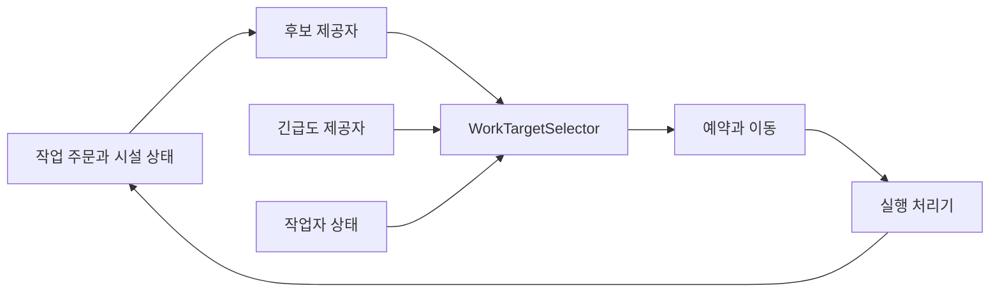

# 작업 주문, 노동 배정과 실행

## 구현 개요

작업 시스템은 주문 상태, 후보 발견, 긴급도, 작업자 선택과 실제 실행을 분리한다. `WorkExecutionHandlerRegistry`는 `WorkTypeId`별 실행 처리기, 후보 제공자와 긴급도 제공자를 각각 인덱싱한다. AI는 이 레지스트리를 통해 가능한 작업을 받고, `WorkTargetSelector`가 우선순위와 거리, 적성, 시설 상태, 예약 가능성 등을 수치로 비교한다.

## 주문과 실행 권위

작업 주문 aggregate는 주문 ID, 종류, 상태, 요구 작업량, 재료, 전달량과 예약 작업자를 가진다. 건설, 제작, 연구처럼 장기 작업은 주문 상태가 진행을 보존한다. `WorkTaskExecutor`는 선택된 대상까지 이동하고 예약을 유지하며 처리기를 호출한다. 처리기는 도메인별 완료 규칙을 실행한다.

작업 종류가 새로 생길 때 AI 루프에 거대한 분기를 추가하지 않는다. 해당 `WorkTypeId`의 후보와 긴급도, 실행 처리를 등록한다. 다만 새 작업이 새로운 저장 불변식이나 물리 재료 흐름을 요구하면 주문 aggregate와 저장 검증도 함께 확장해야 한다.

## 후보 평가

후보는 우선순위, 도메인 긴급도, 작업자 능력, 거리 추정, 방과 환경, 시설 상태, 대기열, 최근 실패와 역할 적합도를 조합한다. 전체 후보마다 설명 문자열을 조립하지 않고 수치 비교를 먼저 수행한다. 최종 선택된 후보에 대해서만 상세 효용 분해를 블랙보드에 기록한다.

## 적용된 최적화

| 구현 | 실제 효과 | 한계 |
|---|---|---|
| 종류별 처리기 인덱스 | 실행 시 처리기 선형 탐색 제거 | 등록 누락은 시작 시 실패해야 한다 |
| 시설 후보 캐시 | 모든 건물을 매 판단마다 스캔하지 않는다 | 동적 상태 무효화가 빠지면 오래된 후보가 남는다 |
| 프레임 단위 결정 문맥 캐시 | 같은 캐릭터의 반복 상태 캡처 감소 | 프레임을 넘겨 재사용하지 않는다 |
| 작업 종류별 점수 캐시 | 한 결정 안의 중복 능력 계산 감소 | 작업자나 규칙 변경 시 키가 충분해야 한다 |
| 여러 버전을 결합한 후보 캐시 | 그리드, 건물, 시설, 주문이 그대로면 목록 재사용 | 버전 하나만 자주 바뀌어도 적중률이 낮아진다 |
| 선택 후보만 설명 포맷 | 대량 문자열과 디버그 객체 생성 감소 | 비선택 후보의 상세 원인은 기본적으로 남지 않는다 |
| 단계별 프로파일러 표식 | 후보 비용을 구성 요소별로 측정 | 표식은 최적화 결과가 아니다 |

## 예약과 실패 복구

시설과 재료 예약은 선택과 실행 사이의 경쟁을 제어한다. 이동 실패, 대상 파괴, 재료 소진이나 작업 중단이 생기면 실행기는 예약과 운반 lease를 해제한다. branch가 많아 cleanup 경로가 복잡하므로, 새 작업 처리기는 완료뿐 아니라 취소, 재계획, 복원 후 재개를 함께 정의해야 한다.

## 적용 사례

오염된 방을 소독하는 작업을 추가한다고 가정한다. 후보 제공자는 오염 시설이나 방을 내놓고, 긴급도 제공자는 감염 위험과 사용 인원을 반영한다. 실행 처리기는 소독제 예약, 이동, 작업량 소비와 오염 감소를 맡는다. 기존 작업 선택기는 거리와 작업자 적성까지 함께 비교한다. 새 업무가 AI의 다른 행동 선택 규칙을 복사하지 않는다.

## 비용과 한계

`WorkTargetSelector`와 `WorkTaskExecutor`는 현재 규모가 크다. 특히 실행기는 생산, 연구, 보충, 구조 작업 등 다양한 수명주기를 알고 있다. 처리기 레지스트리가 있어도 공통 이동과 예약 뒤의 branch가 계속 늘어나면 변경 충돌이 커진다. 실제 후보 수와 선택 p95를 성능 기록으로 확인하고, 병목이 확인되면 후보 생성과 실행 오케스트레이션을 더 작은 workflow로 나누는 편이 맞다.

## 구현 위치

- `Assets/Scripts/Services/Character/Work/WorkExecutionRegistry.cs`
- `Assets/Scripts/Services/Character/Work/WorkTargetSelector.cs`
- `Assets/Scripts/Services/Character/Work/WorkTaskExecutor.cs`
- `Assets/Scripts/Services/Character/Work/WorkOrderAggregateState.cs`
- `Assets/Scripts/Services/Character/Work/WorkOrderMaterialOutbox.cs`
- `Assets/Scripts/Models/Work/WorkTypeId.cs`
- `Assets/Scripts/Models/Work/WorkTargetCandidate.cs`

