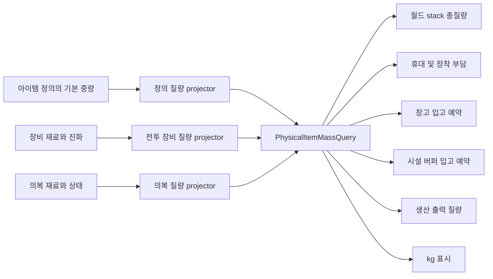

# 아이템, 재고, 예약과 운반

## 구현 개요

월드 아이템의 수량과 위치, 개별 인스턴스 상태, 장비와 모듈은 `WorldItemRepository`가 소유한다. 건물, 생산, 전투와 의료는 자체 재고 사본을 만들지 않고 이 권위에 명령하거나 스냅샷을 조회한다. 운반은 출발 스택을 예약하고 목적지 의도를 기록한 뒤 실제 이동과 인계를 수행한다.

## 상태 구성

저장되는 스택 기록에는 스택 ID, 아이템 ID, 수량, 위치, 목적지, 현재 책임과 인스턴스 컴포넌트가 들어간다. 종류 정의에서 오는 기본 질량은 스택마다 독립된 가변 권위로 복제하지 않는다. 복원한 정의와 인스턴스 컴포넌트에서 다시 계산한다. 다만 예약과 인계처럼 재시도 중에도 같은 물리량을 보장해야 하는 거래 기록은 준비 시점의 exact gram과 질량 권위 revision을 동결할 수 있다.

장비 인스턴스와 모듈도 같은 아이템 aggregate의 별도 인덱스로 유지된다. 위치 버킷은 특정 셀의 스택을 찾을 때 전체 스택을 순회하지 않게 한다.

아이템 버전과 운반 작업 버전은 후보 캐시가 오래된 결과를 감지하는 데 사용된다. 운반 가능한 스택 목록은 dirty 플래그가 켜질 때만 다시 만든다.

## 물리 질량 권위

질량은 Items 안의 공통 값 객체와 질의 경계로 정규화한다. 작성 자산의 단위 중량, 전투 장비의 재료와 진화 상태, 의복의 직물과 장착 상태가 각자 최종 kg를 저장하지 않는다. 정의 projector와 인스턴스 projector가 gram 기여분을 만들고 `PhysicalItemMassQuery`가 하나의 단위 질량으로 합성한다.

| 사실 | 쓰기 권위 | 소비자 | 중복 저장이 금지되는 이유 |
|---|---|---|---|
| 종류별 기본 질량 | 아이템 정의와 카탈로그 | 공통 정의 projector | 화면이나 스택마다 복사하면 자산 수정 뒤 값이 갈라진다 |
| 개별 물건의 질량 기여 | 장비와 의복 인스턴스 컴포넌트 | 등록된 인스턴스 projector | 전투용 무게와 물류용 무게가 다른 규칙으로 계산되는 것을 막는다 |
| 수량을 포함한 총질량 | `PhysicalItemMassQuery`의 계산 결과 | 운반, 창고, 시설 버퍼, 생산과 표시 | count와 kg를 섞지 않고 동일 반올림 규칙을 사용한다 |
| 목적지의 허용 질량 | 창고 또는 시설 버퍼 capacity authority | admission service와 계획기 | Items가 목적지 수치를 임의로 소유하지 않는다 |
| 예약된 입고 질량 | 창고 또는 시설 버퍼 admission ledger | 인계 commit과 저장 검증 | 여러 운반자가 같은 빈 공간을 중복 약속하지 못하게 한다 |

내부 단위는 정수 gram이다. kg는 화면과 작성 편의를 위한 표현이다. 수량을 곱하거나 여러 구성요소를 더할 때 부동소수점 오차가 누적되지 않고, fingerprint와 저장 검증이 같은 값을 재현할 수 있다는 이점이 있다.

질량 권위에는 revision이 있다. 정의 카탈로그나 질량에 기여하는 인스턴스 구성이 바뀌면 준비된 질의와 목적지 예약은 오래된 것으로 판정할 수 있다. 반대로 품질 표시처럼 질량에 영향을 주지 않는 변경이 매번 질량 캐시를 무효화해서는 안 된다. 현재 구조는 공통 질의와 admission token에 revision을 결속하지만, 모든 동적 컴포넌트와 콘텐츠 자산의 전수 연결 완료 여부는 중앙 구현 체크리스트가 판정한다.

## 예약과 원자적 변경

수량 예약은 lease ID와 목적을 가진다. 작업자나 생산 주문이 중단되면 해제 이유를 남기고 반환한다. 배치 추가, 제거, 컴포넌트 교체, 출력 승인과 경로 변경은 전체 입력을 먼저 검증한다. 중간 실패 시 이전 상태를 되돌릴 수 있는 기록을 보유한다.

이는 속도 최적화라기보다 상태 비용 통제다. 한 배치의 절반만 옮겨진 상태가 외부에 노출되면 생산과 저장 복원이 훨씬 복잡해지기 때문이다.

## 적용된 최적화

| 구현 | 실제 효과 | 한계 |
|---|---|---|
| 스택 ID 사전 | 단일 스택 직접 조회 | 스냅샷 복사는 별도 비용이다 |
| 위치별 스택 버킷 | 셀 단위 수거와 드롭 질의 | 이동 시 두 위치 인덱스를 정확히 갱신해야 한다 |
| 장비와 모듈 인덱스 | 인스턴스 ID 직접 조회 | 아이템 기록과 교차 무결성 검사가 필요하다 |
| haulable dirty cache | 운반 후보의 반복 전체 필터링 감소 | 아이템 변화가 잦으면 자주 재구축된다 |
| 아이템 및 운반 버전 | 후보 목록의 저렴한 무효화 | 버전만으로 변화 내용을 알 수는 없다 |
| 배치 사전 검증과 rollback | 부분 적용과 복구 재작업 방지 | 임시 배열과 rollback 객체를 만든다 |
| pending ledger와 receipt | 저장 경계의 중복 소비와 유실 방지 | 상태와 검증 코드가 많아진다 |
| canonical gram 값 객체 | 곱셈, 합산과 fingerprint의 결정론 유지 | 표시 단계에서 kg 변환이 필요하다 |
| 질량 query와 projector registry | 월드, 장비, 운반과 UI의 계산식 공유 | 신규 질량 컴포넌트는 projector 등록과 감사 대상이 된다 |
| 목적지별 mass admission ledger | 동시 입고의 용량 초과 방지 | 예약, commit, 취소와 복원 상태가 늘어난다 |

## 운반 계획

`WorldItemHaulPlanningService`는 예약되지 않은 적합한 스택, 목적지 정책, 용량과 경로 가능성을 결합한다. AI 작업자는 계획 결과를 받아 출발지로 이동하고 휴대 인벤토리에 옮긴 뒤 목적지에서 인계한다. 생산 출력처럼 아직 승인되지 않은 물품은 일반 운반 후보에 섞이지 않는다.

휴대 인벤토리는 정상 속도 한도와 최대 허용 한도를 분리한다. 계획기는 현재 화물과 장착 의복의 질량을 공통 query로 합산하고 남은 여유에 맞춰 stack 일부만 선택할 수 있다. `MaxStack`은 저장 레코드의 병합 한도일 뿐 한 actor의 운반 보장이 아니다.

창고로 향하는 계획은 물건 reservation과 별도로 gram 입고 token을 확보한다. token은 목적지 capacity revision, 카탈로그 revision과 원본 stack revision을 기억한다. commit 시 어느 하나라도 달라졌다면 현재 상태에서 다시 판정한다. 일부 수량만 승인된 경우 실제 custody와 승인 gram이 일치해야 하며, 초과분을 바닥에 떨어뜨려 성공으로 바꾸지 않는다.

시설 입력 및 출력 버퍼도 별도 mass admission 경계를 갖는다. 창고 수치를 암묵적으로 빌려 쓰지 않고 시설이 작성한 capacity profile과 현재 예약량으로 판정한다. 생산 묶음 수, 컨베이어 payload 수와 물리 kg는 각각 다른 제한이므로 합산하지 않는다.

환자, 포로와 살아 있는 동물은 이 stack 운반 경로의 대상이 아니다. 해당 도메인의 transport order가 신원과 신체 상태를 소유하고 Items는 들것, 약품, 장비와 사료 같은 물건만 관리한다.

## 적용 사례

부패 온도가 있는 식재료를 추가한다고 가정한다. 정의 자산에 기본 질량과 기능을 붙이고 인스턴스 컴포넌트에 현재 상태를 저장한다. 신선도는 질량을 바꾸지 않는다면 projector를 추가하지 않는다. 운반 정책은 냉장 목적지를 우선할 수 있지만, 스택 수량과 위치는 계속 월드 아이템 권위에 남는다. 냉장고가 가득 차면 kg 입고 예약은 실패하고 다른 목적지 후보를 찾는다. 식재료 전용 인벤토리나 별도 중량 시스템을 만들 필요가 없다.

모듈이 장착된 방패라면 기본 방패와 재료, 장착 모듈의 질량 기여를 공통 query가 합친다. 바닥 정보창, 주민의 장착 부담, 해체를 위해 운반할 때의 화물량이 모두 같은 결과를 읽는다. 전투 능력치 projector는 같은 인스턴스에서 방어 성능을 계산하지만 질량의 두 번째 권위가 되지 않는다.

## 비용과 한계

일부 소비자는 아직 `GetAllStacks()` 결과를 LINQ로 훑는다. 이 경로가 틱마다 호출되면 중앙 저장소의 인덱스 이점이 사라질 수 있다. 실제 프로파일링에서 전체 스냅샷 생성이 상위 비용으로 나타나면 목적, 아이템 종류, 목적지별 읽기 인덱스를 추가하는 것이 다음 후보다. 현재 구현에서 해당 인덱스는 확인되지 않았다.

## 구현 위치

- `Assets/Scripts/Services/Items/WorldItemRepository.cs`
- `Assets/Scripts/Services/Items/WorldItemStackRuntime.cs`
- `Assets/Scripts/Services/Items/ItemTransferService.cs`
- `Assets/Scripts/Services/Items/WorldItemHaulPlanningService.cs`
- `Assets/Scripts/Models/Items/Core/PhysicalMassContracts.cs`
- `Assets/Scripts/Services/Items/PhysicalItemMassQuery.cs`
- `Assets/Scripts/Services/Items/CombatEquipmentPhysicalMassProjector.cs`
- `Assets/Scripts/Services/Items/ApparelPhysicalMassProjector.cs`
- `Assets/Scripts/Services/Items/EquippedApparelPhysicalMassQuery.cs`
- `Assets/Scripts/Services/Items/CharacterCarryInventory.cs`
- `Assets/Scripts/Services/Items/WarehouseMassAdmissionService.cs`
- `Assets/Scripts/Services/Items/FacilityBufferMassAdmissionService.cs`
- `Assets/Scripts/Services/Buildings/WarehouseMassUiFormatter.cs`
- `Assets/Scripts/Services/Items/ItemPileInfoPanel.cs`
- `Assets/Scripts/Views/Character/Presentation/CharacterCarryPresentation.cs`
- `Assets/Scripts/Services/Items/PhysicalItemsSaveSection.cs`
- `Assets/Scripts/Services/Items/HaulDeliveryIntentRuntime.cs`
- `Assets/Scripts/Services/Items/ProductionPhysicalCustodyDrainOutbox.cs`
- `Assets/Scripts/Models/Items/Core/ItemPrimitives.cs`
