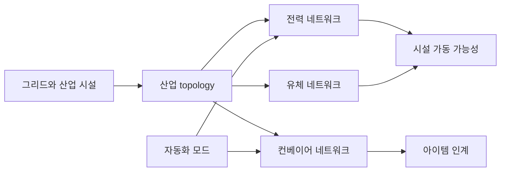
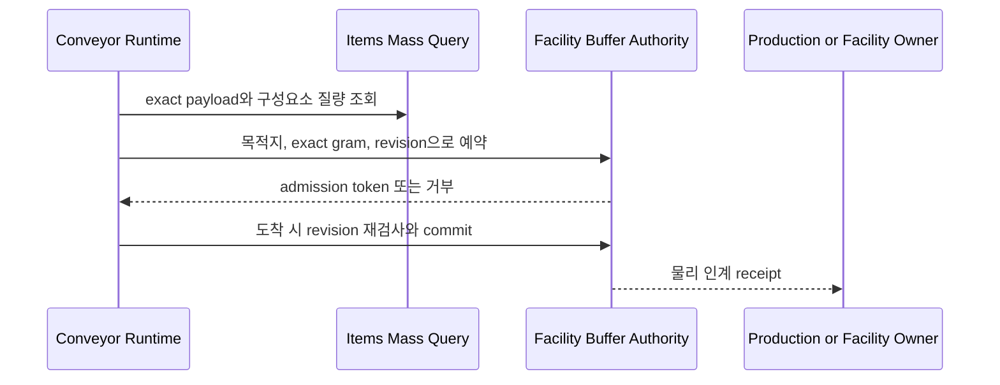

# 전력, 유체, 컨베이어와 자동화

## 구현 개요

산업 시스템은 공통 건물 배치에서 연결 정보를 읽되, 전력, 유체와 컨베이어가 각자의 상태와 계산 규칙을 가진다. topology runtime이 연결 그래프의 스냅샷을 만들고, 각 네트워크 runtime이 수요, 공급, 저장량과 운송 payload를 처리한다. 자동화는 시설의 실행 모드와 전력 요구, 유지보수 상태를 별도 aggregate로 관리한다.

## 네트워크 상태

전력은 노드별 생산, 수요, 저장과 공급 결과를 계산한다. 유체는 수질별 양, 폐수와 수동 운반 상태를 가진다. 컨베이어는 노드, payload, 현재 route와 route index를 저장한다. 모두 라이브 GameObject 자체를 저장 권위로 사용하지 않고 aggregate 상태와 스냅샷을 통해 조회한다.

유체의 배치 수요 처리는 우선순위와 입력 순서로 결정론적 정렬을 한 뒤, 임시 공급량과 폐수량에 먼저 적용한다. 모든 수요가 유효할 때 실제 상태를 발행한다.

## topology와 경로 갱신

건물 연결이 바뀌면 topology가 dirty 상태가 된다. 컨베이어는 topology source version을 비교해 네트워크 스냅샷, overflow threshold와 route version을 갱신한다. 기존 payload가 오래된 route version을 들고 있거나 다음 노드가 사라졌으면 경로를 다시 계산한다.

## 물리 payload와 시설 버퍼

컨베이어의 payload ID, route index와 노드별 개수는 이동 스케줄을 관리한다. 실제 아이템이 생산 시설의 입력 또는 출력 버퍼로 넘어갈 때는 Items의 공통 질량 query와 `FacilityBufferMassAdmissionService`가 별도의 gram 입고를 준비하고 확정한다.

시설 버퍼의 용량은 해당 시설 profile이 소유한다. 창고 용량, 컨베이어 위의 최대 payload 수나 생산 묶음 슬롯을 빌려 계산하지 않는다. 예약된 inbound 질량은 실제 적재량과 함께 사용량에 포함한다. topology, 시설 capacity 또는 질량 권위 revision이 바뀌면 오래된 token으로 억지 입고하지 않고 경로를 다시 계획한다.

이 분리는 자동화가 저장 제약을 우회하는 것을 막는다. 수동 운반과 컨베이어가 같은 목적지에 접근해도 하나의 빈 공간을 두 번 약속할 수 없고, 무거운 물건을 기계 내부에 무제한 쌓아 중앙 창고를 대신하는 경로도 차단할 수 있다. 대신 자동화 설계에는 버퍼 크기, 최대 체류시간, overflow 경로와 정지 복구라는 운영 문제가 남는다.

## 적용된 최적화

| 구현 | 실제 효과 | 한계 |
|---|---|---|
| topology dirty flag와 source version | 연결이 그대로일 때 그래프 재구축 생략 | 건설이 잦으면 갱신이 빈번하다 |
| 네트워크 projection 캐시 | UI와 소비자가 같은 스냅샷을 재사용 | 상태 version이 자주 바뀌면 재생성된다 |
| 컨베이어 payload ID 버퍼 | 매 틱 dictionary 열거 중 변경과 반복 할당 감소 | 정렬 자체의 비용은 남는다 |
| route version | 모든 payload 경로를 매 틱 재계산하지 않는다 | topology 변경 후 재경로가 한꺼번에 몰릴 수 있다 |
| 노드별 payload count 사전 | 혼잡도와 overflow 판단의 반복 집계 감소 | 상태 변화마다 동기화가 필요하다 |
| 유체 배치 시뮬레이션 | 부분 공급 후 rollback하는 비용 방지 | 임시 사전과 리스트를 만든다 |
| 고정 주기와 profiler marker | 매 프레임보다 낮은 빈도로 처리하고 측정 가능 | 주기 사이의 반응 지연이 있다 |

## 자동화와 유지보수

자동화 모드는 수동, 보조, 자동 같은 실행 정책을 표현하고 전력 수요 및 예약 존재 여부와 연결된다. 모드 전환 중 시설이나 주문 예약이 살아 있으면 전환 규칙이 이를 검사한다. 고장과 유지보수 상태가 바뀌면 작업 후보 캐시를 무효화해 수리 업무가 AI에 나타난다.

## 적용 사례

광산에서 분쇄기까지 컨베이어를 연결한다고 가정한다. 새 벨트가 배치되면 topology version이 바뀌고 입력, 출력 노드의 연결이 다시 계산된다. 기존 광석 payload는 route version 불일치를 보고 새 경로를 받는다. 분쇄기 입력 버퍼에 남은 kg가 부족하면 컨베이어 경로가 존재해도 인계는 대기하며, 다른 저장소나 우회 경로를 찾을 수 있다. 분쇄기의 자동화 모드가 전력을 요구하면 전력 네트워크의 공급 결과가 가동 가능성을 결정한다. 연결, 전력과 물리 수용량이 각각 충족되어야 실제 처리량이 나온다.

## 비용과 한계

세 네트워크는 연결 그래프를 공유하지만 계산 모델이 달라 중복된 projection과 저장 코드가 존재한다. 컨베이어 payload가 매우 많을 때 매 틱 정렬과 경로 확인이 병목이 될 수 있고, 유체 처리에는 LINQ와 임시 컬렉션이 남아 있다. 실제 payload 수와 topology 변경 빈도를 기준으로 측정한 뒤에만 분할 갱신이나 작업 큐를 추가해야 한다.

## 구현 위치

- `Assets/Scripts/Services/Infrastructure/Industrial/IndustrialInfrastructureTopology.cs`
- `Assets/Scripts/Services/Infrastructure/Industrial/ElectricalNetworkRuntime.cs`
- `Assets/Scripts/Services/Infrastructure/Industrial/FluidNetworkRuntime.cs`
- `Assets/Scripts/Services/Infrastructure/Industrial/ConveyorRuntime.cs`
- `Assets/Scripts/Services/Items/FacilityBufferMassAdmissionService.cs`
- `Assets/Scripts/Services/Economy/ProductionOutputBufferCapacityProjector.cs`
- `Assets/Scripts/Models/Automation/Core/AutomationCoreModels.cs`
