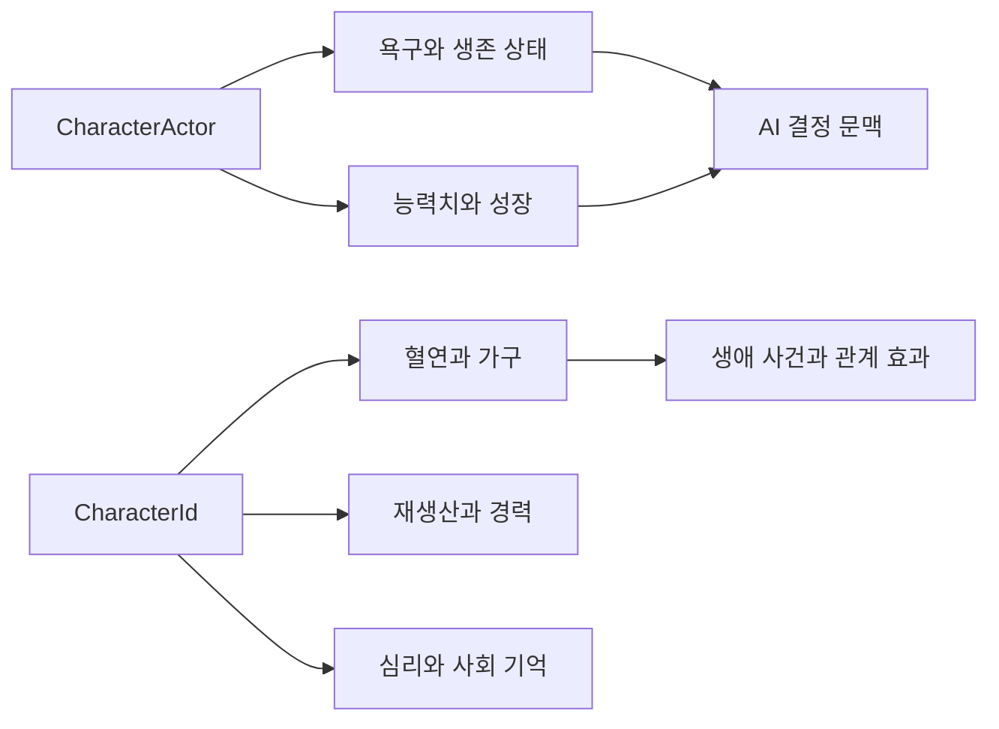

# 캐릭터 생애, 욕구와 사회 상태

## 구현 개요

캐릭터는 하나의 거대한 MonoBehaviour에 모든 생애 상태를 넣지 않는다. 현장 배우는 위치와 행동 실행을 담당하고, 능력치와 욕구, 정체성, 혈연, 가구, 재생산, 경력, 슬픔과 사회 기억은 별도 서비스와 aggregate가 소유한다. 각 시스템은 `CharacterId`를 기준으로 연결된다.

## 상태 권위

배고픔, 갈증과 휴식 같은 짧은 주기 상태는 생존 및 욕구 런타임에서 갱신된다. 종족, 특성, 기술과 성장 결과는 캐릭터 프로필과 진행 서비스가 계산한다. 혈연과 가구는 참조 그래프 aggregate이며, 재생산과 경력은 자신의 과정 상태를 가진다. 사망과 상실은 심리 aggregate에 영향을 준다.

AI는 이 상태들의 스냅샷을 읽어 행동을 결정하지만 직접 수정하지 않는다. 식사 행동은 소비 서비스에 명령하고, 경력 변경은 경력 runtime에 명령한다.

## 갱신 방식

지속 욕구는 게임 시계와 공간 상태에 반응한다. 일부 정체성 욕구는 방 부재나 특정 생활 조건의 지속 시간을 기록한다. 캐릭터 환경 노출처럼 시간 누적이 필요한 시스템은 accumulator를 사용해 고정 간격으로 진행한다. 일시정지와 복원 중에는 각 권위의 시계 및 후보 상태가 통제된다.

## 적용된 최적화와 비용 통제

| 구현 | 실제 효과 | 한계 |
|---|---|---|
| `CharacterId` 기반 aggregate 인덱스 | 장기 상태를 씬 오브젝트 탐색 없이 조회 | 씬 배우와 ID 재연결이 필요하다 |
| 고정 간격 및 시간 이벤트 갱신 | 모든 생애 규칙의 매 프레임 계산 방지 | 즉시 반응이 필요한 상태는 별도 사건이 필요하다 |
| aggregate copy-on-write | 복원 시 변경되는 권위만 복제 | clone 계약을 각 aggregate가 지켜야 한다 |
| 계산 스냅샷 | AI와 UI가 내부 가변 컬렉션을 직접 보지 않는다 | 스냅샷 생성 비용이 있다 |
| 도메인별 분리 저장 | 한 시스템의 복원 검증이 다른 상태를 훼손하지 않는다 | 교차 ID 검증과 저장 순서가 필요하다 |

## 적용 사례

장기적인 고독 욕구를 추가한다고 가정한다. 욕구 정의는 증가 조건과 완화 조건을 제공하고, 지속 시계는 유효한 사회 공간이나 가구 구성원 접촉이 없는 시간을 누적한다. AI는 값이 높을 때 대화나 공동 활동 후보의 효용을 높인다. 관계 그래프 자체를 AI 행동이 직접 수정하지 않고, 실제 상호작용 완료가 사회 runtime에 결과를 전달한다.

## 비용과 한계

상태 권위가 잘게 나뉜 만큼 교차 생애 사건은 여러 서비스를 조정한다. 출생, 입양, 사망이나 이주처럼 혈연, 가구, 경력, AI 배우와 저장 상태를 함께 바꾸는 동작은 application workflow가 필요하다. 단일 aggregate의 편리함을 피한 대신 교차 무결성 검증 비용을 지불한다.

## 구현 위치

- `Assets/Scripts/Services/Character/Core/CharacterNeedStateService.cs`
- `Assets/Scripts/Services/Character/Core/CharacterStatsVitalsService.cs`
- `Assets/Scripts/Services/Character/Identity/Runtime/CharacterIdentityRuntime.cs`
- `Assets/Scripts/Services/Character/Identity/Runtime/CharacterPersistentNeedClock.cs`
- `Assets/Scripts/Services/Character/PopulationSocialRuntime.cs`
- `Assets/Scripts/Services/Character/AI/CharacterSocialMemory.cs`

