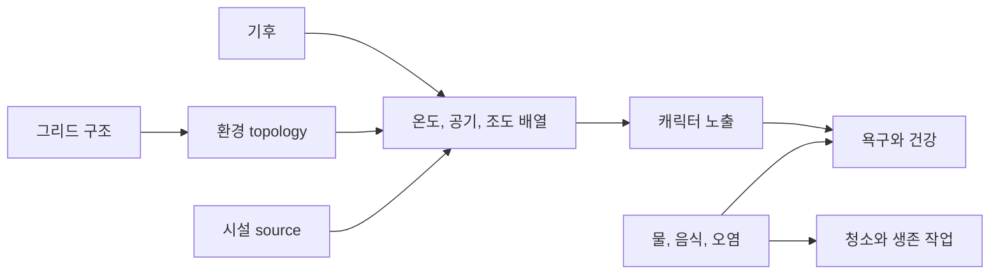

# 환경장, 생존과 공간 위생

## 구현 개요

환경 시스템은 그리드 셀마다 온도, 공기와 조도를 연속 배열에 저장한다. 기후와 외부 조건이 기본값을 제공하고, 벽, 문, 덕트와 시설 source가 전파와 차단에 영향을 준다. 캐릭터 노출은 이 필드를 일정 주기로 표본화한다. 생존 시스템은 음식, 물, 결핍과 오염을 별도 상태로 관리한다.

## 필드 시뮬레이션

셀 좌표는 그리드의 선형 인덱스로 변환된다. 현재 배열과 다음 결과 배열을 분리해 한 셀의 갱신 순서가 같은 틱의 다른 셀에 임의로 영향을 주지 않게 한다. topology에는 외부 여부, 장벽, 문과 덕트 교환량이 들어간다.

topology는 dirty 플래그, 그리드 구조 버전과 건물 버전을 비교한다. 셋이 그대로면 벽과 시설을 다시 훑지 않는다. source 목록의 온도, 오염과 광원 효과는 반경 내 셀에 적용된다.

## 생존과 위생

음식과 물은 물리 아이템 및 수질 상태와 연결된다. 결핍 runtime은 캐릭터별 누적 상태와 breakdown을 관리한다. 오염은 ID와 위치 인덱스를 가진 aggregate이며, 청소 가능한 오염은 작업 대상으로 projection된다. 오염 변화가 있을 때만 시설 후보의 동적 상태를 무효화한다.

## 적용된 최적화

| 구현 | 실제 효과 | 한계 |
|---|---|---|
| 셀별 연속 배열 | 위치 기반 직접 접근 | 큰 그리드는 필드당 메모리가 선형 증가한다 |
| topology dirty/version 검사 | 벽과 건물 재스캔 생략 | 구조 변경이 잦으면 효과가 줄어든다 |
| 고정 간격 accumulator | 캐릭터 노출과 환경 계산의 프레임 독립성 | 한 프레임에 누적 step이 몰릴 수 있다 |
| 변화 임계값 저장 | 거의 기본값인 셀의 저장량 감소 | 저장 캡처 시 전체 셀 비교가 필요하다 |
| 오염 위치 인덱스와 projection dirty | 셀 질의와 작업 대상 갱신 비용 감소 | 대량 오염 생성 시 인덱스 갱신이 몰린다 |
| profiler marker | 환경장과 노출 비용을 별도 측정 | 실제 목표 충족 여부는 측정이 필요하다 |

## 적용 사례

독성 연기를 내는 제련소를 추가한다고 가정한다. 건물 능력은 환경 source를 등록하고, 환경장은 반경과 장벽을 반영해 공기 값을 갱신한다. 환기 덕트가 추가되면 topology가 dirty가 되어 교환량이 다시 계산된다. 캐릭터는 한 번의 환경 표본으로 노출 상태를 갱신하고, 위험이 높아지면 AI가 보호 장비나 대피 행동을 고려한다.

## 비용과 한계

source 반경 적용과 전체 필드 step은 셀 수와 source 수에 영향을 받는다. 현재 코드에 topology 캐시와 고정 주기가 있지만 공간 분할이나 job system 병렬화가 이미 적용됐다고 볼 근거는 없다. 큰 맵에서 환경 marker p95가 높을 때만 chunk dirty 영역이나 병렬화를 검토해야 한다.

## 구현 위치

- `Assets/Scripts/Services/Infrastructure/Environment/ClimateRuntime.cs`
- `Assets/Scripts/Services/Infrastructure/Environment/EnvironmentalFieldRuntime.cs`
- `Assets/Scripts/Services/Infrastructure/Environment/CharacterEnvironmentRuntime.cs`
- `Assets/Scripts/Services/Survival/CharacterDeprivationRuntime.cs`
- `Assets/Scripts/Services/Survival/WorldFilthRuntime.cs`
- `Assets/Scripts/Services/Survival/WorldWaterRuntime.cs`

