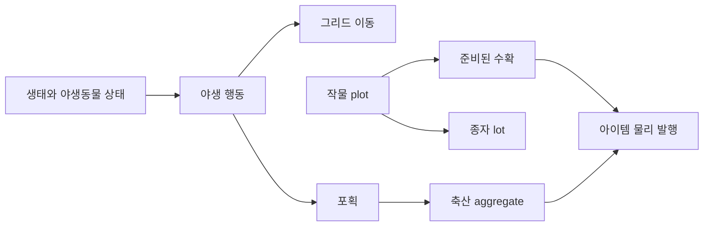

# 야생동물, 농업과 축산

## 구현 개요

야생동물은 월드 배우와 생태 aggregate를 함께 사용한다. 행동 runtime은 먹이, 위협, 서식지와 이동 가능성을 평가하고, 포획되면 captivity와 husbandry 권위로 상태가 인계된다. 농업은 작물 plot, 생태 조건, 종자 lot와 준비된 수확을 관리한다. 축산은 동물 ID, 우리 정책, 생산 주기와 호환성 위험을 보존한다.

## 야생동물과 포획

야생동물 배우는 종 ID와 인스턴스 ID를 가지며 월드 registry에 등록된다. 행동 runtime은 캐릭터와 아이템 스냅샷을 읽지만, 아이템 version이 같으면 이전 스냅샷을 재사용한다. 포획은 이동, 문 접근, 우리 방과 운반 경로를 검사한 뒤 캡처 상태를 aggregate에 기록한다.

## 농업과 종자

작물 plot은 파종, 성장, 처리와 수확 진행을 저장한다. 종자 lot는 물리 아이템 인스턴스 컴포넌트로 품질과 계통 정보를 보존한다. 수확 결과는 준비 상태를 거친 뒤 item disposition을 통해 발행되므로 로드 후 중복 수확을 막는다.

## 축산

축산 runtime은 동물을 인스턴스 ID로 찾고, 우리별 동물 목록과 호환성 위험을 projection한다. 5초 주기로 성장, 먹이, 분뇨와 생산물 진행을 누적한다. restore revision이 바뀌었을 때만 캡처 동물과의 연결을 다시 투영한다.

## 적용된 최적화

| 구현 | 실제 효과 | 한계 |
|---|---|---|
| 아이템 version 기반 야생동물 캐시 | 먹이 탐색용 전체 스냅샷 반복 생성 감소 | 아이템 변화가 잦으면 캐시가 자주 무효화된다 |
| 축산 5초 cadence | 동물 생산과 호환성 계산 빈도 감소 | 즉시 상태 표시에는 지연이 있다 |
| ID와 우리별 사전 | 동물 및 우리 직접 조회 | projection 재구축 비용은 남는다 |
| 동기화와 tick 버퍼 재사용 | 반복 컬렉션 생성 감소 | 일부 상세 평가에서는 새 리스트와 사전을 만든다 |
| 작물 및 축산 version | UI와 후보 projection 무효화 | 버전 변경 원인을 별도로 추적하지 않는다 |
| 준비 수확과 disposition receipt | 중복 생산 방지 | 상태와 저장 검증이 복잡해진다 |

## 적용 사례

양봉을 추가한다고 가정한다. 벌통은 축산 시설 역할과 환경 조건을 제공하고, 군체는 동물 또는 별도 husbandry profile로 생산 주기를 가진다. 꽃 작물과 온도가 생산량 조건에 들어가며, 완성된 꿀은 준비 출력 뒤 아이템 권위로 발행된다. 벌통 상태 변화는 작업 후보 캐시를 무효화해 먹이 공급이나 질병 관리 작업을 노출한다.

## 비용과 한계

우리 호환성 평가는 종 조합에 따라 중첩 반복을 사용하고, 일부 야생 행동은 모든 캐릭터나 아이템을 본다. 개체 수가 커질 때 공간 인덱스가 필요한지는 실제 표본에서 판단해야 한다. 현재 구현에 범용 생태 공간 파티션이 있다고 기술해서는 안 된다.

## 구현 위치

- `Assets/Scripts/Models/Wildlife/Core/WildlifeEcosystemRuntime.cs`
- `Assets/Scripts/Services/Wildlife/WildlifeBehaviorRuntime.cs`
- `Assets/Scripts/Services/Wildlife/WildlifeWorldRuntime.cs`
- `Assets/Scripts/Services/Economy/CropEcologyRuntime.cs`
- `Assets/Scripts/Services/Economy/CropPlotRuntime.cs`
- `Assets/Scripts/Services/Economy/Husbandry/AnimalHusbandryRuntime.cs`

