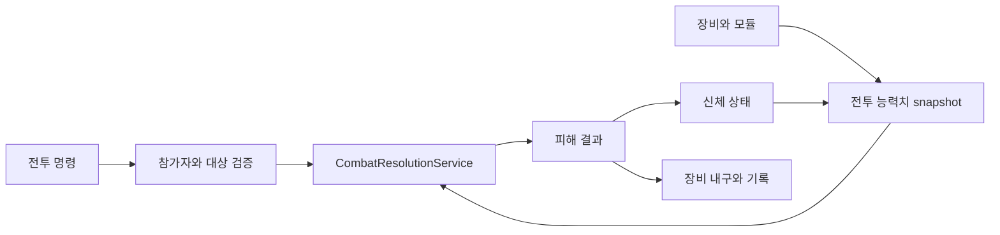
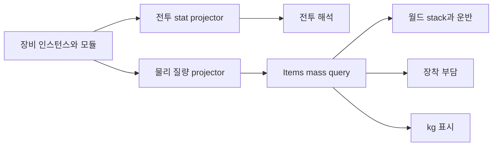

# 전투, 장비와 피해 처리

## 구현 개요

전투는 명령, 장비, 능력치 투영, 피해 계산과 신체 상태를 분리한다. 장비 인스턴스와 모듈은 월드 아이템 권위에 있고, 전투 runtime은 활성 loadout의 스냅샷을 읽는다. 공격 결과는 전투 계산 서비스가 만들고 신체 및 시설 상태 소유자가 적용한다.

## 장비와 능력치

무기, 방어구와 모듈은 정의와 인스턴스 상태를 분리한다. 인스턴스에는 품질, 내구, 이력과 장착 슬롯이 들어간다. `CombatEquipmentStatProjector`는 장비 조합을 전투용 스냅샷으로 변환한다. 공격 실행기가 원본 아이템의 내부 컬렉션을 직접 바꾸지 않는다.

장비 제작, 수리와 모듈 장착은 물리 아이템을 소비하므로 item disposition receipt를 사용한다. 수리 주문은 정책, 배정, 재료 인계와 출력 해제를 단계별로 보존한다.

## 전투 성능과 물리 질량의 두 투영

같은 장비 인스턴스에서 전투 성능과 물리 질량을 따로 투영하되, 원본 상태는 공유한다. `CombatEquipmentStatProjector`는 공격, 방어와 내구 관련 값을 만들고 `CombatEquipmentPhysicalMassProjector`는 기본 아이템, 재료, 진화와 장착 모듈 중 질량에 영향을 주는 요소를 canonical gram 기여로 바꾼다. 최종 질량은 Items의 `PhysicalItemMassQuery`가 합성한다.

이 구조는 전투 정의의 `weight`, 물리 아이템의 단위 중량과 재료 배율이 서로 다른 최종값을 소유하는 문제를 막는다. 모듈을 장착한 방패를 바닥에서 옮길 때와 전투원이 착용할 때 같은 물리량을 읽으며, 전투용 수치는 별도 계산으로 유지된다. 품질이나 내구도가 성능을 바꾸더라도 실제 물질량을 바꾸지 않는다면 질량 projector에는 포함하지 않는다.

화물 질량과 장착 질량은 용도가 다르다. 화물은 새 stack을 더 집을 수 있는지 판단하고, 장착 질량은 이동과 전투 부담 정책의 입력이 된다. 둘을 무조건 한 값으로 합치면 운반 멜빵 같은 장비가 자기 무게와 payload 보너스를 잘못 이중 적용할 수 있다. 공통 장비 질량 투영과 장착 의복 집계는 현재 구현에 존재하며, 작성값과 최종 부담 정책의 전수 판정은 [시스템 구현 권위 체크리스트](../../system-implementation-checklist.md)가 관리한다.

## 장비 사용 이력과 진화

장비 인스턴스는 전투 수치와 내구만 보존하지 않는다. `EquipmentEvolutionRuntime`은 장비 사용 사건을 개체별 원장에 기록하고, 세대가 닫힐 때 압축 이력과 역사 증거를 만든다. 강적 처치, 소유자 보호, 치명타 차단, 빈사 생존, 반복된 장거리 명중, 방어구 파손과 적 포획 같은 사건은 장비가 어떤 방향의 역사를 가졌는지 판정하는 자료가 된다.

이 원장, 압축 구간, `EvolutionNode`와 안정 해시는 시설 개체 진화도 함께 사용한다. 공용 구조는 이력을 어떤 형식으로 보존할지만 정하고, 장비 효과 후보와 재단조·재조율 상태는 전투 장비 계층이 소유한다.

후보를 승인하면 장비, 재료와 작업 진행을 주문에 고정한다. 완료 시점에 현재 전투 이력으로 결과를 다시 고르지 않는다. 저장 후에도 플레이어가 승인한 후보를 유지하기 위한 결정이다. 역사 노드의 이름과 설명은 선택적인 서술 생성 경로를 사용할 수 있지만, 요청에 고정된 효과와 허용 후보를 바꿀 권한은 없다.

| 구현 | 실제 효과 | 한계 |
|---|---|---|
| 제한된 원시 원장과 계층 압축 | 장기 이력을 지표, 증거와 선택된 주요 사건으로 유지한다 | 모든 원시 전투 사건을 영구 보존하지 않는다 |
| 역사 증거 규칙 | 같은 장비 정의도 사용 방식에 따라 다른 후보를 갖는다 | 사건 생산자와 장비 귀속이 빠지면 해당 역사는 형성되지 않는다 |
| 후보와 작업 Snapshot | 재단조 도중 이력이 바뀌어도 승인 결과를 유지한다 | 취소, 재료 반환과 복원 상태가 늘어난다 |
| 진화 노드 능력치 투영 | 전투 계산이 원장을 직접 해석하지 않고 완성된 stat snapshot을 읽는다 | 노드와 장착 상태가 바뀔 때 투영을 다시 계산해야 한다 |
| 제한된 서술 요청 | 자연어 설명 실패가 전투 효과를 바꾸지 않는다 | 요청 검증과 fallback 표시가 필요하다 |

공용 이력 구조와 시설 진화와의 관계는 [사용 이력 기반 진화 아키텍처](../07-history-driven-evolution-architecture.md)에 정리했다.

## 피해 처리

공격 간격은 캐릭터 능력치, 무기와 상황 배율로 계산되고 engagement가 다음 실행 시각을 예약한다. 명중과 피해 결과는 신체 runtime에 적용된다. 다운, 구조, 치료 가능성은 신체 스냅샷에서 파생된다.

## 적용된 최적화와 비용 통제

| 구현 | 실제 효과 | 한계 |
|---|---|---|
| 장비 및 모듈 ID 인덱스 | 인스턴스 직접 조회 | 일부 호출은 여전히 전체 스택을 검색한다 |
| 전투 stat snapshot | 한 공격 동안 일관된 입력 유지 | 매 공격 또는 변경 시 투영 비용이 있다 |
| 예약된 공격 시각 | 매 프레임 전체 공격 가능성 계산 방지 | 참여자 수가 많으면 engagement 순회는 남는다 |
| 수리 1초 scan cadence | 유지보수 주문 검사 빈도 제한 | 즉시 반영이 최대 1초 늦을 수 있다 |
| profiler marker | 유지보수와 전투 비용 분리 측정 | 목표 충족을 보장하지 않는다 |
| 물리 재료 receipt | 장착, 수리와 해체의 중복 소비 방지 | 교차 저장 검증이 커진다 |

## 적용 사례

방패에 반격 모듈을 추가한다고 가정한다. 모듈 정의는 적용 가능한 슬롯, stat 변화와 실제 질량 기여를 제공하고, 장착 workflow는 공구와 모듈 아이템을 예약한다. 장착 성공 후 전투 projection은 방어 및 반격 수치를, 질량 projection은 모듈이 포함된 gram을 제공한다. 전투 계산과 운반 계획은 모듈 인스턴스를 제각기 해석하지 않고 각자의 완성된 projection을 사용한다.

## 비용과 한계

전투 장비 계층은 제작, 품질, 수리, 모듈, 이력과 물리 아이템을 모두 연결해 복잡하다. 전체 스택 조회와 LINQ가 전투 준비 또는 수리 경로에 남아 있다. 대규모 전투의 병목이 능력치 투영인지 신체 적용인지 장비 검색인지 profiler로 나눠 확인해야 한다.

## 구현 위치

- `Assets/Scripts/Services/Combat/CombatResolutionService.cs`
- `Assets/Scripts/Services/Combat/CombatEquipmentRuntime.cs`
- `Assets/Scripts/Services/Combat/CombatEquipmentLoadoutRuntime.cs`
- `Assets/Scripts/Services/Combat/CombatEquipmentStatProjector.cs`
- `Assets/Scripts/Services/Items/CombatEquipmentPhysicalMassProjector.cs`
- `Assets/Scripts/Services/Items/PhysicalItemMassQuery.cs`
- `Assets/Scripts/Services/Items/EquippedApparelPhysicalMassQuery.cs`
- `Assets/Scripts/Services/Combat/EquipmentEvolutionRuntime.cs`
- `Assets/Scripts/Services/Combat/EquipmentEvolutionRules.cs`
- `Assets/Scripts/Models/Evolution/Equipment/EquipmentEvolutionModels.cs`
- `Assets/Scripts/Models/Evolution/Core/UsageLedgerCompactor.cs`
- `Assets/Scripts/Services/Combat/EquipmentModuleRuntime.cs`
- `Assets/Scripts/Services/Combat/EquipmentMaintenanceRuntime.cs`
- `Assets/Scripts/Services/Combat/CharacterBodyHealthRuntime.cs`
