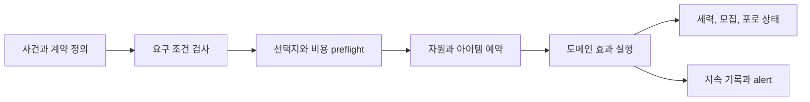

# 세력, 사건, 모집과 포로

## 구현 개요

사회 콘텐츠는 세력 관계, 모집 후보, 사건 해결, 포로와 포획 동물을 별도 aggregate로 유지한다. 콘텐츠 정의는 요구 조건과 기존 효과를 조합한다. 실제 해결은 `V20ContentResolutionService`가 비용 사전 검사, 예약, 물리 아이템 발행과 도메인 효과를 하나의 workflow로 조정한다.

## 사건 해결

요구 조건은 세력 상태, 캐릭터, 시설, 자원과 선행 기록을 읽는다. 비용과 보상은 실제 변경 전에 가능한지 검사한다. 물리 아이템 보상은 exact source와 commit ID를 가진 준비 발행을 거치며, 중간 실패 시 예약과 준비 결과를 되돌린다.

기존 효과 종류의 조합은 데이터에서 처리된다. 새 사건은 기존 조건과 효과만 사용하면 코드 없이 추가할 수 있다. 새 효과 의미는 중앙 switch와 preflight, commit, rollback, 저장 검증을 수정해야 한다. `V21ContentEffectExecutionRegistry`는 소유권 목록이며 실행 handler는 중앙 실행 경로가 관리한다.

## 세력과 모집

세력 aggregate는 관계, 계약과 진행 상태를 소유한다. 모집은 regular customer와 정착 인구 용량을 검사한다. 정착 수용 여부는 침상, 식량, 노동 잉여와 운영 지표를 snapshot으로 계산해 후보를 받아들일지 판단한다.

## 포로와 포획

포로 상태, 정책, 상호작용, 탈출과 escort는 captivity aggregate와 runtime이 맡는다. 이동은 공통 grid path broker를 사용하고 문 접근 권한은 subject registry에서 검사한다. 공연과 포획 동물도 주문 상태와 물리 소모품 receipt를 가진다.

## 하수인과 정식 주민

`CharacterSettlementStanding`이 정착지 안에서 인물이 갖는 신분을 소유한다. 준비 후보, 방문자, 정식 주민과 하수인을 분리하며 업무, 임금, 인구, 불만, 멘토링과 원정은 `ICharacterSettlementStandingQuery`만 읽는다. 포로 상태와 재사회화 진행은 captivity aggregate가 계속 소유한다.

| 구분 | 하수인 | 정식 주민 |
|---|---|---|
| 합류 조건 | 타락 80 이상, 포획 3일 이상 | 신뢰 70 이상, 원한 30 이하, 타락 60 미만, 포획 10일 이상 |
| 업무 | 31개 중 23개, 경비 가능, 원정 불가 | 전체 업무, 경비와 원정 가능 |
| 숙련 | 현재 숙련의 속도·품질 유지, 업무 XP 50%, 멘토링 불가 | 업무 XP 100%, 멘토와 학생 가능 |
| 생활 | 임금 0, 음식·물·수면·침상·의복·치료는 정식 주민과 같은 규칙 | 임금 계약과 모든 생활비 적용 |
| 사회 | 하수인 비율에 따른 정식 주민 기분 저하, 사회 충돌과 통제 이탈 판정 | 가족·교육·외교·지휘를 포함한 주민 활동 가능 |

하수인이 맡을 수 있는 업무는 운영, 보급, 건설, 수리, 청소, 경비, 구조, 휴식, 제작, 운반, 사냥, 도축, 급수, 조리, 연료 보급, 채집, 파종, 수확, 벌목, 채석, 동물 돌봄, 배관과 시설 해체다. 연구, 접객, 치료, 수술, 포로 관리, 공연, 대형 사업과 위협 완화는 정식 주민이 맡는다.

하수인 비율은 `하수인 수 / (정식 주민 수 + 하수인 수)`다. 정식 주민의 일일 기분 변화는 10% 미만 0, 10~24% -2, 25~49% -5, 50% 이상 -9다. 하수인마다 하루 한 번 사회 충돌과 통제 이탈을 판정하며, 같은 날 발생하는 충돌은 `ceil(하수인 수 / 4)`건으로 제한한다. 수치 권위는 전역 밸런스 기준서 4.13이 가리키는 `captivity:v28:minion-resident-standing-and-rehabilitation` 기록에 있다. 공개 위키는 플레이어에게 같은 경계를 설명한다.

재사회화는 하루 한 번 18 WU와 음식 1개를 사용한다. 한 번 끝날 때마다 신뢰 +5, 원한 -3, 타락 -6을 적용한다. 15회를 끝내고 신뢰 70 이상, 원한 30 이하, 타락 30 이하에 도달하면 정식 주민 전환을 선택할 수 있다.

하수인 전환과 정식 주민 전환은 `CaptivityRuntime`이 하나의 명령으로 조정한다. 명령은 포로 상태, 정착 신분, 캐릭터 유형, 출입 권한과 임금 상태를 함께 바꾸며 한 단계라도 실패하면 이전 상태로 되돌린다. 하수인은 전환 직후 감방, 구속구, 포로 노동 도구, 탈출, 몸값과 공연 경로에서 빠지고 일반 생활 인구에 들어간다.

저장 데이터는 인구 프로필의 `CharacterSettlementStanding`과 captivity section의 포획일, 재사회화 일수·작업량·마지막 실행일, 마지막 사회 판정일을 기록한다. 이전 저장의 `isStaff`, `isVisiting`과 `CaptivityStatus.Minion`은 복원 단계에서 새 신분으로 변환한다.

## 적용된 최적화와 비용 통제

| 구현 | 실제 효과 | 한계 |
|---|---|---|
| 정의 및 aggregate ID 인덱스 | 사건과 상태 직접 조회 | 교차 참조 검증이 필요하다 |
| 전 변경 preflight | 비용 일부만 빠지는 실패 방지 | 실행 전 조회가 늘어난다 |
| 아이템 reservation과 receipt | 선택지 재실행의 중복 소비 방지 | 프로토콜 상태가 많다 |
| typed event와 alert merge | 여러 UI의 polling과 알림 폭증 감소 | 동기 event handler 비용은 발행자 틱에 포함된다 |
| 포획 tick buffer | 반복 목록 생성 감소 | 일부 공간 후보는 새 리스트를 만든다 |
| 공통 경로 broker | captivity 전용 길찾기 중복 제거 | 긴급 탈출과 일반 AI가 예산을 공유한다 |

## 적용 사례

적대 세력의 포로 교환 사건을 추가한다고 가정한다. 조건은 포로 ID, 세력 관계와 지급 물품을 검사한다. 선택 시 물품을 예약하고 포로 해방 workflow를 준비한다. 두 변경이 모두 유효할 때 세력 관계와 포로 상태를 발행하고 영수증을 남긴다. 로드 후 선택을 재처리해도 같은 포로와 물품이 다시 거래되지 않는다.

## 비용과 한계

사건 정의 조합은 높지만 새 효과 의미의 확장성은 건물 능력보다 약하다. 중앙 해결 서비스가 많은 도메인을 알고 있어 변경 충돌과 테스트 표면이 크다. 장기적으로 effect kind별 실행 handler와 공통 transaction context를 분리하는 것이 우선 개선 후보다.

## 구현 위치

- `Assets/Scripts/Services/Run/V20ContentResolutionService.cs`
- `Assets/Scripts/Services/Run/V20CampaignRuntime.cs`
- `Assets/Scripts/Services/Factions/FactionRuntime.cs`
- `Assets/Scripts/Services/Recruitment/RegularCustomerRuntime.cs`
- `Assets/Scripts/Services/Recruitment/SettlementPopulationCapacityRuntime.cs`
- `Assets/Scripts/Services/Captivity/CaptivityRuntime.cs`
- `Assets/Scripts/Services/Captivity/MinionSettlementSocialRuntime.cs`
- `Assets/Scripts/Services/Character/Core/CharacterSettlementStandingQuery.cs`
- `Assets/Scripts/Models/Characters/CharacterSettlementStanding.cs`
- `Assets/Scripts/Services/Captivity/WildlifeCaptureRuntime.cs`
- `Assets/Scripts/Services/Captivity/CircusRuntime.cs`
