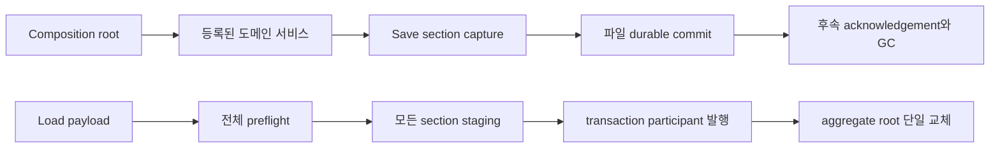

# 세션 조립, 저장과 결정론

## 구현 개요

런타임 조립은 `DungeonRuntimeLifetimeScope`와 등록 모듈이 담당한다. 저장은 도메인별 section을 하나의 registry에 등록하고 의존 순서대로 캡처 및 복원한다. 복원은 라이브 상태를 바로 수정하지 않고 모든 후보를 먼저 만든 뒤 한 번의 발행 단계로 넘어간다.

## 조립

VContainer가 constructor와 injection method를 통해 의존성을 넣는다. Unity component 생성, scene 참조와 prefab factory는 adapter 계층에 남긴다. 다중 handler와 save section은 collection binding으로 등록된다. 중복 handler, section ID와 presenter ID는 조립 시점에 실패한다.

## 저장과 복원

각 section은 ID, version, phase와 dependency를 선언한다. registry는 시작 시 위상 정렬을 계산한다. 로드 시 모든 payload를 preflight하고 모든 section을 stage한다. 그 뒤 restore participant를 시작하고 stage를 commit하며 participant publication과 aggregate root 교체를 완료한다.

`DungeonRuntimeAggregateRootStore`는 live root의 얕은 사본을 후보로 만들고, 쓰기가 요청된 aggregate type만 clone한다. 모든 발행이 성공한 뒤 live 참조를 한 번 바꾸고 restore revision을 올린다.

## 물리 질량의 저장 계약

`PhysicalItemsSaveSection`은 물건의 안정 ID, 정의 ID, 수량, 위치, 목적지, 인스턴스 컴포넌트, 예약과 현재 책임을 저장한다. 종류 정의에서 오는 기본 질량을 스택별 가변 필드로 복제해 영속 권위로 삼지 않는다. 복원 후보는 현재 카탈로그와 등록된 mass projector로 canonical gram을 다시 계산한다.

예약과 교차 도메인 거래는 예외적으로 준비 당시의 exact gram, mass authority revision과 fingerprint를 저장할 수 있다. 이 값은 동일 operation을 재개할 때 원래 약속한 lot과 현재 계산 결과가 같은지 검사하는 증거이며, 질량 권위는 기존 작성 정의에 남는다. 값이 다르면 조용히 현재 kg로 덮어쓰지 않고 conflict 또는 손상으로 처리한다.

현재 형식의 저장에서 복원 직후 화물이 새 한도를 넘더라도 물건을 삭제하거나 다른 위치로 순간이동시켜 맞추지 않는다. 물리 상태를 보존한 뒤 신규 pickup을 막고 unload 또는 재계획 경로가 해결해야 한다. Downed나 Dead처럼 원래 운반자가 책임질 수 없는 경우에도 해당 recovery 계약을 통해 현 위치의 물리 lot으로 전환한다.

이 방식의 이점은 수치 조정과 세계 연속성을 분리하는 데 있다. 자산의 kg를 고쳤다고 세이브 안의 오래된 복사값이 남지 않고, load를 이용해 과적이나 목적지 포화를 지울 수도 없다. 과거 버전 세이브의 kg 마이그레이션은 별도 정책이며 현재 V27 범위에 포함되지 않는다.

## 결정론과 재실행 안전

결정론은 random seed와 함께 stable ID, 정렬된 iteration, 명시적 queue 순서, commit ID, fingerprint와 receipt를 사용해 같은 입력의 처리 순서를 고정한다. AI와 path broker에는 editor 진단용 deterministic mode가 있어 등록 순서와 cache 상태를 초기화한 뒤 반복 시나리오를 비교할 수 있다.

## 적용된 최적화와 비용 통제

| 구현 | 실제 효과 | 한계 |
|---|---|---|
| 시작 시 위상 정렬 | 매 저장마다 dependency 정렬하지 않는다 | 잘못된 dependency는 시작을 막는다 |
| section별 payload | 변경과 검증 범위를 도메인별로 제한 | section 간 참조 검증이 필요하다 |
| 얕은 root copy와 aggregate copy-on-write | 복원 때 전 세계 deep clone을 피한다 | clone 누락은 격리 계약을 깨뜨린다 |
| 전체 staging 후 단일 publication | 부분 복원 노출 방지 | 후보 메모리를 동시에 보유한다 |
| durable 후속 participant | 파일 저장과 receipt 정리를 분리 | 완료 상태가 추가로 필요하다 |
| stable ordering과 fingerprints | 재실행 불일치와 중복 효과 감지 | canonical 규칙 유지 비용이 있다 |

## 적용 사례

생산 출력이 아이템 창고로 전달된 직후 저장한다고 가정한다. 저장 파일에는 생산 batch와 아이템 receipt가 함께 들어간다. 로드 preflight는 commit ID와 fingerprint의 대응을 검사한다. 둘이 일치하면 이미 적용된 결과로 복원하고, acknowledgement가 남았다면 durable save 후 정리한다. 일치하지 않으면 조용히 한쪽을 선택하지 않고 손상으로 실패한다.

## 비용과 한계

이 구조는 복구 가능성을 우선해 section과 participant가 많다. 저장 캡처 및 복원 시간, 후보 peak memory와 파일 크기는 실제 세이브로 측정해야 한다. 적용 범위는 local staged unit of work이며 외부 데이터베이스는 참여하지 않는다.

## 구현 위치

- `Assets/Scripts/Services/Infrastructure/DungeonRuntimeLifetimeScope.cs`
- `Assets/Scripts/Services/Infrastructure/Registration/DungeonSaveRegistration.cs`
- `Assets/Scripts/Services/Foundation/Save/DungeonSaveSections.cs`
- `Assets/Scripts/Services/Infrastructure/Core/Save/DungeonJsonSaveSection.cs`
- `Assets/Scripts/Services/Infrastructure/DungeonGameSaveService.cs`
- `Assets/Scripts/Services/Infrastructure/DungeonAutosaveService.cs`
- `Assets/Scripts/Services/Foundation/Save/DungeonDurableSaveCommitContracts.cs`
- `Assets/Scripts/Services/Items/PhysicalItemsSaveSection.cs`
- `Assets/Scripts/Services/Items/PhysicalItemSaveValidation.cs`
- `Assets/Scripts/Services/Items/PhysicalItemMassQuery.cs`
