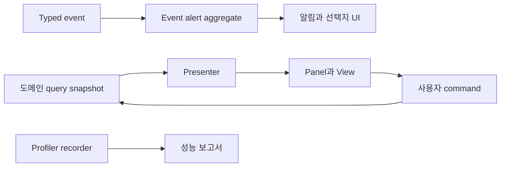

# UI, 알림과 성능 진단

## 구현 개요

프레젠테이션 계층은 도메인 snapshot을 화면 모델로 바꾸고 사용자 명령을 command port에 전달한다. 탭과 건물 기능 화면은 stable ID 기반 presenter registry로 연결된다. 알림은 typed event를 받아 event-alert aggregate에 기록하고, view presenter가 현재 선택과 버튼을 렌더링한다.

## presenter와 화면 조립

`FeatureSurfaceTabPresenterRegistry`는 `TabId`와 presenter를 연결하고 중복 또는 누락을 조기에 거부한다. 생산 화면처럼 여러 도메인이 필요한 패널은 query interface들을 받아 하나의 view model을 구성한다. 쓰기는 별도의 command interface로 보낸다.

event alert는 요청을 aggregate record로 정규화하고 merge policy에 따라 같은 알림을 합친다. dismissal과 선택 결과가 저장된다. UI runtime은 aggregate root의 restore revision을 감시해 복원 뒤 projection을 다시 연결한다.

## 구독과 오브젝트 수명

typed event 구독은 `IDisposable`을 반환하고 `OnDisable` 또는 dispose에서 해제한다. event bus는 발행 시 listener 목록의 snapshot을 사용하므로 callback 중 구독 변경이 현재 순회를 깨뜨리지 않는다. notice feed는 prefab별 Unity object pool을 사용해 반복 생성과 파괴를 줄인다.

## 성능 진단

성능 측정 세션은 frame, script, GC, AI scheduler, path search와 named marker를 `ProfilerRecorder`로 수집한다. 표본은 최대 개수가 정해진 배열에 저장되고, report assembler가 평균과 percentile, backlog와 cache 지표를 구성한다. AI에는 별도 category별 rolling sample ring과 런타임 invariant trace가 있다.

## 적용된 최적화와 비용 통제

| 구현 | 실제 효과 | 한계 |
|---|---|---|
| presenter registry | 화면 선택 시 선형 조건문 감소 | 새 탭 등록 누락은 시작 실패가 맞다 |
| query snapshot | 렌더 중 가변 도메인 상태 노출 방지 | view model 생성과 문자열 포맷 비용이 있다 |
| disposable subscription | 닫힌 화면의 중복 callback 방지 | 해제 규약을 지켜야 한다 |
| listener snapshot | 발행 중 collection mutation 방지 | 발행마다 snapshot 비용이 생길 수 있다 |
| alert merge | 동일 알림 GameObject의 무제한 증가 억제 | merge key가 너무 넓으면 다른 사건이 합쳐진다 |
| notice object pool | 반복 알림의 Instantiate와 Destroy 감소 | 다른 패널에는 보편 적용되지 않았다 |
| 고정 표본 배열 | 진단 메모리 상한 설정 | 표본 창 밖의 세부 정보는 사라진다 |

## 적용 사례

환경 탭을 추가한다고 가정한다. 새 presenter는 환경 field와 방 layout query를 받아 셀 및 방 요약을 만든다. 온도 변경 명령은 환경 command port로 보낸다. registry에 `TabId`와 presenter를 등록하면 공통 panel이 해당 view model을 렌더링한다. 환경 runtime을 UI가 직접 찾아 수정하지 않는다.

## 비용과 한계

notice feed에는 pooling이 있지만 여러 큰 패널은 렌더 때 GameObject와 리스트를 다시 만든다. UI 최적화가 프로젝트 전역에서 통일됐다고 볼 수 없다. 성능 probe도 editor 또는 진단 시나리오에서 작동하는 측정 도구다. 최근 캡처 결과 없이 프레임 목표 통과를 문서에 적지 않는다.

## 구현 위치

- `Assets/Scripts/Views/UI/Core/PresentationPrimitives.cs`
- `Assets/Scripts/Views/UI/Core/EventAlertRuntime.cs`
- `Assets/Scripts/Views/UI/Core/EventAlertViewPresenter.cs`
- `Assets/Scripts/Views/UI/Core/NoticeFeedPresenter.cs`
- `Assets/Scripts/Services/Foundation/Events/GameEventBus.cs`
- `Assets/Scripts/Services/Infrastructure/Core/Diagnostics/GameplayPerformanceMeasurementSession.cs`
- `Assets/Scripts/Services/Infrastructure/Core/Diagnostics/GameplayPerformanceReportAssembler.cs`

