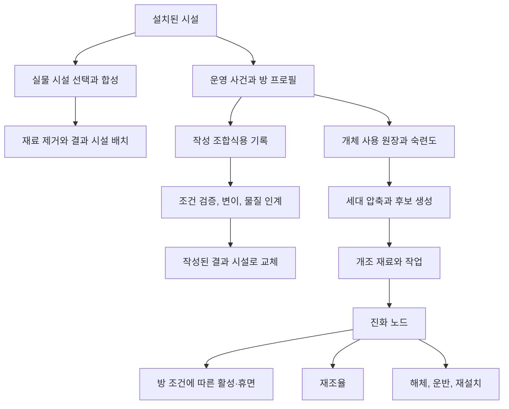
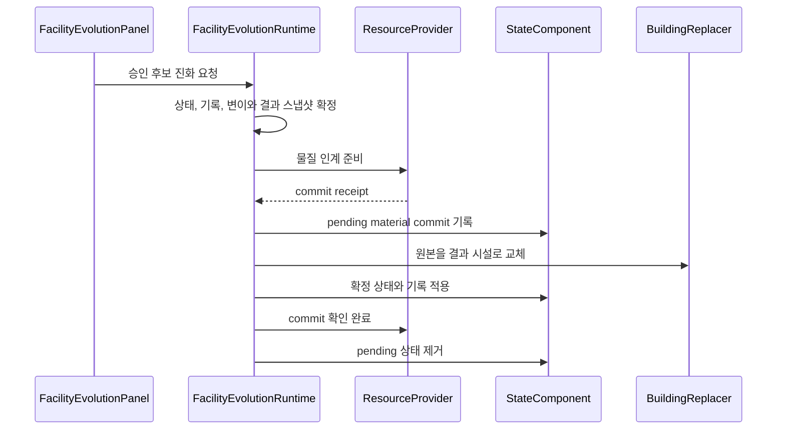
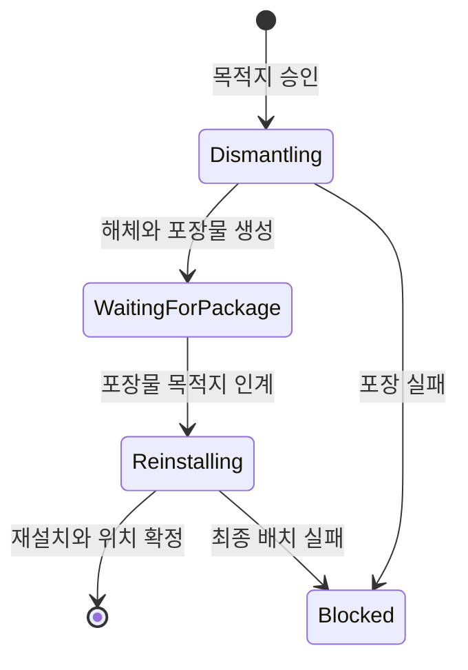

# 시설 합성과 사용 기반 진화

## 구현 개요

건설 이후의 시설을 바꾸는 실행 경로는 세 가지다. 합성은 설치된 여러 시설을 실물 재료로 소모해 하나의 결과 시설로 바꾼다. 작성 조합식 교체는 개별 시설의 운영 기록과 방 맥락을 작성된 계보 조건에 대조해 다른 시설 정의로 교체한다. 개체 진화는 숙련도와 압축된 사용 이력으로 후보를 만들고, 선택 결과를 같은 시설의 진화 노드로 남긴다.

세 경로는 입력, 결과와 복원 방식이 다르다. 합성에서는 운영 자산을 포기하고 공간을 다시 잡는다. 작성 조합식 교체에서는 원하는 계보에 맞는 환경과 기록을 만든다. 개체 진화에서는 사용 방식으로 후보를 형성한 뒤 물질과 노동을 들여 모듈을 확정하고, 방 변화에 따라 활성 상태를 관리한다.

현재 작성 자산은 시설 합성 조합식 9개와 시설 진화 조합식 6개다. 구조가 표현할 수 있는 흐름과 실제로 제공되는 콘텐츠 양은 구분해서 봐야 한다.

## 세 실행 경로의 역할 분담

| 절차 | 입력 | 플레이어의 결정 | 결과와 정체성 보존 방식 |
|---|---|---|---|
| 시설 합성 | 월드에 설치된 시설 개체, 조합식, 연구 상태, 배치 공간 | 어느 시설을 희생하고 어느 자리를 결과의 기준점으로 삼을지 | 선택한 시설이 사라지고 상속 등급을 가진 결과 시설이 기준 위치에 등록된다 |
| 작성 조합식 교체 | 시설 계보, 방 프로필, 운영 기록, 연구, 물질, 작성된 후보 | 어느 운영 성격을 키우고 조건을 갖춘 계보 가운데 무엇을 선택할지 | 기록과 계보를 이어받은 결과 시설 및 최대 두 개의 허용 변이가 확정된다 |
| 개체 진화 | 숙련도, 세대별 사용 이력, 방 조건, 진화 모듈, 촉매와 작업 | 생성된 주 역할·방 시너지·위험 촉매 후보 중 무엇을 설치하고 어떤 조건으로 유지할지 | 시설 정의는 유지하며 이득, 부담, 증거와 활성 조건을 가진 진화 노드가 추가된다 |

합성은 여러 자산을 하나로 재편하는 공간·생산 결정이다. 작성 조합식 교체는 한 장소의 운영사를 다음 시설 정의에 넘기는 계보 결정이다. 개체 진화는 같은 시설이 축적한 역사를 모듈과 조건으로 남기는 성장 결정이다. 세 절차를 같은 업그레이드로 설명하면 자산 희생, 작성된 계보, 개체별 역사라는 서로 다른 판단이 사라진다.

## 시설 합성 실행 흐름

`FacilitySynthesisRecipeSO`는 필요한 시설 정의, 결과 시설, 연구 조건과 등급 상속 비율을 제공한다. `FacilitySynthesisRuntime`은 패널이나 건물 기능 명령 서비스가 선택한 실제 `BuildableObject` 목록을 받아 다음 순서로 처리한다.

1. 조합식 유효성과 연구 공개 상태를 확인한다.
2. 재료가 존재하고 파괴 또는 파손 상태가 아니며 같은 개체가 중복되지 않았는지 검사한다.
3. 재료 정의의 다중 집합이 조합식과 정확히 일치하는지 확인한다.
4. 모든 재료가 같은 `Grid`에 있고 결과가 기준 시설 위치를 점유할 수 있는지 검사한다.
5. `IProductionFacilityMutationFence`로 생산 주문, 재공품과 출력 권위가 남지 않았음을 요구한다.
6. 재료 시설의 평균 수준과 조합식 비율로 상속 등급을 확정한다.
7. 재료 시설을 그리드와 시각 표현에서 제거하고 결과 시설을 기준 위치에 생성·등록한다.
8. 완료 사건과 알림을 발행한다.

정의 ID의 정렬된 다중 집합을 비교하므로 재료 선택 순서는 결과에 영향을 주지 않는다. 기준 위치는 조합식에 처음 선언된 재료 정의와 일치하는 시설을 우선 사용한다. 이 방식은 플레이어가 기존 공간을 재활용할 수 있게 하지만, 결과 크기와 주변 점유를 합성 전에 고려하게 만든다.

생산 변이 차단선은 합성으로 시설이 사라질 때 주문, 재공품 또는 출력의 소유자가 함께 사라지는 일을 막는다. 시설 시스템이 생산 시스템의 내부 상태를 직접 수정하지 않고, 생산 권위가 비어 있다는 계약만 요구한다.

## 작성 조합식 교체용 기록과 방 프로필

`FacilityEvolutionRecordEventRecorder`는 매 프레임 시설 전체를 훑지 않는다. 방문, 매출, 재고 소비, 재입고 실패, 범죄, 방어 발동, 침입 피해와 운영일 완료 사건을 받을 때 해당 시설의 기록을 갱신한다.

`FacilityEvolutionRecord`는 다음 세 종류의 자료를 보관한다.

| 자료 | 예 | 사용처 |
|---|---|---|
| 누적 지표 | 방문 수, 재방문 비율, 평균 지출, 만족, 범죄, 재고 부족, 방어 피해 | 정체성 압력과 조합식 수치 조건 |
| 기록 표식 | 용병 이용, 귀족 후원, 빠른 회전, 무법자 소문, 경비 집결, 무사고 서비스 | 진화 해금 조건과 선택적 소모 |
| 최근 사건 | 시설에 귀속된 운영 사건 문자열 | 프로필 설명과 서술 입력 |

`RoomProfileBuilder`는 기록만 보지 않는다. 현재 방의 면적, 문, 기물, 좌석과 탁자 밀도, 좌석 간격, 장식, 서비스, 조리, 휴식, 보관, 위생, 연구, 마나, 방어와 물류 정보를 합친 `RoomProfile`을 만든다. 같은 사용 기록도 방을 어떻게 구성했는지에 따라 다른 의미를 가질 수 있다.

기록 컬렉션은 읽기 전용 보기로 외부에 노출된다. 후보 계산이나 UI가 내부 사전을 직접 수정해 상태 권위를 우회하지 못하게 하는 장치다.

## 정체성 압력과 충돌

`FacilityIdentityPressureUtility`는 방 프로필과 기록을 다음 아홉 성향으로 정규화한다.

- 혼잡
- 사치
- 전투
- 무법
- 휴식
- 서비스
- 의식
- 치안
- 물류

조합식은 이 성향에 가중치와 최소 점수를 둘 수 있다. 점수는 양의 가중치 합을 기준으로 정규화되며, 현재 프로필이 어떤 항목으로 기여했는지도 후보 설명에 남는다.

충돌은 별도 판정으로 표시된다. 현재 코드는 혼잡과 사치, 서비스와 무법, 휴식과 전투가 동시에 강할 때 상충 신호를 만든다. 모든 성향을 한 시설에 최대치로 쌓는 방식보다 공간과 운영 정책을 분화하도록 유도한다.

## 작성 조합식 후보와 게임 규칙의 권위

`RuleBasedFacilityEvolutionProposalProvider`는 현재 시설에 연결된 작성 후보를 정체성 점수와 안정 ID 순서로 정렬한다. 후보가 부족한 이유도 방 맥락, 기록 표식과 정체성 점수에서 구성한다.

로컬 언어 모델을 사용할 수 있는 경우 `CachedLocalLlmFacilityEvolutionProposalProvider`가 설명용 서술을 요청한다. 이 경로는 게임 결과의 권위가 아니다.

- 유효한 후보 ID와 허용된 변이 태그만 모델 입력과 응답 필터에 포함된다.
- 캐시된 결과도 규칙 기반 후보 순서, 이유, 변이 제안과 신뢰도를 그대로 유지한다.
- 모델이 없거나 요청이 진행 중이거나 실패하면 규칙 기반 결과가 계속 사용된다.
- 최종 실행은 모델 응답과 무관하게 동일한 연구, 계보, 방, 기록, 물질과 배치 검증을 통과해야 한다.

이 분리는 자연어 설명이 바뀌어도 저장 상태와 경제 결과가 달라지지 않게 한다. 작성되지 않은 진화가 생성되거나, 설명이 조건 검사를 우회하는 경로도 차단한다.

## 작성 조합식 후보 검증과 변이

`FacilityEvolutionService.Validate`는 후보마다 다음 조건을 개별 항목으로 기록한다.

- 현재 시설 정의와 계보
- 요구 등급과 연구 공개 상태
- 사용 가능한 방 여부
- 필수 방 태그, 점수와 지표
- 필수 사용 기록 표식
- 정체성 최소 점수
- 고유 기물
- 필요한 물질

`FacilityEvolutionPanel`은 계보, 기존 변이, 방 사용 가능 여부, 좌석 밀도, 좌석당 장식, 두드러진 정체성 압력과 후보별 검증 결과를 표시한다. 승인된 후보만 실행하며, 거절된 후보는 부족한 조건을 영감 형태로 보여 줄 수 있다. 플레이어가 시설의 성장 방향을 운영으로 교정할 근거를 제공하는 화면이다.

`DefaultFacilityEvolutionMutationResolver`는 조합식이 허용한 태그 가운데 현재 프로필에 증거가 있는 것만 선택한다. 제안된 태그도 허용 목록과 기록 증거를 다시 확인한다. 정체성 조건을 크게 넘긴 경우에는 그 성향과 맞는 변이가 추가될 수 있으며, 한 번의 진화에서 최대 두 개로 제한된다.

변이는 무작위 재굴림이 아니다. 작성된 허용 범위, 현재 기록과 정체성 증거의 교집합에서 결정된다.

## 작성 조합식의 물질 인계, 교체와 저장 복원

`FacilityEvolutionRuntime.TryEvolve`는 검증이 끝난 뒤 현재 상태와 기록을 스냅샷으로 복제한다. 필요한 기록 표식을 복제본에서 소모하고, 변이와 결과 상태를 먼저 확정한다. 그다음 물질 인계를 요청한다.

물질 요구가 없으면 결과 시설로 교체하고 확정된 상태와 기록을 즉시 이전한다. 물질이 실제로 인계되면 `FacilityEvolutionPendingMaterialCommitSnapshot`에 작업 ID, 사유 코드, 원본과 결과 정의, 원본 개체 ID, 이력 순번, 확정된 결과 상태와 변이를 기록한다.

중간에 중단되면 `TryResumePending`이 저장된 조합식과 결과 정의, 원본 개체 권위, 물질 영수증을 서로 대조한다. 모두 일치할 때만 저장된 결과 상태를 적용하고 물질 인계를 확인한다. 다시 제안하거나 변이를 계산하지 않으므로 불러오기와 재시도로 결과를 바꿀 수 없다.

`FacilityEvolutionAggregateAdapter`와 복원 규칙은 중복 ID, 유효하지 않은 수치, 끊어진 이력·노드·후보 참조와 잘못된 대기 작업을 라이브 상태에 적용하기 전에 거부한다. 저장 DTO가 별도 게임 상태 권위가 되는 대신, 검증된 스냅샷을 현재 시설 상태에 적용한다.

## 개체 사용 원장과 세대 압축

`FacilityInstanceEvolutionRuntime`은 작성 조합식용 `FacilityEvolutionRecord`와 별도의 `UsageLedger`를 사용한다. 운영 코드가 시설 사용 사건을 기록하면 원장은 사건 ID, 행위자, 대상, 양, 세대와 출처 태그를 저장하고 숙련도를 올린다.

현재 세대의 원시 사건은 최대 128개다. 숙련도 조건을 만족해 후보가 필요해지면 현재 세대를 닫고 다음 자료를 압축 구간으로 만든다.

- 사건별 누적 지표
- 역사 증거의 강도와 발생 횟수
- 중요도가 높은 주요 사건 최대 8개
- 참여자와 출처 태그
- 세대 범위와 정규화된 이력 해시

같은 단계의 구간 8개는 상위 구간으로 다시 합쳐진다. 장기 런의 모든 원시 사건을 계속 보관하지 않으면서 후보 판정에 필요한 집계와 선택 증거를 유지하려는 구조다. 이 압축 이력은 완전한 사건 재생 로그가 아니며, 현재 시설 상태는 별도 스냅샷으로 복원된다.

## 생성 후보와 개조 작업

숙련도 조건을 만족하면 런 시드, 시설 영속 ID, 세대와 이력 해시로 결정론적 후보를 만든다. 현재 후보 부류는 세 가지다.

| 후보 부류 | 의미 | 적용 조건 |
|---|---|---|
| 주 역할 | 압축 이력에서 두드러진 사용 성격을 강화한다 | 숙련도와 해당 이력을 축적해야 한다 |
| 방 시너지 | 현재 방의 설비와 조건에 묶인 모듈을 제안한다 | 적용 후에도 활성 조건을 유지해야 한다 |
| 위험 촉매 | 촉매 계열에 맞는 강한 이득과 부담을 함께 제안한다 | 요구 단계의 촉매와 추가 위험을 받아들여야 한다 |

플레이어가 후보를 승인하면 후보 복제본, 결속 재료, 선택한 촉매, 요구 작업량과 물질 목적지가 `FacilityModificationOrder`에 고정된다. 다른 개조, 재조율 또는 이전이 진행 중이면 새 주문을 받지 않는다. 재료가 물리 인계된 뒤 작업량을 채우고, 완료 시에만 `EvolutionNode`를 추가한다.

후보는 작업 완료 시 다시 계산하지 않는다. 승인 뒤 방이나 사용 이력이 변해도 선택한 결과를 유지하고, 새 사건은 다음 진화 판단에 사용한다. 저장과 재시도에서 결과가 바뀌지 않는 대신, 화면은 어떤 후보가 고정되어 있는지 보여 줘야 한다.

## 진화 노드의 활성과 재조율

진화 노드는 효과, 부담, 세대, 부모 노드, 증거와 방 활성 조건을 함께 보존한다. 현재 방이 조건을 충족하면 활성 목록에, 충족하지 못하면 휴면 목록에 들어간다. 격자 구조 버전과 시설 동적 상태 버전이 바뀌지 않았다면 같은 방 판정을 반복하지 않는다.

방 시너지 노드는 영구 해금 보너스가 아니다. 시설 주변의 기물과 방 구성을 바꾸면 휴면될 수 있다. 공간 전환이 시설 정체성과 능력을 다시 조정하는 수단이 되는 이유다.

재조율은 촉매와 작업을 들여 기존 노드의 활성 조건을 다시 설정한다. 현재 방을 기준으로 새 조건을 만드는 경로도 있다. 시설 용도를 바꿀 때 과거 노드를 삭제하지 않고 새 공간에 적응시키며, 촉매와 노동을 비용으로 요구한다.

## 해체, 포장 운반과 재설치

시설 이전은 해체, 포장, 운반과 재설치 단계를 보존하는 작업이다.

해체가 끝나면 고유 포장물이 생성되고 시설은 목적지 설치 대기 상태가 된다. 포장물이 목적지에 도착해 물리 인계가 확정된 뒤 재설치 작업을 수행한다. 해체 전에는 취소할 수 있지만, 해체가 끝난 시설은 목적지에서 재설치해야 한다.

이 절차는 조립식 공간 운영을 실제 노동과 물류에 연결한다. 시설을 방 사이에서 자유롭게 순간 이동시키지 않으므로, 역할 전환에는 공백 시간과 운반 부담이 생긴다. 동시에 포장물과 시설 상태가 어긋나지 않도록 이전 단계와 물리 인계 결과를 저장하고 검증해야 한다.

## 장비 진화와 공유하는 구조

시설 개체 진화와 장비 진화는 `UsageLedgerCompactor`, `EvolutionNode`, `StableEvolutionHash`와 서술 요청 스냅샷을 공유한다. 시설은 사용 이력과 방 조건을 후보와 활성 상태로 투영하고, 장비는 전투 역사 증거를 재단조 후보와 전투 능력치로 투영한다.

공용 계층은 이력 보존과 결정론 도구를 소유한다. 후보 의미, 물리 작업과 최종 효과는 시설과 장비의 런타임이 각각 맡는다. 전체 의존 구조는 [사용 이력 기반 진화 아키텍처](../07-history-driven-evolution-architecture.md)에 정리했다.

## 적용된 기법과 그 효과

| 구현 또는 기법 | 직접 이득 | 비용과 조건 |
|---|---|---|
| 조합식 기반 합성·진화 | 새 결과와 조건을 자산으로 작성하고 공용 실행 흐름을 재사용한다 | 새로운 조건 의미나 상태는 코드 계약을 추가해야 한다 |
| 실물 시설 선택과 생산 변이 차단선 | 합성 비용이 현재 월드 자산에 귀속되고 생산 소유권 손실을 사전 차단한다 | 합성 전에 주문과 출력을 정리해야 한다 |
| 사건 기반 기록 수집 | 관련 사건이 있을 때만 해당 시설 기록과 후보 버전을 갱신한다 | 모든 의미 있는 사건 생산자가 기록기에 연결되어야 한다 |
| 방 프로필 투영 | 방과 기물의 세부 자료를 진화 규칙이 읽는 공통 언어로 바꾼다 | 프로필 생성 시 방과 시설 자료를 모으는 비용이 든다 |
| Strategy 형태의 제안 공급자 | 규칙 기반 결과를 유지한 채 선택적인 서술 공급자를 교체할 수 있다 | 공급자 상태와 캐시 수명을 관리해야 한다 |
| 허용 목록과 증거 기반 변이 | 서술 제안이 작성 범위와 현재 기록을 벗어나지 못한다 | 허용 태그와 증거 규칙의 일관성을 감사해야 한다 |
| 대기 물질 커밋과 영수증 | 물질 인계와 시설 교체 사이의 중단을 저장하고 같은 결과로 재개한다 | 단계, 작업 ID, 사유 코드와 확인 완료 수명을 관리해야 한다 |
| 후보 캐시의 동적 버전 무효화 | 기록이나 시설 상태가 그대로일 때 관련 소비자가 기존 후보 스캔을 재사용할 수 있다 | 여러 사건이 연속되면 버전 갱신이 몰릴 수 있다 |
| 읽기 전용 기록 보기와 복제 스냅샷 | UI와 후보 계산이 라이브 기록을 임의로 바꾸지 못한다 | 진화 시 사전과 사건 목록을 복제한다 |
| 서명별 로컬 모델 응답 캐시 | 같은 프로필과 후보 조합에 반복 요청하지 않는다 | 세션 내 서명이 계속 늘면 캐시도 커질 수 있다 |
| 제한 원장과 계층 압축 | 개체 진화의 장기 이력을 집계와 선택 증거로 보존한다 | 원시 사건 전체를 영구 보존하지 않는다 |
| 결정론적 이력 해시 | 같은 이력과 시드에서 후보 입력을 재현한다 | 해시 입력과 정렬 규칙의 호환성을 관리해야 한다 |
| 후보 Snapshot과 작업 주문 | 승인한 선택을 재료와 작업 완료까지 고정한다 | 취소, 차단과 복원 상태가 늘어난다 |
| 진화 노드의 활성·휴면 투영 | 방 구성 변화가 시설 능력 유지에 계속 영향을 준다 | 구조 변경 시 재평가와 명확한 상태 표시가 필요하다 |
| 이전 포장물 workflow | 시설 역할 전환을 해체, 운반과 재설치 비용에 연결한다 | 물리 포장물과 시설 권위의 교차 검증이 필요하다 |

위 표는 코드에서 확인되는 구조적 효과다. 프레임 시간, 할당량, 최대 시설 수와 체감 응답성은 프로파일링 없이는 확정할 수 없다.

## 적용 사례

같은 접객 시설 두 개가 있다고 가정한다. A는 좌석을 촘촘히 배치하고 짧은 대기와 높은 회전을 유지한다. B는 좌석 수를 줄이고 장식, 서비스 기물과 넓은 간격을 유지하며 고소비 방문을 반복해서 받는다.

두 시설의 정의가 같아도 `RoomProfile`과 기록 표식은 달라진다. A는 혼잡과 서비스 쪽 후보 점수가 높아질 수 있고, B는 사치와 후원 기록을 요구하는 후보에 가까워질 수 있다. 다만 실제 결과는 현재 작성된 조합식이 그 원본 계보를 받아들이고, 연구, 최소 점수, 기록과 물질 조건을 모두 만족할 때만 열린다.

이 차이는 메뉴에서 A와 B의 전문화를 바로 지정한 결과가 아니다. 플레이어가 좌석 수, 기물, 재고, 손님 흐름과 서비스 결과를 일정 기간 다르게 운영한 결과다. 시설 성장에 공간 설계와 운영 시간이 함께 들어가는 이유가 여기에 있다.

## 비용과 현재 한계

### 합성의 실패 원자성

`FacilitySynthesisRuntime.TrySynthesize`는 모든 사전 검증을 마친 뒤 재료 시설을 먼저 제거하고 결과를 생성한다. 결과 생성 또는 그리드 등록이 그 뒤에 실패하면 제거한 재료 시설을 복원하는 절차가 현재 메서드에 없다. 통상 배치 실패는 사전 검사로 줄이지만, 생성기 실패와 등록 시점의 상태 변화까지 원자적으로 복구하지는 못한다. 시설 손실 가능성이 있으므로 정확성 보강 우선순위가 높다.

### 두 기록층의 성장 정책과 서술 캐시

작성 조합식 교체에 사용하는 `FacilityEvolutionRecord`의 최근 사건 목록에는 확인된 상한이나 오래된 항목 제거가 없다. 기록기는 운영일별 임시 자료를 하루 완료 시 비우지만, 시설별 고유 방문자 집합과 소비량 사전의 개체 정리도 해당 클래스에서 확인되지 않는다. 로컬 모델 제안 캐시 역시 서명별 항목을 보관하며 축출 정책이 보이지 않는다.

개체 진화의 `UsageLedger`는 같은 문제가 아니다. 현재 세대 원시 사건을 128개로 제한하고, 세대 종료 후 계층 압축을 수행한다. 두 기록층의 저장 크기와 의미가 다르므로 각각 계측해야 한다. 작성 기록에는 상한이나 요약이 필요한지, 압축 원장에는 구간 수와 선택 증거가 장기 런에 충분한지 따로 판단한다.

### 조정자 크기와 검증 중복

합성과 진화 런타임은 그리드, 건물 생성·교체, 연구, 생산 차단선, 기록, 물질 인계, 방 캐시와 사건 발행을 조정한다. 각 권위는 분리되어 있지만 응용 절차가 큰 클래스에 모여 있다. 실패 복구를 추가할 때 다른 서비스에 우회 쓰기를 만들기보다 명시적인 준비·적용·철회 단계로 절차를 나누는 편이 현재 권위 구조와 맞는다.

### 콘텐츠와 체감 검증 범위

현재 작성된 합성 9개와 진화 6개만으로 모든 시설군이 이 구조를 충분히 사용하는지는 별도 문제다. 후보 조건이 화면에서 이해되는지, 의도한 계보를 만드는 기간이 적절한지, 시설 간 차이가 실제 운영 선택으로 느껴지는지는 정적 코드 검토로 판정할 수 없다. 이 문서는 실행 구조를 확인한 것이며 재미와 가독성의 실전 검증을 대신하지 않는다.

## 구현 위치

- `Assets/Scripts/Models/Synthesis/Core/FacilitySynthesisRules.cs`
- `Assets/Scripts/Services/Synthesis/FacilitySynthesisRecipeSO.cs`
- `Assets/Scripts/Services/Synthesis/FacilitySynthesisRuntime.cs`
- `Assets/Scripts/Services/Synthesis/FacilitySynthesisSystem.cs`
- `Assets/Scripts/Views/Synthesis/UI/FacilitySynthesisPanel.cs`
- `Assets/Scripts/Views/UI/BuildingFeatureSurfacePresenter.cs`
- `Assets/Scripts/Models/FacilityEvolution/Core/FacilityEvolutionAggregate.cs`
- `Assets/Scripts/Models/FacilityEvolution/Core/FacilityEvolutionRestore.cs`
- `Assets/Scripts/Models/FacilityEvolution/Core/FacilityEvolutionRules.cs`
- `Assets/Scripts/Services/FacilityEvolution/FacilityEvolutionRuntime.cs`
- `Assets/Scripts/Services/FacilityEvolution/FacilityEvolutionService.cs`
- `Assets/Scripts/Services/FacilityEvolution/FacilityEvolutionIdentity.cs`
- `Assets/Scripts/Services/FacilityEvolution/FacilityEvolutionMutations.cs`
- `Assets/Scripts/Services/FacilityEvolution/FacilityEvolutionRecord.cs`
- `Assets/Scripts/Services/FacilityEvolution/FacilityEvolutionRecordEventRecorder.cs`
- `Assets/Scripts/Services/FacilityEvolution/FacilityEvolutionStateComponent.cs`
- `Assets/Scripts/Services/FacilityEvolution/FacilityEvolutionAggregateAdapter.cs`
- `Assets/Scripts/Services/FacilityEvolution/FacilityEvolutionLlmProposalProvider.cs`
- `Assets/Scripts/Services/FacilityEvolution/FacilityInstanceEvolutionRuntime.cs`
- `Assets/Scripts/Services/FacilityEvolution/FacilityModificationMaterialOutbox.cs`
- `Assets/Scripts/Services/FacilityEvolution/FacilityRecalibrationMaterialOutbox.cs`
- `Assets/Scripts/Services/FacilityEvolution/FacilityRelocationPackageOutbox.cs`
- `Assets/Scripts/Models/Evolution/Core/EvolutionHistoryModels.cs`
- `Assets/Scripts/Models/Evolution/Core/UsageLedgerCompactor.cs`
- `Assets/Scripts/Models/Evolution/Facility/FacilityEvolutionModels.cs`
- `Assets/Scripts/Services/Evolution/EvolutionHistoryNarrativeRuntime.cs`
- `Assets/Scripts/Services/FacilityEvolution/WarehouseFacilityEvolutionResourceProvider.cs`
- `Assets/Scripts/Views/FacilityEvolution/UI/FacilityEvolutionPanel.cs`
