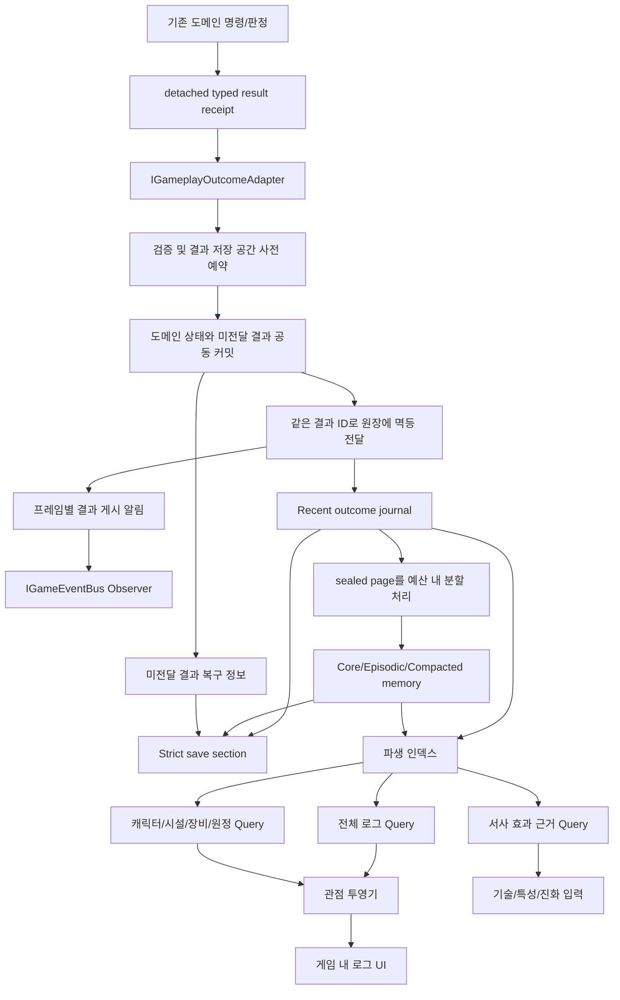

# 게임 결과 서사 원장 구현 계획

상태: 구현 전 구조 계약  
작성일: 2026-09-17  
수정일: 2026-09-18 — 성능·트랜잭션·인지 필터·분할 처리 검토 및 조사 오픈소스 재사용 결정 반영  
사용자 결정: 게임에서 실제로 확정되는 모든 의미 있는 결과를 먼저 기록하되, 중요도·반복도·참조 여부에 따라 장기 기억으로 승격하거나 요약·망각한다. 전체·캐릭터·시설·장비·원정 로그는 동일한 원본과 기억 링크를 관점별로 조회한다. 결과 종류가 늘어날 때 중앙 `if`/`switch` 분기를 추가하는 설계는 허용하지 않는다.

이번 수정은 구현 계약이며 성능 측정이나 런타임 원자성 검증을 완료했다는 뜻이 아니다. 아래 타입/API 예시는 책임을 설명하는 설계안이다.

| 피드백 | 판단 | 반영 계약 |
|---|---|---|
| Envelope·컬렉션 할당 | 채택, 원인 정정 | 인터페이스 선언 자체가 할당은 아니다. 건별 객체/배열 생성, boxing, 복사와 문자열 생성을 줄이는 value builder + 사전 확보한 chunk page를 사용한다. |
| 커밋 뒤 기록 실패 | 채택, 해결 방식 보강 | 도메인 변경과 미전달 결과 outbox를 같은 커밋에 포함한다. 사전 예약·멱등 전달·복구 상태로 정합성을 지키며 inlining이나 catch를 원자성의 근거로 삼지 않는다. |
| 목격자 링크 폭증 | 채택 | 실제 인지 근거와 중요도 임계값을 통과한 목격자에게만 sparse memory link를 만든다. 직접 피해자·수혜자·고정 근거는 필터에서 보호한다. |
| 날짜 경계 처리 spike | 채택 | 날짜 변경은 작업 예약만 한다. sealed page의 처리를 시간·항목 예산으로 나누고, 완료 결과만 revision 검증 후 게시한다. |
| 한글 조사 | 채택, 오픈소스 재사용 확정 | 공용 Josa Formatter 뒤에 C# 오픈소스 구현체를 연결한다. 받침·ㄹ 예외·숫자·외래 이름·서식 태그를 시험하며 프로젝트는 발음/표시 연결을 담당한다. |

## 1. 목표

게임 규칙에서 확정된 결과를 한 번만 구조화해 기록하고, 의미 있는 사건은 오래 보존하되 반복되는 일상 결과는 시간이 지나며 회상 가능한 에피소드로 통합한다. 다음 소비자는 동일한 사실 또는 명시적으로 통합된 기억을 사용한다.

- 게임 내 전체 사건 로그
- 캐릭터별 활동·인생 로그
- 시설 이력
- 장비 이력
- 전투·침입·원정 이력
- 기술·후천 특성·장비 진화·시설 진화의 서사 근거
- 향후 LLM 문장 생성과 학습 export

원장은 관찰 기록이다. 체력, 재고, 연구 진척, 관계, 시설 상태 등의 게임 상태를 다시 계산하거나 변경하지 않는다. 해당 상태의 기존 Aggregate와 명령 서비스가 계속 유일한 게임플레이 권위다. 망각은 서사 기록의 상세도와 조회 가능성만 바꾸며 이미 확정된 게임 상태를 되돌리지 않는다.

## 2. 현재 구조에서 그대로 쓸 것과 대체할 것

### 재사용

- `IGameEventBus`/`GameEventBus`: 원장 게시 후 UI에 변경 알림을 전달한다. 고빈도 건별 알림은 프레임별 sequence 구간으로 합칠 수 있으며 UI는 Query로 실제 결과를 읽는다. 기존 typed event 구독은 전환기 adapter에만 허용하며 최종 누락 방지 권위로 삼지 않는다.
- `DungeonStrictJsonSaveSection<TPayload, TRestoreCandidate>`: 엄격한 버전 검증과 원자적 restore 경계를 재사용한다.
- 기존 캐릭터·시설·장비·전투 도메인의 안정 ID와 실제 결과 receipt/event를 사용한다.
- `CharacterLogNarrativeService`의 LLM 요청 큐는 표현 계층에서만 재사용 여부를 검토한다.

### 원장 권위로 사용하지 않음

- `CharacterLog`는 캐릭터 GameObject가 소유하는 최대 80줄 표시 캐시다. `RestoreVisibleEntries`가 typed activity를 free-text로 복원하므로 전체 역사 권위가 될 수 없다.
- `CharacterActivityEvent`는 actor/target 하나와 단일 수치에 최적화돼 있어 다수 참여자, 복합 결과, 피해자·가해자·목격자 관점을 완전하게 표현하지 못한다.
- `CharacterNarrativeDomainUtility`와 `CharacterActivityFormatter`의 중앙 `switch`는 새 결과 원장의 dispatch 방식으로 확장하지 않는다.
- UI 문자열, ViewModel, LLM 문장은 기계 사실의 권위가 아니다.

## 3. 범위 정의

“모든 결과”는 매 프레임의 좌표·보간값·AI 탐색 후보가 아니라, 플레이 규칙에서 하나의 명령·판정·거래가 끝나며 확정된 의미 있는 결과를 뜻한다.

포함한다.

- 시작 후 확정된 성공, 실패, 부분 성공, 차단, 취소
- 작업 완료와 실제 생산·소비·품질
- 연구 진척과 완료·해금
- 건설·수리·철거·파괴
- 피해·치유·처치·생포·도주·구조
- 욕구·기분·관계·생애의 의미 있는 상태 전이
- 거래·수입·지출·재고 이전
- 원정·침입·사건·축제의 확정 결과
- 장비 사용·파손·수리·귀속·진화
- 기술·특성 획득·발현·소거
- 시설 이용·운영·진화
- 플레이어가 결과로 확인할 가치가 있는 시스템 실패

제외한다.

- 프레임별 이동 좌표와 애니메이션 상태
- 아직 선택되지 않은 AI 후보와 예상치
- 미확정 preview
- 같은 확정 결과에서 재계산 가능한 UI 임시 상태
- 디버그 전용 신호

제외 항목은 암묵적으로 버리지 않는다. 결과 생산자 전수 manifest에 `NonResult`와 구체적 이유를 기록한다.

## 4. 전체 구조



활성 원본 결과는 논리적으로 한 건이다. outbox는 동일 결과 ID의 미전달 receipt를 임시 소유하며, 원장 인계 후 중복 본문은 정리한다. 캐릭터별 기억 여부는 원본을 복제하지 않는 sparse memory link로 관리한다. 캐릭터별 로그와 관점별 문장은 활성 원본 또는 통합 기억의 파생 표현이다.

## 5. 공통 결과 계약

### 5.0 구현 전 구조 계약 요약

| 항목 | 확정 계약 |
|---|---|
| 콘텐츠 정의 | outcome descriptor, 관점 frame, importance/perception/consolidation policy와 조사 규칙은 명시 등록된 불변 정의가 소유한다. shared SO나 UI가 결과 의미를 정의하지 않는다. |
| 런타임 상태 | Ledger가 게시된 결과·기억·링크를 소유한다. 도메인 커밋이 소유하는 outbox는 아직 인계되지 않은 같은 결과의 복구 정보이며 게임 상태나 기억의 별도 권위가 아니다. |
| 명령 | Recorder의 `TryPrepare`가 검증/공간 예약하고, 도메인 커밋에 포함된 결과만 `TryDeliver`가 원장에 멱등 게시한다. 임의 `Append`와 커밋 후 별도 신규 기록 생성은 금지한다. |
| 조회 | UI·AI·검증기는 `IGameplayOutcomeQuery`와 파생 인덱스만 사용한다. 목록이나 ViewModel을 직접 변경할 수 없다. |
| 식별자 | outcome/type/operation/entity/role/metric을 각각 검증되는 typed stable ID로 분리하고 receipt 생산자가 발급한다. |
| 저장 | 도메인 상태·outbox·원장 게시 위치를 동일 save generation으로 캡처한다. 완료된 통합 결과만 저장하며 index/ViewModel/실행 중 worker는 복원 후 재계산한다. |
| 의존성 | 도메인 command/receipt → generic adapter/recorder → ledger → query/projector/UI 방향만 허용한다. ledger가 전투·생산 Aggregate를 호출하지 않는다. |
| 실패 정책 | 잘못된 계약은 커밋 전 거부한다. 전달 실패는 committed outbox에 보존해 재시도하며 fault 상태를 드러낸다. OOM/프로세스 종료의 무손실 복구를 약속하지 않는다. |
| 전환 범위 | 신규 gameplay truth의 `CharacterLog.AddLog(string)` 직접 쓰기를 단계적으로 제거한다. 구형 문자열은 `legacy.character-free-text`로만 보존한다. 영구 exact 보존 가정은 memory policy로 교체한다. |
| 검증 | 실제 생산·피해 명령, 다중 관점, 중요도·감쇠·통합·pin, 중복·변조 거부, strict save round-trip, coverage manifest, content-ID branch0과 canary core-diff0을 확인한다. |

### 5.1 안정 ID

문자열을 직접 비교하는 대신 검증되는 값 타입을 사용한다.

```csharp
GameplayOutcomeId       // run-id + monotonic sequence
GameplayOutcomeTypeId   // 예: combat.damage-resolved
GameplayOperationId     // 원인이 된 명령·작업·전투·거래 ID
GameplayResultKey       // producer/operation/commit-revision/local-result-index
GameplayEntityId        // character/facility/equipment/expedition 등 typed ref
GameplayRoleId          // attacker, victim, healer, beneficiary, witness 등
GameplayMetricId        // health.damage, item.produced, research.progress 등
```

ID 문법과 발급 주체는 공통 계약에서 검증한다. 표시 이름, 좌표 또는 이름 prefix로 ID를 추측하지 않는다. 커밋된 outbox는 최초 발급된 result key와 outcome ID를 보존하고 재시도마다 새 sequence를 발급하지 않는다. 런타임 표의 숫자 handle은 세션 내 최적화이며 저장/export에는 안정 ID 또는 버전이 있는 해당 ID table을 쓴다.

### 5.2 `GameplayOutcomeEnvelope`

다음은 저장/export/저빈도 상세 조회용 논리 DTO다. 전투·작업 캡처 때 매번 이 클래스와 컬렉션을 생성하라는 계약이 아니다. `IReadOnlyList<T>`는 그 자체로 불변성이나 할당을 결정하지 않으므로 저장 계층은 backing buffer의 소유권도 검증한다.

```csharp
public sealed class GameplayOutcomeEnvelope
{
    public GameplayOutcomeId OutcomeId;
    public GameplayOutcomeTypeId OutcomeTypeId;
    public GameplayOperationId OperationId;
    public long Sequence;
    public int AbsoluteDay;
    public GameplayOutcomeStatus Status;
    public IReadOnlyList<GameplayOutcomeParticipant> Participants;
    public IReadOnlyList<GameplayOutcomeMetric> Metrics;
    public IReadOnlyList<GameplayEntityReference> Subjects;
    public IReadOnlyList<GameplayOutcomeTagId> Tags;
    public GameplayLocationReference Location;
    public GameplayOutcomeCausation Causation;
}
```

참여자는 캐릭터 하나당 여러 역할을 가질 수 있다.

```text
character:A → attacker, source
character:B → defender, victim
character:C → witness, party-member
```

수치는 metric ID, 값, 단위, 정의/인스턴스 참조로 저장한다. 자유로운 설명 문자열에 피해량이나 생산량을 숨기지 않는다.

### 5.3 고빈도 기록의 메모리 형식과 소유권

기본안은 **값 타입 builder + 미리 확보한 고정 크기 chunk page**다. 건마다 커다란 고정 버퍼를 struct 안에 넣지 않고, header 배열과 participant/metric/role 배열을 offset/count로 연결한다.

```csharp
// 개념 예시: 값만 포함하며 backing page의 lease 동안만 읽는다.
public readonly struct OutcomeRecordHeader
{
    public readonly long Sequence;
    public readonly int OutcomeTypeHandle;
    public readonly BufferSlice Participants;
    public readonly BufferSlice Metrics;
    public readonly BufferSlice Subjects;
}
```

- 로딩 시 page, 보조 배열, dictionary 용량을 확보한다. commit 구간은 예약된 범위 쓰기와 상태 전이만 수행하며 `new List`, LINQ, boxing, 문자열 보간, JSON, 해시, 동기 I/O를 호출하지 않는다.
- Builder와 receipt는 `in`/`ref` 전달을 사용한다. hot path에서 값 타입을 `object`나 비제네릭 collection에 넣지 않는다. `IReadOnlyList` 기반 DTO materialization은 상세 조회·export·저장 단계로 미룬다.
- 안정 ID·이름 snapshot은 수명이 한정된 세션 table에서 관리하고 header는 handle을 참조한다. `string.Intern`으로 모든 사건 문자열을 영구 보관하지 않는다. 이름 변경 시 새 snapshot revision을 만들고 이전 이름 참조를 유지한다.
- 광역기처럼 participant가 작은 inline 용량을 넘으면 필요한 추가 page를 **커밋 전에** 예약한다. fixed capacity 때문에 피해자나 실제 수치를 자르지 않는다.
- `ArrayPool<T>`는 임시 builder/worker scratch에 선택적으로 쓴다. 풀에 여유가 없으면 Rent도 할당할 수 있으므로 zero-allocation 보증으로 사용하지 않는다. 실제 `Length`와 유효 `Count`를 구분하고, 읽기 전에 쓰기 완료 여부를 보장한다. 같은 풀로 정확히 한 번 반환하며 참조를 포함하면 잔존 참조를 정리한다. [ArrayPool 계약](https://learn.microsoft.com/en-us/dotnet/api/system.buffers.arraypool-1.rent?view=net-10.0)
- 풀에서 빌린 배열을 반환한 뒤 DTO/비동기 작업이 계속 참조하게 두지 않는다. 장기 page로 복사하거나 lease 소유권을 넘긴다. save snapshot·Query·worker 중 하나라도 page를 읽으면 재사용하지 않는다.
- ring buffer는 준비/전달 큐에만 사용할 수 있다. 가득 찼다고 미전달·recent·anchored 결과를 덮어쓰는 동작은 금지한다. 여유 부족은 커밋 전에 `CapacityDeferred`로 반환하고 같은 operation을 대기시킨다. 용량 확장은 분할 유지보수에서 수행하며 실패/대기를 측정한다.
- 새 컬렉션 전체를 매 append마다 복사하는 `immutable list 교체` 방식은 채택하지 않는다. 게시된 record는 불변으로 유지하고 page의 사용 길이/게시 revision만 단일 작성자가 갱신한다.
- 정규화된 primitive column을 versioned codec으로 직렬화한다. 구조체의 raw memory dump나 CLR layout에 의존하는 저장은 사용하지 않는다.

재사용·boxing 회피는 Unity 권고에 맞추되 실제 backend에서 측정한다. 목표는 warm-up 이후 지원 용량 내 recorder hot path의 `GC.Alloc = 0 B/result`이며 cold start·page 확장·저장·표현 비용은 따로 보고한다. 현재 Event Bus의 subscriber snapshot 할당까지 사라졌다고 주장하지 않는다. [Unity GC 지침](https://docs.unity3d.com/cn/2022.3/Manual/performance-garbage-collection-best-practices.html)

## 6. 분기 폭증을 막는 확장 패턴

### 6.1 Mandatory recorder와 Observer의 역할 분리

`IGameEventBus`의 구독 여부나 MonoBehaviour 수명에 따라 기록이 빠지면 안 된다. authoritative command는 **준비 → 도메인 상태와 미전달 receipt 공동 커밋 → 원장에 전달 → UI 통지** 순서를 따른다. 세부 원자성·저장·복구 계약은 10장에 둔다. 이전의 `ApplyDamage(); Record(receipt);` 두 독립 호출은 이 계약을 충족하지 않는다.

```csharp
public interface IGameplayOutcomeRecorder
{
    OutcomePrepareResult TryPrepare<TReceipt>(
        in TReceipt receipt, out PreparedOutcomeToken prepared);
    OutcomeDeliveryResult TryDeliver(in CommittedOutcomeToken committed);
    void CancelPrepared(in PreparedOutcomeToken prepared);
}
```

Token은 domain transaction adapter만 발급·전이할 수 있는 내부 계약이며 UI나 임의 호출자가 committed token을 만들 수 없다. 같은 committed token의 전달은 멱등이다. UI에는 원장 게시 후에만 알리며 표시 지연이 있는 경우 실제 게임 효과를 다시 실행하지 않는다. 기존 domain event를 직접 구독해 기록하는 adapter는 전환기 비교용이며 최종 원자성 증거로 세지 않는다.

### 6.2 Generic Adapter

```csharp
public interface IGameplayOutcomeAdapter<TReceipt>
{
    OutcomePrepareResult TryWrite(
        in TReceipt receipt, ref OutcomeWriteBuilder builder);
}
```

각 adapter는 자신의 typed result receipt를 값 builder에 쓴다. effect 재실행, ID 재발급, 표시 문장 생성은 하지 않는다. 새 결과 종류는 adapter와 descriptor를 등록한다. 중앙 recorder, ledger, save DTO, Query에는 콘텐츠별 분기를 추가하지 않는다.

### 6.3 Descriptor/Strategy Registry

```csharp
public interface IGameplayOutcomeDescriptor
{
    GameplayOutcomeTypeId OutcomeTypeId { get; }
    OutcomeValidationResult Validate(in GameplayOutcomeReadView outcome);
    INarrativePerspectiveProjector PerspectiveProjector { get; }
}
```

Registry 요구사항:

- typed ID 기준 정확히 한 descriptor
- 중복 ID, 누락 adapter, 누락 projector는 시작 시 fail-loud
- runtime reflection 자동 탐색을 dispatch 권위로 사용하지 않음
- VContainer의 interface collection 또는 생성된 registration source로 명시 등록
- 결과 ID를 검사하는 중앙 `if`, `switch`, 이름 prefix 분기 금지

### 6.4 전수 coverage manifest

모든 authoritative command의 result receipt와 `IGameEventBus.Publish<T>` 생산 event를 함께 자동 열거해 다음 중 하나로 분류한다.

```text
event-type | producer | authority receipt | classification
adapter/descriptor | commit/outbox boundary | save | UI/query | test | status
```

분류는 다음 둘 중 하나만 허용한다.

- `Record`: 등록된 adapter와 descriptor가 있음
- `NonResult`: UI 요청·preview·디버그 신호 등 구체적 제외 사유가 있음

미분류 event, adapter 없는 `Record`, 생산자 없는 descriptor는 빌드 감사를 실패시킨다. 이 manifest가 “모든 결과”의 누락 방지 권위다.

## 7. 관점별 문장 투영

### 7.1 조회 관점

```csharp
public readonly struct NarrativePerspectiveContext
{
    public readonly GameplayEntityId ViewerId;
    public readonly NarrativePerspectiveKind Kind; // Global, Character, Facility, Equipment, Expedition
    public readonly string Locale;
}
```

투영기는 viewer가 해당 결과에서 가진 모든 역할을 구한다.

```csharp
public interface INarrativePerspectiveProjector
{
    NarrativeView Project(
        in GameplayOutcomeReadView outcome,
        NarrativePerspectiveContext perspective);
}
```

### 7.2 역할별 표현

하나의 피해 결과는 원본 한 건에서 다음처럼 투영된다.

- 공격자: `B를 공격해 피해 18을 입혔다.`
- 피해자: `A의 공격을 받아 피해 18을 입었다.`
- 목격자: `A가 B에게 피해 18을 입히는 모습을 보았다.`
- 전체: `A가 B를 공격해 피해 18을 입혔다.`

`옆구리`, `베었다`, `목격했다` 같은 구체적 부위·행동·인지 표현은 원본에 그 사실이 있을 때만 쓴다. 예시의 A/B는 역할을 설명하는 자리표시자이며 실제 이름의 조사는 7.4에서 결정한다.

역할 처리는 중앙 분기가 아니라 descriptor가 가진 관점 frame 목록으로 한다.

```text
PerspectiveFrameDefinition
- requiredRoles
- excludedRoles
- priority
- formatterStrategyId
- visibleMetricIds
```

캐릭터가 반사 피해처럼 공격자와 피해자 역할을 동시에 가지면 두 역할에 맞는 복합 frame을 우선한다. 일치 frame이 없으면 임의 global 문장으로 가장하지 않고 해당 descriptor 검증을 실패시킨다.

### 7.3 저장되는 것

- 해당 기억의 보존 기간 동안 저장: 구조화된 결과와 display-name snapshot
- 저장 가능: 실제로 생성·확정된 관점 문장의 캐시와 renderer/Josa version. 모든 viewer×결과의 문장을 미리 만들지 않으며 원본 망각 시 해당 캐시도 회수한다.
- 저장하지 않음: 필터 인덱스, UI 페이지, ViewModel

LLM 문장은 기계 사실을 변경할 수 없다. LLM 실패 시 원본 결과는 이미 보존되며, UI는 descriptor의 정확한 canonical 문장을 표시하고 실패 상태를 진단에 남긴다. LLM이 만든 문장은 source outcome ID, perspective, renderer/model version과 함께 검증된 경우에만 캐시한다.

### 7.4 공용 한글 조사와 발음 정보

사용자 결정에 따라 조사 선택은 오픈소스를 재사용한다. 모든 한국어 perspective frame은 공용 `IKoreanJosaFormatter`를 통해 해당 구현체를 호출한다. 각 projector에서 이름 끝 글자를 보고 별도 `if`를 구현하거나, 완성 문장 전체를 정규식으로 바꾸지 않는다. 아래의 종성/발음 규칙은 자체 조사 엔진을 새로 작성하라는 뜻이 아니라 도입 구현체와 어댑터가 지켜야 할 검증 계약이다.

```text
frame: {attacker:이/가} {victim:을/를} 공격해 {damage}의 피해를 입혔다.
입력: display-name snapshot + pronunciation hint + 문법 토큰
출력: 각 이름의 실제 발음과 관점에 맞게 조사가 결정된 문장
```

계약:

- 조사를 붙일 display token과 TMP/색상/링크 markup은 분리한다. 받침 판정에는 태그와 끝 인용부호·공백을 제외하되 화면 이름은 그대로 유지한다.
- 한글 이름의 발음용 문자열은 등록/이름 변경 때 NFC로 정규화한다. 현대 한글 음절 `U+AC00..U+D7A3`의 종성 index는 `(codePoint - 0xAC00) % 28`이다. index 0은 받침 없음이며 `으로/로`는 index 8인 ㄹ 받침도 `로`를 사용한다. 이 연산은 해당 범위에서만 적용한다. [Unicode 한글 알고리즘, 3.12절](https://www.unicode.org/versions/Unicode16.0.0/core-spec/chapter-3/)
- `은/는`, `이/가`, `을/를`, `과/와`, `으로/로`를 지원하며 공유 grammar rule 하나로 처리한다. 이것은 유한한 언어 규칙이며 사건·콘텐츠별 분기와 다르다.
- 숫자·영문·약어·혼합 이름은 의미/발음이 달라질 수 있으므로 마지막 UTF-16 code unit만으로 추측하지 않는다. 이름 데이터에 한국어 읽기 또는 `None/Consonant/Rieul/Unknown` 종성 정보를 둘 수 있다. 숫자는 unit/number formatter가 사용한 읽기를 따른다.
- 발음이 불명확하면 사전에 정의한 조사 없는 frame(예: `공격자: X · 대상: Y · 피해: 18`)을 명시적으로 사용하고 authoring 진단에 `UnknownPronunciation`을 남긴다. 추측한 조사로 자연어 생성 성공을 주장하지 않는다.
- 조합형 자모, surrogate pair/emoji, rich text가 있는 이름도 범위를 벗어난 계산이나 문장 손상을 만들지 않는다. Unicode 범위 밖 문자는 등록된 발음 정보 또는 위 중립 frame을 쓴다.
- 종성 판정은 이름 snapshot revision·발음 정보 revision·locale·formatter version으로 캐시한다. 완성된 조사까지 캐시하면 선택한 조사 쌍과 number formatter의 읽기 문맥도 키에 포함한다. LLM 자유 문장의 오류는 검증/재요청하고, 우연히 일치한 부분 문자열을 일괄 교체하지 않는다.

필수 예: `세린이/유나가`, `세린을/유나를`, `서울로/성으로/바다로`, 숫자 읽기, `Alice`와 한국어 발음 힌트, 끝 따옴표/태그, NFC·NFD 동등 이름, 알 수 없는 발음이다. 피해 숫자 역시 `18을`처럼 임의 조사를 이어 붙이지 않도록 실제 number formatter와 함께 시험한다.

#### 7.4.1 오픈소스 도입 결정과 연결 범위

- C# 구현은 [SmartFormat.NET-Korean](https://github.com/what-studio/SmartFormat.NET-Korean)의 조사 선택부를 사용한다. upstream은 SmartFormat.NET용 조사 포매터이며 숫자·구두점·`으로/로`와 조사 분리 출력을 문서화한다. 라이선스는 BSD-3-Clause다. 현재 고정한 upstream commit은 `cd149be3a683a2ef49fbef44e31308d39c3ca375`이며, 프로젝트에는 SmartFormat 런타임 전체가 아니라 Unity 의존성을 늘리지 않는 좁은 포트만 포함한다.
- 도입 전에 현재 Unity의 .NET API profile, SmartFormat 의존 버전/namespace 충돌, 실제 배포 backend와 필요한 출력 예제를 확인한다. 통과한 버전 또는 commit과 배포 파일 SHA-256을 고정한다. 최신 버전 자동 추종은 하지 않는다.
- 원본 LICENSE·저작권 고지와 배포 시 필요한 notice를 보존한다. 수정/이식이 필요하면 upstream 출처·고정 commit·로컬 수정 범위를 남긴다. 호환성 실패를 숨기거나 임의의 자체 엔진으로 대체하지 않고 원인과 다음 도입 후보를 보고한다.
- 게임 어댑터는 표시 이름 snapshot, 한국어 발음 정보, 숫자/단위 읽기, 서식 분리, 캐시와 진단만 연결한다. 조사 선택 규칙을 projector마다 복제하지 않는다. 발음 힌트를 라이브러리에 넘겨 조사만 구한 경우에도 화면에는 원래 표시 이름을 유지한다.
- 알 수 없는 발음에 대한 upstream의 조사 병기를 정상 자연어 성공으로 취급하지 않는다. 어댑터가 `UnknownPronunciation`을 명시하고 위의 중립 frame을 사용한다. LLM 자유 문장 교정은 이 구조화된 token 포매팅과 별개다.
- 숫자는 `1=일`, `10=십`, `100=백`, `1000=천`처럼 실제 읽기 전체를 기준으로 검증한다. `1`을 받침 없음으로 분류하거나 모든 수를 마지막 숫자 하나로 처리하지 않는다. 소수·단위·한자어/고유어 수사와 식별자 한 자리씩 읽기는 number formatter의 문맥을 따른다.
- `L=엘`, `M=엠`, `N=엔`, `R=알`은 이니셜 읽기로 지정한 token의 테스트에 포함한다. 모든 영문 고유 명사의 마지막 알파벳에 이 규칙을 적용하지 않는다. 일반 이름은 등록한 한국어 발음 또는 명시적 unknown 상태를 쓴다.
- [es-hangul](https://github.com/toss/es-hangul)은 브라우저 도구가 필요할 때 별도로 검토할 수 있는 JavaScript 후보이며 이번 Unity 의존성에 추가하지 않는다. 브라우저가 별도 조사 결과를 저장 권위로 만들지 않으며 authoritative 표시가 필요하면 C# export 문장을 사용한다.

현재 상태는 **오픈소스 재사용 정책 확정 / source·commit·license·원본 SHA-256 고정 / 공용 C# 어댑터 연결 / 독립 회귀 통과 / Unity Editor·Player 실행 검증 전**이다. vendored 근거는 `Assets/ThirdParty/SmartFormat.NET-Korean/PROVENANCE.json`, 고지는 같은 디렉터리의 `NOTICE.md`, 라이선스 전문은 `LICENSE`에 둔다. `IKoreanJosaFormatter` 연결이나 독립 회귀만으로 최종 구현 완료를 선언하지 않는다.

## 8. 원장과 조회

### 8.1 쓰기 권위

`GameplayOutcomeLedger`가 recent 결과, 장기 기억과 통합 기억의 유일한 쓰기 권위다.

```csharp
internal interface IGameplayOutcomeJournalWriter
{
    OutcomeDeliveryResult TryPublish(in CommittedOutcomeToken committed);
}
```

규칙:

- 새 결과 수집은 append-only
- 동일 `GameplayResultKey` 재전달은 `AlreadyPublished`를 반환하고 추가 행을 만들지 않음
- 같은 result key인데 payload가 다르면 충돌로 거부
- 결과 순서는 monotonic sequence로 결정
- exact 결과를 제자리에서 수정·덮어쓰기 금지
- 망각은 별도 deterministic consolidation transaction으로만 exact→core/episodic/compacted/forgotten 상태를 전이
- 게임 결과가 확정된 뒤에만 기록
- preview와 재생성 후보는 기록 금지

### 8.2 Query

```csharp
public interface IGameplayOutcomeQuery
{
    OutcomePage GetGlobal(OutcomeCursor cursor, OutcomeFilter filter);
    OutcomePage GetForEntity(GameplayEntityId id, OutcomeCursor cursor, OutcomeFilter filter);
    OutcomePage GetForOperation(GameplayOperationId id);
    OutcomePage GetNarrativeEvidence(NarrativeEvidenceQuery query);
}
```

파생 인덱스:

- participant/entity ID
- role ID
- facility/equipment/expedition instance ID
- outcome type/tag
- operation ID
- location/room
- sequence/day

인덱스는 원장에서 재생성하며 저장 권위가 아니다. 캐릭터별·시설별로 결과를 복제하지 않는다.

### 8.3 기억 계층

모든 결과는 우선 recent journal에 exact 형태로 들어간다. 날짜 경계에서는 `NarrativeMemoryConsolidationService`의 처리 대상 cutoff만 예약한다. 다음 상태의 계산·hash·정리는 8.9의 시간 분할 작업이 맡는다.

| 계층 | 보존 형태 | 용도 |
|---|---|---|
| `Core` | exact 영구 보존 | 사망·탄생·중상·배신·우두머리·최초·진화·플레이어 pin·서사 효과 근거 |
| `Episodic` | exact 장기 보존, 느린 감쇠 | 눈에 띄는 성공·실패·관계 사건·희귀 사건 |
| `Recent` | exact 단기 보존 | 아직 평가·통합되지 않은 일상 결과 |
| `Compacted` | 여러 exact 결과를 한 에피소드로 집계 | 반복 작업·식사·순찰·일상 연구 같은 습관 기억 |
| `Forgotten` | 상세 제거 | 중요도와 참조가 모두 낮고 통합 가치도 없는 오래된 결과 |

단순 시간 경과만으로 Core가 삭제되지 않는다. Exact 결과가 다음 중 하나에 해당하면 `Anchored`로 고정한다.

- 기술·후천 특성·장비·시설 진화의 evidence로 실제 사용됨
- 아직 끝나지 않은 명령·사건·관계·원정의 인과 사슬에 연결됨
- 플레이어가 기억 고정 표시를 함
- 비가역 상태 변화 또는 descriptor가 정의한 세계/인물 이정표임
- 다른 장기 기억의 원인으로 참조됨

### 8.4 캐릭터별 기억 강도

같은 사건도 인물마다 기억 강도가 다르다. 결과를 복사하는 대신 다음 link를 둔다.

아래는 논리 저장 형태다. 런타임 링크는 재사용하는 struct page의 sparse row로 관리하며 role/anchor는 별도 table의 slice로 참조한다. 모든 참여자마다 클래스·배열을 할당하지 않는다.

```csharp
public sealed class NarrativeMemoryLink
{
    public GameplayOutcomeId OutcomeId;
    public GameplayEntityId SubjectId;
    public IReadOnlyList<GameplayRoleId> Roles;
    public float Salience;
    public NarrativeMemoryTier Tier;
    public bool IsPinned;
    public IReadOnlyList<NarrativeEvidenceReference> Anchors;
}
```

예를 들어 피해18 사건은 피해자에게 높은 salience, 공격자에게 중간 salience, 목격자에게 낮은 salience가 될 수 있다. 피해자는 exact Episodic 기억을 유지하는 동안 목격자는 시간이 지나 같은 전투의 Compacted 기억만 남길 수 있다.

### 8.5 중요도 계산

LLM은 중요도나 삭제 여부를 결정하지 않는다. Descriptor가 선언한 policy와 실제 결과만 사용해 C#이 결정론적으로 계산한다.

```text
importance =
  base semantic importance
  + novelty/first-time contribution
  + normalized mechanical magnitude
  + emotional/relationship relevance
  + identity/goal relevance
  + causal consequence contribution
  + player pin/evidence anchor
  - repeated-signature penalty
  - deterministic age decay
```

세부 가중치·최소 보존 기간·감쇠 곡선은 descriptor의 `IOutcomeMemoryPolicy`가 소유한다. 원장 core는 outcome type ID를 검사하지 않고 registry에서 policy를 받는다.

반복 감쇠는 같은 `memorySignature`가 쌓일수록 individual salience를 낮춘다. Signature 구성도 descriptor가 제공하며 중앙에서 결과 종류를 분기하지 않는다.

### 8.6 기억 통합

반복 exact 결과를 무조건 삭제하지 않고 먼저 하나의 `CompactedNarrativeMemory`로 합칠 수 있는지 검사한다.

```csharp
public sealed class CompactedNarrativeMemory
{
    public NarrativeMemoryId MemoryId;
    public GameplayMemorySignature Signature;
    public long FirstSequence;
    public long LastSequence;
    public int FirstDay;
    public int LastDay;
    public int OccurrenceCount;
    public IReadOnlyList<GameplayOutcomeMetricAggregate> Metrics;
    public IReadOnlyList<GameplayOutcomeParticipant> Participants;
    public string SourceSegmentHash;
}
```

예: 제련 완료14건을 `12일 동안 제련 작업을 14회 마쳐 철괴 56개를 만들었다.`라는 한 기억으로 통합한다. 합산 가능한 metric, 같은 행위인지 여부, 장소·대상 결합 가능성은 `IOutcomeMemoryConsolidator`가 검증한다. 실패·부상·품질 이상치처럼 의미가 다른 결과를 평범한 성공 묶음에 섞지 않는다.

통합 시 canonical 순서의 원본을 스트리밍해 `SourceSegmentHash`를 계산하고, 별도의 `CompactedPayloadHash`로 통합 결과의 저장 손상을 검사한다. 원본을 망각한 뒤에는 source hash만으로 원본의 사실을 다시 증명할 수 없으므로, 삭제 전 count/metric 대조가 통과해야 한다. hash는 진위 인증이나 중복 방지의 대체물이 아니다.

서로 다른 signature가 섞인 범위에서 `FirstSequence..LastSequence`만으로 모든 원본이 포함됐다고 판단하지 않는다. 처리 segment의 membership/완료 정보를 쓰고, 중간에 미처리·pinned 결과가 있으면 건너뛰어 닫힌 범위로 표시하지 않는다. 중복 재수집은 원장 sequence 새 발급으로 피할 수 없도록 producer/operation의 영속 commit revision 및 outbox ack 경계로 거부한다. 미완료 operation은 보존하며, 닫힌 operation의 receipt 정리는 해당 도메인의 기존 멱등성/저장 계약을 통과한 후에만 허용한다.

### 8.7 UI와 서사 근거에서의 망각

- 전체/캐릭터 로그는 `Recent`, `Core`, `Episodic`, `Compacted`를 시간순으로 섞어 보여 줄 수 있다.
- `Forgotten` 상세 사건은 일반 UI와 LLM evidence에서 조회되지 않는다.
- `Compacted` 기억은 반복 숙련·생활사 근거로 사용할 수 있지만, 존재하지 않는 단일 사건의 대사·대상·장소를 복원하지 않는다.
- exact evidence가 기술·특성·진화에 사용되는 순간 해당 outcome과 subject link를 anchor한다.
- 플레이어가 pin을 해제해도 다른 anchor가 남아 있으면 자동 망각하지 않는다.
- 기억 통합은 캐릭터의 게임 스탯이나 실제 숙련 수치를 변경하지 않는다.

### 8.8 목격자의 인지 필터와 N:M 제한

`IOutcomePerceptionPolicy`는 recorder의 준비 단계에서 실제 perception receipt와 사건 당시의 관계·역할을 받아 **개인 기억 링크를 생성할지** 결정한다. 기준은 descriptor 데이터이며 중앙에서 전투·축제·재난 ID를 검사하지 않는다.

- 직접 행동자, 실제 피해자·치료 대상·재산 소유자 등 결과가 영향을 준 필수 subject는 임계값만으로 버리지 않는다. 실제 피해100명은 원본에서도100명이어야 한다.
- 선택적 목격자는 실제 시야·청취 등 인지 producer의 근거가 있고, 사건 당시 salience가 정책 임계값 이상인 경우에만 개인 link를 생성한다. 근처에 있었거나 같은 파티라는 이유로 `목격했다`고 만들지 않는다.
- link 할당 후에 걸러내지 않고 기존 공간/인지 Query 결과에서 사전 판정한다. 도시 전체 entity와 결과의 Cartesian product를 순회하지 않는다.
- 선택적 목격자 후보는 정책의 상한과 프레임 예산 안에서 다룬다. 상한 초과는 `salience 내림차순 → stable entity ID`로 결정론적으로 선택하며 누락된 개인에게 목격 기억을 만들어주지 않는다. 이 상한은 직접 피해 결과에 적용하지 않는다.
- 인지 receipt가 군중 집합을 보장하면 원본에는 group/집계 관찰을 저장할 수 있으나, 이를 근거로 구성원 전부가 알고 있다고 역추론하지 않는다. 과거 군중 membership이나 소유권은 현재 상태로 재구성하지 않는다.
- 생성되는 link는 `(outcomeId, subjectId)`당 하나이고 복수 role을 합친다. global log 자체에 모든 사람의 link를 만들지 않는다.
- 개인 link가 없으면 개인 기억 Query에는 나오지 않는다. 최근 global 사건에서 사용자가 pin을 누르면 provenance가 있는 새 player-reference를 만들 수 있지만, 해당 캐릭터가 과거에 직접 목격했다는 role을 소급 부여하지 않는다.
- 어느 subject라도 exact anchor를 가진 동안 공유 원본은 회수하지 않는다. 잊은 목격자가 다른 인물의 보존된 원본을 통해 다시 기억을 얻는 조회 우회도 차단한다.

즉, 원본 사실 참여자와 개인의 기억 link는 다른 책임이다. 인지 필터는 개인 목격 링크와 선택적 인지 상세를 줄이며, 실제 게임 결과의 대상·수치를 삭제하는 필터가 아니다.

### 8.9 시간 분할 통합과 worker 수명

기본 실행기는 메인 PlayerLoop에서 처리하는 시간 분할 scheduler다. UniTask는 프로젝트가 사용하는 버전에 맞춰 yield/cancellation 수단으로 쓸 수 있다. `async`/`UniTask` 선언만으로 계산이 별도 스레드에 옮겨가지는 않는다. [UniTask 실행 모델](https://github.com/Cysharp/UniTask#playerloop)

1. 날짜 변경 시 고정된 `evaluationDay`, `cutoffSequence`, `policyVersion`, `worldEpoch`와 처리 cursor를 예약한다. 매일 전체 역사 목록을 순회하지 않는다.
2. due-day index와 sealed recent page에서 처리 대상 segment만 가져온다. Episodic은 다음 평가 예정일이 온 항목만 방문하고 anchor 변경도 해당 항목을 재예약한다.
3. 매 프레임 `maxRecordsPerSlice`와 `maxElapsedTimePerSlice` 중 먼저 도달한 경계에서 yield한다. 한 사건의 participant 합산과 hash도 byte/항목 chunk로 나눠 거대한 단일 항목이 예산을 독점하지 않게 한다.
4. 결과는 detached delta로 만든다. 화면은 게시된 recent/기억을 계속 읽는다. 부분 합산 결과를 UI·LLM에 공개하거나 원본을 먼저 지우지 않는다.
5. 완료된 작은 segment 단위로 `worldEpoch`, source generation, policy 및 pin/anchor revision을 대조해 메인 스레드에서 게시한다. 작업 중 새 pin/evidence anchor가 생겼으면 해당 segment를 재평가하고 원본을 유지한다. unrelated 새 결과 append는 작업 전체를 무효화하지 않는다.
6. 합산·hash 병렬화가 실제 측정으로 필요한 경우에만 thread-pool worker를 추가한다. worker는 lease가 고정한 값 데이터만 읽고 Unity API·GameObject·가변 registry/원장에는 접근하지 않는다. Unity 쪽 게시와 알림은 메인 스레드에서 한다.
7. 저장은 완료된 segment와 나머지 exact 원본을 같은 generation으로 캡처한다. worker 완료를 기다리며 전체 backlog를 강제로 처리하지 않는다. 실행 중 scratch/hash context는 저장하지 않고 복원 시 미완료 segment를 재예약한다. 평가 기준일·정책·cursor metadata는 저장한다.
8. 씬 전환/로드/종료는 world epoch를 바꾸고 cancellation을 전파한다. worker가 끝나기 전 lease를 반환하지 않으며 예전 world의 completion은 게시를 거부한다. `Forget()`으로 수명과 예외 관찰을 버리지 않는다.

시간 예산은 언제 yield할지만 바꾸며 기억 선택 결과는 고정된 evaluation day와 입력 순서로 결정한다. 실제 프레임 수/worker 완료 순서에 따라 salience·합계·hash가 달라지면 실패다. 여러 처리 경로의 수치 합산과 정렬도 같은 순서를 따른다.

`backlog count/bytes/oldest age`, page high-water, link/원본 byte 비율, slice p95/p99/max를 측정한다. 유입량이 처리량보다 지속적으로 많으면 기록을 덮어쓰거나 anchor를 삭제하지 않고 처리 지연을 드러내며, 준비 단계의 capacity backpressure를 적용한다. 초기 예산값과 실제 장기 성장률은 타깃 빌드 측정 후 확정한다. Core/pin이 계속 생기는 한 저장량의 절대 상한이 저절로 생긴다고 주장하지 않는다.

## 9. 저장 계약

새 section ID는 `world.gameplay-outcome-ledger`, payload version은 1로 시작한다.

저장 원본:

- next sequence
- 세계/도메인 commit generation, 미전달 outbox의 result key·payload·commit 상태와 원장 인계 확인 정보
- consolidation 처리 segment/cursor metadata, evaluation day, watermark와 policy version
- recent exact outcome envelope
- Core/Episodic exact memory
- Compacted memory와 source segment provenance hash 및 저장된 통합 payload hash
- subject별 memory link, pin과 evidence anchor
- 확정된 관점 문장 캐시와 renderer version
- 전달 실패가 있었다면 숨기지 않는 capture fault metadata와 재시도에 필요한 원본 receipt

저장하지 않는 것:

- 필터 인덱스
- 정렬된 UI 목록
- ViewModel
- 미확정 LLM 요청
- 메모리 주소·pool 배열 참조·실행 중 worker·부분 hash context

복원 절차:

1. JSON shape와 payload version 검증
2. 모든 ID, 값 유한성, sequence, operation 중복 검증
3. descriptor registry에 모든 outcome type이 등록됐는지 검증
4. memory tier, 인지/link 정책 버전, anchor, 완료 segment와 통합 payload hash 검증
5. 도메인 commit·outbox·원장의 result key/ack 경계 교차 검증 및 미전달 복구 후보 구성
6. detached restore candidate와 필요한 page/index 생성
7. 전체 검증 성공 후 원자적으로 publish
8. 미전달 결과를 같은 ID로 재전달하고 미완료 통합 segment 재예약

하나라도 실패하면 기존 라이브 원장은 바뀌지 않는다. 알 수 없는 version/type/role/metric을 비슷한 값으로 대체하지 않는다.

최근 N개를 기계적으로 잘라내지 않는다. importance/anchor/consolidation policy를 통과한 결과만 상세를 잃으며, Core와 anchored 결과는 개수와 무관하게 exact 보존한다. 저장 크기와 로딩 시간을 계측하고, 결과가 같은 경우에만 segment 압축과 지연 인덱싱을 P1로 추가한다.

## 10. 커밋 정합성과 실패 정책

### 10.1 보장 범위

커밋된 결과는 **원장에 게시됨** 또는 **도메인과 함께 커밋된 outbox에 전달 대기 중** 둘 중 하나의 복구 가능한 상태로 존재해야 한다. 표현/UI/통합의 실패로 완료한 전투·생산을 재실행하지 않는다. `narrative-capture-failed` 로그 한 줄만 남기는 방식은 정합성 보장이 아니다.

`AggressiveInlining`은 최적화 힌트이며 할당 없음, 무예외, 원자성을 보장하지 않는다. 채택 여부는 실제 backend 측정으로 판단한다. OOM·강제 종료·치명적 런타임 오류를 `try-catch`로 안전하게 처리할 수 있다고 약속하지 않는다. 이 경우 지속성 보장 범위는 게임 상태와 기록이 함께 저장된 마지막 정상 체크포인트까지다. 매 사건 디스크 fsync 또는 프로세스 종료 직전까지의 무손실 journal은 이 계약에 포함하지 않는다. [MethodImplOptions 문서](https://learn.microsoft.com/en-us/dotnet/api/system.runtime.compilerservices.methodimploptions?view=net-10.0)

### 10.2 준비·공동 커밋·전달

| 단계 | 행동 | 실패 시 권위 상태 |
|---|---|---|
| Prepare | 도메인의 계산된 receipt를 검증하고 result ID, page 공간, 실제 참여자와 인지 링크 공간을 예약한다. | 계약 오류는 명시 실패, 용량 부족은 `CapacityDeferred`; 게임 효과·비용은 아직 미적용 |
| Commit | 도메인 변경과 동일 receipt를 가진 outbox 상태를 기존 transaction의 하나의 게시 경계로 확정한다. | 둘 다 committed 또는 둘 다 미확정. domain별 실패 원자성 증거 필요 |
| Deliver | committed token의 준비된 값만 원장에 게시하고 결과 ID를 확인한다. | 실패하면 committed outbox를 유지하며 `PendingDelivery`/fault 표시 |
| Acknowledge | 게시된 동일 ID를 확인한 뒤 인계 상태를 표시한다. | ack 직전 실패는 재전달해 `AlreadyPublished`로 종료 |
| Notify/Consolidate | 게시 범위를 UI에 통지하고 장기 기억 처리를 예약한다. | observer/worker 실패는 원본이나 도메인 상태에 영향 없음 |

- detached aggregate를 지원하는 도메인은 prepared state와 outbox 후보를 기존 root transaction에 함께 포함한다. in-place 도메인은 기존 rollback 가능한 command 경계에 outbox 전이를 통합하고 정상/실패 검증을 한다. 공용 recorder가 두 메서드를 순서대로 호출하거나 `lock`을 건 것만으로 원자성을 주장하지 않는다.
- 공동 커밋을 연결할 수 없는 생산자는 manifest에 `transaction-integration-pending`으로 남긴다. 단순 observer나 사후 `Record`를 붙여 완료 처리하지 않는다.
- `TryPrepare(in receipt)`의 정확한 호출 시점은 도메인 판정과 실제 참여자 계산이 끝나 순수 receipt가 완성된 직후이자, 그 결과를 권위 상태에 쓰기 직전이다. 광역기·군중 사건의 가변 인원을 추측해 미리 예약하지 않는다. Prepare의 receipt와 실제 commit revision/결과가 일치해야 하며, 상태가 바뀌어 준비가 무효가 되면 commit 전 취소·재준비하되 RNG나 결과를 새로 굴려 이익을 만들지 않는다.
- Prepare와 Commit 사이에는 임의 `await`, 외부 callback, scene 전환을 넣지 않는다. token은 `worldEpoch`와 owner revision에 결속하며 취소 때 미공개 예약 공간을 반환한다.
- Commit 성공 시 준비 공간의 소유권은 outbox로 이동한다. 준비 token의 `Dispose`/cleanup이 committed receipt를 지울 수 없게 상태를 검증한다.
- 메인 스레드 single-writer가 이 경계를 소유한다. 저장은 그 경계 밖에서 동일 generation의 도메인/outbox/원장을 캡처하며 부분 커밋 중에는 시작하지 않는다.

### 10.3 예외 격리·포화·복구

- 데이터 검증과 용량 판단은 `TryPrepare` 결과 코드로 반환한다. 예상 가능한 실패를 고빈도 throw/catch로 처리하지 않는다.
- `TryDeliver` 진입점은 catch 가능한 기록 서브시스템 오류를 격리한다. outbox와 준비 payload를 유지하고 `DeliveryFaultPending`을 반환한다. 진단에는 사전 확보한 슬롯의 오류 코드/result key/카운터를 쓰며 catch 안에서 새 JSON·보간 문자열·거대한 stack trace를 만들지 않는다.
- 도메인 mutation 예외는 해당 transaction이 처리한다. Recorder가 광범위한 `catch(Exception)`으로 삼켜 gameplay 성공을 반환해서는 안 된다. OOM, stack overflow, 프로세스 손상은 정상 복구 가능 오류로 취급하지 않는다.
- observer callback은 gameplay commit 밖에서 호출하고 observer별 catch 가능한 오류를 진단한다. UI observer의 실패 때문에 도메인 호출자가 같은 작업을 다시 실행하는 경로를 차단한다. 기존 Event Bus의 전체 동작 변경 여부는 연결 조사 뒤 최소 범위로 결정한다.
- 전달 재시도는 같은 committed receipt/ID에 한정한다. 재시도에서도 실패하면 fault를 유지하고 다음 안전한 처리 기회에 재시도한다. 원본 도메인 command는 재실행하지 않는다.
- outbox/queue 포화 시 미전달 결과를 덮어쓰지 않는다. 후속 command는 상태 변경 전에 capacity 대기 상태를 반환하고 UI/AI에 재시도 가능성을 알린다. 이를 서사 속 실패·취소 사건으로 꾸미지 않는다. 대기 발생은 성능 gate 실패로 측정하고 용량/처리량을 보완한다.
- outbox receipt의 회수는 인계와 durable save checkpoint가 안전하다는 것을 확인한 뒤 수행한다. 인계된 본문은 journal page의 같은 payload를 참조하고 outbox에는 필요한 ack/lease metadata만 유지한다. 인계 완료 본문을 이중 직렬화하지 않으며, checkpoint 전 필요한 payload가 통합으로 사라지지 않도록 보존한다. 저장 중에는 정상적으로 기록된 결과와 아직 outbox에 있는 결과를 모두 포함한다. fault가 있다는 이유로 recoverable receipt를 버리거나 정상 저장 완료로 위장하지 않는다.
- 저장 실패는 기존 저장 파일과 라이브 권위 상태를 보존한다. 복원은 도메인·outbox·원장을 함께 검증하고, 게시된 결과와 중복되는 미전달 receipt는 동일 ID로 멱등 처리한다.

여유 있는 정상 경로의 무할당은 측정 목표다. 유한 메모리에서 임의의 무한 유입량, zero-latency, 완전 무손실을 동시에 보장하지 않는다. 용량 부족을 커밋 전에 드러내는 정책이 원자성과 기록 보존을 지키는 경계다.

## 11. 기존 로그 전환

### 단계 A: 병행 관찰

- 새 원장이 실제 결과를 기록한다.
- 기존 `CharacterLog` 표시는 유지하되 새 원장 결과와 중복 여부를 측정한다.
- 기술·특성 생성은 아직 기존 입력을 사용한다.

### 단계 B: UI Query 전환

- 전체 로그와 캐릭터 로그가 `IGameplayOutcomeQuery`를 사용한다.
- `CharacterLog`의 최근 80줄은 표시 호환 캐시로만 남긴다.
- 신규 gameplay truth를 `CharacterLog.AddLog(string)`에 직접 쓰는 경로를 금지한다.

### 단계 C: 서사 근거 전환

- 기술·특성·장비·시설 생성기가 원장 query에서 실제 outcome ID를 선택한다.
- influence use count는 outcome ID에 연결하지만 원본 outcome을 수정하지 않는다.
- AI export는 원장 원본의 typed participant/metric/context를 사용한다.

### 기존 저장 마이그레이션

구형 캐릭터 문자열 로그는 사실을 역추론하지 않는다. 캐릭터 ID와 원문만 가진 `legacy.character-free-text` 결과로 한 번 가져오고, 기계 수치 근거나 인과관계 근거로 사용하지 않는다.

## 12. 구현 배치

### 배치 0 — 조사와 manifest

- 모든 실제 authoritative result receipt, `TryPrepare`/공동 커밋 연결 후보와 `Publish<T>` 생산자를 열거한다.
- `Record/NonResult` coverage manifest 초안을 만든다.
- 기존 캐릭터·시설·장비 원장과 중복·저장 경계, rollback/공동 커밋 가능 여부를 표시한다.
- 결과 크기, 직접 참여자와 선택적 목격자의 분포, 버퍼 소유권과 초기 용량을 계측한다. 현재 backend·UniTask 사용 버전·공용 조사 유틸리티 유무와 7.4.1의 오픈소스 의존 호환성도 확인한다.
- 완료 조건: 미분류 생산자 0, 단 아직 구현되지 않은 `Record`는 `planned`로 명시한다.

### 배치 1 — 공용 원장 수직 슬라이스

- typed ID, value builder/page/lease, registry, ledger, query, save section을 구현한다. 저장 DTO와 hot path를 분리한다.
- 작업 생산 완료와 전투 피해 결과를 사전 예약·공동 커밋 outbox·멱등 전달의 첫 실제 수직 슬라이스로 연결한다. 각 실패 경계에서 게임 상태와 기록을 대조한다.
- 공격자·피해자·목격자·전체 관점 문장을 검증한다. 버전/해시/notice를 고정한 오픈소스 구현체를 공용 Josa Formatter에 연결하고 대표 조사 회귀를 수행한다.
- sparse subject link, 인지 필터, importance policy, pin과 날짜별 예약/시간 분할 통합을 함께 연결한다.
- 반복 작업 exact 결과가 Compacted 기억으로 합쳐지고 피해자의 중요 사건은 exact로 남는지 확인한다.
- 새 outcome type canary를 descriptor/adapter 등록만으로 추가하고 core diff 0을 확인한다.

### 배치 2 — 게임 로그 UI 전환

- 전체 로그의 cursor/paging/filter를 연결한다.
- 캐릭터·시설·장비·원정 화면이 동일한 outcome ID를 조회한다.
- 화면 간 중복 저장이 없는지 확인한다.

### 배치 3 — 모든 도메인 생산자 연결

다음 묶음별로 adapter와 descriptor를 추가한다.

1. 작업·생산·품질·연구·건설·수리
2. 전투·침입·의료·생포·사망
3. 원정·외부 활동·세력·사건·축제
4. 관계·욕구·기분·생애·가족
5. 거래·재고·재정·서비스·손님
6. 장비·특성·기술·시설 진화
7. 환경·농업·야생동물·질병·재난

각 묶음 완료 조건은 manifest의 해당 `Record`가 생산자→adapter/공동 커밋 outbox→ledger→save→query→대표 UI까지 연결되고 고아가 0인 것이다. `transaction-integration-pending`은 완료로 세지 않는다.

### 배치 4 — 서사 효과 선택 연결

- 캐릭터/장비/시설별 evidence query를 연결한다.
- 역할, 실제 metric, causation, 장소와 결과가 선택 입력에 포함되는지 확인한다.
- LLM은 제공된 결과를 표현할 뿐 새 사건·수치·참여자를 만들지 못하게 한다.

### 배치 5 — 전체 감사와 export

- coverage manifest에서 `Record planned` 0, 미분류 0을 확인한다.
- 현재 지원 outcome type 전부가 저장·조회 가능한지 정적 전수 검사한다.
- 장기 누적·버스트·버퍼 포화·통합 중 저장/로드를 타깃 빌드에서 계측하고 처리 예산을 확정한다. 무할당/원자성/인지/조사 검증 증거를 별도로 남긴다.
- 버전·게임 commit·catalog hash·outcome schema hash를 포함한 narrative export를 만든다.

## 13. 검증 계획

### 공용 계약

- 중복 outcome/descriptor/adapter ID 거부
- 알 수 없는 type/role/metric 거부
- NaN, Infinity, 잘못된 단위와 끊어진 entity 참조 거부
- 같은 입력의 outcome ID·sequence·정렬 결정론
- 중앙 core의 outcome type/role 문자열 `if`/`switch` 0
- canary 추가 시 core source diff 0

### 메모리·커밋 정합성

- warm-up 이후 지원 용량 내 `TryPrepare`→commit→`TryDeliver`의 recorder 부분 `GC.Alloc = 0 B/result` 계측; cold path, 도메인 계산, observer, 저장과 표현 비용은 따로 보고
- 값 타입 boxing, 작은/큰 receipt, pool 확장, capacity 경계, ring wrap, lease 중 반환·중복 반환·반환 후 참조 검증
- 광역 피해의 실제 참여자 수가 page 용량을 넘어도 전원 보존; 공간 부족이면 gameplay mutation 전 `CapacityDeferred`
- 준비 후 취소, 공동 커밋 내부 실패, 커밋 후 전달 전 실패, 게시 후 ack 전 실패, observer 예외를 각각 주입해 domain/outbox/ledger 상태 대조
- 전달·저장·복원 재시도에서 같은 result ID는 한 건만 존재하고 피해·생산·비용을 두 번 적용하지 않음
- 전달 fault와 원본 receipt는 저장 왕복 후에도 유지; 진단 메시지만 남기고 원본을 잃으면 실패
- in-place rollback 불가 생산자나 원자성을 증명하지 못한 생산자는 coverage 완료 처리 금지

### 중요도·망각

- 같은 입력과 policy version에서 중요도·tier·통합 결과 결정론
- first/rare/high-magnitude/irreversible 사건의 salience가 일상 반복보다 높음
- 같은 signature 반복 시 individual salience가 단조 감소함
- 피해자·가해자·목격자의 subject별 salience와 tier가 역할에 맞게 달라짐
- evidence 참조, 진행 중 causation, player pin, 비가역 milestone은 exact anchor 유지
- anchor가 하나라도 남으면 pin 해제나 시간 경과로 삭제되지 않음
- 반복 정상 결과만 합산되고 실패·부상·품질 이상치는 별도 기억으로 유지
- 원본 회수 전에 compacted count/metric 합과 SourceSegmentHash를 대조하고, 복원에서는 CompactedPayloadHash로 저장된 통합 payload 손상을 검증
- Forgotten 결과가 UI/LLM evidence에 노출되지 않으며 기존 확정 게임 상태·별도 숙련 누계·influenceUseCount는 변하지 않음
- policy version 변경 시 기존 기억을 몰래 재평가하지 않고 명시적 migration만 허용

### 인지 필터·분할 처리

- 낮은 중요도의 목격자는 link 미생성, 직접 가해자·피해자·수혜자는 보존, 실제 인지 근거가 없는 개인은 목격자로 생성하지 않음
- 동일 subject 복수 role의 link는 하나; 개인 기억을 망각한 뒤 global 원본이나 다른 인물의 anchor로 기억이 되살아나지 않음
- 선택적 목격자 상한의 정렬 결정론, 큰 군중에서 전체 entity×event 순회 없음, 현재 group membership으로 과거 목격자 재구성 없음
- 고정된 입력/평가일에 slice 크기 1과 128, 서로 다른 yield/worker 완료 순서에서도 tier·합계·canonical hash가 같음
- 큰 단일 사건의 hash/participant 처리도 분할되며 날짜 변경에 전체 역사 순회나 강제 통합 없음
- 처리 중 pin/anchor 변경 시 해당 delta 재검증, 새 world 로드 시 이전 worker 게시 거부, cancellation 완료 전 lease 반환 없음
- backlog가 있는 저장/로드에서 완료 결과와 미완료 exact 원본을 보존하고 부분 delta는 게시하지 않음

### 관점

- 공격자, 피해자, 수혜자, 목격자, 전체 관점
- 한 entity가 복수 역할인 반사 피해·자기 치료
- 다수 가해자·다수 피해자·파티 단위 결과
- 관점마다 주어·목적어·조사가 자연스럽고 수치가 동일함
- 관점 문장이 달라도 동일 outcome ID를 참조함
- `민수는/민혁은`, `유리가/강철이`, `민수를/민혁을`, `학교로/성으로/마을로` 등 받침 없음·있음·ㄹ 예외 회귀
- NFC/NFD 이름, rich-text/닫는 따옴표, 숫자 읽기, 발음 정보 있는 외래 이름과 정보 없는 중립형 frame 검증
- 이름 변경/renderer version 변경 후 캐시 재생성, LLM 자유 문장의 조사 오류를 전역 정규식 치환으로 숨기지 않음
- 오픈소스 고정 버전/commit·SHA-256·라이선스 고지 확인, 현재 Unity/backend 호환성과 프로젝트 어댑터를 통한 실제 출력 회귀
- `1/10/100/1000`의 전체 수 읽기, 소수·단위, 이니셜 `L/M/N/R`와 일반 영문 이름 구분; upstream unknown 병기를 검증 성공으로 오인하지 않음

### 저장

- capture→restore→recapture 의미 동등성
- payload 변조 시 라이브 원장 부분 변경 0
- 저장/복원 후 sequence와 중복 방지 유지
- 동일 save generation의 도메인·outbox·원장만 복원하며 ack/payload 불일치로 라이브 상태 일부만 바뀌지 않음
- 저장/복원 후 tier, salience, pin, anchor, watermark와 compacted segment 동일
- 손상된 segment hash와 끊어진 anchor 복원 원자적 거부
- 구형 free-text 가져오기에서 사실·수치 추론 0
- 큰 원장의 저장 크기와 로딩 시간 계측

### 실제 경로

- 실제 작업 명령→물리 생산 결과→원장→캐릭터/시설 UI
- 실제 전투 명령→피해 적용→원장→가해자/피해자 UI
- 실제 저장/불러오기 후 동일 로그와 관점 문장
- 취소·실패·재시도에서 결과 중복 및 유령 성공 0
- 기술/특성 근거가 실제 참여자 역할과 metric을 보존함

### 성능 계측 시나리오

- 통제 부하로 프레임당 10/100/500건, 광역 피해·군중 인지, 통합 지연과 pin 증가를 시험한다. 이 수치는 실제 플레이 발생률이 아니라 부하 시험 입력이다.
- 100/200일 누적 상태를 만들어 GC bytes/result, 기록 p95/p99/max, 날짜 경계 비용, slice 시간, backlog 최대 나이, 메모리와 저장 크기, link/원본 byte 비율을 기록한다.
- 하드웨어·빌드 backend·설정·policy version·receipt 크기를 결과에 포함한다. 지원하는 실제 Player 빌드에서 확인하며 Editor 측정만으로 배포 성능을 확정하지 않는다.
- 최대 실행시간은 cooperative yield의 목표이며 OS/GC를 포함한 엄격한 실시간 보장은 아니다. 한 primitive가 길어지면 chunk를 줄이고 max 초과를 공개한다.
- 예상 운영 부하에서 capacity 대기가 반복되면 성능 gate 실패다. 게임 진행을 조용히 늦추거나 사실을 버려서 PASS로 만들지 않는다.

## 14. 완료 판정

다음을 모두 만족해야 “모든 게임 결과 서사 원장 연결 완료”라고 보고한다.

- coverage manifest의 미분류 event/receipt 0
- `Record planned` 0
- `transaction-integration-pending` 0, 공동 커밋/전달 실패 주입과 중복 재실행 방지 PASS
- 등록되지 않은 adapter/descriptor/projector 0
- 중앙 콘텐츠 ID 분기 0
- 결과 원본 중복 저장 0
- 미통합 recent backlog가 정책상 허용 범위를 넘지 않음
- 타깃 빌드 warm-path 무할당, 분할 예산과 장기 누적 계측 PASS; 한도 초과/불명확한 측정 없음
- 인지 필터로 직접 결과 누락 0, pool/lease 수명 위반 0
- Core/anchored exact 사건 자동 삭제 0
- compacted memory의 count/metric/hash 불일치 0
- Forgotten 상세가 UI·LLM evidence로 다시 나타나는 경로 0
- 저장 왕복과 변조 원자성 PASS
- 전체·캐릭터·시설·장비·원정 Query가 동일 outcome ID를 사용
- 공격자·피해자·목격자·복수 역할 관점 PASS
- Josa Formatter의 한글·숫자·발음 정보/중립형 처리와 캐시 회귀 PASS
- 조사 오픈소스 출처·버전/해시·notice와 Unity 연결 증거 존재
- 실제 운영 경로의 대표 도메인 묶음별 실행 증거 존재
- 게임 수치·진행·보상 변화 0

## 15. 밸런스와 에셋 영향

현재 계획은 게임 수치, 효과, 비용, 확률, 보상, 쿨다운, AI 효용을 변경하지 않는다. 기존 확정 결과의 서사 보존 상세도만 조절하므로 `밸런스 영향 없음`을 목표로 한다. 다만 망각/인지 필터 때문에 기술·특성 생성의 선택 가능한 서사 근거 분포는 달라질 수 있다. 기존 숙련·이정표 누계와 influenceUseCount는 별도 권위로 보존하며 journal 상세 삭제로 다시 계산하거나 초기화하지 않는다. anchored evidence 보존과 Compacted 기억의 허용 범위를 별도 품질 검증하고, capacity 대기·처리 순서·이벤트 구독 예외가 실제 게임 명령과 진행 속도를 바꾸지 않는지 확인해야 한다. 영향 없음은 아직 검증 결과가 아니다.

새 ScriptableObject, prefab, scene 또는 Inspector 연결은 P0 설계에 필요하지 않다. immutable descriptor 등록은 C# registry source로 시작한다. 구현 중 에셋 연결 필요성이 발견되면 변경 전에 별도로 고지한다.

## 16. 조사 근거

2026-09-17 최초 계획 조사 당시 지식베이스 상태는 fresh였다. 아래 digest는 그 시점의 조사 근거이지 2026-09-18의 새 런타임 검증 결과가 아니다.

- content source digest: `7be6a15e848d0380aacab78d9d4d4aad76f0fbc6f7bd08f9b3063b7a37d11f69`
- system source digest: `e5817ec1064a78bb6ff1806707ed9a8aa7a4b11788460fc5485ad118d52bb876`
- 사용 query/area: `CharacterLog/code`, `GameplayNarrativeEventContext/observation`, `SaveData Narrative/persistence`, event/save 관련 원본 `rg`

직접 확인한 원본:

- `Assets/Scripts/Services/Foundation/Events/GameEventBus.cs`
- `Assets/Scripts/Services/Character/Core/CharacterLog.cs`
- `Assets/Scripts/Services/Character/Core/CharacterActivityEvent.cs`
- `Assets/Scripts/Services/Character/AI/CharacterLogNarrativeService.cs`
- `Assets/Scripts/Models/Evolution/Core/EvolutionHistoryModels.cs`
- `Assets/Scripts/Services/Infrastructure/Core/Save/DungeonJsonSaveSection.cs`
- `Assets/Scripts/Services/Foundation/Save/DungeonSaveSections.cs`
- `Assets/Scripts/Services/Infrastructure/Registration/DungeonSaveRegistration.cs`

현재 불일치·미확인 사항:

- `IGameEventBus`에 존재하는 published event 전수와 실제 command receipt 전수 분류는 아직 수행하지 않았다. 배치0의 첫 산출물이다.
- 기존 로그의 자연어 LLM 처리와 새 role-aware projector의 재사용 범위는 수직 슬라이스 결과로 확정한다.
- 중요도 가중치, 최소 exact 보존 기간과 감쇠 곡선은 아직 작성값이 없다. 수직 슬라이스에서 실제 발생 분포와 저장 크기를 계측한 뒤 policy version1 값으로 확정한다.
- 2026-09-18 구현에서는 SmartFormat.NET-Korean의 고정 commit 조사 선택부와 공용 어댑터를 소스에 연결했고 독립 회귀를 통과시켰다. 다만 domain별 공동 커밋 전체 폐쇄, warm-path Player 할당, 실제 witness 분포, 장기 성능과 Unity Editor·Player 조사 출력은 아직 최종 실행 검증 전이다.
- 본문에 연결한 .NET/Unity/UniTask/Unicode 공식 문서는 API·실행 모델·종성 판별의 근거이며 프로젝트별 성능이나 원자성 보증을 대신하지 않는다.
